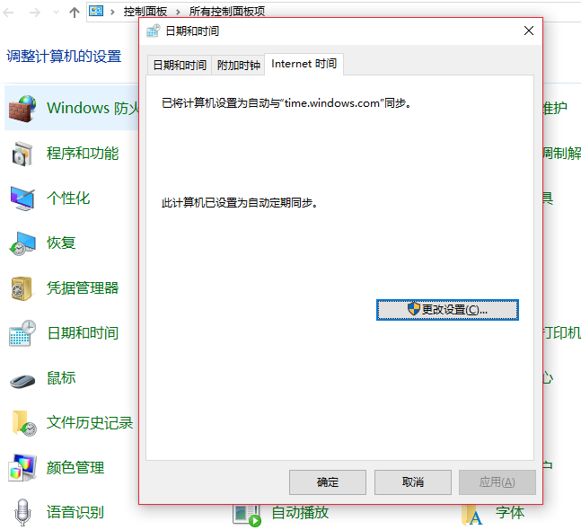
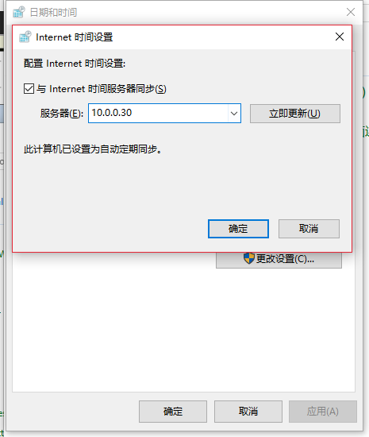

## 1.8. 配置NTP

### 1.8.1. 配置NTP服务器

#### 1.8.1.1. NTPd

安装[NTPd](http://www.ntp.org/)：

`yum -y install ntp`

编辑`/etc/ntp.conf`文件

添加允许接收请求的网络范围：

`restrict 10.0.0.0 mask 255.255.255.0 nomodify notrap`

更改同步服务器：

```
#server 0.centos.pool.ntp.org iburst
#server 1.centos.pool.ntp.org iburst
#server 2.centos.pool.ntp.org iburst
#server 3.centos.pool.ntp.org iburst
server 0.cn.pool.ntp.org iburst
server 1.cn.pool.ntp.org iburst
server 2.cn.pool.ntp.org iburst
server 3.cn.pool.ntp.org iburst
```

以上服务器地址可以在<http://www.pool.ntp.org/zh/>查找。

启动并设置开机启动：

```
systemctl start ntpd
systemctl enable ntpd
```

firewalld防火墙设置（NTP使用端口123/UDP）：

```
firewall-cmd --add-service=ntp --permanent
firewall-cmd --reload
```

验证运行：

`ntpq -p`

#### 1.8.1.2. Chrony

[Chrony](https://chrony.tuxfamily.org/)与NTPd选择一个安装。

安装：

`yum -y install chrony`

编辑`/etc/chrony.conf`文件

更改同步服务器：

```
#server 0.centos.pool.ntp.org iburst
#server 1.centos.pool.ntp.org iburst
#server 2.centos.pool.ntp.org iburst
#server 3.centos.pool.ntp.org iburst
server 0.cn.pool.ntp.org iburst
server 1.cn.pool.ntp.org iburst
server 2.cn.pool.ntp.org iburst
server 3.cn.pool.ntp.org iburst
```

添加允许接收请求的网络范围：

`allow 10.0.0.0/24`

启动并设置开机启动：

```
systemctl start chronyd
systemctl enable chronyd
```

防火墙设置同NTPd。

验证运行：

`chronyc sources`

### 1.8.2. 配置NTP客户端

#### 1.8.2.1. CentOS

CentOS的NTP客户端设置大致与服务器相同，参考[NTPd](#1811-ntpd)或[Chrony](#1812-chrony)的设置。与服务器设置不同之处在于，客户端不需要从其他计算机接收时间同步请求，因此它不需要设置访问权限。

使用命令来立即同步时间，按以下操作：

```
yum -y install ntpdate
ntpdate cn.pool.ntp.org  # 系统时间与网络同步
hwclock --systohc  # 将时间写入硬件
systemctl start ntpdate
systemctl enable ntpdate
```

以上为[Server World](https://www.server-world.info/en/)内容，下面是收集的一些关于时间的命令：

```
timedatectl  # 查看系统时间
timedatectl list-timezones  # 列出可用时区
timedatectl set-timezone Asia/Shanghai  # 设置时区（上海）
timedatectl set-ntp yes  # 同步系统时间
```

#### 1.8.2.2. Windows

打开Windows“控制面板”->“日期和时间”->“Internet时间”->“更改设置”->“立即更新”：





配置Windows的NTP客户端服务，到[这里](https://www.server-world.info/en/note?os=CentOS_7&p=ntp&f=2)查看详细步骤
