## 1.9. 配置SSH

### 1.9.1. 配置SSH服务器

#### 1.9.1.1. 密码验证登录

CentOS默认安装[OpenSSH](http://www.openssh.com/)，编辑`/etc/ssh/sshd_config`文件，做一些安全设置（根据需要修改）：

禁止root远程登录，将`PermitRootLogin`一行取消注释，并修改为：

`PermitRootLogin no`

禁止空密码，使用密码验证登录：

```
PermitEmptyPasswords no
PasswordAuthentication yes
```

`systemctl restart sshd` # 重启服务以生效

firewalld防火墙设置（SSH默认端口22/TCP）：

```
firewall-cmd --add-service=ssh --permanent
firewall-cmd --reload
```

修改端口：

编辑`/etc/ssh/sshd_config`文件，`Port 22`取消注释，并添加一行想要使用的端口（不要和服务器其他常用端口冲突）如10000，则添加`Port 10000`，将对应的防火墙规则先添加好。运行`systemctl restart sshd`重启SSH后测试是否可以通过添加的端口连接。可以连接后将`Port 22`重新注释并重启SSH。

#### 1.9.1.2. 密钥验证登录

为客户端创建一个私钥，并为服务器创建一个公钥。

为每个用户创建密钥对，因此使用普通用户登录并按如下操作：

`ssh-keygen -t rsa` # 创建密钥对

```
Generating public/private rsa key pair.
Enter file in which to save the key (/home/cent/.ssh/id_rsa):  # 回车
Created directory '/home/cent/.ssh'.
Enter passphrase (empty for no passphrase):  # 设置密码短语（没有密码短语则直接回车）
Enter same passphrase again:  # 确认密码短语
Your identification has been saved in /home/cent/.ssh/id_rsa.
Your public key has been saved in /home/cent/.ssh/id_rsa.pub.
The key fingerprint is:
38:f1:b4:6d:d3:0e:59:c8:fa:1d:1d:48:86:f0:fe:74 cent@dlp.srv.world
The key's randomart image is:
```

`mv ~/.ssh/id_rsa.pub ~/.ssh/authorized_keys`

`chmod 600 ~/.ssh/authorized_keys` # 更改文件权限

将在服务器上创建的密钥传输到客户端，然后可以使用密钥身份验证登录：

`mkdir ~/.ssh`

`chmod 700 ~/.ssh`

`scp cent@10.0.0.30:/home/cent/.ssh/id_rsa ~/.ssh/` # 将密钥[复制](#193-ssh文件传输)到本地ssh目录

```
cent@10.0.0.30's password:
id_rsa
```

`ssh -i ~/.ssh/id_rsa cent@10.0.0.30` # 使用密钥验证登录

```
Enter passphrase for key '/home/cent/.ssh/id_rsa':  # 之前设置的密码短语
Last login: Wed Jul 30 21:37:19 2014 from www.srv.world
```

将`/etc/ssh/sshd_config`文件中的`PasswordAuthentication`设置为`no`，禁止密码验证登录，会更安全。

Windows客户端比较简单，在此不作介绍了。

### 1.9.2. 配置SSH客户端

#### 1.9.2.1. CentOS客户端

`yum -y install openssh-clients`

使用普通用户连接到SSH服务器：

`ssh cent@dlp.srv.world` # `ssh [用户名@域名或IP]`

```
The authenticity of host 'dlp.srv.world (<no hostip for proxy command>)' can't be established.
ECDSA key fingerprint is xx:xx:xx:xx:xx:xx:xx:xx:xx:xx:xx:xx:xx:60:90:d8.
Are you sure you want to continue connecting (yes/no)? yes  # 输入yes确认
Warning: Permanently added 'dlp.srv.world' (ECDSA) to the list of known hosts.
cent@dlp.srv.world's password:  # 用户cent的密码
```

可以使用SSH在远程主机上执行命令，如下所示：

`ssh cent@dlp.srv.world "cat /etc/passwd"` # 在远程主机上执行`cat /etc/passwd`

```
cent@dlp.srv.world's password:
root:x:0:0:root:/root:/bin/bash
bin:x:1:1:bin:/bin:/sbin/nologin
...
...
postfix:x:89:89::/var/spool/postfix:/sbin/nologin
sshd:x:74:74:Privilege-separated SSH:/var/empty/sshd:/sbin/nologin
```

#### 1.9.2.2. Windows客户端

Windows下SSH客户端很多，推荐[Xshell](http://www.netsarang.com/products/xsh_overview.html)，使用方法就不多说了。

### 1.9.3. SSH文件传输

#### 1.9.3.1. CentOS客户端

**使用SCP（Secure Copy）**

命令格式：`scp [选项] 源文件 目标`

`scp ./test.txt cent@www.srv.world:~/` # 将本地的`test.txt`复制到远程服务器`www.srv.world`

```
cent@www.srv.world's password:  # 输入远程主机cent用户的密码
100%   10   0.0KB/s   00:00
```

`scp cent@www.srv.world:/home/cent/test.txt ./test.txt` # 
将远程服务器`www.srv.world`上的`/home/cent/test.txt`复制到本地

```
cent@prox.srv.world's password:# 输入远程主机cent用户的密码
test.txt   100%   10   0.0KB/s   00:00
```

**使用SFTP（SSH File Transfer Protocol）**

SFTP服务器默认启用，如果没有启用，编辑`/etc/ssh/sshd_config`文件，添加一行内容：`Subsystem sftp /usr/libexec/openssh/sftp-server`，然后重启SSH服务。

命令格式：`sftp [选项] [用户名@远程主机域名或IP]`

`sftp cent@www.srv.world`

```
cent@www.srv.world's password:  # 输入远程主机cent用户的密码
Connected to prox.srv.world.
sftp>
```

```
sftp> pwd  # 显示远程服务器上的当前目录
Remote working directory: /home/cent
```

```
sftp> !pwd  # 显示本地服务器上的当前目录
/home/redhat
```


```
sftp> ls -l  # 在FTP服务器上显示当前目录中的文件
drwxrwxr-x  2 cent  cent   6 Jul 29 21:33 public_html
-rw-rw-r--  1 cent  cent  10 Jul 28 22:53 test.txt
```

```
sftp> !ls -l  # 在本地服务器上的当前目录中显示文件
total 4
-rw-rw-r-- 1 redhat  redhat  10 Jul 29 21:31 test.txt
```

```
sftp> cd public_html  # 更改目录
sftp> pwd
Remote working directory: /home/cent/public_html
```

```
sftp> put test.txt redhat.txt  # 将文件上传到远程服务器
Uploading test.txt to /home/cent/redhat.txt
test.txt 100% 10 0.0KB/s 00:00
sftp> ls -l
drwxrwxr-x  2 cent  cent   6 Jul 29 21:33 public_html
-rw-rw-r--  1 cent  cent  10 Jul 29 21:39 redhat.txt
-rw-rw-r--  1 cent  cent  10 Jul 28 22:53 test.txt
```

```
sftp> put *.txt  # 将多个文件上传到远程服务器
Uploading test.txt to /home/cent/test.txt
test.txt 100% 10 0.0KB/s 00:00
Uploading test2.txt to /home/cent/test2.txt
test2.txt 100% 0 0.0KB/s 00:00
sftp> ls -l
drwxrwxr-x  2 cent  cent   6 Jul 29 21:33 public_html
-rw-rw-r--  1 cent  cent  10 Jul 29 21:39 redhat.txt
-rw-rw-r--  1 cent  cent  10 Jul 29 21:45 test.txt
-rw-rw-r--  1 cent  cent  10 Jul 29 21:46 test2.txt
```

```
sftp> get test.txt  # 从远程服务器下载文件
Fetching /home/cent/test.txt to test.txt
/home/cent/test.txt 100% 10 0.0KB/s 00:00
```

```
sftp> get *.txt  # 从远程服务器下载多个文件
Fetching /home/cent/redhat.txt to redhat.txt
/home/cent/redhat.txt 100% 10 0.0KB/s 00:00
Fetching /home/cent/test.txt to test.txt
/home/cent/test.txt 100% 10 0.0KB/s 00:00
Fetching /home/cent/test2.txt to test2.txt
/home/cent/test2.txt 100% 10 0.0KB/s 00:00
```

```
sftp> mkdir testdir  # 在远程服务器上创建目录
sftp> ls -l
drwxrwxr-x  2 cent  cent   6 Jul 29 21:33 public_html
-rw-rw-r--  1 cent  cent  10 Jul 29 21:39 redhat.txt
-rw-rw-r--  1 cent  cent  10 Jul 29 21:45 test.txt
-rw-rw-r--  1 cent  cent  10 Jul 29 21:46 test2.txt
drwxrwxr-x  2 cent  cent  6 Jul 29 21:53 testdir
```

```
sftp> rmdir testdir  # 删除远程服务器上的目录
rmdir ok, `testdir' removed
sftp> ls -l
drwxrwxr-x  2 cent  cent   6 Jul 29 21:33 public_html
-rw-rw-r--  1 cent  cent  10 Jul 29 21:39 redhat.txt
-rw-rw-r--  1 cent  cent  10 Jul 29 21:45 test.txt
-rw-rw-r--  1 cent  cent  10 Jul 29 21:46 test2.txt
```

```
sftp> rm test2.txt  # 删除远程服务器上的文件
Removing /home/cent/test2.txt
sftp> ls -l
drwxrwxr-x  2 cent  cent   6 Jul 29 21:33 public_html
-rw-rw-r--  1 cent  cent  10 Jul 29 21:39 redhat.txt
-rw-rw-r--  1 cent  cent  10 Jul 29 21:45 test.txt
```

```
sftp> !cat /etc/passwd  # 使用“!命令”来执行命令
root:x:0:0:root:/root:/bin/bash
bin:x:1:1:bin:/bin:/sbin/nologin
...
...
redhat:x:1001:1001::/home/redhat:/bin/bash
```

```
sftp> quit  # 退出
221 Goodbye.
```

#### 1.9.3.2. Windows客户端

推荐[Xftp](http://www.netsarang.com/products/xfp_overview.html)，使用方法也不多说了。

#### 1.9.3.3 仅SFTP + Chroot

应用此设置的某些用户只能使用SFTP访问和访问允许的目录。

例如，将/home设置为Chroot目录：

`groupadd sftp_users` # 为SFTP创建一个组

`usermod -G sftp_users cent` # 仅用于SFTP的用户“cent”

编辑`/etc/ssh/sshd_config`文件：

```
# 注释下面一行，并添加上第二行
#Subsystem sftp /usr/libexec/openssh/sftp-server
Subsystem sftp internal-sftp

# 添加以下内容
Match Group sftp_users
  X11Forwarding no
  AllowTcpForwarding no
  ChrootDirectory /home
  ForceCommand internal-sftp
```

`systemctl restart sshd` # 重启服务以生效

尝试使用用户访问并确保设置：

`ssh cent@10.0.0.30` # 通过SSH客户端访问

```
cent@10.0.0.30's password:  # 输入密码
This service allows sftp connections only.
Connection to 10.0.0.30 closed.  # 拒绝访问
```

`sftp cent@10.0.0.30` # 通过SFTP客户端访问

```
Connecting to 10.0.0.30...
cent@10.0.0.30's password:
sftp> ls -l
drwx------  3 1000  1000  4096 Jul  9 12:06 cent
drwx------  2 1001  1001    59 Jul  8 22:06 hirokun
sftp> pwd
Remote working directory: /
sftp> exit
```

### 1.9.4. SSH端口转发

SSH端口转发可以将一个端口转发到另一个端口。

例如，配置转发设置，将本地的8081转发到本地的5901（VNC）。此示例显示简单的设置，但它可以将大多数端口转发到本地或其他服务器上的大多数端口。

[启动VNC](../3. 桌面环境/3.4. VNC服务器.html)，然后按以下操作：

`ssh -L 0.0.0.0:8081:localhost:5901 cent@localhost` # 将到本地8081的连接转发到5901

```
cent@localhost's password:  # 用户cent的密码（登录到本地）
Last login: Thu Jul 10 01:35:15 2014
```

`netstat -lnp | grep 8081` # netstat -lnp | grep 8081

```
(Not all processes could be identified, non-owned process info
 will not be shown, you would have to be root to see it all.)
tcp  0  0 0.0.0.0:8081  0.0.0.0:*  LISTEN  3238/ssh
```

保持这个会话，进行下一步。可以使用`-f`选项在后台启动进程作为一个守护进程，但使用完成后需要手动结束进程。

连接到本地配置的端口：

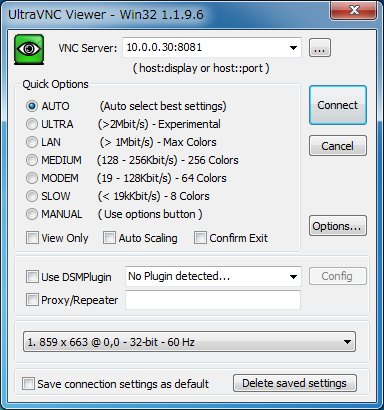

连接成功：

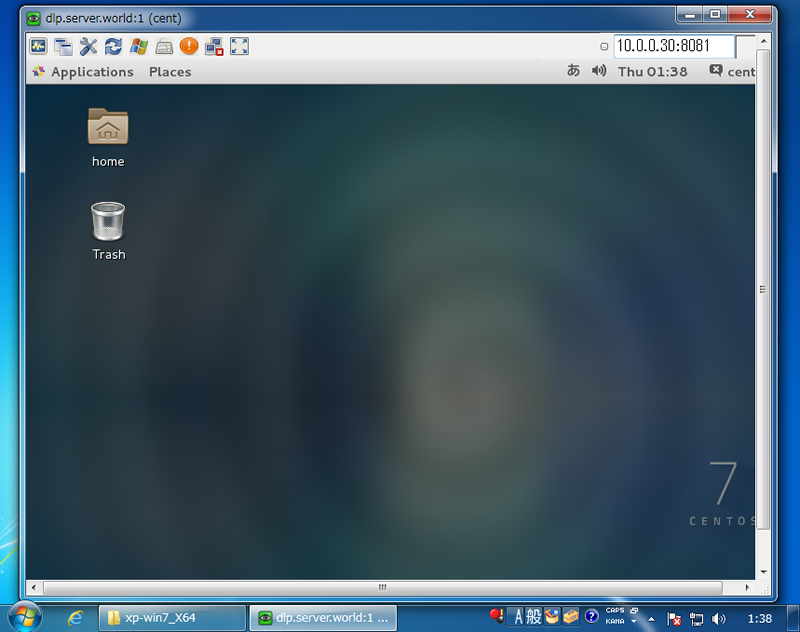

**使用客户端工具进行端口转发**

可以使用具有端口转发功能的工具，而无需配置服务器。

例如，使用Putty的端口转发连接到VNC服务器。

[启动VNC](../3. 桌面环境/3.4. VNC服务器.html)。

在客户端电脑上启动Putty并指定目标服务器：

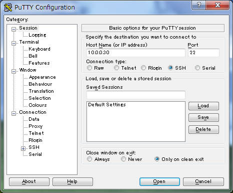

在左侧菜单中选择“Connection”->“SSH”->“Tunnels”，在“Source port”字段上输入本地PC上任何可用的端口，在“目标服务器”字段输入“目标服务器:端口”。然后，点击“Add”按钮：

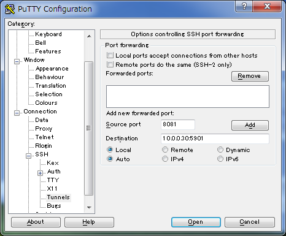

确保设置已添加，然后单击“Open”按钮进行连接：

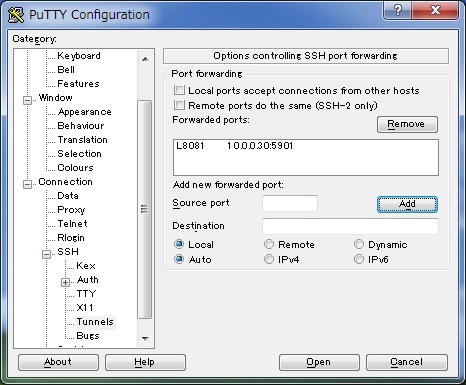

登录服务器并保持会话，然后进入下一步：

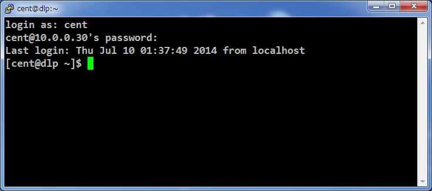

在客户端电脑上启动VNC客户端，并连接到“[localhost]:[之前设置为source port的端口]”：

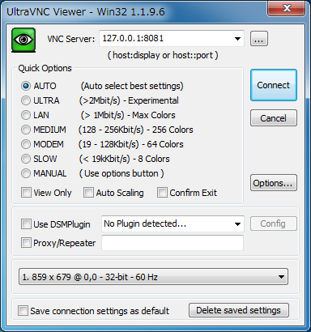

连接成功：


### 1.9.5. X11转发

可以使用SSH X11转发在本地客户端显示和使用远程服务器上的GUI应用程序。

在SSH服务器上启用X11转发功能：

编辑`/etc/ssh/sshd_config`文件：

```
# 取消注释
X11Forwarding yes
X11DisplayOffset 10
```

`systemctl restart sshd`

#### 1.9.5.1. CentOS客户端

这是在[安装了桌面环境的CentOS客户端](../3. 桌面环境/3.1. GNOME桌面.html)上使用GUI应用程序的示例。

启动终端（Terminal）并使用`ssh -XC xxx`连接到启用了X11转发的SSH服务器，连接后，输入如下命令：

```
eval `dbus-launch --sh-syntax`
export DBUS_SESSION_BUS_ADDRESS
export DBUS_SESSION_BUS_PID
```

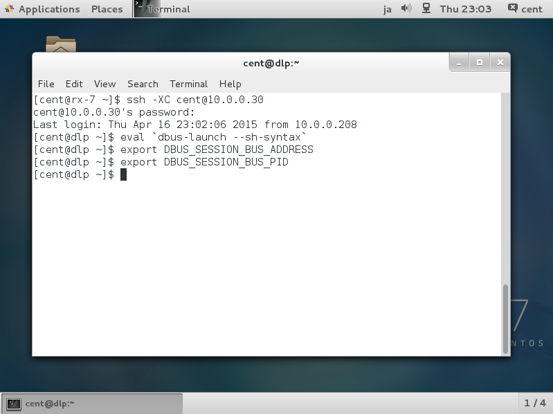

接下来，执行想要的GUI应用程序。例如，启动系统监视器（System Monitor）：

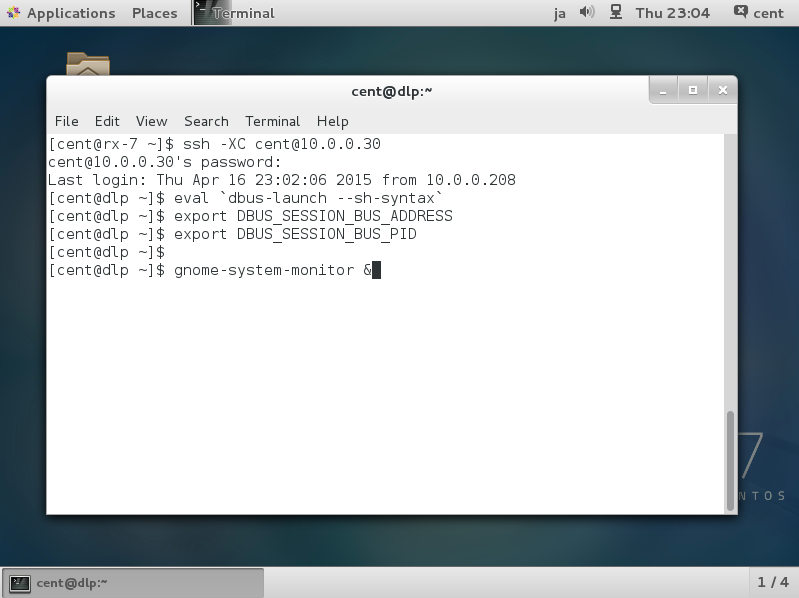

显示在远程服务器上的系统监视器：

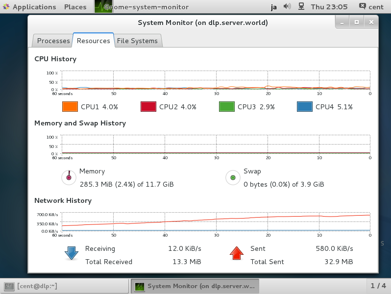

#### 1.9.5.2. Windows客户端

演示使用Windows 8.1和Putty为例。

首先[下载并安装Xming](https://sourceforge.net/projects/xming/)（可默认安装全部）。

安装Xming后，启动Putty，选择左侧菜单上的“X11”，然后在右侧窗格中选中“Enable X11 forwarding”复选框：

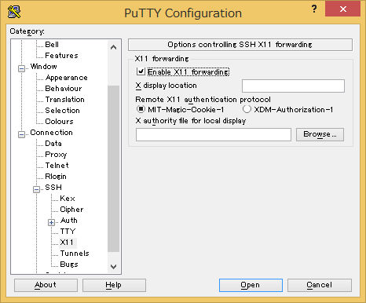

登录到远程服务器后，执行想要的GUI应用程序。例如，启动Libre Office Calc：

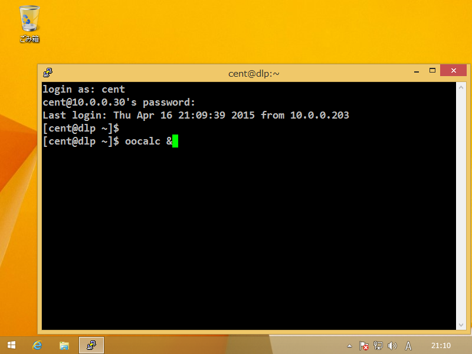

显示在远程服务器上的Libre Office Calc：


### 1.9.6. SSHPass

使用SSHPass自动输入口令验证密码。这很方便，但有**安全隐患（密码泄漏）**，如果使用，请特别小心。

安装SSHPass：

`yum --enablerepo=epel -y install sshpass` # 从EPEL安装

使用SSHPass：

`-p password`（从参数）：

`sshpass -p password ssh 10.0.0.51 hostname` # 

```
node01.srv.world
```

`-f file`（从文件）：

`echo 'password' > sshpass.txt`

`chmod 600 sshpass.txt`

`sshpass -f sshpass.txt ssh 10.0.0.51 hostname`

```
node01.srv.world
```

`-e`（从环境变量）：

`export SSHPASS=password`

`sshpass -e ssh 10.0.0.51 hostname`

```
node01.srv.world
```

### 1.9.7. SSH-Agent

使用SSH-Agent在密钥对认证上自动输入密码。

必须首先[设置密钥对](#1912-密钥验证登录)。

使用SSH-Agent：

启动SSH-Agent：

```
eval `ssh-agent`
```

```
Agent pid 2168
```

`ssh-add` # 添加身份

```
Enter passphrase for /home/cent/.ssh/id_rsa:
Identity added: /home/cent/.ssh/id_rsa (/home/cent/.ssh/id_rsa)
```

`ssh-add -l` # 确认

```
2048 xx:xx:xx:xx:xx:xx:xx:xx:xx:xx:xx:xx:xx:xx:4c:b2 /home/cent/.ssh/id_rsa (RSA)
```

`ssh node01.srv.world hostname` # 尝试不输入密码连接SSH

```
node01.srv.world
```

退出SSH-Agent：

```
eval `ssh-agent -k`
```

```
Agent pid 2168 killed
```

### 1.9.8. Parallel SSH

安装Parallel SSH以连接到多个主机。

安装PSSH：

`yum --enablerepo=epel -y install pssh` # 从EPEL安装

使用PSSH：

这里演示没有密码短语的密钥对认证，如果在密钥对中设置密码，首先[启动SSH-Agent自动输入密码](#197-ssh-agent)。

`pssh -H "10.0.0.51 10.0.0.52" -i "hostname"` # 连接到主机并执行`hostname`命令

```
[1] 17:28:02 [SUCCESS] 10.0.0.51
node01.srv.world
[2] 17:28:02 [SUCCESS] 10.0.0.52
node02.srv.world
```

可以从文件中读取主机列表：

编辑`pssh_hosts.txt`文件：

```
# 如下在每行写入主机
cent@10.0.0.51
cent@10.0.0.52
```

`pssh -h pssh_hosts.txt -i "uptime"`

```
[1] 19:37:59 [SUCCESS] cent@10.0.0.52
 19:37:59 up  1:35,  0 users,  load average: 0.00, 0.00, 0.00
[2] 19:37:59 [SUCCESS] cent@10.0.0.51
 19:37:59 up  1:35,  0 users,  load average: 0.00, 0.00, 0.00
```

也可以使用密码认证连接，但需要所有主机密码都是一样的：

`pssh -h pssh_hosts.txt -A -O PreferredAuthentications=password -i "uname -r"`

```
Warning: do not enter your password if anyone else has superuser
privileges or access to your account.
Password:  # 输入密码
[1] 12:54:06 [SUCCESS] cent@10.0.0.51
2.6.32-504.12.2.el6.x86_64
[2] 12:54:06 [SUCCESS] cent@10.0.0.52
2.6.32-504.12.2.el6.x86_64
```

注：PSSH软件包包括`pscp.pssh`，`prsync`，`pslurp`，`pnuke`等命令，与`pssh`用法相同。

### 1.9.9. 远程登陆SSH时，微信提醒

（企业微信官方接口文档：<https://qydev.weixin.qq.com/wiki/index.php>；脚本参考<https://blog.csdn.net/bwlab/article/details/50725335>和<https://my.oschina.net/u/3658138/blog/1586428>）（很多内容不懂，所以只测试了能正常发送）。

先注册企业微信，创建一个应用，在应用的可见范围设置权限。

新建文件`/etc/ssh/sshrc`：

```
#!/bin/bash

CorpID='   '  # 填入企业ID
Secret='   '  # 填入应用Secret
GURL="https://qyapi.weixin.qq.com/cgi-bin/gettoken?corpid=$CorpID&corpsecret=$Secret"

# get acccess_token
GToken=$(/usr/bin/curl -s -G $GURL)
Token=`echo $GToken |awk -F '"' '{print $10}'`
PURL="https://qyapi.weixin.qq.com/cgi-bin/message/send?access_token=$Token"

wxAppID=xxxxx  # 填入应用AgentId
wxUserID=1  # 企业微信中部门成员ID(企业微信成员信息中称为帐号)
Last=`last`
IP=`echo $Last |awk -F ' ' '{print $3}'`
Time=`date +'%Y-%m-%d %H:%M:%S'`
wxMsg='服务器登陆提醒：\n主机名：'`hostname`'\n登录用户：'`whoami`'\n登录IP：'${IP}'\n登录时间：'${Time}
Body='{ "touser":"'$wxUserID'", "msgtype":"text", "agentid":"'$wxAppID'", "text":{"content":"'$wxMsg'"}, "safe":"0" }'

/usr/bin/curl --data-ascii "$Body" $PURL
```

可以不用`chmod +x`，登录ssh时会先执行此脚本内容。
