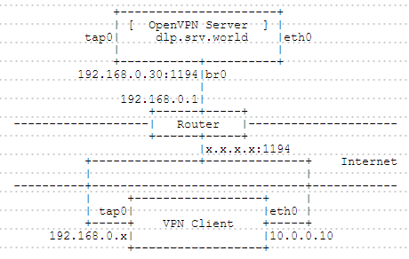

## 10.5. OpenVPN

[OpenVPN](https://openvpn.net/)（OpenVPN官网所有内容需科学上网才能访问）是一个功能齐全的SSL VPN，它使用行业标准的SSL/TLS协议实现了OSI模型第2层（数据链路层）或第3层（网络层）的安全网络扩展。OpenVPN支持基于证书、智能卡以及用户名/密码等多种形式的灵活的客户端认证方法，并可以通过应用于VPN虚拟接口的防火墙规则为指定用户或用户组设置访问控制策略。

### 10.5.1. 客户端使用证书认证连接

本例基于以下环境：



使用桥接模式配置OpenVPN，OpenVPN服务器的“br0”和“tap0”由服务自动生成，客户端上“tap0”的IP地址由OpenVPN服务器分配。连接VPN后，客户端可以访问（与服务器）同一本地网络上的任何计算机。

配置之前，必须在网关路由器上配置IP伪装。对于本例，与`x.x.x.x:1194`的连接将转发到`192.168.0.30:1194`。

#### 10.5.1.1. 服务端

安装OpenVPN：

`yum --enablerepo=epel -y install openvpn easy-rsa net-tools bridge-utils`

创建CA证书：

`cd /usr/share/easy-rsa/2.0`

编辑`vars`文件：

```
# 根据自己需要更改
export KEY_COUNTRY="CN"
export KEY_PROVINCE="SC"
export KEY_CITY="CD"
export KEY_ORG="GTS"
export KEY_EMAIL="root@dlp.srv.world"
export KEY_OU="Server_World"
```

`source ./vars`

```
NOTE: If you run ./clean-all, I will be doing a rm -rf on /usr/share/easy-rsa/2.0/keys
```

`./clean-all`

`./build-ca`

```
Generating a 2048 bit RSA private key
..............+++
...+++
writing new private key to 'ca.key'
-----
You are about to be asked to enter information that will be incorporated
into your certificate request.
What you are about to enter is what is called a Distinguished Name or a DN.
There are quite a few fields but you can leave some blank
For some fields there will be a default value,
If you enter '.', the field will be left blank.
-----
Country Name (2 letter code) [CN]:  # 回车
State or Province Name (full name) [SC]:  # 回车
Locality Name (eg, city) [CD]:  # 回车
Organization Name (eg, company) [GTS]:  # 回车
Organizational Unit Name (eg, section) [Server_World]:  # 回车
Common Name (eg, your name or your server's hostname) [GTS CA]:  # 回车
Name [EasyRSA]:Server-CA  # 设置任意名称
Email Address [root@dlp.srv.world]:  # 回车
```

创建服务器证书：

`cd /usr/share/easy-rsa/2.0`

`./build-key-server server`

```
Generating a 2048 bit RSA private key
.................................................+++
.................+++
writing new private key to 'server.key'
-----
You are about to be asked to enter information that will be incorporated
into your certificate request.
What you are about to enter is what is called a Distinguished Name or a DN.
There are quite a few fields but you can leave some blank
For some fields there will be a default value,
If you enter '.', the field will be left blank.
-----
Country Name (2 letter code) [CN]:  # 回车
State or Province Name (full name) [SC]:  # 回车
Locality Name (eg, city) [CD]:  # 回车
Organization Name (eg, company) [GTS]:  # 回车
Organizational Unit Name (eg, section) [Server_World]:  # 回车
Common Name (eg, your name or your server's hostname) [server]:  # 回车
Name [EasyRSA]:Server-CRT  # 设置任意名称
Email Address [root@dlp.srv.world]:  # 回车

Please enter the following 'extra' attributes
to be sent with your certificate request
A challenge password []:
An optional company name []:
Using configuration from /usr/share/easy-rsa/2.0/openssl-1.0.0.cnf
Check that the request matches the signature
Signature ok
The Subject's Distinguished Name is as follows
countryName           :PRINTABLE:'CN'
stateOrProvinceName   :PRINTABLE:'SC'
localityName          :PRINTABLE:'CD'
organizationName      :PRINTABLE:'GTS'
organizationalUnitName:T61STRING:'Server_World'
commonName            :PRINTABLE:'server'
name                  :PRINTABLE:'Server-CRT'
emailAddress          :IA5STRING:'root@dlp.srv.world'
Certificate is to be certified until Jun 23 05:59:34 2025 GMT (3650 days)
Sign the certificate? [y/n]: y  # 确认设置并输入y继续执行
# proceed with yes
1 out of 1 certificate requests certified, commit? [y/n] y  # 输入y继续执行
Write out database with 1 new entries
Data Base Updated
```

生成Diffie Hellman（DH）参数：

`cd /usr/share/easy-rsa/2.0`

`./build-dh`

```
Generating DH parameters, 2048 bit long safe prime, generator 2
This is going to take a long time
```

创建客户端证书：

`cd /usr/share/easy-rsa/2.0`

`./build-key client01`

```
Generating a 2048 bit RSA private key
............+++
.......................................................+++
writing new private key to 'client01.key'
-----
You are about to be asked to enter information that will be incorporated
into your certificate request.
What you are about to enter is what is called a Distinguished Name or a DN.
There are quite a few fields but you can leave some blank
For some fields there will be a default value,
If you enter '.', the field will be left blank.
-----
Country Name (2 letter code) [CN]:  # 回车
State or Province Name (full name) [SC]:  # 回车
Locality Name (eg, city) [CD]:  # 回车
Organization Name (eg, company) [GTS]:  # 回车
Organizational Unit Name (eg, section) [Server_World]:  # 回车
Common Name (eg, your name or your server's hostname) [client01]:  # 回车
Name [EasyRSA]:client01  # 设置任意名称
Email Address [root@dlp.srv.world]:  # 回车

Please enter the following 'extra' attributes
to be sent with your certificate request
A challenge password []:
An optional company name []:
Using configuration from /usr/share/easy-rsa/2.0/openssl-1.0.0.cnf
Check that the request matches the signature
Signature ok
The Subject's Distinguished Name is as follows
countryName           :PRINTABLE:'CN'
stateOrProvinceName   :PRINTABLE:'SC'
localityName          :PRINTABLE:'CD'
organizationName      :PRINTABLE:'GTS'
organizationalUnitName:T61STRING:'Server_World'
commonName            :PRINTABLE:'client01'
name                  :PRINTABLE:'client01'
emailAddress          :IA5STRING:'root@dlp.srv.world'
Certificate is to be certified until Jun 23 06:01:37 2025 GMT (3650 days)
Sign the certificate? [y/n]: y  # 确认设置并输入y继续执行
# proceed with yes
1 out of 1 certificate requests certified, commit? [y/n] y  # 输入y继续执行
Write out database with 1 new entries
Data Base Updated
```

配置并启动OpenVPN服务器：

`cp -pR /usr/share/easy-rsa/2.0/keys /etc/openvpn/keys`

`cp /usr/share/doc/openvpn-*/sample/sample-config-files/server.conf /etc/openvpn/`

编辑`/etc/openvpn/server.conf`文件：

```
# 根据需要修改（侦听端口）
port 1194

# 取消注释“tcp”并注释掉“udp”
proto tcp
;proto udp

# 更改为tap（使用桥接模式）
dev tap0
;dev tun

# 更改证书路径
ca keys/ca.crt
cert keys/server.crt
key keys/server.key
dh keys/dh2048.pem

# 注释
;server 10.8.0.0 255.255.255.0

# 取消注释并更改：[VPN服务器IP地址] [子网掩码] [客户端的IP范围]
server-bridge 192.168.0.30 255.255.255.0 192.168.0.150 192.168.0.199

# keepalive设置
keepalive 10 120

# 启用压缩
comp-lzo

# 启用persist选项
persist-key
persist-tun

# 取消注释并指定日志
log /var/log/openvpn.log
log-append /var/log/openvpn.log

# 指定日志级别（0 - 9，9表示调试级别）
verb 3
```

`cp /usr/share/doc/openvpn-*/sample/sample-scripts/bridge-start /etc/openvpn/openvpn-startup`

`cp /usr/share/doc/openvpn-*/sample/sample-scripts/bridge-stop /etc/openvpn/openvpn-shutdown`

`chmod 755 /etc/openvpn/openvpn-startup /etc/openvpn/openvpn-shutdown`

编辑`/etc/openvpn/openvpn-startup`文件：

```
# 更改
eth="eth0"  # 根据需要更改
eth_ip="192.168.0.30"  # 网桥接口IP
eth_netmask="255.255.255.0"  # 子网掩码
eth_broadcast="192.168.0.255"  # 广播地址

# 添加以内容到最后（定义网关）
eth_gw="192.168.0.1"
route add default gw $eth_gw
```

`cp /usr/lib/systemd/system/openvpn@.service /usr/lib/systemd/system/openvpn-bridge.service`

编辑`/usr/lib/systemd/system/openvpn-bridge.service`文件：

```
# 在[Service]部分如下更改
[Service]
PrivateTmp=true
Type=forking
PIDFile=/var/run/openvpn/openvpn.pid
ExecStartPre=/bin/echo 1 > /proc/sys/net/ipv4/ip_forward
ExecStartPre=/etc/openvpn/openvpn-startup
ExecStart=/usr/sbin/openvpn --daemon --writepid /var/run/openvpn/openvpn.pid --cd /etc/openvpn/ --config server.conf
ExecStopPost=/etc/openvpn/openvpn-shutdown
ExecStopPost=/bin/echo 0 > /proc/sys/net/ipv4/ip_forward
```

`systemctl start openvpn-bridge`

```
[ 1367.964300] device tap0 entered promiscuous mode
[ 1367.967487] IPv6: ADDRCONF(NETDEV_UP): tap0: link is not ready
[ 1367.971388] br0: port 1(eth0) entered forwarding state
[ 1367.972534] br0: port 1(eth0) entered forwarding state
[ 1368.006320] IPv6: ADDRCONF(NETDEV_CHANGE): tap0: link becomes ready
[ 1368.007546] br0: port 2(tap0) entered forwarding state
[ 1368.008452] br0: port 2(tap0) entered forwarding state
```

`systemctl enable openvpn-bridge`

将`/etc/openvpn/keys`下的文件“ca.crt”，“client01.crt”，“client01.key”传输到客户端计算机以连接到OpenVPN服务器。

#### 10.5.1.2. 客户端

Windows客户端为例。在[这里](https://openvpn.net/index.php/open-source/downloads.html)下载客户端。安装在默认路径。

安装完成后，将`C:\Program Files\OpenVPN\sample-config`下的“client.ovpn”复制到`C:\Program Files\OpenVPN\config`，并重命名为在服务端创建客户端证书时的名称（这里为“client01”）。此外，将在服务器上创建的文件“ca.crt”，“client01.crt”，“client01.key”也复制到`C:\Program Files\OpenVPN\config`，如下所示：


编辑`client01.ovpn`文件：

```
# 使用默认
client

# 在服务器配置中指定的设备名称
dev tap0
;dev tun

# 在服务器配置中指定的协议
proto tcp
;proto udp

# OpenVPN服务器的公网IP和端口（替换为自己环境）
remote 172.16.2.1 1194

# retry resolving
resolv-retry infinite

# no bind for local port
nobind

# 启用persist选项
persist-key
persist-tun

# 证书路径
ca ca.crt
cert client01.crt
key client01.key

# 启用压缩
comp-lzo

# 日志级别
verb 3
```

打开“开始”菜单，右键点击“OpenVPN GUI”，点击“以管理员身份运行”：


点击任务栏中的OpenVPN图标，右键点击并选择“Connect”：


连接后，图标的颜色变为绿色：


连接后，添加TAP适配器，如下所示：


由于桥模式配置，客户端不仅可以连接OpenVPN服务器，还可以连接（与服务器）同一网络上的其他计算机，如下所示：


### 10.5.2. 客户端使用用户名密码连接

上一节为server-world上的内容，本节为笔者自己整理的。

CentOS6可以通过“pam_mysql”使用MySQL存储用户名密码，但CentOS7好像已经取消“pam_mysql”，自行编译什么的也弄了，但是无法使用。故使用RADIUS进行认证。

#### 10.5.2.1. 服务端

首先安装好认证服务器（可以使用[FreeRADIUS](../15. 认证服务器/15.1. FreeRADIUS.html)或是[privacyIDEA + FreeRADIUS](../15. 认证服务器/15.2. privacyIDEA.html)），privacyIDEA实现可以多因素认证，但本质也是通过RADIUS认证（[有三种基本的方法来整合OpenVPN与privacyIDEA](https://izombielandgit.gitbooks.io/privacyidea-authentication-system/content/13. Application Plugins 应用程序插件/OTP with OpenVPN.html)，可以自行研究）

**安装OpenVPN**：

`yum --enablerepo=epel -y install openvpn openssl-devel lzo-devel pam-devel`

[禁用SELinux](../1. 初始化设置/1.2. 防火墙和SELinux.html#122-selinux)。

开启IP转发：

编辑`/etc/sysctl.conf`文件：

```
net.ipv4.ip_forward = 1
```

`sysctl -p`

`cat /proc/sys/net/ipv4/ip_forward`

```
# 检查是否开启成功,1为正确,若为0需检查错误
1
```

**生成证书文件**（可以参考[第一节](#10511-服务端)生成服务器端证书）：

yum安装easy-rsa，如下操作：

`yum -y install easy-rsa`

`cd /usr/share/easy-rsa/2.0`

编辑`vars`文件：

```
# 密钥长度为2048，如果是1024可改为2048
export KEY_SIZE=2048

# CA证书有效时间3650天，根据需要修改
export CA_EXPIRE=3650

# 密钥有效时间3650天，根据需要修改
export KEY_EXPIRE=3650

export KEY_COUNTRY="CN"  # 国家
export KEY_PROVINCE="SC"  # 省份
export KEY_CITY="CD"  # 城市
export KEY_ORG="x"  # 组织机构
export KEY_EMAIL="x@x.com"  # 邮箱
export KEY_OU="x"  # 单位或部门

export KEY_NAME="OpenVPNServer"  # openvpn服务器的名称
```

`source ./vars`  # 初始化

`./clean-all`  # 清理keys

`./build-ca`  # 生成`ca.crt`和`ca.key`

`./build-key-server server`  # 生成`server.crt`，`server.csr`和`server.key`

`./build-dh`  # 生成`dh2048.pem`

`openvpn --genkey --secret ta.key`  # 生成`ta.key`

keys文件详解可[参考这里](http://www.williamlong.info/archives/3814.html)。

将生成的`ca.crt`，`server.crt`，`server.key`，`dh2048.pem`，`ta.key`放到`/etc/openvpn/keys`目录下。

[GitHub上的easy-rsa](https://github.com/OpenVPN/easy-rsa)最新版本为easy-rsa3，生成证书命令有一些变化，如下操作（有问题可官网查看或运行`./easyrsa help`）：

```
wget https://github.com/OpenVPN/easy-rsa/archive/master.zip
unzip master.zip
cd easy-rsa-master/easyrsa3
cp vars.example vars
```

编辑`vars`文件：

```
# 取消注释并修改对应内容
set_var EASYRSA_REQ_COUNTRY    "US"  # 国家
set_var EASYRSA_REQ_PROVINCE   "California"  # 省份
set_var EASYRSA_REQ_CITY       "San Francisco"  # 城市
set_var EASYRSA_REQ_ORG        "Copyleft Certificate Co"  # 组织机构
set_var EASYRSA_REQ_EMAIL      "me@example.net"  # 邮箱
set_var EASYRSA_REQ_OU         "My Organizational Unit"  # 单位或部门

set_var EASYRSA_KEY_SIZE       2048  # 密钥长度2048

set_var EASYRSA_CA_EXPIRE       3650  # CA有效期3650天

set_var EASYRSA_CERT_EXPIRE     3650  # CERT有效期3650天

# 客户端使用--ns-cert-type，取消下行注释并改值改为yes，（一般不推荐使用，而推荐使用--remote-cert-tls功能）
#set_var EASYRSA_NS_SUPPORT     "no"

# 其他内容可以根据自己需要修改
```

保存后继续运行，生成服务器端证书：

```
./easyrsa init-pki  # 初始化，会清空已有信息，并在当前目录创建PKI目录，用于存储一些中间变量及最终生成的证书
./easyrsa build-ca  # 创建根证书，会提示设置密码，用于ca对之后生成的server和client证书签名时使用，然后提示设置Common Name
./easyrsa gen-req server nopass  # 创建server证书和private key，nopass表示不加密private key，然后提示设置Common Name（使用与上一步不同的）
./easyrsa sign-req server server  # 给server证书签名，确认信息后输入yes，然后输入build-ca时设置的密码
./easyrsa gen-dh  # 创建Diffie-Hellman
```

OpenVPN服务端需要的文件如下：

`easyrsa3/pki/ca.crt`

`easyrsa3/pki/private/server.key`

`easyrsa3/pki/issued/server.crt`

`easyrsa3/pki/dh.pem`

`openvpn --genkey --secret ta.key`  # 生成`ta.key`的命令相同

生成客户端证书（如果客户端不使用证书认证，这一步就不需要了），在与上面生成服务端证书的easy-rsa不同的文件夹重新解压一次（网上查的资料说是在新目录重新生成，不知道可否直接在刚才的目录使用，未测试，如果要测试注意不要再次运行`./easyrsa init-pki`），进入新的`easy-rsa-master/easyrsa3`目录后同样设置一下`vars`文件，然后开始生成证书：

```
./easyrsa init-pki
./easyrsa gen-req client1 nopass  # 创建client1证书和private key，nopass表示不加密private key，然后提示设置Country Name（设置与上面不同的）
```

切换到前面生成CA的目录，运行：

```
./easyrsa import-req [上一步生成客户端证书的路径]/easyrsa3/pki/reqs/client1.req client1  # 导入req
./easyrsa sign-req client client1  # # 给client1证书签名，确认信息后输入yes，然后输入build-ca时设置的密码
```

文件位置如下：

`easyrsa3/pki/issued/client.crt`

`easyrsa3/pki/private/client.key`

**配置OpenVPN**：

`cp /usr/share/doc/openvpn-*/sample/sample-config-files/server.conf /etc/openvpn/`

编辑`/etc/openvpn/server.conf`文件：

```
# 定义侦听IP，不指定则侦听所有IP
;local a.b.c.d

# 定义协议类型，tcp或udp
proto tcp
;proto udp

# 定义侦听端口
port 1194

# 定义使用模式，tap或tun
# tap是桥接模式，通过软件在系统中模式出一个tap设备，该设备是一个二层设备，同时支持链路层协议
# tun是路由模式，通过软件在系统中模拟出一个tun路由，tun是ip层的点对点协议
;dev tap
dev tun

# ca定义openvpn使用的CA证书文件,该文件通过build-ca命令生成，CA证书主要用于验证客户端证书的合法性
# cert定义openvpn服务器端使用的证书
# key定义openvpn服务器使用的密钥文件，该文件必须严格控制其安全性
ca /etc/openvpn/keys/ca.crt
cert /etc/openvpn/keys/server.crt 
key /etc/openvpn/keys/server.key

# 定义Diffie Hellman文件
dh /etc/openvpn/keys/dh2048.pem 

# 网络拓扑类型，不修改
;topology subnet

# 定义使用tun路由模式时，给客户端分配的IP地址段（一个客户端占用4个IP）
# 可以更改子网掩码来更改最大IP数量（自行参考网上子网计算方法），同一服务器同时运行多个配置文件时，IP地址池不能有重复
server 10.8.0.0 255.255.255.0

# 设置后，同一客户端每次分配到同一IP地址，设置规则每行一个用户名：用户名,ip。注意需要有效的ip地址
ifconfig-pool-persist ipp.txt

# 定义使用tap桥接模式时，给分配的IP地址段
;server-bridge 10.8.0.4 255.255.255.0 10.8.0.50 10.8.0.100

# 向客户端推送路由信息，比如使客户端能访问（服务器本身能访问的）192.168.10.0网段，则加入此配置（并取消注释）
;push "route 192.168.10.0 255.255.255.0"

# 给具体客户端指定IP等信息，需要在openvpn目录下创建ccd目录，目录下用户名同名的文件，进去写入对该用户生效的规则，如push route等，详见英文注释及官方文档
client-config-dir ccd

# 动态修改防火墙来响应不同用户的访问，详见官方文档
;learn-address ./script

# 指定默认网关，客户端所有流量通过VPN
;push "redirect-gateway def1 bypass-dhcp"

# 向客户端推送DNS或WINS信息
;push "dhcp-option DNS 114.114.114.114"

# 开启后客户端可互相访问
;client-to-client

# 开启后同一证书可在多个客户端同时登陆，建议关闭
;duplicate-cn

# 每10秒ping一次，如果120秒ping不通则认为对方掉线，如果客户端容易掉线，可将数值调小
keepalive 10 120

# 启用ta.key用于ssl认证，服务端配0，客户端配1
tls-auth /etc/openvpn/keys/ta.key 0

# 选择加密算法，需在客户端做相应配置，详见官方文档(如使用cipher AES-256-CBC,客户端也需相应设置)
;cipher BF-CBC        # Blowfish (default)
cipher AES-256-CBC   # AES
;cipher DES-EDE3-CBC  # Triple-DES

# 启用数据压缩，客户端也需要相应启用
comp-lzo

# 定义最大客户端并发数，默认不限制
;max-clients 100

# 定义openvpn运行时使用的用户及用户组
user nobody
group nobody

# 通过keepalive检测超时后，重新启动VPN，不重新读取keys，保留第一次使用的keys
persist-key
# 通过keepalive检测超时后，重新启动VPN，一直保持tun或者tap设备是linkup的，否则网络连接会先linkdown再linkup
persist-tun

# 临时状态文件，记录当前连接状态，每分钟刷新
status openvpn-status.log

# 记录日志，启用log或log-append，log每次重启openvpn后删除原有log信息，log-append为追加log信息
;log openvpn.log
log-append openvpn.log

#日志级别，0只记录致命错误，4一般使用，5或6debug模式，9详细日志
verb 4

# 重复的日志最多记录数量
;mute 20

# 通知客户端，当服务器重新启动时，它可以自动重新连接。
# 这个好像是新的参数，默认打开，但是只能是UDP协议使用，TCP使用的话不能启动服务，注释该行即可
;explicit-exit-notify 1

# （如果不添加该参数）默认值3600，也就是一个小时进行一次TSL重新协商。这个参数在服务端和客户端设置都有效。如果两边都设置了，就按照时间短的设定优先。当两边同时设置成0，表示禁用TSL重协商。使用OTP认证需要禁用
reneg-sec 0
```

创建ccd目录：

```
mkdir /etc/openvpn/ccd
```

启动OpenVPN（`@server`对应配置文件`server.conf`的文件名）：

```
systemctl enable openvpn@server
systemctl start openvpn@server
```

**防火墙设置**：

iptables规则：

编辑`/etc/sysconfig/iptables`文件：

```
# 根据实际情况修改对应内容
*nat
-A POSTROUTING -s 10.8.0.0/24 -j MASQUERADE  # 根据IP地址池设置
COMMIT
*filter
:INPUT ACCEPT [0:0]
:FORWARD ACCEPT [0:0]
:OUTPUT ACCEPT [0:0]
-A INPUT -m state --state ESTABLISHED,RELATED -j ACCEPT
-A INPUT -p icmp -j ACCEPT
-A INPUT -i lo -j ACCEPT
-A INPUT -m state --state NEW -m tcp -p tcp --dport 1194 -j ACCEPT  # openvpn服务器tcp端口
-A INPUT -p udp -m udp --dport 1194 -j ACCEPT  # openvpn服务器udp端口
-A INPUT -j REJECT --reject-with icmp-host-prohibited
-A FORWARD -o tun+ -d 10.8.0.0/24 -j ACCEPT
-A FORWARD -i tun+ -s 10.8.0.0/24 -j ACCEPT
-A FORWARD -j REJECT --reject-with icmp-host-prohibited
COMMIT
```

firewalld规则：

```
firewall-cmd --permanent --add-service openvpn  # 或添加自己设置的端口，如--add-port=1194/tcp
firewall-cmd --zone=block --add-interface=tun0  # 多个服务端的话可以把tun0换成tun+，也可以一个一个地添加
firewall-cmd --permanent --zone=block --add-interface=tun0
firewall-cmd --direct --add-rule ipv4 nat POSTROUTING 0 -j MASQUERADE
firewall-cmd --permanent --direct --add-rule ipv4 nat POSTROUTING 0 -j MASQUERADE
firewall-cmd --direct --add-rule ipv4 filter FORWARD 0 -o tun+ -j ACCEPT
firewall-cmd --permanent --direct --add-rule ipv4 filter FORWARD 0 -o tun+ -j ACCEPT
firewall-cmd --direct --add-rule ipv4 filter FORWARD 0 -i tun+ -s 10.8.0.0/24 -j ACCEPT
firewall-cmd --direct --add-rule ipv4 filter FORWARD 0 -i tun+ -s 10.8.0.0/24 -m iprange --dst-range 192.168.0.50-192.168.0.60 -j ACCEPT  # 或是指定允许访问的范围
firewall-cmd --permanent --direct --add-rule ipv4 filter FORWARD 0 -i tun+ -s 10.8.0.0/24 -j ACCEPT
```

**配置Radiusplugin**：

`wget http://www.nongnu.org/radiusplugin/radiusplugin_v2.1a_beta1.tar.gz` # 在[这里](http://www.nongnu.org/radiusplugin/index.html)查看版本（好像很久没更新了）

`tar -zxvf radiusplugin_v2.1a_beta1.tar.gz`

`cd radiusplugin_v2.1a_beta1`

`yum -y groupinstall 'Development Tools'`

`yum -y install libgcrypt-devel`

`make`

`mkdir /etc/openvpn/plugin`

`cp radiusplugin.so /etc/openvpn/plugin`

`cp radiusplugin.cnf /etc/openvpn/plugin`

编辑`/etc/openvpn/plugin/radiusplugin.cnf`文件：

```
# 修改对应内容
OpenVPNConfig=/etc/openvpn/server.conf  # server.conf改为对应的配置文件
# 如果多个服务端配置文件,则每个新增一行OpenVPNConfig=
server
{
        # The UDP port for radius accounting.
        acctport=1813
        # The UDP port for radius authentication.
        authport=1812
        # The name or ip address of the radius server.
        name=127.0.0.1  # radius服务器地址,这里是本机
        # How many times should the plugin send the if there is no response?
        retry=1
        # How long should the plugin wait for a response?
        wait=1
        # The shared secret.
        sharedsecret=testing123  # 这里改成radius的shared secret,radius默认是testing123
}
```

编辑`/etc/openvpn/server.conf`文件：

```
# 在最后添加以下内容
client-cert-not-required
username-as-common-name
plugin /etc/openvpn/plugin/radiusplugin.so /etc/openvpn/plugin/radiusplugin.cnf
```

重启服务：

```
systemctl restart radiusd
systemctl restart openvpn@server
```

#### 10.5.2.2. 客户端

客户端配置文件存放在安装目录下`config`目录中，文件名保存为“客户端名称.ovpn”。

右键点击快捷方式选择属性，在“目标”的最后加上` --connect 客户端名称.ovpn`，则运行快捷方式时直接以该配置文件进行连接。

**证书文件单独存放**（“ca.crt”和“ta.key”放在配置文件同一目录）：

```
client
dev tun
proto tcp
remote 服务器地址 1194
nobind
persist-key
persist-tun
cipher AES-256-CBC
remote-cert-tls server
resolv-retry infinite  # 尝试解析每个`remote`的DNS名称的时间，如果指定了多个服务器地址，可以指定一个数值来指定尝试解析的时间（单位为“秒”，如果在指定时间内未成功转到下一个服务器）
reneg-sec 0
auth-nocache

ca ca.crt
tls-auth ta.key 1
comp-lzo
verb 3
auth-user-pass  # 在安装目录下“config”文件中新建文档，第一行用户名，第二行密码，在此参数后面加上该文档的文件名，则可以不用输用户名密码直接连接，如“auth-user-pass pass.txt”，注：Windows新版本GUI已有记住密码功能
# 如果不在服务端“push route”，可以在客户端添加route信息，比如使客户端能访问（服务器本身能访问的）192.168.10.0网段，则加入此配置（并取消注释）
;route 192.168.10.0 255.255.255.0
```

**证书文本直接写入配置文件**：

```
client
dev tun
proto tcp
remote 服务器地址 1194
nobind
persist-key
persist-tun
cipher AES-256-CBC
remote-cert-tls server
resolv-retry infinite  # 尝试解析每个`remote`的DNS名称的时间，如果指定了多个服务器地址，可以指定一个数值来指定尝试解析的时间（单位为“秒”，如果在指定时间内未成功转到下一个服务器）
reneg-sec 0
auth-nocache

comp-lzo
verb 3
auth-user-pass

<ca>
-----BEGIN CERTIFICATE-----
***  # ca.crt文本内容粘贴到这里
-----END CERTIFICATE-----
</ca>

key-direction 1
<tls-auth>
-----BEGIN OpenVPN Static key V1-----
***  # ta.key文本内容粘贴到这里
-----END OpenVPN Static key V1-----
</tls-auth>
```

### 10.5.3. 执行脚本示例

**客户端连接，断开时运行脚本**（很久以前写的，对数据库不是很熟，可根据自己需要修改）：

创建数据库（先[安装数据库服务器](../6. 数据库/6.1. MariaDB.html)）：

`mysql -u root -p`

```
>CREATE DATABASE openvpn;

>set session sql_mode='ONLY_FULL_GROUP_BY,STRICT_TRANS_TABLES,ERROR_FOR_DIVISION_BY_ZERO,NO_AUTO_CREATE_USER,NO_ENGINE_SUBSTITUTION';

>CREATE TABLE `openvpn`.`log` (
  `log_id` bigint(20) UNSIGNED NOT NULL AUTO_INCREMENT,
  `user_id` varchar(32) NOT NULL,
  `log_trusted_ip` varchar(32) NOT NULL DEFAULT '0',
  `log_trusted_port` varchar(10) NOT NULL DEFAULT '0',
  `log_remote_ip` varchar(32) NOT NULL DEFAULT '0',
  `log_remote_port` varchar(10) NOT NULL DEFAULT '0',
  `log_protocol` varchar(10) NOT NULL DEFAULT '0',
  `log_start_time` timestamp NOT NULL DEFAULT CURRENT_TIMESTAMP,
  `log_end_time` timestamp NOT NULL DEFAULT '0000-00-00 00:00:00',
  `log_duration` int(10) UNSIGNED NOT NULL DEFAULT '0',
  `log_received` bigint(20) UNSIGNED NOT NULL DEFAULT '0',
  `log_send` bigint(20) UNSIGNED NOT NULL DEFAULT '0',
  `log_total` bigint(20) UNSIGNED NOT NULL DEFAULT '0',
  PRIMARY KEY (`log_id`)
) ENGINE=InnoDB DEFAULT CHARSET=utf8;

# `log_id` log编号（自动增长）
# `user_id` 本次登录用户账号
# `log_trusted_ip` 本次客户端外网IP，默认为0
# `log_trusted_port` 本次客户端端口，默认为0
# `log_remote_ip` 本次客户端获取到的虚拟IP，默认为0
# `log_remote_port` 本次连接服务端端口号，默认为0
# `log_protocol` 本次连接服务端端口协议类型（upd/tcp），默认为0
# `log_start_time` 本次登录时间，默认为当前时间
# `log_end_time` 本次断开时间，默认为0000-00-00 00:00:00
# `log_duration` 本次连接时长（单位：sec），默认为0
# `log_received` 服务端本次接收数据（单位:byte），默认为0
# `log_send` 服务端本次发送数据（单位:byte），默认为0
# `log_total` 所有本次数据流量（单位:byte），默认为0

>set session sql_mode='ONLY_FULL_GROUP_BY,STRICT_TRANS_TABLES,ERROR_FOR_DIVISION_BY_ZERO,NO_AUTO_CREATE_USER,NO_ENGINE_SUBSTITUTION';

>CREATE TABLE `openvpn`.`traffic` (
  `user_id` varchar(32) NOT NULL,
  `user_online` tinyint(1) UNSIGNED NOT NULL DEFAULT '0',
  `login_times` int(10) UNSIGNED NOT NULL DEFAULT '0',
  `last_login` timestamp NOT NULL DEFAULT CURRENT_TIMESTAMP,
  `last_logout` timestamp NOT NULL DEFAULT '0000-00-00 00:00:00',
  `last_login_from` varchar(32) NOT NULL DEFAULT '0',
  `last_duration` int(10) UNSIGNED NOT NULL DEFAULT '0',
  `last_total` bigint(20) UNSIGNED NOT NULL DEFAULT '0',
  `total_duration` int(10) UNSIGNED NOT NULL DEFAULT '0',
  `total_received` bigint(20) UNSIGNED NOT NULL DEFAULT '0',
  `total_sent` bigint(20) UNSIGNED NOT NULL DEFAULT '0',
  `grand_total` bigint(20) UNSIGNED NOT NULL DEFAULT '0',
  PRIMARY KEY (`user_id`)
) ENGINE=InnoDB DEFAULT CHARSET=utf8;

# `user_id` 用户账号
# `user_online` 是否在线（0：否，1：是），默认为0
# `login_times` 用户登录次数，默认为0
# `last_login` 最后一次登录时间，默认为当前时间
# `last_logout` 最后一次断开时间，默认为0000-00-00 00:00:00
# `last_login_from` 最后一次连接用户客户端外网IP，默认为0
# `last_duration` 最后一次连接时长（单位：sec），默认为0
# `last_total` 最后一次连接数据流量（单位：sec），默认为0
# `total_duration` 用户登录总时长(单位:sec)，默认为0
# `total_received` 服务端所有接收数据（单位:byte），默认为0
# `total_sent` 服务端所有发送数据（单位:byte），默认为0
# `grand_total` 所有数据流量（单位:byte），默认为0
```

创建表时若不允许`timestamp`字段默认值为`0`，则运行：

```
>show variables like 'sql_mode';

# 结果大概如下：
Variable_name   Value
sql_mode        ONLY_FULL_GROUP_BY,STRICT_TRANS_TABLES,NO_ZERO_IN_DATE,NO_ZERO_DATE,ERROR_FOR_DIVISION_BY_ZERO,NO_AUTO_CREATE_USER,NO_ENGINE_SUBSTITUTION

# 需要将其中NO_ZERO_IN_DATE,NO_ZERO_DATE,去掉
>set session sql_mode='ONLY_FULL_GROUP_BY,STRICT_TRANS_TABLES,ERROR_FOR_DIVISION_BY_ZERO,NO_AUTO_CREATE_USER,NO_ENGINE_SUBSTITUTION';

# 再次查看
>show variables like 'sql_mode';
```

其它一些命令：

```
OPTIMIZE TABLE 表名称  # 删除纪录会闲置一些空间,使用此命令收回这些空间
TRUNCATE TABLE 表名称  # 清空表数据(慎用),一般表log可能用上(log_id会重新开始计数)
```

因数据库版本和设置不同，命令报错的话可以根据需要，自己创建数据库和表。

脚本文件：

编辑`/etc/openvpn/script/config.sh`文件，创建数据库服务器配置信息存储文件：

```
#!/bin/bash
## Dababase Server（数据库服务器主机或IP地址）
HOST='localhost'
## Default port = 3306（端口，默认3306）
PORT='3306'
## Username（数据库用户）
USER='root'
## Password（数据库密码）
PASS='***'
## database name（数据库名称）
DB='openvpn'
```

编辑`/etc/openvpn/script/connect.sh`文件，创建客户端连接时运行脚本：

```
#!/bin/bash
. /etc/openvpn/script/config.sh
## insert user_id to table traffic if not exists（如果登陆user_id不在表traffic中则新建一条（默认）记录）
mysql -h$HOST -P$PORT -u$USER -p$PASS $DB -e "INSERT INTO traffic(user_id) SELECT '$common_name' FROM dual WHERE NOT EXISTS (SELECT user_id from traffic WHERE user_id ='$common_name')"
## set status online to user connected && record the last login time and login from IP（将用户登陆状态设置为1（在线），记录最后一次登陆时间和外网IP）
mysql -h$HOST -P$PORT -u$USER -p$PASS $DB -e "UPDATE traffic SET user_online=1,login_times=login_times+1,last_login=now(),last_login_from='$trusted_ip' WHERE user_id='$common_name'"
## insert data connection to table log（插入登陆数据到表log）
mysql -h$HOST -P$PORT -u$USER -p$PASS $DB -e "INSERT INTO log (log_id,user_id,log_trusted_ip,log_trusted_port,log_remote_ip,log_remote_port,log_protocol,log_start_time) VALUES(NULL,'$common_name','$trusted_ip','$trusted_port','$ifconfig_pool_remote_ip','$remote_port_1','$proto_1',now())"

exit 0
```

编辑`/etc/openvpn/script/disconnect.sh`文件，创建客户端断开连接时运行脚本（通过`UDP`协议连接，服务器记录客户端退出的时间会有延迟，可以在客户端加入`explicit-exit-notify 1`解决）：

```
#!/bin/bash
. /etc/openvpn/script/config.sh
## add disconnected information to table log（更新退出数据（时间，流量等）到表log，异常退出可能会无法执行此语句）
mysql -h$HOST -P$PORT -u$USER -p$PASS $DB -e "UPDATE log SET log_end_time=now(),log_duration=TIMESTAMPDIFF(SECOND,log_start_time,now()),log_received=$bytes_received,log_send=$bytes_sent,log_total=$bytes_received+$bytes_sent WHERE log_id IN (SELECT * FROM (SELECT MAX(log_id) FROM log WHERE user_id='$common_name') a)"
## set status offline to user disconnected && add disconnected information to table traffic（更新用户登陆状态设置为0（离线），更新历史数据信息（时间，流量等）到表traffic）
mysql -h$HOST -P$PORT -u$USER -p$PASS $DB -e "UPDATE traffic SET user_online=0,last_logout=now(),last_duration=TIMESTAMPDIFF(SECOND,last_login,now()),last_total=$bytes_received+$bytes_sent,total_duration=total_duration+TIMESTAMPDIFF(SECOND,last_login,now()),total_received=total_received+$bytes_received,total_sent=total_sent+$bytes_sent,grand_total=grand_total+$bytes_received+$bytes_sent WHERE user_id='$common_name'"

exit 0
```

运行：

`chmod +x /etc/openvpn/script/*.sh`

关于变量说明，可以在[`man openvpn`](https://openvpn.net/index.php/open-source/documentation/manuals/65-openvpn-20x-manpage.html)中查找`Environmental Variables`。

**再补充一个使用SQL SERVER的示例**

假设如下环境：

* 数据库服务器IP为`192.168.0.100`（与openvpn服务器不在同一主机），数据库用户名`openvpn_user`，密码`openvpn_pass`，数据库名`openvpn`（测试时数据库使用版本为2008R2，注意防火墙设置及数据库远程操作权限）
* 有两台openvpn服务器，分别记录登录情况

安装[sqlcmd](https://docs.microsoft.com/zh-cn/sql/tools/sqlcmd-utility)：

```
sudo curl -o /etc/yum.repos.d/msprod.repo https://packages.microsoft.com/config/rhel/7/prod.repo
sudo yum remove unixODBC-utf16 unixODBC-utf16-devel  # 如果安装了以前版本的mssql-tools，删除所有较旧的unixODBC软件包
sudo yum install -y mssql-tools unixODBC-devel
```

添加/opt/mssql-tools/bin/到PATH境变量：

```
echo 'export PATH="$PATH:/opt/mssql-tools/bin"' >> ~/.bash_profile
echo 'export PATH="$PATH:/opt/mssql-tools/bin"' >> ~/.bashrc
source ~/.bashrc
```

在其中创建好如下两个表（不允许为NULL值，字段都指定默认值0，可以根据自己使用情况修改）：

表traffic（登录信息概况）

|列名|数据类型|
|-|-|
|log_id|int|
|user_id|varchar(50)|
|log_conn_server|varchar(20)|
|log_trusted_ip|varchar(50)|
|log_trusted_port|int|
|log_remote_ip|varchar(50)|
|log_remote_port|int|
|log_protocol|varchar(10)|
|log_start_time|datetime|
|log_end_time|datetime|
|log_duration|int|
|log_received|bigint|
|log_send|bigint|
|log_total|bigint|

表log（每次登录信息）

|列名|数据类型|
|-|-|
|id|int|
|user_id|varchar(50)|
|user_online|tinyint|
|login_times|int|
|last_login|datetime|
|last_logout|datetime|
|last_login_from|varchar(50)|
|last_total|bigint|
|total_received|bigint|
|total_sent|bigint|
|grand_total|bigint|

脚本文件：

编辑`/etc/openvpn/script/config.sh`文件，创建数据库服务器配置信息存储文件：

```
#!/bin/bash
# 数据库服务器IP
HOST=192.168.0.100
# 数据库用户名
USER=openvpn_user
# 数据库密码
PASS='openvpn_pass'
# 数据库名称
DB=openvpn
# 服务器编号
SERV_N=serv1  # 设置为serv1会写如对应serv1的字段，同理另有一台openvpn服务器则设置为serv2
# 设置mssql-tool环境变量
PATH="$PATH:/opt/mssql-tools/bin"
```

编辑`/etc/openvpn/script/connect.sh`文件，创建客户端连接时运行脚本：

```
#!/bin/bash
. /etc/openvpn/script/config.sh
# 在表traffic中插入/更新用户在$SERV_N上的登陆状态为1（在线）,并记录登陆时间和外网IP
sqlcmd -S $HOST -U $USER -P $PASS -d $DB -Q "if exists(select 1 from traffic where traffic.user_id='$common_name') update traffic set user_online=1,login_times=login_times+1,last_login=getdate(),last_login_from='$trusted_ip' where user_id='$common_name' else insert into traffic(user_id,user_online,login_times,last_login,last_login_from) values('$common_name',1,1,getdate(),'$trusted_ip');"
# 在表log中插入登陆数据
sqlcmd -S $HOST -U $USER -P $PASS -d $DB -Q "insert into log(user_id,log_conn_server,log_trusted_ip,log_trusted_port,log_remote_ip,log_remote_port,log_protocol,log_start_time) VALUES('$common_name','$SERV_N','$trusted_ip','$trusted_port','$ifconfig_pool_remote_ip','$remote_port_1','$proto_1',getdate())"

exit 0
```

编辑`/etc/openvpn/script/disconnect.sh`文件，创建客户端断开连接时运行脚本：

```
#!/bin/bash
. /etc/openvpn/script/config.sh
# 在表log中更新退出数据（时间，流量等）
sqlcmd -S $HOST -U $USER -P $PASS -d $DB -Q "update log set log_end_time=getdate(),log_duration=datediff(second,log_start_time,getdate()),log_received=$bytes_received,log_send=$bytes_sent,log_total=$bytes_received+$bytes_sent where log_id in (select max(log_id) from log where user_id='$common_name' and log_conn_server='$SERV_N')"
# 在表traffic中更新用户在$SERV_N上的登陆状态为0（离线），并更新历史数据信息（时间，流量等）
sqlcmd -S $HOST -U $USER -P $PASS -d $DB -Q "update traffic set user_online=0,last_logout=getdate(),last_total=$bytes_received+$bytes_sent,total_received=total_received+$bytes_received,total_sent=total_sent+$bytes_sent,grand_total=grand_total+$bytes_received+$bytes_sent where user_id='$common_name'"

exit 0
```

多条数据库语句可以使用分号隔开写在一行，保存后同样运行：

`chmod +x /etc/openvpn/script/*.sh`

**其他一些脚本**

[这里](https://gist.github.com/JoshOldenburg/b3039461afe903986fe6)有一个连接状态改变，自动发送邮件的脚本（参考用法，没有测试）：

```
#!/bin/bash

if [ "$script_type" == "client-connect" ]; then
    subj='Client Connected'
elif [ "$script_type" == "client-disconnect" ]; then
    subj='Client Disconnected'
else
    subj=$script_type
fi

(echo "$time_ascii: $common_name @ $untrusted_ip via $proto_1"; echo '---'; env) | \
curl -s --user 'api:key-redacted' \
    https://api.mailgun.net/v2/redacted.example.com/messages \
    -F from='Open VPN <redacted@redacted.example.com>' \
    -F to='redacted@example.com' \
    -F subject="$subj: $common_name" \
    -F text=\<- >/dev/null 2>&1

echo "Sent email ($?): $script_type: $common_name"

exit 0
```

选择一种类型的脚本后（多个脚本可以用空格分隔），编辑`/etc/openvpn/server.conf`文件：

```
# 在最后添加以下内容
script-security 2  # 2.3版本以后不使用“script-security 3 system”这种写法
client-connect /etc/openvpn/script/connect.sh
client-disconnect /etc/openvpn/script/disconnect.sh
```

重启服务：

```
systemctl restart openvpn@server
```

**一些需要注意的地方**

* 脚本需要以`exit 0`结束，以确认脚本以`0`值退出
* 使用`user nobody`和`group nobody`指令时：
  * 若脚本内容有写入文件，则需要授予`nobody`对应的文件或目录权限，如`chown -R nobody:nobody /etc/openvpn/`
  * 若脚本内容有执行命令，如果没有执行，可以检查命令是否需要以绝对路径写出，或者提前加入到环境变量，如上面的`config.sh`中加入`PATH="$PATH:/opt/mssql-tools/bin"`（尝试了加入到`/etc/profile`也不能省略）
  * 总的来说就是使用本指令启动openvpn后，都使用`nobody`身份来运行，因此执行额外命令需要相对应的权限

### 10.5.4. Ubuntu 16.04安装OpenVPN

暂时把Ubuntu的放这里（FreeRADIUS认证）。

#### 10.5.4.1. 系统准备

安装新系统，安装过程就不多说了，安装软件的时候把基础软件包和SSH服务装上就可以了。

安装完成后设置：

以下设置都先`sudo -s`，输入安装时添加的用户的密码进入。

**网络设置**，编辑`/etc/network/interfaces`（可以先用`ls /proc/sys/net/ipv4/conf/`查看网卡名称）：

```
auto ens3
# iface ens3 inet dhcp  #注释掉该行
iface ens3 inet static  #“ens3”是网卡名称，根据实际情况输入
address 192.168.1.100  #设置IP地址
network 192.168.1.0  #设置网段
netmask 255.255.255.0  #设置子网掩码
broadcast 192.168.1.255  #设置广播地址
gateway 192.168.1.1  #设置网关
dns-nameservers 114.114.114.114  #设置DNS服务器

#有其他网卡可以按照上面的方式添加，如：
auto ens4
iface ens4 inet static
address 192.168.2.100
network 192.168.2.0
netmask 255.255.255.0
broadcast 192.168.2.255

#添加路由表（在终端运行的命令前加上“up”），如：
up route add -net 192.168.3.0/24 gw 192.168.2.1
```

设置完成后重启系统。

如果不使用IPv6：

```
echo "net.ipv6.conf.all.disable_ipv6 = 1" >> /etc/sysctl.conf
sysctl -p
ip addr
```

**设置时间**：

```
timedatectl  #查看系统时间是否正确 
timedatectl list-timezones  #列出可用时区
timedatectl set-timezone Asia/Shanghai
timedatectl set-ntp yes

apt-get install ntpdate  # 安装ntpdate工具
ntpdate cn.pool.ntp.org  # 系统时间与网络同步
hwclock --systohc  # 将时间写入硬件
```

**运行更新**：

```
apt-get update
apt-get -y upgrade
```

如果`apt-get -y upgrade`提示有软件不能更新，可能需要先运行一下`apt-get -u dist-upgrade`。

**安装防火墙**，根据习惯安装，这里安装firewalld：

```
apt-get -y install firewalld
systemctl start firewalld  #这两步好像不需要，应该是安装好了自动就设置好了吧
systemctl enable firewalld
```

**安装配置vim**：

```
apt-get -y install vim
```

编辑`~/.vimrc`（以下是在CentOS上弄的，Ubuntu应该也可以用）：

```
" use extended function of vim (no compatible with vi)
set nocompatible
" specify encoding
set encoding=utf-8
" specify file encoding
set fileencodings=ucs-bom,utf-8,cp936,gb18030,big5,euc-jp,euc-kr,latin1
" specify file formats
set fileformats=unix,dos
" take backup
" if not, specify [ set nobackup ]
set backup
" specify backup directory//指定的存储目录先建好
set backupdir=~/backup
" take 50 search histories
set history=50
" ignore Case
set ignorecase
" distinct Capital if you mix it in search words
set smartcase
" highlights matched words
" if not, specify [ set nohlsearch ]
set hlsearch
" use incremental search
" if not, specify [ set noincsearch ]
set incsearch
" show line number
" if not, specify [ set nonumber ]
set number
" Visualize break ( $ ) or tab ( ^I )//break和tab显示为$和^I(个人习惯不使用)
" set list
" highlights parentheses
set showmatch
" show color display
" if not, specify [ syntax off ]
syntax on
" change colors for comments if it's set [ syntax on ]
highlight Comment ctermfg=LightCyan
" wrap lines
" if not, specify [ set nowrap ]
set wrap
#各设置的含义可以网上查资料,根据自己需要设置
#set paste/set nopaste(paste不会改变复制文本的格式,可以在编辑时在set前加:来临时启用)
```

#### 10.5.4.2. 安装服务端

```
sudo apt-get update
sudo apt-get install openvpn
```

安装编译环境软件

```
sudo apt-get install build-essential
sudo apt-get install libgcrypt20-dev
```

下载编译

```
wget http://www.nongnu.org/radiusplugin/radiusplugin_v2.1a_beta1.tar.gz
tar -zxvf radiusplugin_v2.1a_beta1.tar.gz
cd radiusplugin_v2.1a_beta1
make
mkdir /etc/openvpn/plugin
cp radiusplugin.so /etc/openvpn/plugin
cp radiusplugin.cnf /etc/openvpn/plugin
```

编辑`/etc/openvpn/plugin/radiusplugin.cnf`文件：

```
# 修改对应内容
OpenVPNConfig=/etc/openvpn/server.conf  # server.conf改为对应的配置文件
server
{
        # The UDP port for radius accounting.
        acctport=1813
        # The UDP port for radius authentication.
        authport=1812
        # The name or ip address of the radius server.
        name=127.0.0.1  # radius服务器地址,这里是本机
        # How many times should the plugin send the if there is no response?
        retry=1
        # How long should the plugin wait for a response?
        wait=1
        # The shared secret.
        sharedsecret=testing123  # 这里改成radius的shared secret,radius默认是testing123
}
```

开启转发：

```
cat /proc/sys/net/ipv4/ip_forward
echo "net.ipv4.ip_forward = 1" >> /etc/sysctl.conf
sysctl -p
cat /proc/sys/net/ipv4/ip_forward
```

firewalld防火墙规则：

```
firewall-cmd --permanent --add-service openvpn  # 或添加自己设置的端口，如--add-port=1194/tcp
firewall-cmd --zone=block --add-interface=tun+
firewall-cmd --permanent --zone=block --add-interface=tun0  # 多个服务端的话可以把tun0换成tun+，也可以一个一个地添加
firewall-cmd --zone=block --add-masquerade
firewall-cmd --permanent --zone=block --add-masquerade
firewall-cmd --direct --add-rule ipv4 nat POSTROUTING 0 -s 10.8.0.0/24 -j MASQUERADE
firewall-cmd --permanent --direct --add-rule ipv4 nat POSTROUTING 0 -s 10.8.0.0/24 -j MASQUERADE
firewall-cmd --direct --add-rule ipv4 filter FORWARD 0 -o tun+ -d 10.8.0.0/24 -j ACCEPT
firewall-cmd --permanent --direct --add-rule ipv4 filter FORWARD 0 -o tun+ -d 10.8.0.0/24 -j ACCEPT
firewall-cmd --direct --add-rule ipv4 filter FORWARD 0 -i tun+ -s 10.8.0.0/24 -j ACCEPT
firewall-cmd --permanent --direct --add-rule ipv4 filter FORWARD 0 -i tun+ -s 10.8.0.0/24 -j ACCEPT
```

编辑`/etc/openvpn/server.conf`文件，进行服务器配置（先创建`/etc/openvpn/ccd`目录）：

```
# 定义侦听IP，不指定则侦听所有IP
;local a.b.c.d

# 定义协议类型，tcp或udp
proto tcp
;proto udp

# 定义侦听端口
port 1194

# 定义使用模式，tap或tun
# tap是桥接模式，通过软件在系统中模式出一个tap设备，该设备是一个二层设备，同时支持链路层协议
# tun是路由模式，通过软件在系统中模拟出一个tun路由，tun是ip层的点对点协议
;dev tap
dev tun

# ca定义openvpn使用的CA证书文件,该文件通过build-ca命令生成，CA证书主要用于验证客户端证书的合法性
# cert定义openvpn服务器端使用的证书
# key定义openvpn服务器使用的密钥文件，该文件必须严格控制其安全性
ca /etc/openvpn/keys/ca.crt
cert /etc/openvpn/keys/server.crt 
key /etc/openvpn/keys/server.key

# 定义Diffie Hellman文件
dh /etc/openvpn/keys/dh2048.pem 

# 网络拓扑类型，不修改
;topology subnet

# 定义使用tun路由模式时，给客户端分配的IP地址段（一个客户端占用4个IP）
# 可以更改子网掩码来更改最大IP数量（自行参考网上子网计算方法），同一服务器同时运行多个配置文件时，IP地址池不能有重复
server 10.8.0.0 255.255.255.0

# 设置后，同一客户端每次分配到同一IP地址
ifconfig-pool-persist ipp.txt

# 定义使用tap桥接模式时，给分配的IP地址段
;server-bridge 10.8.0.4 255.255.255.0 10.8.0.50 10.8.0.100

# 向客户端推送路由信息，比如使客户端能访问（服务器本身能访问的）192.168.10.0网段，则加入此配置（并取消注释）
;push "route 192.168.10.0 255.255.255.0"

# 给具体客户端指定IP等信息，需要在openvpn目录下创建ccd目录，目录下用户名同名的文件，进去写入对该用户生效的规则，如push route等，详见英文注释及官方文档
client-config-dir ccd

# 动态修改防火墙来响应不同用户的访问，详见官方文档
;learn-address ./script

# 指定默认网关，客户端所有流量通过VPN
;push "redirect-gateway def1 bypass-dhcp"

# 向客户端推送DNS或WINS信息
;push "dhcp-option DNS 114.114.114.114"

# 开启后客户端可互相访问
;client-to-client

# 开启后同一证书可在多个客户端同时登陆，建议关闭
;duplicate-cn

# 每10秒ping一次，如果120秒ping不通则认为对方掉线，如果客户端容易掉线，可将数值调小
keepalive 10 120

# 启用ta.key用于ssl认证，服务端配0，客户端配1
tls-auth /etc/openvpn/keys/ta.key 0

# 选择加密算法，需在客户端做相应配置，详见官方文档(如使用cipher AES-256-CBC,客户端也需相应设置)
;cipher BF-CBC        # Blowfish (default)
cipher AES-256-CBC   # AES
;cipher DES-EDE3-CBC  # Triple-DES

# 启用数据压缩，客户端也需要相应启用
comp-lzo

# 定义最大客户端并发数，默认不限制
;max-clients 100

# 定义openvpn运行时使用的用户及用户组
user nobody
group nogroup

# 通过keepalive检测超时后，重新启动VPN，不重新读取keys，保留第一次使用的keys
persist-key
# 通过keepalive检测超时后，重新启动VPN，一直保持tun或者tap设备是linkup的，否则网络连接会先linkdown再linkup
persist-tun

# 临时状态文件，记录当前连接状态，每分钟刷新
status openvpn-status.log

# 记录日志，启用log或log-append，log每次重启openvpn后删除原有log信息，log-append为追加log信息
;log openvpn.log
log-append openvpn.log

#日志级别，0只记录致命错误，4一般使用，5或6debug模式，9详细日志
verb 4

# 重复的日志最多记录数量
;mute 20

# 默认值3600，也就是一个小时进行一次TSL重新协商。这个参数在服务端和客户端设置都有效。如果两边都设置了，就按照时间短的设定优先。当两边同时设置成0，表示禁用TSL重协商。使用OTP认证需要禁用
reneg-sec 0

# 启用radius认证
client-cert-not-required
username-as-common-name
plugin /etc/openvpn/plugin/radiusplugin.so /etc/openvpn/plugin/radiusplugin.cnf
```

启动服务：

```
systemctl restart openvpn@server
```

#### 10.5.4.3. 客户端

客户端配置文件存放在安装目录下`config`目录中，文件名保存为“客户端名称.ovpn”。

右键点击快捷方式选择属性，在“目标”的最后加上` --connect 客户端名称.ovpn`，则运行快捷方式时直接以该配置文件进行连接。

**证书文件单独存放**（“ca.crt”和“ta.key”放在配置文件同一目录）：

```
client
dev tun
proto tcp
remote 服务器地址 1194
nobind
persist-key
persist-tun
cipher AES-256-CBC
remote-cert-tls server
resolv-retry infinite  # 尝试解析每个`remote`的DNS名称的时间，如果指定了多个服务器地址，可以指定一个数值来指定尝试解析的时间（单位为“秒”，如果在指定时间内未成功转到下一个服务器）
reneg-sec 0
auth-nocache

ca ca.crt
tls-auth ta.key 1
comp-lzo
verb 3
auth-user-pass  # 在安装目录下“config”文件中新建文档，第一行用户名，第二行密码，在此参数后面加上该文档的文件名，则可以不用输用户名密码直接连接，如“auth-user-pass pass.txt”，注：Windows新版本GUI已有记住密码功能
# 如果不在服务端“push route”，可以在客户端添加route信息，比如使客户端能访问（服务器本身能访问的）192.168.10.0网段，则加入此配置（并取消注释）
;route 192.168.10.0 255.255.255.0
```

**证书文本直接写入配置文件**：

```
client
dev tun
proto tcp
remote 服务器地址 1194
nobind
persist-key
persist-tun
cipher AES-256-CBC
remote-cert-tls server
resolv-retry infinite  # 尝试解析每个`remote`的DNS名称的时间，如果指定了多个服务器地址，可以指定一个数值来指定尝试解析的时间（单位为“秒”，如果在指定时间内未成功转到下一个服务器）
reneg-sec 0
auth-nocache

comp-lzo
verb 3
auth-user-pass

<ca>
-----BEGIN CERTIFICATE-----
***  # ca.crt文本内容粘贴到这里
-----END CERTIFICATE-----
</ca>

key-direction 1
<tls-auth>
-----BEGIN OpenVPN Static key V1-----
***  # ta.key文本内容粘贴到这里
-----END OpenVPN Static key V1-----
</tls-auth>
```
