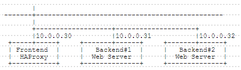
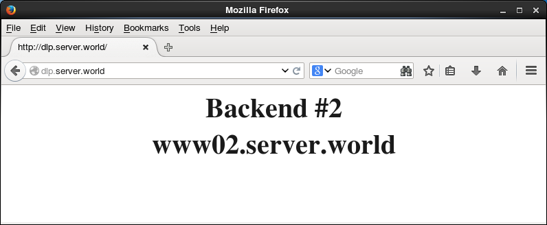
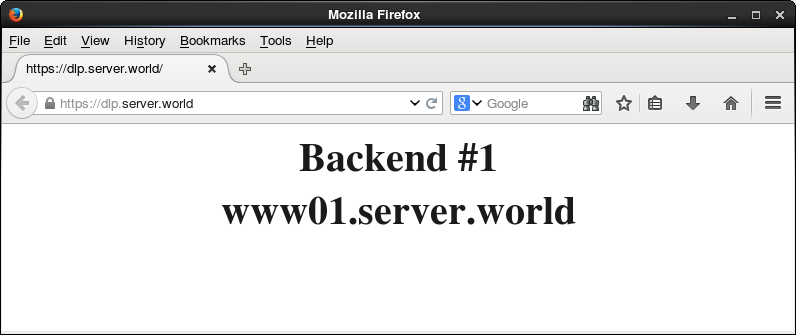

## 11.1. HAProxy

### 11.1.1. 安装HAProxy

安装[HAProxy](http://www.haproxy.org/)以配置负载均衡服务器。

本例基于以下环境：



与HAProxy服务器的HTTP连接转发到后端Web服务器。

`yum -y install haproxy`

配置HAProxy：

`mv /etc/haproxy/haproxy.cfg /etc/haproxy/haproxy.cfg.org`

编辑`/etc/haproxy/haproxy.cfg`文件：

```
global
    # 用于日志部分
    log         127.0.0.1 local2 info
    chroot      /var/lib/haproxy
    pidfile     /var/run/haproxy.pid
    # 最大每进程连接数
    maxconn     256
    # 进程用户和组
    user        haproxy
    group       haproxy
    # 使进程叉入后台
    daemon

defaults
    # 运行模式
    mode               http
    # 使用全局设置
    log                global
    # 获取HTTP请求日志
    option             httplog
    # 如果后端没有回复，则超时
    timeout connect    10s
    # 客户端超时
    timeout client     30s
    # 服务器端超时
    timeout server     30s

# 定义前端（为“http-in”部分设置任意名称）
frontend http-in
    # 侦听80端口
    bind *:80
    # 设置默认后端
    default_backend    backend_servers
    # 发送X-Forwarded-For头
    option             forwardfor

# 定义后端
backend backend_servers
    # 轮询均衡
    balance            roundrobin
    # 定义后端服务器
    server             www01 10.0.0.31:80 check
    server             www02 10.0.0.32:80 check
```

```
systemctl start haproxy
systemctl enable haproxy
```

配置Rsyslog以获取HAProxy的日志：

编辑`/etc/rsyslog.conf`文件：

```
# 取消注释并添加
$ModLoad imudp
$UDPServerRun 514
$AllowedSender UDP, 127.0.0.1

# 如下更改
*.info;mail.none;authpriv.none;cron.none,local2.none   /var/log/messages
 local2.*                                                /var/log/haproxy.log
```

`systemctl restart rsyslog`

将后端的httpd设置更改为记录X-Forwarded-For头：

编辑`/etc/httpd/conf/httpd.conf`文件：

```
# 如下更改
LogFormat "\"%{X-Forwarded-For}i\" %l %u %t \"%r\" %>s %b \"%{Referer}i\" \"%{User-Agent}i\"" combined
```

`systemctl restart httpd`

如下所示从客户端使用HTTP访问前端服务器以确保所有工作正常：




### 11.1.2. SSL设置

配置HAProxy使用SSL。HAproxy和客户端之间的连接使用SSL进行加密。（HAproxy与后端正常连接）。

本例基于上一节环境配置。

创建SSL证书：

`cd /etc/pki/tls/certs`

`openssl req -x509 -nodes -newkey rsa:2048 -keyout /etc/pki/tls/certs/haproxy.pem -out /etc/pki/tls/certs/haproxy.pem -days 365`

```
Generating a 2048 bit RSA private key
......++++++
.......++++++
writing new private key to '/etc/pki/tls/certs/haproxy.pem'
-----
You are about to be asked to enter information that will be incorporated
into your certificate request.
What you are about to enter is what is called a Distinguished Name or a DN.
There are quite a few fields but you can leave some blank
For some fields there will be a default value,
If you enter '.', the field will be left blank.
-----
Country Name (2 letter code) [XX]:CN  # 国家
State or Province Name (full name) []:SC  # 省
Locality Name (eg, city) [Default City]:CD  # 城市
Organization Name (eg, company) [Default Company Ltd]:GTS  # 公司
Organizational Unit Name (eg, section) []:Server World  # 部门
Common Name (eg, your name or your server's hostname) []:www.srv.world  # 服务器域名全称
Email Address []:xxx@srv.world  # 管理员邮箱
```

`chmod 600 haproxy.pem`

编辑`/etc/haproxy/haproxy.cfg`文件：

```
# 添加在“global”部分
global
    # 每个进程的SSL连接数
    maxsslconn     256
    # Diffie-Hellman密钥设置为2048位
    tune.ssl.default-dh-param 2048

# 添加在“frontend”部分
frontend  http-in
    bind *:80
    # 指定端口和证书
    bind *:443 ssl crt /etc/pki/tls/certs/haproxy.pem
```

`systemctl restart haproxy`

如下所示从客户端使用HTTPS访问前端服务器以确保所有工作正常：




