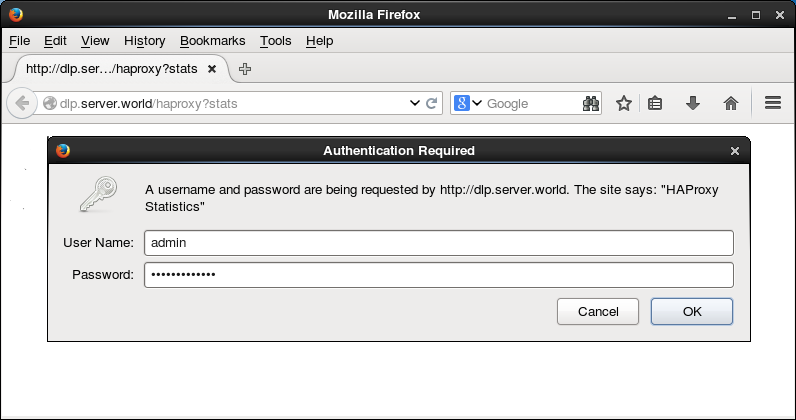
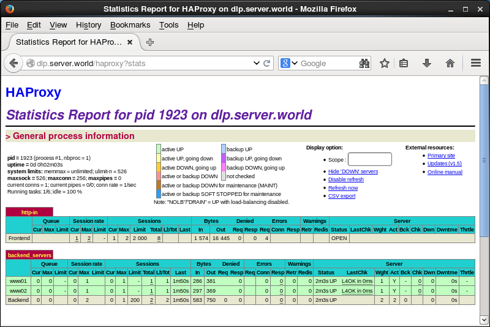
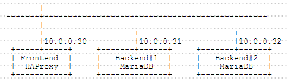

## 11.1. HAProxy

### 11.1.1. 安装HAProxy

安装[HAProxy](http://www.haproxy.org/)以配置负载均衡服务器。

本例基于以下环境：


与HAProxy服务器的HTTP连接转发到后端Web服务器。

`yum -y install haproxy`

配置HAProxy：

`mv /etc/haproxy/haproxy.cfg /etc/haproxy/haproxy.cfg.org`

编辑`/etc/haproxy/haproxy.cfg`文件：

```
global
    # 用于日志部分
    log         127.0.0.1 local2 info
    chroot      /var/lib/haproxy
    pidfile     /var/run/haproxy.pid
    # 最大每进程连接数
    maxconn     256
    # 进程用户和组
    user        haproxy
    group       haproxy
    # 后台守护进程
    daemon

defaults
    # 运行模式
    mode               http
    # 使用全局设置
    log                global
    # 获取HTTP请求日志
    option             httplog
    # 如果后端没有回复，则超时
    timeout connect    10s
    # 客户端超时
    timeout client     30s
    # 服务器端超时
    timeout server     30s

# 定义前端（为“http-in”部分设置任意名称）
frontend http-in
    # 侦听80端口
    bind *:80
    # 设置默认后端
    default_backend    backend_servers
    # 发送X-Forwarded-For头
    option             forwardfor

# 定义后端
backend backend_servers
    # 轮询均衡
    balance            roundrobin
    # 定义后端服务器
    server             www01 10.0.0.31:80 check
    server             www02 10.0.0.32:80 check
```

```
systemctl start haproxy
systemctl enable haproxy
```

配置Rsyslog以获取HAProxy的日志：

编辑`/etc/rsyslog.conf`文件：

```
# 取消注释并添加
$ModLoad imudp
$UDPServerRun 514
$AllowedSender UDP, 127.0.0.1

# 如下更改
*.info;mail.none;authpriv.none;cron.none,local2.none   /var/log/messages
 local2.*                                                /var/log/haproxy.log
```

`systemctl restart rsyslog`

将**后端**的httpd设置更改为记录X-Forwarded-For头：

编辑`/etc/httpd/conf/httpd.conf`文件：

```
# 如下更改
LogFormat "\"%{X-Forwarded-For}i\" %l %u %t \"%r\" %>s %b \"%{Referer}i\" \"%{User-Agent}i\"" combined
```

`systemctl restart httpd`

如下所示从客户端使用HTTP访问前端服务器以确保所有工作正常：


### 11.1.2. SSL设置

配置HAProxy使用SSL。HAproxy和客户端之间的连接使用SSL进行加密。（HAproxy与后端正常连接）。

本例基于上一节环境配置。

创建SSL证书：

`cd /etc/pki/tls/certs`

`openssl req -x509 -nodes -newkey rsa:2048 -keyout /etc/pki/tls/certs/haproxy.pem -out /etc/pki/tls/certs/haproxy.pem -days 365`

```
Generating a 2048 bit RSA private key
......++++++
.......++++++
writing new private key to '/etc/pki/tls/certs/haproxy.pem'
-----
You are about to be asked to enter information that will be incorporated
into your certificate request.
What you are about to enter is what is called a Distinguished Name or a DN.
There are quite a few fields but you can leave some blank
For some fields there will be a default value,
If you enter '.', the field will be left blank.
-----
Country Name (2 letter code) [XX]:CN  # 国家
State or Province Name (full name) []:SC  # 省
Locality Name (eg, city) [Default City]:CD  # 城市
Organization Name (eg, company) [Default Company Ltd]:GTS  # 公司
Organizational Unit Name (eg, section) []:Server World  # 部门
Common Name (eg, your name or your server's hostname) []:www.srv.world  # 服务器域名全称
Email Address []:xxx@srv.world  # 管理员邮箱
```

`chmod 600 haproxy.pem`

编辑`/etc/haproxy/haproxy.cfg`文件：

```
# 添加在“global”部分
global
    # 每个进程的SSL连接数
    maxsslconn     256
    # Diffie-Hellman密钥设置为2048位
    tune.ssl.default-dh-param 2048

# 添加在“frontend”部分
frontend  http-in
    bind *:80
    # 指定端口和证书
    bind *:443 ssl crt /etc/pki/tls/certs/haproxy.pem
```

`systemctl restart haproxy`

如下所示从客户端使用HTTPS访问前端服务器以确保所有工作正常：


### 11.1.3. 查看统计信息

#### 11.1.3.1. 网页查看

配置HAProxy以在Web上查看HAProxy的统计信息。

编辑`/etc/haproxy/haproxy.cfg`文件：

```
# 添加在“frontend”部分
frontend  http-in
    bind *:80
      # 启用统计报告
    stats enable
      # 统计网站的验证信息
    stats auth admin:adminpassword
      # 隐藏HAProxy的版本
    stats hide-version
      # 显示HAProxy主机名
    stats show-node
      # 刷新时间
    stats refresh 60s
      # 统计报告URI
    stats uri /haproxy?stats
```

`systemctl restart haproxy`

如下所示，客户端使用HTTP/HTTPS访问前端服务器，必须身份验证，输入在配置中设置的验证信息：



登录成功，可以在这里查看HAProxy统计信息：



#### 11.1.3.2. 命令查看

配置HAProxy以使用命令查看HAProxy的统计信息。

`yum -y install socat`

编辑`/etc/haproxy/haproxy.cfg`文件：

```
# 添加在“global”部分
global
      # 绑定UNIX sockets
    stats socket /var/lib/haproxy/stats
```

`systemctl restart haproxy`

如下查看统计信息：

显示当前统计：

`echo "show info" | socat /var/lib/haproxy/stats stdio`

```
Name: HAProxy
Version: 1.5.2
Release_date: 2014/07/12
Nbproc: 1
Process_num: 1
Pid: 1953
...
...
Idle_pct: 100
node: dlp.srv.world
description:
```

以CSV格式显示统计：

`echo "show stat" | socat /var/lib/haproxy/stats stdio`

```
# pxname,svname,qcur,qmax,scur,smax,slim,stot,bin,bout,dreq,dresp,ereq,econ,eresp,.....
http-in,FRONTEND,,,0,1,2000,1,0,187,0,0,1,,,,,OPEN,,,,,,,,,1,2,0,,,,0,0,0,1,,,,0,0,.....
backend_servers,www01,0,0,0,0,,0,0,0,,0,,0,0,0,0,UP,1,1,0,0,0,67,0,,1,3,1,,0,,2,0,,.....
backend_servers,www02,0,0,0,0,,0,0,0,,0,,0,0,0,0,UP,1,1,0,0,0,67,0,,1,3,2,,0,,2,0,,.....
backend_servers,BACKEND,0,0,0,0,200,0,0,0,0,0,,0,0,0,0,UP,2,2,0,,0,67,0,,1,3,0,,0,,.....
```

显示当前会话：

`echo "show sess" | socat /var/lib/haproxy/stats stdio`

```
0x7fbc09349150: proto=tcpv4 src=10.0.0.18:55987 fe=http-in be=<NONE> srv=<none> ts=08 
age=4s calls=8 rq[f=400000h,i=0,an=1ch,rx=26s,wx=,ax=] rp[f=048200h,i=0,an=00h,rx=,wx=,ax=] 
s0=[7,8h,fd=1,ex=] s1=[0,0h,fd=2,ex=] exp=26s
0x7fbc09351d80: proto=unix_stream src=unix:1 fe=GLOBAL be=<NONE> srv=<none> ts=0b age=0s 
calls=1 rq[f=c08200h,i=0,an=00h,rx=10s,wx=,ax=] rp[f=008002h,i=0,an=00h,rx=,wx=,ax=] s0=[7,8h,fd=3,ex=] 
s1=[7,8h,fd=-1,ex=] exp=
```

其他操作：

进入交互模式：

`socat readline /var/lib/haproxy/stats`

```
prompt

# 显示帮助
> help
Unknown command. Please enter one of the following commands only :
  clear counters : clear max statistics counters (add 'all' for all counters)
  clear table    : remove an entry from a table
  help           : this message
  prompt         : toggle interactive mode with prompt
  quit           : disconnect
  show info      : report information about the running process
  show pools     : report information about the memory pools usage
  show stat      : report counters for each proxy and server
  show errors    : report last request and response errors for each proxy
  show sess [id] : report the list of current sessions or dump this session
  show table [id]: report table usage stats or dump this table's contents
  get weight     : report a server's current weight
  set weight     : change a server's weight
  set server     : change a server's state or weight
  set table [id] : update or create a table entry's data
  set timeout    : change a timeout setting
  set maxconn    : change a maxconn setting
  set rate-limit : change a rate limiting value
  disable        : put a server or frontend in maintenance mode
  enable         : re-enable a server or frontend which is in maintenance mode
  shutdown       : kill a session or a frontend (eg:to release listening ports)
  show acl [id]  : report avalaible acls or dump an acl's contents
  get acl        : reports the patterns matching a sample for an ACL
  add acl        : add acl entry
  del acl        : delete acl entry
  clear acl <id> : clear the content of this acl
  show map [id]  : report avalaible maps or dump a map's contents
  get map        : reports the keys and values matching a sample for a map
  set map        : modify map entry
  add map        : add map entry
  del map        : delete map entry
  clear map <id> : clear the content of this map
  set ssl <stmt> : set statement for ssl

# 退出交互模式
> quit
```

### 11.1.4. Layer4模式

在Layer4模式配置HAProxy。

本例基于以下环境：



编辑`/etc/haproxy/haproxy.cfg`文件:

```
global
    log         127.0.0.1 local2 info
    chroot      /var/lib/haproxy
    pidfile     /var/run/haproxy.pid
    maxconn     256
    maxsslconn  256
    user        haproxy
    group       haproxy
    daemon

defaults
    # 为Layer4设置“mode tcp”
    mode               tcp
    log                global
    timeout connect    10s
    timeout client     30s
    timeout server     30s

# 定义前端和后端服务器
frontend  mysql-in
    bind *:3306
    default_backend    backend_servers

backend backend_servers
    balance            roundrobin
    server             db01 10.0.0.31:3306 check
    server             db02 10.0.0.32:3306 check
```

`systemctl restart haproxy`

如下所示，从客户端使用SQL访问前端服务器以确保所有工作正常：

`mysql -u keystone -p -h 10.0.0.30 keystone -e "select * from table01;"`

```
Enter password:
+------+-------------------+
| id   | name              |
+------+-------------------+
|    1 | db01.srv.world    |
+------+-------------------+
```

`mysql -u keystone -p -h 10.0.0.30 keystone -e "select * from table01;"`

```
Enter password:
+------+-------------------+
| id   | name              |
+------+-------------------+
|    1 | db02.srv.world    |
+------+-------------------+
```
