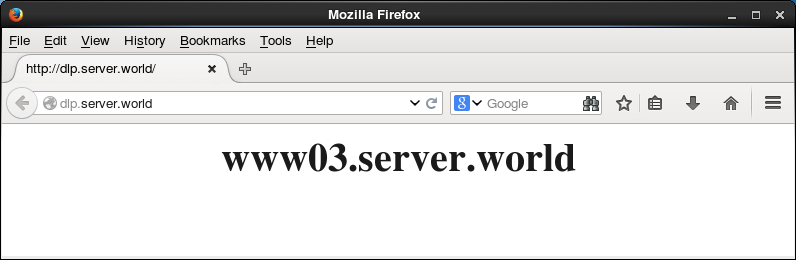
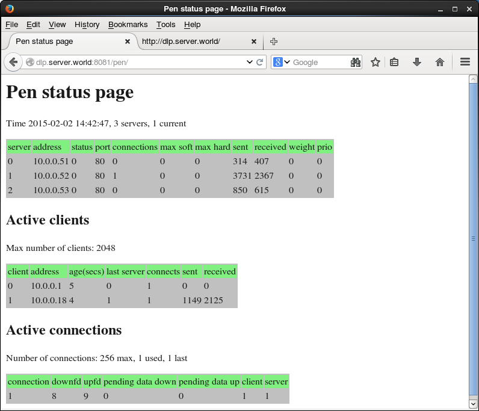
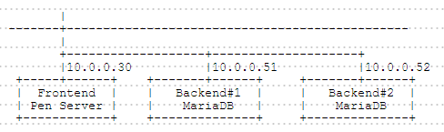

## 11.2. Pen

### 11.2.1. 安装Pen

[Pen](http://siag.nu/pen/)是轻量级的简单负载均衡软件。Pen基于TCP协议，所以它可以不仅可以用在HTTP，还可以用在SMTP，FTP，LDAP等。

本例基于以下环境：


配置Pen以向Backend#1(后端#1)，Backend#2(后端#2)，Backend#3(后端#3)Web服务器加载均衡。

`yum --enablerepo=epel -y install pen` # 从EPEL安装

编辑`/etc/pen.conf`文件：

```
# 日志文件
LOGFILE=/var/log/pen.log

# 统计报告文件
WEBFILE=/var/www/pen/webstats.html

# 最大连接数
MAX_CONNECTIONS=256

# 发送X-Forwarded-For头
XFORWARDEDFOR=true

# 轮询模式
ROUNDROBIN=true

# 侦听端口
PORT=80

# 后端数量
BACKEND=3

# 定义后端服务器
SERVER1=10.0.0.51:80
SERVER2=10.0.0.52:80
SERVER2=10.0.0.53:80
```

创建init脚本：

编辑`/etc/rc.d/init.d/pend`文件：

```
#!/bin/bash

# pend: Start/Stop Pend
# chkconfig: - 90 10
# description: Pen is a light weight simple load balancer.
# pidfile: /var/run/pen.pid

. /etc/rc.d/init.d/functions
. /etc/pen.conf

LOCKFILE="/var/lock/subsys/pen"
PID=/var/run/pen.pid
PROG=/usr/bin/pen
PROGNAME=Pend

RETVAL=0
start() {
    SERVER=`grep "^SERVER" /etc/pen.conf | cut -d= -f2`
    [ $XFORWARDEDFOR = "true" ] && SERVER="-H $SERVER"
    [ $ROUNDROBIN = "true" ] && SERVER="-r $SERVER"
    [ $SSLCERTS ] && SERVER="-E $SSLCERTS $SERVER"

    echo -n $"Starting $PROGNAME: "
    daemon $PROG $PORT -w $WEBFILE -x $MAX_CONNECTIONS -p $PID -l $LOGFILE -S $BACKEND $SERVER
    RETVAL=$?
    echo
    [ $RETVAL -eq 0 ] && touch $LOCKFILE
    return $RETVAL
}
stop() {
    echo -n $"Stopping $PROGNAME: "
    killproc $PROG
    RETVAL=$?
    echo
    [ $RETVAL -eq 0 ] && rm -f $PID $LOCKFILE
    return $RETVAL
}
case "$1" in
    start)
        start
        ;;
    stop)
        stop
        ;;
    status)
        status -p "$PID" -l $PROG $PROGNAME
        ;;
    restart)
        stop
        start
        ;;
    *)
        echo $"Usage: $0 {start|stop|status|restart}"
        exit 1
esac
exit $?
```

`chmod 755 /etc/rc.d/init.d/pend`

创建Systemd设置文件：

编辑`/usr/lib/systemd/system/pen.service`文件：

```
[Unit]
Description=Pend service
After=network.target

[Service]
Type=oneshot
RemainAfterExit=yes
ExecStart=/etc/rc.d/init.d/pend start
ExecStop=/etc/rc.d/init.d/pend stop

[Install]
WantedBy=multi-user.target
```

```
systemctl start pen
systemctl enable pen
```

在后端服务器上配置httpd，记录X-Forwarded-For的日志：

编辑`/etc/httpd/conf/httpd.conf`文件：

```
# 更改
LogFormat "\"%{X-Forwarded-For}i\" %l %u %t \"%r\" %>s %b \"%{Referer}i\" \"%{User-Agent}i\"" combined
```

`systemctl restart httpd`

如下所示从客户端使用HTTP访问前端服务器以确保所有工作正常：




### 11.2.2. SSL设置

配置Pen使用SSL。Pen和客户端之间的连接使用SSL进行加密。（Pen与后端正常连接）。

本例基于上一节环境配置。

创建SSL证书：

`cd /etc/pki/tls/certs`

`openssl req -x509 -nodes -newkey rsa:2048 -keyout /etc/pki/tls/certs/pen.pem -out /etc/pki/tls/certs/pen.pem -days 365`

```
Generating a 2048 bit RSA private key
......++++++
.......++++++
writing new private key to '/etc/pki/tls/certs/pen.pem'
-----
You are about to be asked to enter information that will be incorporated
into your certificate request.
What you are about to enter is what is called a Distinguished Name or a DN.
There are quite a few fields but you can leave some blank
For some fields there will be a default value,
If you enter '.', the field will be left blank.
-----
Country Name (2 letter code) [XX]:CN  # 国家
State or Province Name (full name) []:SC  # 省
Locality Name (eg, city) [Default City]:CD  # 城市
Organization Name (eg, company) [Default Company Ltd]:GTS  # 公司
Organizational Unit Name (eg, section) []:Server World  # 部门
Common Name (eg, your name or your server's hostname) []:www.srv.world  # 服务器域名全称
Email Address []:xxx@srv.world  # 管理员邮箱
```

`chmod 600 pen.pem`

编辑`/etc/pen.conf`文件：

```
# 更改端口并指定证书
PORT=443
SSLCERTS=/etc/pki/tls/certs/pen.pem
```

`systemctl restart pen`

如下所示从客户端使用HTTPS访问前端服务器以确保所有工作正常：


### 11.2.3. 查看统计信息

先[安装httpd](../5. Web服务器/5.1. Apache httpd.html)

另外，由于Pen使用了80端口，因此将httpd的端口从80更改为另一个端口（本例使用8081）。

配置Pen：

`cp /usr/share/doc/pen-*/penstats /var/www/pen`

编辑`/var/www/pen/penstats`文件：

```
# 更改
PIDFILE=/var/run/pen.pid
WEBFILE=/var/www/pen/webstats.html
```

编辑`/etc/httpd/conf.d/pen.conf`文件：

```
# 如下更改
Alias /pen/ /var/www/pen/
<Directory /var/www/pen/>
    DirectoryIndex webstats.html
    #Options ExecCGI
    <IfModule mod_authz_core.c>
        # Apache 2.4
        # 添加访问权限
        Require local
        Require ip 10.0.0.0/24
    </IfModule>
```

`systemctl restart httpd`

`chmod 755 /var/www/pen/penstats`

生成统计：

`/var/www/pen/penstats > /dev/null`

添加到Cron：

`echo '*/5 * * * * /var/www/pen/penstats > /dev/null' > /etc/cron.d/pend`

访问`http://(Pen服务器的主机名或IP地址):(httpd侦听端口)/pen/`，然后可以查看Pen的统计数据如下：



### 11.2.4. MariaDB负载均衡

将Pen配置为加载均衡到两个MariaDB后端。

本例基于以下环境：



先按照[第一节内容]()


