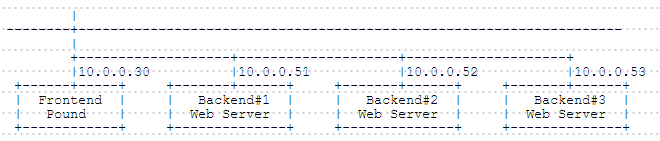
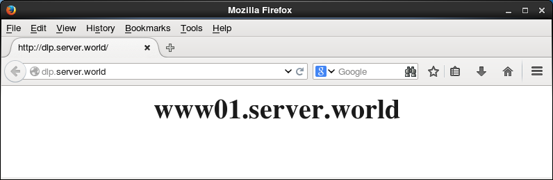
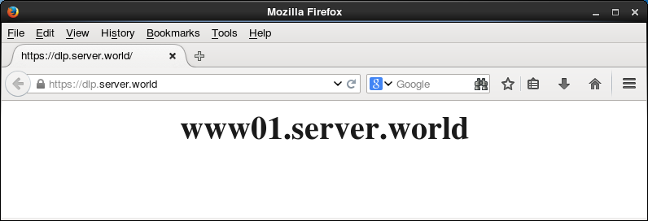
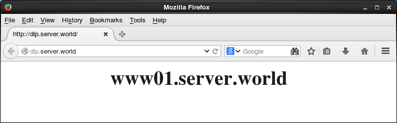
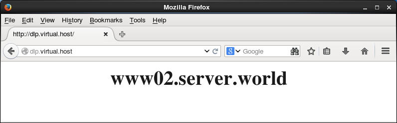
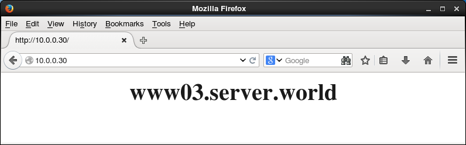

## 11.3. Pound

### 11.3.1. 安装Pound

[Pound](http://www.apsis.ch/pound/)是HTTP/HTTPS负载均衡软件。

本例基于以下环境：



配置Pound以向Backend#1(后端#1)，Backend#2(后端#2)，Backend#3(后端#3)Web服务器加载均衡。

`yum --enablerepo=epel -y install Pound` # 从EPEL安装

`mv /etc/pound.cfg /etc/pound.cfg.org`

编辑`/etc/pound.cfg`文件：

```
User "pound"
Group "pound"
# 日志级别（最大：5）
LogLevel 3
# 指定LogFacility
LogFacility local1
# 心跳间隔 - 秒
Alive 30

# 定义前端
ListenHTTP
    Address 0.0.0.0
    Port 80
End

# 定义后端
Service
    BackEnd
       # 后端服务器的IP地址
        Address  10.0.0.51
       # 后端服务器的端口
        Port     80
       # 设置优先级（值为1-9，最大9）
        Priority 5
    End

    BackEnd
        Address  10.0.0.52
        Port     80
        Priority 5
    End

    BackEnd
        Address  10.0.0.53
        Port     80
        Priority 5
    End
End
```

`sed -i -e "s/^PIDFile/#PIDFile/" /usr/lib/systemd/system/pound.service`

```
systemctl start pound
systemctl enable pound
```

配置Rsyslog以获取Pound的日志：

编辑`/etc/rsyslog.conf`文件：

```
# 如下更改
*.info;mail.none;authpriv.none;cron.none,local1.none   /var/log/messages
 local1.*                                                /var/log/pound.log
```

`systemctl restart rsyslog`

将**后端**的httpd设置更改为记录X-Forwarded-For的日志：

编辑`/etc/httpd/conf/httpd.conf`文件：

```
# 更改
LogFormat "\"%{X-Forwarded-For}i\" %l %u %t \"%r\" %>s %b \"%{Referer}i\" \"%{User-Agent}i\"" combined
```

`systemctl restart httpd`

如下所示从客户端使用HTTP访问前端服务器以确保所有工作正常：




### 11.3.2. SSL设置

配置Pound使用SSL。Pound和客户端之间的连接使用SSL进行加密。（Pound与后端正常连接）。

本例基于上一节环境配置。

创建SSL证书：

`cd /etc/pki/tls/certs`

`openssl req -x509 -nodes -newkey rsa:2048 -keyout /etc/pki/tls/certs/pound.pem -out /etc/pki/tls/certs/pound.pem`

```
Generating a 2048 bit RSA private key
......++++++
.......++++++
writing new private key to '/etc/pki/tls/certs/pound.pem'
-----
You are about to be asked to enter information that will be incorporated
into your certificate request.
What you are about to enter is what is called a Distinguished Name or a DN.
There are quite a few fields but you can leave some blank
For some fields there will be a default value,
If you enter '.', the field will be left blank.
-----
Country Name (2 letter code) [XX]:CN  # 国家
State or Province Name (full name) []:SC  # 省
Locality Name (eg, city) [Default City]:CD  # 城市
Organization Name (eg, company) [Default Company Ltd]:GTS  # 公司
Organizational Unit Name (eg, section) []:Server World  # 部门
Common Name (eg, your name or your server's hostname) []:www.srv.world  # 服务器域名全称
Email Address []:xxx@srv.world  # 管理员邮箱
```

`chmod 600 pound.pem`

编辑`/etc/pound.cfg`文件：

```
# 如下添加
ListenHTTP
    Address 0.0.0.0
    Port 80
End
 ListenHTTPS
    Address 0.0.0.0
    Port 443
    Cert "/etc/pki/tls/certs/pound.pem"
End
```

如下所示从客户端使用HTTPS访问前端服务器以确保所有工作正常：



### 11.3.3. URL重定向

来自URL匹配的重定向设置。

本例基于以下环境：


如下配置Pound：

到`dlp.srv.world`的HTTP连接转发到Backend#1(后端#1)，

到`dlp.virtual.host`的HTTP连接转发到Backend#2(后端#2)，

到除开上面的HTTP连接转发到Backend#3(后端#3)。

配置Pound：

`mv /etc/pound.cfg /etc/pound.cfg.org`

编辑`/etc/pound.cfg`文件：

```
User "pound"
Group "pound"
LogLevel 3
LogFacility local1
Alive 30

ListenHTTP
    Address 0.0.0.0
    Port 80
End

Service
    # 为dlp.srv.world定义
    HeadRequire "Host: .*dlp.srv.world"
    BackEnd
        Address  10.0.0.51
        Port     80
        Priority 5
    End
End

Service
    # 为dlp.virtual.host
    HeadRequire "Host: .*dlp.virtual.host"
    BackEnd
        Address  10.0.0.52
        Port     80
        Priority 5
    End
End

Service
    # 为其他定义
    HeadRequire "Host: .*"
    BackEnd
        Address  10.0.0.53
        Port     80
        Priority 5
    End
End
```

`systemctl restart pound`

如下所示从客户端使用HTTP访问前端服务器以确保所有工作正常：






