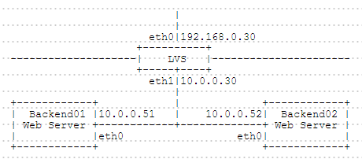
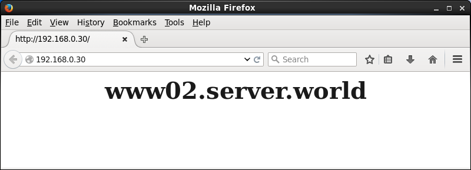
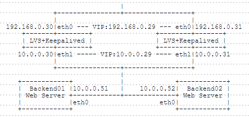

## 11.4. LVS

### 11.4.1. 安装LVS

配置[LVS（Linux Virtual Server虚拟服务器）](http://www.linuxvirtualserver.org/)构建负载均衡器。

本例基于以下环境：



到LVS服务器eth0的HTTP数据包将使用NAT转发到Backend01和Backend02服务器。

首先在两个后端Web服务器上将默认网关更改为LVS的内部IP地址。（本例为`10.0.0.30`）

安装ipvsadm：

`yum -y install ipvsadm`

启用IP转发：

`echo 'net.ipv4.ip_forward = 1' >> /etc/sysctl.conf`

`sysctl -p`

`touch /etc/sysconfig/ipvsadm`

```
systemctl start ipvsadm
systemctl enable ipvsadm
```

配置负载均衡：

清除表：

`ipvsadm -C`

添加虚拟服务，格式为：`ipvsadm -A -t (服务器IP:端口) -s (分配方式)` （分配方式见[下表](#distribution-method)）
`ipvsadm -A -t 192.168.0.30:80 -s wlc`

添加后端实体服务器，格式为：`ipvsadm -a -t (服务器IP:端口) -r (实体服务器IP:端口) -m`（“m”表示伪装（NAT））：

`ipvsadm -a -t 192.168.0.30:80 -r 10.0.0.51:80 -m`

`ipvsadm -a -t 192.168.0.30:80 -r 10.0.0.52:80 -m`

确认表

`ipvsadm -l`

```
IP Virtual Server version 1.2.1 (size=4096)
Prot LocalAddress:Port Scheduler Flags
  -> RemoteAddress:Port           Forward Weight ActiveConn InActConn
TCP  dlp.srv.world:http wlc
  -> 10.0.0.51:http               Masq    1      0          0
  -> 10.0.0.52:http               Masq    1      0          0
```

配置完成，访问服务IP地址确保它正常工作：




<span id="distribution-method">[下面是一些分配方式](https://www.server-world.info/en/note?os=CentOS_7&p=lvs)</span>：

| 方式 | 描述 |
| --- | --- |
| rr | Round Robin轮询。在可用的实体服务器之间平均分配作业。 |
| wrr | Weighted Round Robin加权轮询。将作业分配给实体服务器的权重。有较高权重的服务器首先接收新作业，且获得比低权重服务器更多的作业。具有相等权重的服务器获得的新作业平均分配。 |
| lc | Least-Connection最小连接。为有较少活动作业的实体服务器分配更多作业。 |
| wlc | Weighted Least-Connection加权最小连接。为有较少作业并相对于实体服务器权重（Ci/Wi）的服务器分配更多作业。这是默认值。 |
| lblc | Locality-Based Least-Connection基于位置的最小连接。如果服务器未过载并可用，则将同一IP地址的作业分配给同一服务器，否则将作业分配给作业较少的服务器，保留它以备将来分配。 |
| lblcr | Locality-Based Least-Connection with Replication复制基于位置的最小连接。将同一IP地址的作业分配给为该IP地址设置的服务器中的最小连接节点。如果服务器集中的所有节点都已过载，则将在集群中选择有较少作业的节点，并将其添加到目标的服务器集中。如果服务器集尚未被修改指定的时间，则最多加载的节点将从服务器集中删除，以避免高度复制。 |
| dh | Destination Hashing目标哈希。通过按照目标的IP地址查找静态分配的哈希表来将作业分配给服务器。 |
| sh | Source Hashing源哈希。通过按照源的IP地址查找静态分配的哈希表来将作业分配给服务器。 |
| sed | Shortest Expected Delay最短预期延迟。将最短预期延迟的传入作业分配给服务器。如果发送到第i个服务器，作业将经历的预期延迟是（Ci + 1）/ Ui，其中Ci是第i个服务器上的作业数，Ui是第i个服务器的固定服务速率（权重）。 |
| nq | Never Queue从不队列。将传入的作业分配给空闲服务器（如果存在），而不是等待更快的服务器，如果所有服务器都忙，则采用最短预期延迟策略来分配作业。 |

### 11.4.2. LVS + Keepalived

LVS + Keepalived服务器本身的冗余配置

本例基于以下环境：



到LVS服务器eth0的HTTP数据包将使用NAT转发到Backend01和Backend02服务器。

首先在两个后端Web服务器上将默认网关更改为LVS的内部IP地址。（本例为`10.0.0.29`）

安装ipvsadm和keepalived：

`yum -y install ipvsadm keepalived`

启用IP转发：

`echo 'net.ipv4.ip_forward = 1' >> /etc/sysctl.conf`

`sysctl -p`

`touch /etc/sysconfig/ipvsadm`

```
systemctl start ipvsadm
systemctl enable ipvsadm
```

配置Keepalived：

可以在两个后端服务器上配置相同的设置（除了有一个设置：“priority”优先级部分，在两个后端服务器上进行更改）：

`mv /etc/keepalived/keepalived.conf /etc/keepalived/keepalived.conf.org`

编辑`/etc/keepalived/keepalived.conf`文件：

```
global_defs {
    notification_email {
        root@dlp.srv.world
    }
    notification_email_from root@dlp.srv.world
    smtp_server 127.0.0.1
    smtp_connect_timeout 30
    router_id LVS_Server
}
vrrp_instance VI_1 {
    state BACKUP
    # 监控接口
    interface eth0
    # 虚拟路由器ID
    virtual_router_id 51
    # 设置优先级（在每个服务器上更改此值）
    # （数字越大意味着优先级越高）
    priority 100
    nopreempt
    # VRRP发送间隔
    advert_int 1
    # Keepalived服务器之间的身份验证信息
    authentication {
        auth_type PASS
        auth_pass password
    }

    virtual_ipaddress {
        # 虚拟IP地址
        192.168.0.29 dev eth0
        10.0.0.29/24 dev eth1
    }
}
virtual_server 192.168.0.29 80 {
    # 监控间隔
    delay_loop 3
    # 分配方式
    lvs_sched rr
    # 路由方式
    lvs_method NAT
    protocol TCP

    # 后端服务器#1
    real_server 10.0.0.51 80 {
        weight 1
        HTTP_GET {
            url {
                # 监控路径
                path /
                # 状态码为正常状态
                status_code 200
            }
            # 超时（秒）
            connect_timeout 3
        }
    }
    # 后端服务器#2
    real_server 10.0.0.52 80 {
        weight 1
        HTTP_GET {
            url {
                path /
                status_code 200
            }
            connect_timeout 3
        }
    }
}
```

```
systemctl start keepalived
systemctl enable keepalived
```

配置完成，访问服务IP地址确保其正常工作。
