## 12.4. Zabbix

[Zabbix](http://www.zabbix.com/)是一个基于WEB界面的提供分布式系统监视以及网络监视功能的企业级的开源解决方案。

### 12.4.1. 安装Zabbix 3.2

先安装[Apache httpd](../5. Web服务器/5.1. Apache httpd.html)，[PHP](../5. Web服务器/5.1. Apache httpd.html#513-使用php脚本)和[MariaDB](../6. 数据库/6.1. MariaDB.html)。

`yum -y install php-mysql php-gd php-xml php-bcmath` # 安装一些其他必需的软件包

`yum -y install http://repo.zabbix.com/zabbix/3.2/rhel/7/x86_64/zabbix-release-3.2-1.el7.noarch.rpm` # 安装Zabbix存储库

`yum -y install zabbix-get zabbix-server-mysql zabbix-web-mysql zabbix-agent` # 安装Zabbix服务器

为Zabbix创建数据库：

`mysql -u root -p`

```
Enter password:
Welcome to the MariaDB monitor.  Commands end with ; or \g.
Your MariaDB connection id is 10
Server version: 5.5.50-MariaDB MariaDB Server

Copyright (c) 2000, 2016, Oracle, MariaDB Corporation Ab and others.

Type 'help;' or '\h' for help. Type '\c' to clear the current input statement.

MariaDB [(none)]> create database zabbix;
Query OK, 1 row affected (0.00 sec)

MariaDB [(none)]> grant all privileges on zabbix.* to zabbix@'localhost' identified by 'password';
Query OK, 0 rows affected (0.00 sec)

MariaDB [(none)]> grant all privileges on zabbix.* to zabbix@'%' identified by 'password';
Query OK, 0 rows affected (0.00 sec)

MariaDB [(none)]> flush privileges;
Query OK, 0 rows affected (0.00 sec)

MariaDB [(none)]> exit
Bye
```

`cd /usr/share/doc/zabbix-server-mysql-*/`

`gunzip create.sql.gz`

`mysql -u root -p zabbix < create.sql`

```
Enter password:
```

配置并启动Zabbix服务器：

编辑`/etc/zabbix/zabbix_server.conf`文件：

```
# 添加
DBHost=localhost

# 添加Zabbix数据库密码
DBPassword=password
```

```
systemctl start zabbix-server
systemctl enable zabbix-server
```

配置并启动Zabbix代理以监控Zabbix服务器本身：

编辑`/etc/zabbix/zabbix_agentd.conf`文件：

```
# 指定Zabbix服务器
Server=127.0.0.1

# 指定Zabbix服务器
ServerActive=127.0.0.1

# 更改为自己的主机名
Hostname=dlp.srv.world
```

```
systemctl start zabbix-agent
systemctl enable zabbix-agent
```

编辑`/etc/httpd/conf.d/zabbix.conf`文件，更改httpd设置如下：

```
# 为Zabbix Web前端添加访问权限
#Require all granted
Require ip 127.0.0.1 10.0.0.0/24

# 取消注释并更改为自己的时区
php_value date.timezone Asia/Shanghai
```

`systemctl restart httpd`

如果启用了SELinux，更改布尔设置：

`setsebool -P httpd_can_connect_zabbix on`

firewalld防火墙规则：

```
firewall-cmd --add-service={http,https} --permanent
firewall-cmd --add-port={10051/tcp,10050/tcp} --permanent
firewall-cmd --reload
```

### 12.4.2. 初始设置

从Zabbix服务器允许的网络中的客户端访问`http://(Zabbix服务器的主机名或IP地址)/zabbix/`，显示Zabbix起始页，点击“Next step”继续：

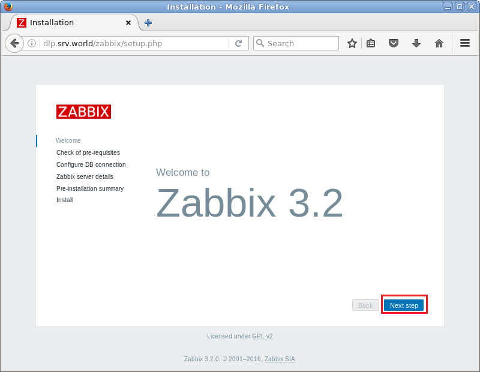

确认所有项目都是“OK”，然后点击“Next step”继续：

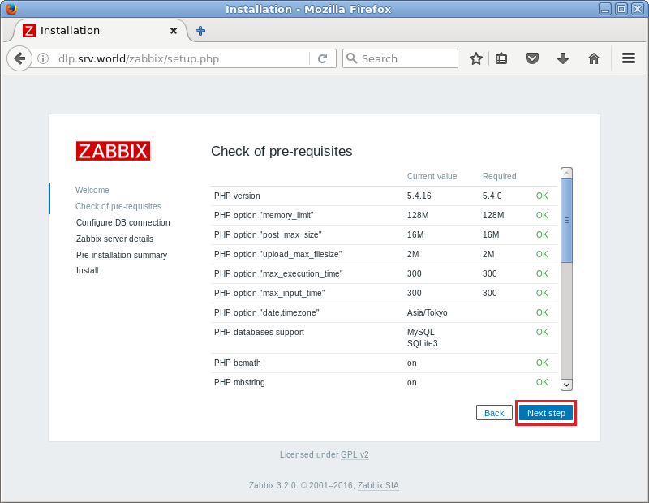

数据库设置部分。将“User”字段默认的“root”更改为“zabbix”，并输入密码：

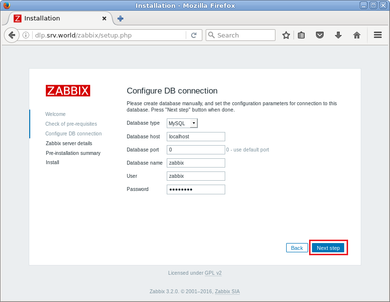

连接到Zabbix服务器的设置。如果是本地，保持默认。更改“Name”字段为名称：

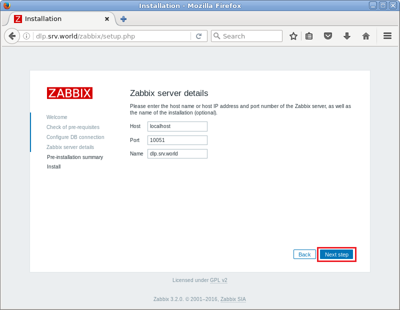

确认前面的设置，如果一切正常，继续下一步：

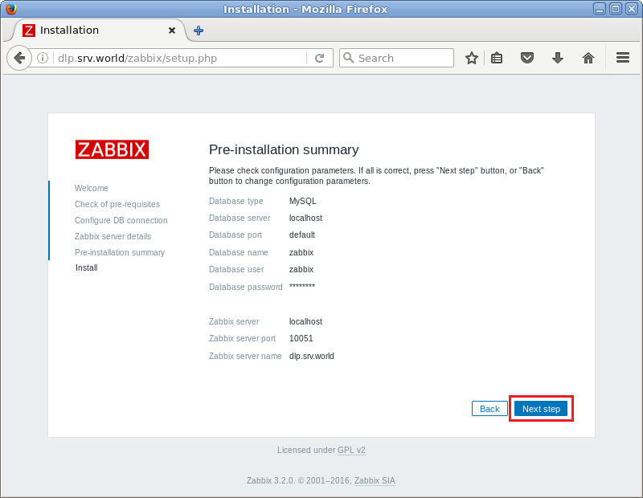

单击“Finish”完成初始设置：

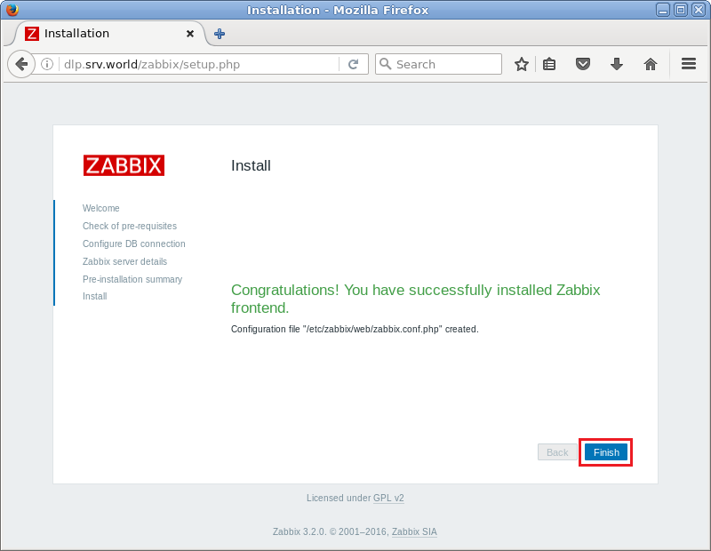

登录页面。可以使用用户名“admin”，初始密码“zabbix”登录：


登录成功。下面是Zabbix管理站点的主页：

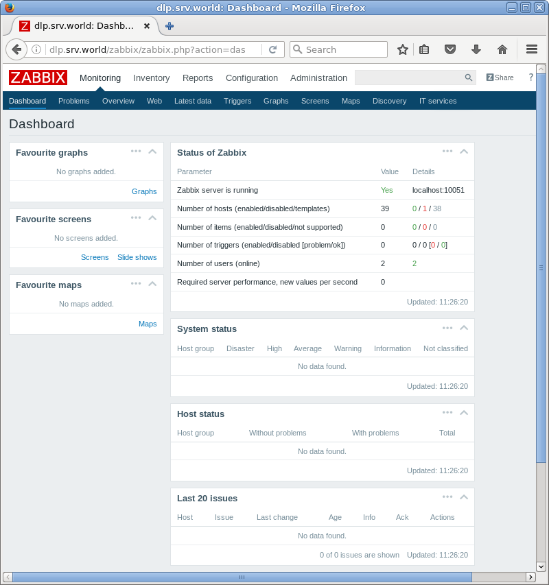

首先更改管理员密码。并设置管理员电子邮件地址。

使用管理员帐户“admin”登录Zabbix管理界面，点击右上角人形图标：

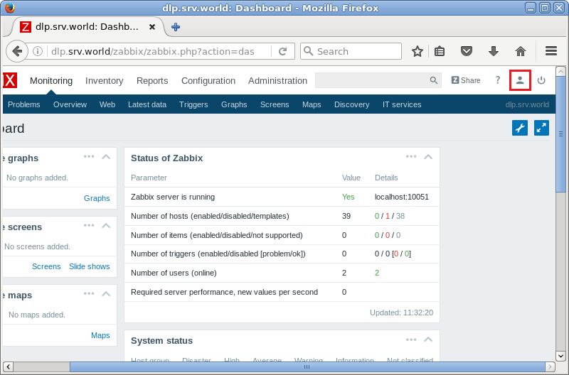

点击“Change Password”：

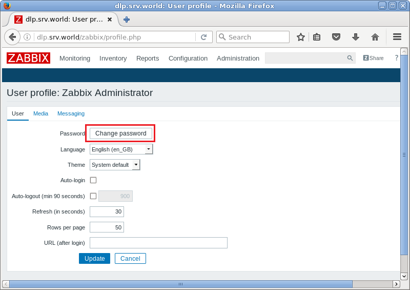

输入您要更改的密码，然后点击“Update”更改密码。顺便，本例是英语显示，但如果您要更改显示语言，可以在“Language”字段中选择：


再次进入“Profile”页面，移动到“Media”选项卡，然后点击“Add”：

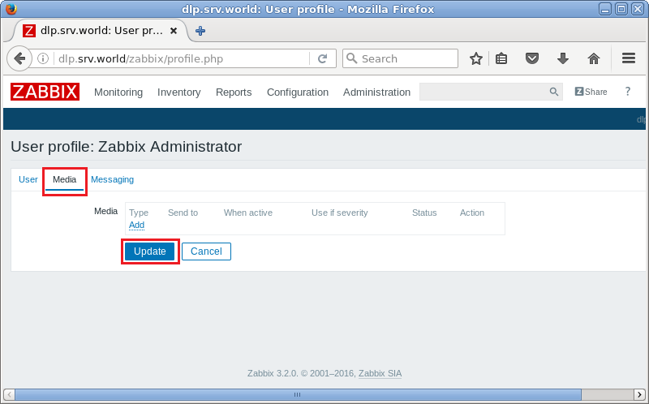

输入管理员电子邮件地址，然后点击“Add”：

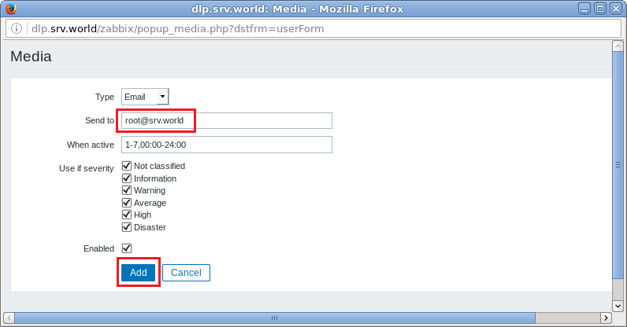

点击“Update”完成：

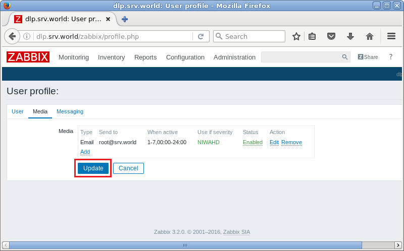

### 12.4.3. 设置监控目标主机

使用管理员帐户“admin”登录Zabbix管理界面，点击“Configuration” -> “Hosts”。安装了Zabbix代理的本地主机显示如下，选中复选框，然后点击“Enable”：

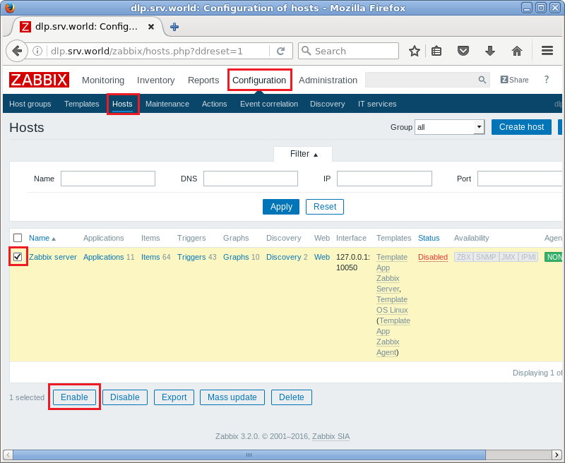

“Status”将转为“enabled”，并开始监控服务器：

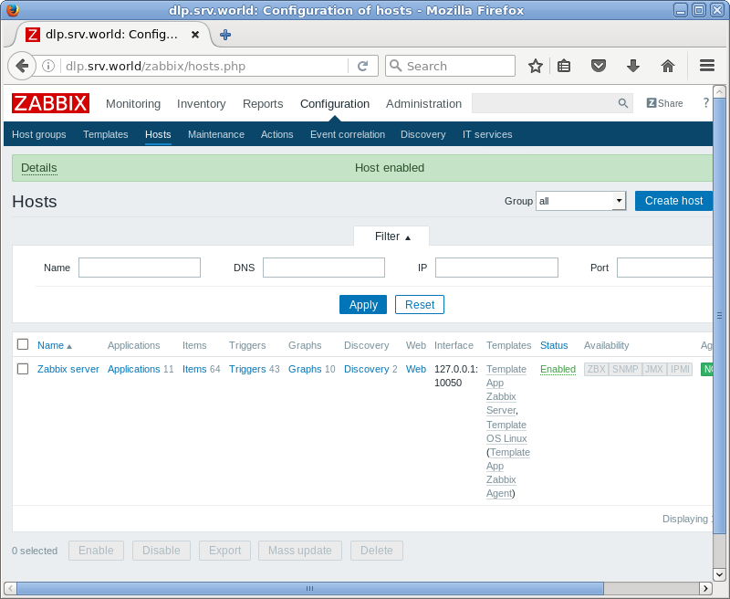

几分钟后，收集监控数据如下。以下页面为“Monitoring” -> “Screens”：

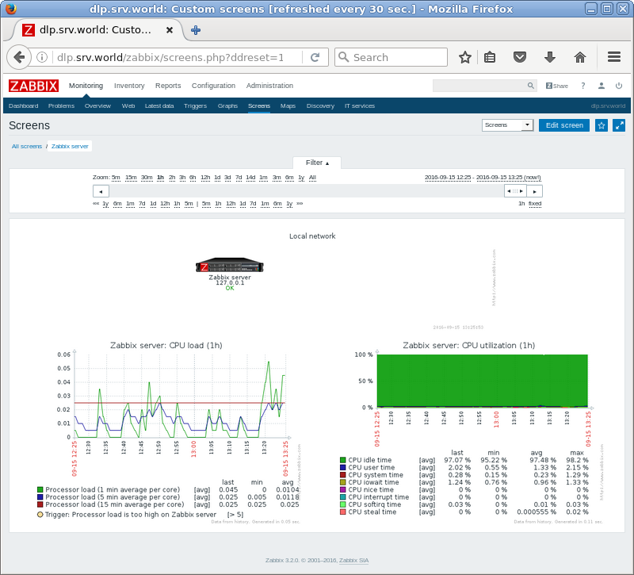

### 12.4.4. 设置电子邮件通知

设置SMTP服务器以发送邮件通知。

使用管理员帐户“admin”登录Zabbix管理界面，转到“Administration” -> “Media Types”，然后点击“Email”：

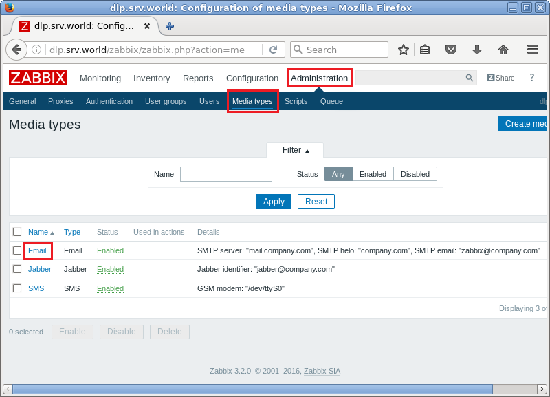

如下设置要使用的SMTP服务器信息，然后点击“Update”按钮：

![zabbix-email-settings2](../Contents/zabbix-email-settings2.png

在“Details”字段中确认正常更改SMTP服务器：

![zabbix-email-settings3](../Contents/zabbix-email-settings3.png

### 12.4.5. 添加目标主机


### 12.4.6. 添加目标项目


