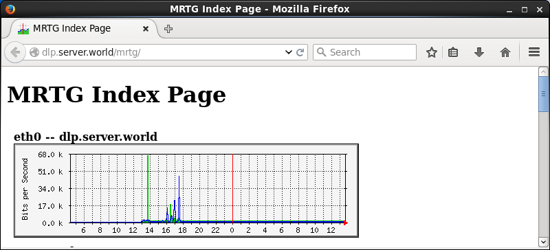
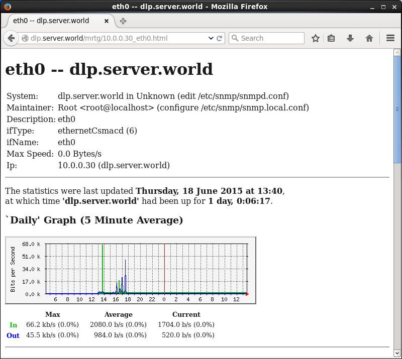

## 12.5. MRTG

[MRTG（Multi Router Traffic Grapher）](http://oss.oetiker.ch/mrtg/)是一套可用来绘出网络流量图的软件。

### 12.5.1. 安装MRTG

先[安装Apache httpd](../5. Web服务器/5.1. Apache httpd.html)。

`yum -y install net-snmp net-snmp-utils mrtg` # 安装MRTG，SNMP

配置SNMP（Simple Network Management Protocol简单网络管理协议）：

编辑`/etc/snmp/snmpd.conf`文件：

```
# 注释
#com2sec notConfigUser   default       public

# 取消注释并更改
# “mynetwork”部分更改为自己的本地网络
# 除了“public”或“private”，更改“comunity name”
com2sec  local       localhost    Serverworld
com2sec  mynetwork   10.0.0.0/24  Serverworld

# 取消注释并更改
group MyRWGroup v2c     local
group MyROGroup v2c     mynetwork

# 取消注释
view all    included  .1           80

# 取消注释并更改
access MyROGroup "" v2c   noauth   exact   all   none   none
access MyRWGroup "" v2c   noauth   exact   all   all      all
```

```
systemctl start snmpd
systemctl enable snmpd
```

显示状态（将“Serverworld”替换为自己的“comunity name”）：

`snmpwalk -v2c -c Serverworld localhost system`

```
SNMPv2-MIB::sysDescr.0 = STRING: Linux dlp.srv.world 3.10.0-229.4.2.el7.x86_64 #1 SMP Wed May.....
SNMPv2-MIB::sysObjectID.0 = OID: NET-SNMP-MIB::netSnmpAgentOIDs.10
DISMAN-EVENT-MIB::sysUpTimeInstance = Timeticks: (91954) 0:15:19.54
SNMPv2-MIB::sysContact.0 = STRING: Root <root@localhost> (configure /etc/snmp
.....
.....
SNMPv2-MIB::sysORUpTime.9 = Timeticks: (4) 0:00:00.04
SNMPv2-MIB::sysORUpTime.10 = Timeticks: (4) 0:00:00.04
```

配置MRTG：

`cfgmaker --snmp-options=:::::2 --ifref=descr --ifdesc=descr Serverworld@10.0.0.30 > /etc/mrtg/mrtg.cfg`

编辑`/etc/mrtg/mrtg.cfg`文件：

```
# 添加
WorkDir: /var/www/mrtg

# 取消注释
Options[_]: growright, bits

# 取消下行开始的所有行并更改“MaxBytes”的值
Target[10.0.0.30_eth0]: \eth0:Serverworld@10.0.0.30:::::2
noHC[10.0.0.30_eth0]: yes
SetEnv[10.0.0.30_eth0]: MRTG_INT_IP="10.0.0.30" MRTG_INT_DESCR="eth0"
MaxBytes[10.0.0.30_eth0]: 125000000
Title[10.0.0.30_eth0]: eth0 -- dlp.srv.world
PageTop[10.0.0.30_eth0]: <h1>eth0 -- dlp.srv.world</h1>
.....
.....
```

`for (( i=1 ; i <= 3 ; i++ )); do env LANG=C mrtg /etc/mrtg/mrtg.cfg; done` # 执行MRTG三次（显示警告，直到三次）

```
2015-06-16 19:54:12, Rateup WARNING: /usr/bin/rateup could not read the primary log file for 10.0.0.30_eth0
2015-06-16 19:54:12, Rateup WARNING: /usr/bin/rateup The backup log file for 10.0.0.30_eth0 was invalid as well
2015-06-16 19:54:12, Rateup WARNING: /usr/bin/rateup Can't rename 10.0.0.30_eth0.log to 10.0.0.30_eth0.old updating log file
```

`indexmaker --columns=1 /etc/mrtg/mrtg.cfg > /var/www/mrtg/index.html` # 生成索引文件

编辑`/etc/cron.d/mrtg`文件，添加进Cron：

```
*/5 * * * * root LANG=C LC_ALL=C /usr/bin/mrtg /etc/mrtg/mrtg.cfg --lock-file /var/lock/mrtg/mrtg_l --confcache-file /var/lib/mrtg/mrtg.ok
```

配置httpd从其他主机访问MRTG站点：

编辑`/etc/httpd/conf.d/mrtg.conf`文件：

```
# 取消注释并添加访问权限
Require ip 10.0.0.0/24
# 添加“DirectoryIndex”
DirectoryIndex index.html
```

`systemctl start httpd`

从客户端浏览器访问`http://(MRTG主机名或IP地址)/mrtg/`，可以查看MRTG网站：





### 12.5.2. 获取CPU负载平均值

配置MRTG以显示CPU负载平均速率。

编辑`/etc/mrtg/mrtg.cfg`文件：

```
# 添加以下内容到最后（将“Serverworld”替换为自己的“comunity name”）
Target[CPU]: .1.3.6.1.4.1.2021.10.1.5.1&.1.3.6.1.4.1.2021.10.1.5.2:Serverworld@127.0.0.1:::::2
MaxBytes[CPU]: 100
Unscaled[CPU]: dwmy
Options[CPU]: gauge, growright, nopercent
YLegend[CPU]: Load Average
ShortLegend[CPU]: (%)
LegendI[CPU]: Load Average 1 min
LegendO[CPU]: Load Average 5 min
Legend1[CPU]: Load Average 1 min
Legend2[CPU]: Load Average 5 min
Title[CPU]: CPU Load Average
PageTop[CPU]: <h1>CPU Load Average</h1>
```

`for (( i=1 ; i <= 3 ; i++ )); do env LANG=C mrtg /etc/mrtg/mrtg.cfg; done` # 执行MRTG三次（显示警告，直到三次）

```
2015-06-16 19:20:01, Rateup WARNING: /usr/bin/rateup could not read the primary log file for cpu
2015-06-16 19:20:01, Rateup WARNING: /usr/bin/rateup The backup log file for cpu was invalid as well
2015-06-16 19:20:01, Rateup WARNING: /usr/bin/rateup Can't rename cpu.log to cpu.old updating log file
```

`indexmaker --columns=1 /etc/mrtg/mrtg.cfg > /var/www/mrtg/index.html` # 生成索引文件

从客户端浏览器访问`http://(MRTG主机名或IP地址)/mrtg/`，可以查看CPU负载平均速率：


### 12.5.3. 获取内存使用率

### 12.5.4. 获取磁盘使用率

### 12.5.5. 获取httpd进程
