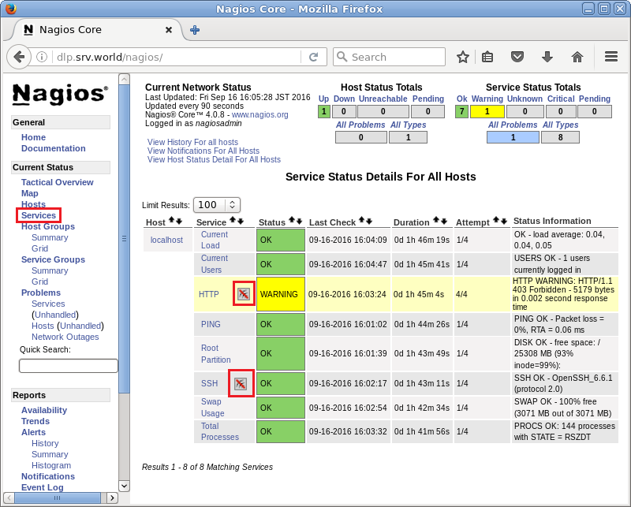
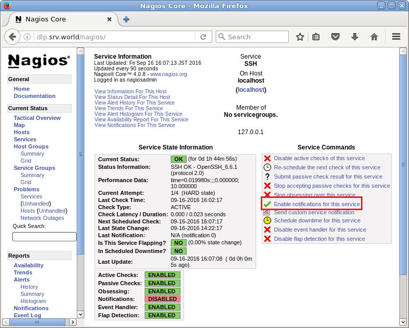
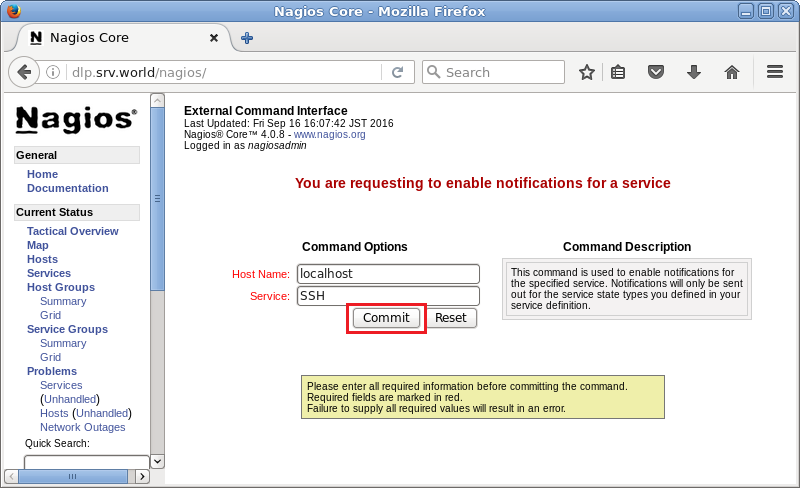
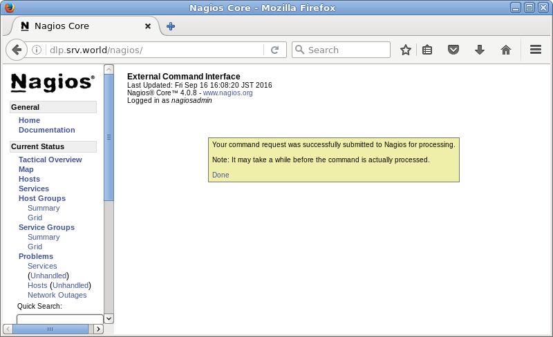
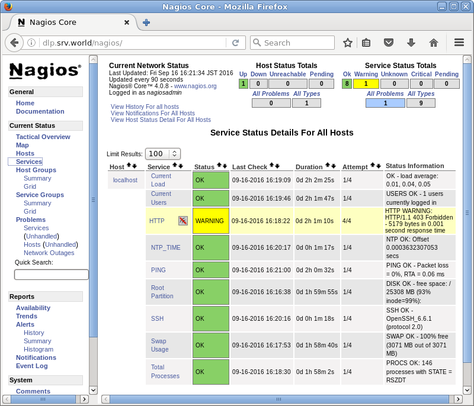
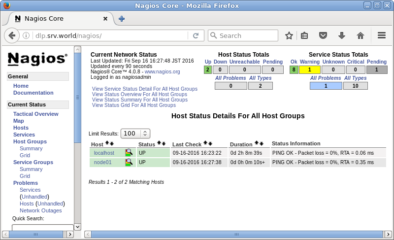
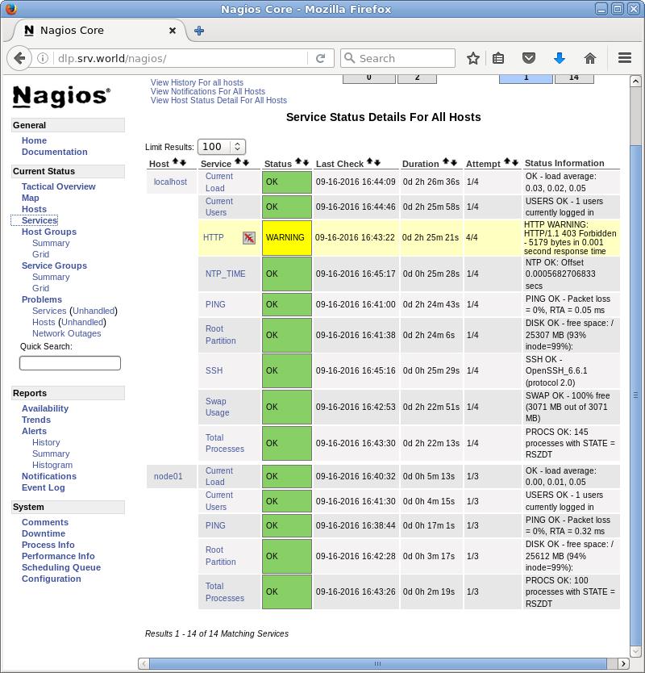
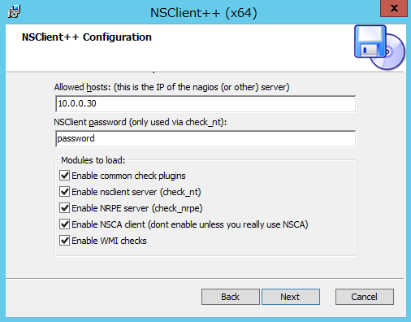
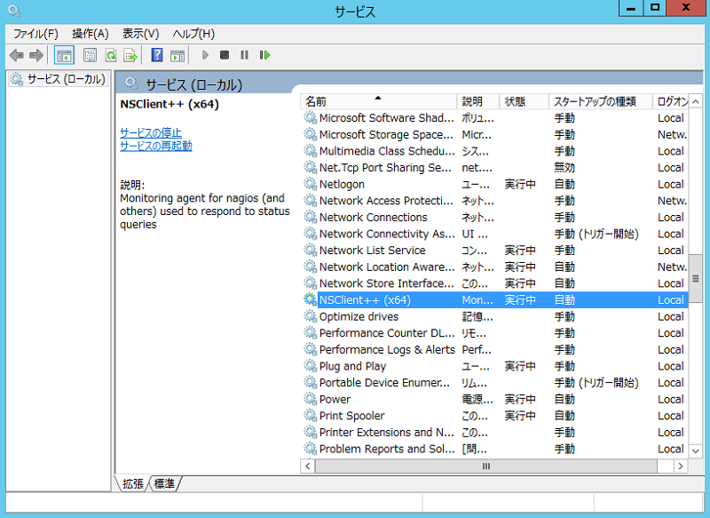
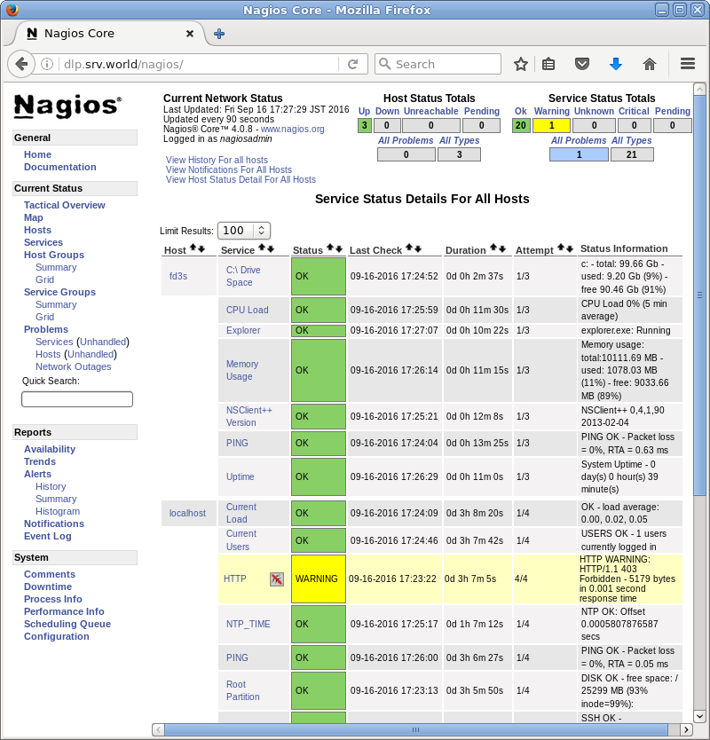

## 12.7. Nagios

[Nagios](http://www.nagios.org/)是一个监控系统运行状态和网络信息的监控系统，能监控所指定的本地或远程主机以及服务，同时提供异常通知功能等。

### 12.7.1. 安装Nagios

先安装[Apache httpd](../5. Web服务器/5.1. Apache httpd.html)和[PHP](../5. Web服务器/5.1. Apache httpd.html#513-使用php脚本)。

`yum --enablerepo=epel -y install nagios nagios-plugins-{ping,disk,users,procs,load,swap,ssh,http}` # 从EPEL安装Nagios和基本插件以监视服务器本身

配置Nagios：

编辑`/etc/httpd/conf.d/nagios.conf`文件：

```
# 更改设置以设置访问权限
#Require all granted
#Require local
Require ip 127.0.0.1 10.0.0.0/24
```

添加Nagios管理用户：

`htpasswd /etc/nagios/passwd nagiosadmin`

```
New password:  # 设置密码
Re-type new password:  # 确认密码
Adding password for user nagiosadmin
```

```
systemctl start nagios
systemctl enable nagios
systemctl restart httpd
```
firewalld防火墙规则：

```
firewall-cmd --add-service={http,https} --permanent
firewall-cmd --reload
```

从Nagios服务器允许的网络中的客户端访问`http://(Nagios服务器的主机名或IP地址)/nagios/`，并使用Nagios管理员用户“nagiosadmin”进行身份验证以登录：


成功验证后，将显示Nagios管理网站：


可以点击“Tactical Overview”查看系统状态等：


### 12.7.2. 电子邮件通知设置

某些项目默认启用，如果需要更改，配置如下：

`yum -y install mailx`

编辑`/etc/nagios/objects/contacts.cfg`文件：

```
# 设置收件人电子邮件地址
email root@localhost
```

`systemctl restart nagios`

可以更改Nagios管理网站上的通知设置。

登录并点击“Services”，显示服务列表。在服务名称旁显示的图标就是禁用通知的图标。（HTTP和SSH如下所示）要在服务上启用通知，先点击服务名称：



点击“Enable notifications for this service”：



点击“Commit”：



可以设置通知：



如果启用通知并且服务存在一些问题，则会将如下通知发送给设置的收件人：

```
Subject: ** PROBLEM Service Alert: localhost/SSH is CRITICAL **
User-Agent: Heirloom mailx 12.4 7/29/08
Content-Type: text/plain; charset=us-ascii
From: nagios@dlp.srv.world

***** Nagios *****

Notification Type: PROBLEM

Service: SSH
Host: localhost
Address: 127.0.0.1
State: CRITICAL

Date/Time: Wed Feb 25 03:29:48 JST 2015

Additional Info:

Connection refused
```

### 12.7.3. 设置阈值

某些项目默认设置，如果需要更改，配置如下：

默认情况下，在配置文件中设置阈值。例如，监控根分区的磁盘使用情况的项目设置如下：

编辑`/etc/nagios/objects/localhost.cfg`文件：

```
# Define a service to check the disk space of the root partition
# on the local machine.  Warning if > 20% free, critical if
# > 10% free space on partition.

# 阀值设置为：>20%可用磁盘为警告，>10%可用磁盘为严重
# 可以自己更改这些值
define service{
        use                       local-service
        host_name                 localhost
        service_description       Root Partition
        check_command             check_local_disk!20%!10%!/
        }
```

`systemctl restart nagios`

若需要添加新插件并为其配置，如下设置（以添加check_ntp_time插件为例）：

`/usr/lib64/nagios/plugins/check_ntp_time -h` # 显示插件的选项

```
...
...
 -w, --warning=THRESHOLD
    Offset to result in warning status (seconds)
 -c, --critical=THRESHOLD
...
...
```

编辑`/etc/nagios/objects/commands.cfg`文件，添加带有阈值选项的插件的命令的定义：

```
# 添加以下内容到最后
define command{
        command_name    check_ntp_time
        command_line    $USER1$/check_ntp_time -H $ARG1$ -w $ARG2$ -c $ARG3$
        }
```

编辑`/etc/nagios/objects/localhost.cfg`文件，添加带有阈值的服务的定义：

```
# 添加以下内容到最后（如果有1秒的时间差为警告，如果2秒为严重）
define service{
        use                             local-service
        host_name                       localhost
        service_description             NTP_TIME
        check_command                   check_ntp_time!ntp1.jst.mfeed.ad.jp!1!2
        notifications_enabled           1
        }
```

`systemctl restart nagios`

如果系统值超过阈值，则发送通知：

```
Subject: ** PROBLEM Service Alert: localhost/Root Partition is CRITICAL **
User-Agent: Heirloom mailx 12.4 7/29/08
Content-Type: text/plain; charset=us-ascii
From: nagios@dlp.srv.world
Status: R

***** Nagios *****

Notification Type: PROBLEM

Service: Root Partition
Host: localhost
Address: 127.0.0.1
State: CRITICAL

Date/Time: Wed Feb 25 07:49:12 JST 2015

Additional Info:

DISK CRITICAL - free space: / 13232 MB (9% inode=15%):
```

### 12.7.4. 添加监控目标项

有很多RPM软件包可以添加监控目标项目，或者也可以自己创建插件。还有许多由[社区提供的插件](https://exchange.nagios.org/)。

许多插件以RPM软件包方式提供，如下：

`yum --enablerepo=epel search nagios-plugins-` # 使用EPEL搜索

```
nagios-plugins-all.x86_64 : Nagios Plugins - All plugins
nagios-plugins-apt.x86_64 : Nagios Plugin - check_apt
nagios-plugins-bdii.x86_64 : Nagios Plugin - check_bdii_entries
nagios-plugins-bonding.x86_64 : Nagios plugin to monitor Linux bonding interfaces
nagios-plugins-breeze.x86_64 : Nagios Plugin - check_breeze
...
...
nagios-plugins-ups.x86_64 : Nagios Plugin - check_ups
nagios-plugins-users.x86_64 : Nagios Plugin - check_users
nagios-plugins-wave.x86_64 : Nagios Plugin - check_wave
```

例如，添加check_ntp插件以监控系统和NTP服务器之间的时间差：

`yum --enablerepo=epel -y install nagios-plugins-ntp`

编辑`/etc/nagios/objects/commands.cfg`文件：

```
# 添加以下内容到最后
define command{
        command_name    check_ntp_time
        command_line    $USER1$/check_ntp_time -H $ARG1$ -w $ARG2$ -c $ARG3$
        }
```

编辑`/etc/nagios/objects/localhost.cfg`文件：

```
# 添加以下内容到最后（如果有1秒的时间差为警告，如果2秒为严重）
define service{
        use                             local-service
        host_name                       localhost
        service_description             NTP_TIME
        check_command                   check_ntp_time!ntp1.jst.mfeed.ad.jp!1!2
        notifications_enabled           1
        }
```

`systemctl restart nagios`

可以在管理网站上查看新插件的状态：



### 12.7.5. 添加监控目标主机

可以**监控网络上的其他服务器**。

例如，使用简单的`ping`命令添加用于监控目标服务器：

编辑`/etc/nagios/nagios.cfg`文件：

```
# 取消注释
cfg_dir=/etc/nagios/servers
```

`mkdir /etc/nagios/servers`

`chgrp nagios /etc/nagios/servers`

`chmod 750 /etc/nagios/servers`

编辑`/etc/nagios/servers/node01.cfg`文件：

```
define host{
    use                     linux-server
    host_name               node01
    alias                   node01
    address                 10.0.0.51
}
define service{
    use                     generic-service
    host_name               node01
    service_description     PING
    check_command           check_ping!100.0,20%!500.0,60%
}
```

`systemctl restart nagios`

可以在管理网站上查看新服务器的状态：



还可以**监控其他服务器上的服务**。

在要监控服务的目标主机上安装nrpe：

`yum --enablerepo=epel -y install nrpe nagios-plugins-{ping,disk,users,procs,load,swap,ssh}`

编辑`/etc/nagios/nrpe.cfg`文件：

```
# 添加访问权限（指定Nagios服务器）
allowed_hosts=127.0.0.1,10.0.0.30

# 允许命令的参数
dont_blame_nrpe=1

# 注释下面内容
#command[check_users]=/usr/lib64/nagios/plugins/check_users -w 5 -c 10
#command[check_load]=/usr/lib64/nagios/plugins/check_load -w 15,10,5 -c 30,25,20
#command[check_hda1]=/usr/lib64/nagios/plugins/check_disk -w 20% -c 10% -p /dev/hda1
#command[check_zombie_procs]=/usr/lib64/nagios/plugins/check_procs -w 5 -c 10 -sZ
#command[check_total_procs]=/usr/lib64/nagios/plugins/check_procs -w 150 -c 200

# 取消注释下面内容
command[check_users]=/usr/lib64/nagios/plugins/check_users -w $ARG1$ -c $ARG2$
command[check_load]=/usr/lib64/nagios/plugins/check_load -w $ARG1$ -c $ARG2$
command[check_disk]=/usr/lib64/nagios/plugins/check_disk -w $ARG1$ -c $ARG2$ -p $ARG3$
command[check_procs]=/usr/lib64/nagios/plugins/check_procs -w $ARG1$ -c $ARG2$ -s $ARG3$
```

```
systemctl start nrpe
systemctl enable nrpe
```

firewalld防火墙规则：

```
firewall-cmd --add-port=5666/tcp --permanent
firewall-cmd --reload
```

配置Nagios服务器：

`yum --enablerepo=epel -y install nagios-plugins-nrpe`

编辑`/etc/nagios/nagios.cfg`文件：

```
# 取消注释
cfg_dir=/etc/nagios/servers
```

`mkdir /etc/nagios/servers`

`chgrp nagios /etc/nagios/servers`

`chmod 750 /etc/nagios/servers`

编辑`/etc/nagios/objects/commands.cfg`文件：

```
# 添加以下内容到最后
define command{
    command_name        check_nrpe
    command_line        $USER1$/check_nrpe -H $HOSTADDRESS$ -c $ARG1$
}
```

编辑`/etc/nagios/servers/node01.cfg`文件：

```
# 定义目标主机
define host{
    use                    linux-server
    host_name              node01
    alias                  node01
    address                10.0.0.51
    }
define service{
    use                    generic-service
    host_name              node01
    service_description    PING
    check_command          check_ping!100.0,20%!500.0,60%
    }
# 可用磁盘
define service{
    use                    generic-service
    host_name              node01
    service_description    Root Partition
    check_command          check_nrpe!check_disk\!20%\!10%\!/
    }
# 当前用户
define service{
    use                    generic-service
    host_name              node01
    service_description    Current Users
    check_command          check_nrpe!check_users\!20\!50
    }
# 总进程
define service{
    use                    generic-service
    host_name              node01
    service_description    Total Processes
    check_command          check_nrpe!check_procs\!250\!400\!RSZDT
    }
# 当前负载
define service{
    use                    generic-service
    host_name              node01
    service_description    Current Load
    check_command          check_nrpe!check_load\!5.0,4.0,3.0\!10.0,6.0,4.0
    }
```

`systemctl restart nagios`

可以在管理网站上查看新服务器的状态：



还可以**监控网络上的Windows服务器**。

以添加Windows Server 2012 R2为监控目标为例。

下载“[NSClient++](http://sourceforge.net/projects/nscplus/)”并将其上传到目标Windows服务器上。

安装“NSClient++”，在安装期间输入Nagios服务器的主机名或IP地址并设置任意密码（该密码用于从Nagios服务器到Windows服务器的连接以进行监控），如下所示：



安装后，NSClient++已启动（安装程序会设置好Windows防火墙，不需要手动设置）：



配置Nagios服务器：

`yum --enablerepo=epel -y install nagios-plugins-nt`

编辑`/etc/nagios/objects/commands.cfg`文件：

```
# 添加在Windows上设置的密码
command_line $USER1$/check_nt -H $HOSTADDRESS$ -p 12489 -v $ARG1$ $ARG2$ -s password
```

编辑`/etc/nagios/servers/windows.cfg`文件：

```
# 定义目标主机
define host{
       use                      windows-server
       host_name                fd3s
       alias                    fd3s
       address                  10.0.0.100
       }
define hostgroup{
        hostgroup_name          windows-servers
        alias                   Windows Servers
        }
# ping
define service{
       use                      generic-service
       host_name                fd3s
       service_description      PING
       check_command            check_ping!100.0,20%!500.0,60%
       }
# NSClient++版本
define service{
        use                     generic-service
        host_name               fd3s
        service_description     NSClient++ Version
        check_command           check_nt!CLIENTVERSION
        }
# 正常运行时间
define service{
        use                     generic-service
        host_name               fd3s
        service_description     Uptime
        check_command           check_nt!UPTIME
        }
# CPU负载
define service{
        use                     generic-service
        host_name               fd3s
        service_description     CPU Load
        check_command           check_nt!CPULOAD!-l 5,80,90
        }
# 内存使用率
define service{
        use                     generic-service
        host_name               fd3s
        service_description     Memory Usage
        check_command           check_nt!MEMUSE!-w 80 -c 90
        }
# 磁盘空间
define service{
        use                     generic-service
        host_name               fd3s
        service_description     C:\ Drive Space
        check_command           check_nt!USEDDISKSPACE!-l c -w 80 -c 90
        }
# 资源管理器
define service{
        use                     generic-service
        host_name               fd3s
        service_description     Explorer
        check_command           check_nt!PROCSTATE!-d SHOWALL -l Explorer.exe
        }
# IIS
define service{
        use                     generic-service
        host_name               winserver
        service_description     W3SVC
        check_command           check_nt!SERVICESTATE!-d SHOWALL -l W3SVC
        }
```

`systemctl restart nagios`

可以在管理网站上查看新服务器的状态：


