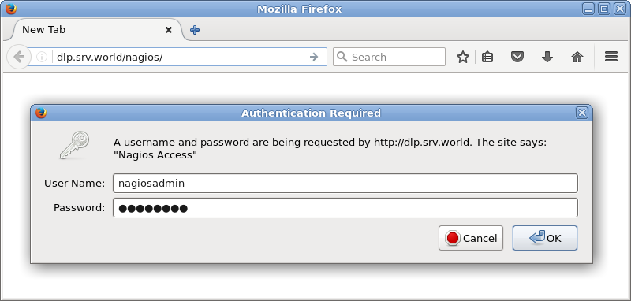
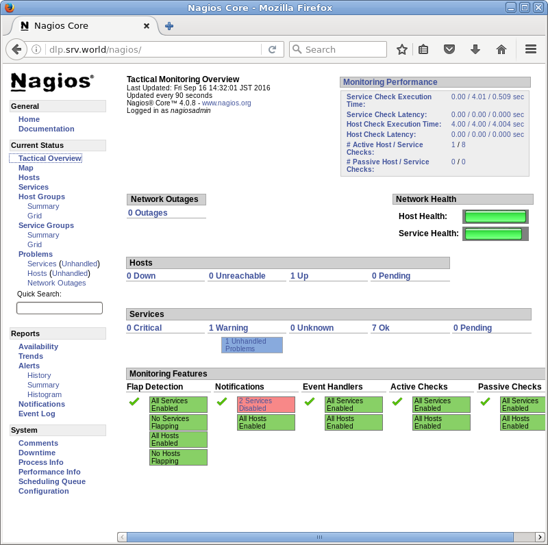
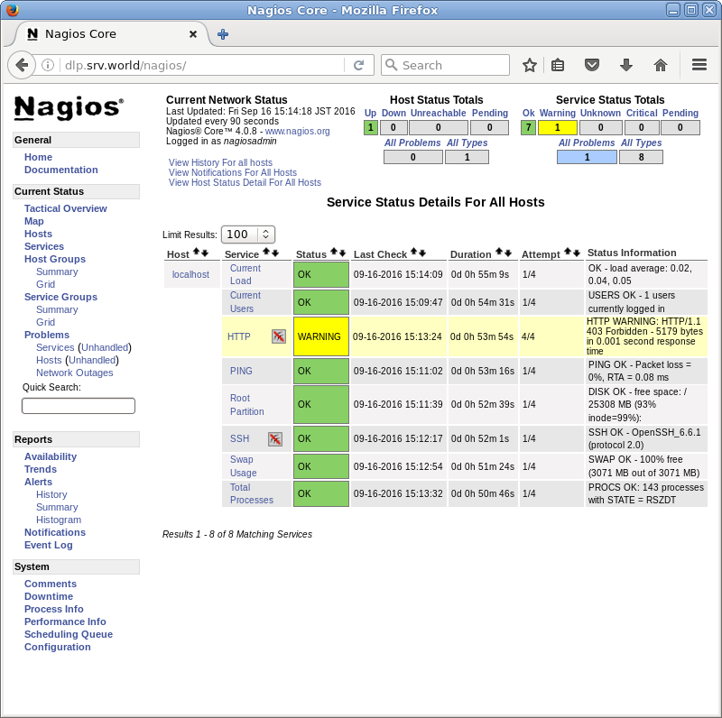

## 12.7. Nagios

[Nagios](http://www.nagios.org/)是一个监控系统运行状态和网络信息的监控系统，能监控所指定的本地或远程主机以及服务，同时提供异常通知功能等。

### 12.7.1. 安装Nagios

先安装[Apache httpd](../5. Web服务器/5.1. Apache httpd.html)和[PHP](../5. Web服务器/5.1. Apache httpd.html#513-使用php脚本)。

`yum --enablerepo=epel -y install nagios nagios-plugins-{ping,disk,users,procs,load,swap,ssh,http}` # 从EPEL安装Nagios和基本插件以监视服务器本身

配置Nagios：

编辑`/etc/httpd/conf.d/nagios.conf`文件：

```
# 更改设置以设置访问权限
#Require all granted
#Require local
Require ip 127.0.0.1 10.0.0.0/24
```

添加Nagios管理用户：

`htpasswd /etc/nagios/passwd nagiosadmin`

```
New password:  # 设置密码
Re-type new password:  # 确认密码
Adding password for user nagiosadmin
```

```
systemctl start nagios
systemctl enable nagios
systemctl restart httpd
```
firewalld防火墙规则：

```
firewall-cmd --add-service={http,https} --permanent
firewall-cmd --reload
```

从Nagios服务器允许的网络中的客户端访问`http://(Nagios服务器的主机名或IP地址)/nagios/`，并使用Nagios管理员用户“nagiosadmin”进行身份验证以登录：



成功验证后，将显示Nagios管理网站：


可以点击“Tactical Overview”查看系统状态等：





### 12.7.2. 电子邮件通知设置


### 12.7.3. 设置阈值
### 12.7.4. 添加监控目标项
### 12.7.5. 添加监控目标主机


