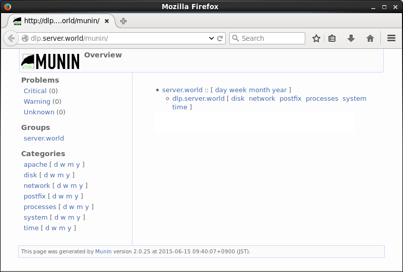
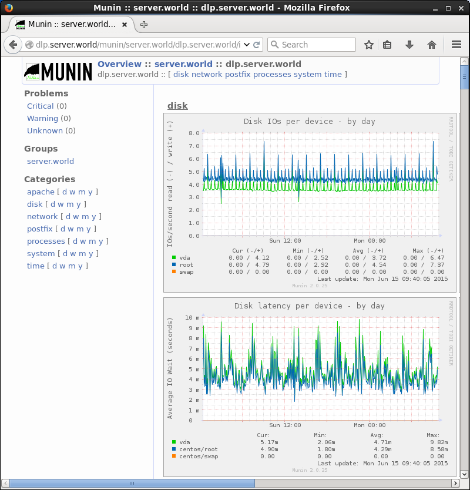

## 12.2. Munin

[Munin](http://munin-monitoring.org/)可监控核心系统资源，包括内存、磁盘、CPU占用、服务器应用如MySQL、Apache和Squid等。

### 12.2.1. 安装Munin

先[安装Apache httpd](../5. Web服务器/5.1. Apache httpd.html)。

安装Munin服务器，并安装Munin代理以监视Munin服务器自身：

`yum --enablerepo=epel -y install munin munin-node` # 从EPEL安装

配置Munin：

编辑`/etc/munin/munin.conf`文件：

```
# 添加访问权限
Order Deny,Allow
Deny from all
Allow from 127.0.0.1 10.0.0.0/24
```

`systemctl restart httpd`

`htpasswd -c /etc/munin/munin-htpasswd cent` # 添加用户：使用`-c`创建一个新文件

```
New password:  # 设置密码
Re-type new password:  # 确认密码
Adding password for user cent
```

将Munin节点配置为监测目标：

编辑`/etc/munin/munin-node.conf`文件：

```
# 更改为自己的主机名
host_name dlp.srv.world
```

```
systemctl start munin-node
systemctl enable munin-node
```

从配置中允许的网络中的客户端访问`http://(Munin服务器的主机名或IP地址)/munin/`，这里需要验证，输入在上面设置的用户名和密码，然后继续：


验证成功后，将显示主页。可以在图表上点击主机名：





### 12.2.2. 电子邮件通知

配置通知设置以发送通知电子邮件。

配置为将通知发送到root帐户：

编辑`/etc/munin/munin.conf`文件：

```
# 添加
contact.email.command mail -s "Munin-notification for ${var:group}::${var:host}" root
```

`su - munin --shell=/bin/bash -c "/usr/share/munin/munin-limits --contact email --force"` # 尝试强制发送通知

电子邮件发送如下：

```
From munin@dlp.srv.world  Fri Feb 18 20:02:27 2015

srv.world :: dlp.srv.world :: Disk usage in percent
        OKs: /boot is 26.23, / is 8.94, /dev/shm is 0.00.

srv.world :: dlp.srv.world :: Inode usage in percent
        OKs: /boot is 0.05, / is 3.90, /dev/shm is 0.00.

srv.world :: dlp.srv.world :: File table usage
        OKs: open files is 864.00.

srv.world :: dlp.srv.world :: Disk latency per device :: Average latency f
or /dev/vda
        OKs: Read IO Wait time is 0.01, Write IO Wait time is 0.14.

srv.world :: dlp.srv.world :: Disk latency per device :: Average latency f
or /dev/VolGroup/lv_swap
        OKs: Read IO Wait time is 0.00, Write IO Wait time is 0.00.

srv.world :: dlp.srv.world :: Disk latency per device :: Average latency f
or /dev/VolGroup/lv_root
        OKs: Read IO Wait time is 0.01, Write IO Wait time is 0.12.

srv.world :: dlp.srv.world :: eth0 errors
        OKs: errors is 0.00, errors is 0.00.
```

如果要将通知以文件的形式记录为日志，按以下步骤操作：

编辑`/etc/munin/munin.conf`文件：

```
# 添加
contact.log.command tee -a /var/log/munin/alert.log
```

### 12.2.3. 设置阈值

监测目标项目被默认设置为插件，并在某些插件中定义阈值，如果要向插件添加更多阈值，按如下所示进行配置。

可以如下确认插件：

`ls /etc/munin/plugins` # 当前启用的插件位于下面的目录

```
cpu                 fw_packets      ntp_kernel_pll_freq  processes
df                  if_err_eth0     ntp_kernel_pll_off   proc_pri
df_inode            if_eth0         ntp_offset           swap
diskstats           interrupts      ntp_states           threads
entropy             irqstats        open_files           uptime
forks               load            open_inodes          users
fw_conntrack        memory          postfix_mailqueue    vmstat
fw_forwarded_local  ntp_kernel_err  postfix_mailvolume
```

`ls /usr/share/munin/plugins` # 安装的插件位于下面的目录

```
acpi                      nvidia_
amavis                    open_files
apache_accesses           open_inodes
apache_processes          openvpn
apache_volume             perdition
.....
.....
```

可以显示每个插件的当前值：

`munin-run cpu` # 显示cpu插件的值

```
user.value 4262
nice.value 680
system.value 1933
idle.value 1069496
iowait.value 1891
irq.value 0
softirq.value 52
steal.value 208
guest.value 0
```

`munin-run df` # 显示df插件的值

```
_dev_mapper_centos_root.value 4.34168354184342
_dev_vda1.value 25.3611960958576
```

在`munin.conf`中设置阈值的格式：`[插件名称].[字段名称].[warning(警告) | critical(紧急)] 最小值:最大值`

“字段名称”只是执行`munin-run`命令时显示的字段名称。“最小值”或“最小值”可以省略。

编辑`/etc/munin/munin.conf`文件：

```
# 在目标节点上设置阈值
[dlp.srv.world]
    address 127.0.0.1
    use_node_name yes
    # 在cpu插件中为user字段设置80%为warning和90%为critical
    cpu.user.warning :80
    cpu.user.critical :90
    # 在df插件中设置root分区字段的80％为warning和90％为critical
    df._dev_mapper_VolGroup_lv_root.warning :80
    df._dev_mapper_VolGroup_lv_root.critical :90
```

如果[配置了通知设置](#1222-电子邮件通知)，并且值超过阈值，则电子邮件将按如下方式发送：

```
From munin@dlp.srv.world  Fri Jun 12 14:35:07 2015
Return-Path: <munin@dlp.srv.world>
X-Original-To: root
Delivered-To: root@dlp.srv.world
Date: Fri, 12 Jun 2015 14:35:07 +0900
To: root@dlp.srv.world
Subject: Munin-notification for srv.world::dlp.srv.world
User-Agent: Heirloom mailx 12.5 7/5/10
Content-Type: text/plain; charset=us-ascii
From: munin@dlp.srv.world (Munin user)
Status: R

srv.world :: dlp.srv.world :: CPU usage
        CRITICALs: user is 100.38 (outside range [:80]).
```

### 12.2.4. 添加目标主机


### 12.2.5. 添加目标项目


