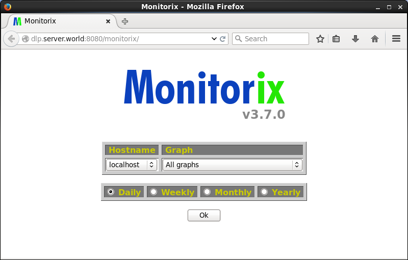
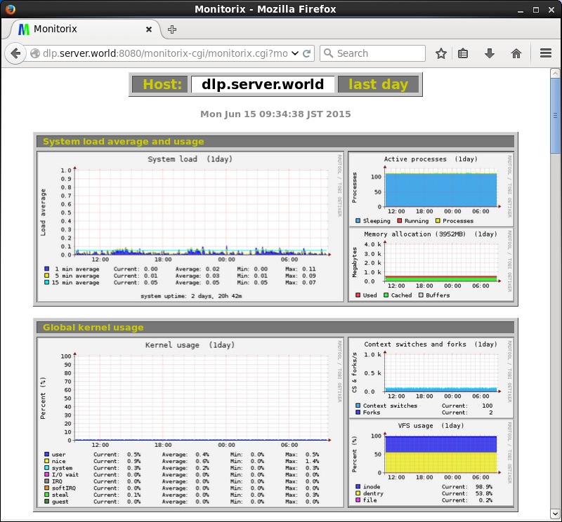
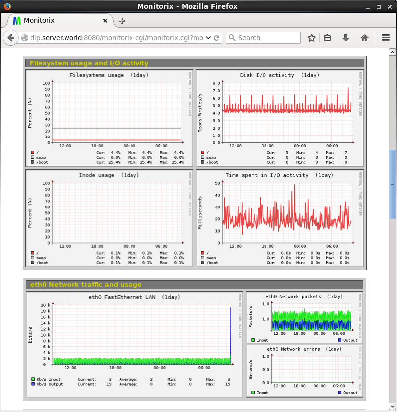

## 12.8. Monitorix

[Monitorix](http://www.monitorix.org/)是一个轻量级的系统监控工具。

安装Monitorix：

`yum --enablerepo=epel -y install monitorix` # 从EPEL安装

配置Monitori：

编辑`/etc/monitorix/monitorix.conf`文件：

```
# 更改为任意标题
title = Monitorix

# 更改为自己的主机名
hostname = dlp.srv.world

# 管理站点的背景颜色
theme_color = white

# 将网络单位更改为bps位每秒（默认值为Bytes per/sec字节每秒）line 12: change network units to bps (default is Bytes per/sec)
netstats_in_bps = y

# 如下更改
<httpd_builtin>
    enabled = y
    host =
    port = 8080
    user = nobody
    group = nobody
    log_file = /var/log/monitorix-httpd
    # 设置管理站点的权限
    hosts_deny = all
    hosts_allow = 10.0.0.0/24
```

```
systemctl start monitorix
systemctl enable monitorix
```

从配置中允许网络中的客户端访问`http://(Monitorix服务器主机名或IP地址):8080/monitorix/`。Monitorix管理站点显示如下（单击“OK”以查看图表）：



显示图表：




