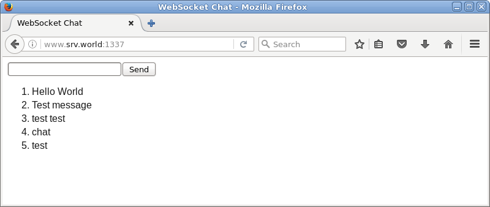

## 13.2. JavaScript

安装服务器端JavaScript环境“[Node.js](https://nodejs.org/en/)”。

### 13.2.1. 安装Node.js

安装Node.js和[npm（包管理工具）](https://www.npmjs.com/)：

`yum --enablerepo=epel -y install nodejs npm` # 从EPEL安装

编辑`helloworld.js`文件，创建测试工具（可以使用普通用户）：

```
var http = require('http');
http.createServer(function (req, res) {
  res.writeHead(200, {'Content-Type': 'text/plain'});
  res.end('Hello World\n');
}).listen(1337, '127.0.0.1');
console.log('listening on http://127.0.0.1:1337/');
```

`node helloworld.js &` # 运行服务器

`curl http://127.0.0.1:1337/` # 验证（如果回显下面内容表示正常）

```
Hello World
```

安装Socket.IO并使用WebSocket创建测试应用程序。

`npm install socket.io express`

编辑`chat.js`文件：

```
var app = require('express')();
var http = require('http').Server(app);
var io = require('socket.io')(http);

app.get('/', function(req, res){
  res.sendFile(__dirname + '/index.html');
});

io.on('connection', function(socket){
  socket.on('chat message', function(msg){
    io.emit('chat message', msg);
  });
});

http.listen(1337, function(){
  console.log('listening on *:1337');
});
```

编辑`index.html`文件：

```
<!DOCTYPE html>
<html>
<head>
<title>WebSocket Chat</title>
</head>
<body>
<form action="">
<input id="sendmsg" autocomplete="off" /><button>Send</button>
</form>
<ul id="messages" style="list-style-type: decimal; font-size: 16px; font-family: Arial;"></ul>
<script src="/socket.io/socket.io.js"></script>
<script src="http://code.jquery.com/jquery.min.js"></script>
<script>
  var socket = io();
  $('form').submit(function(){
    socket.emit('chat message', $('#sendmsg').val());
    $('#sendmsg').val('');
    return false;
  });
  socket.on('chat message', function(msg){
    $('#messages').append($('<li style="margin-bottom: 5px;">').text(msg));
  });
</script>
</body>
</html>
```

编辑`node chat.js`文件：

```
listening on *:1337
```

从客户端计算机访问`http://(服务器的主机名或IP地址):1337/`，以确认示例应用程序正常工作：



### 13.2.2. 安装Node.js 4


