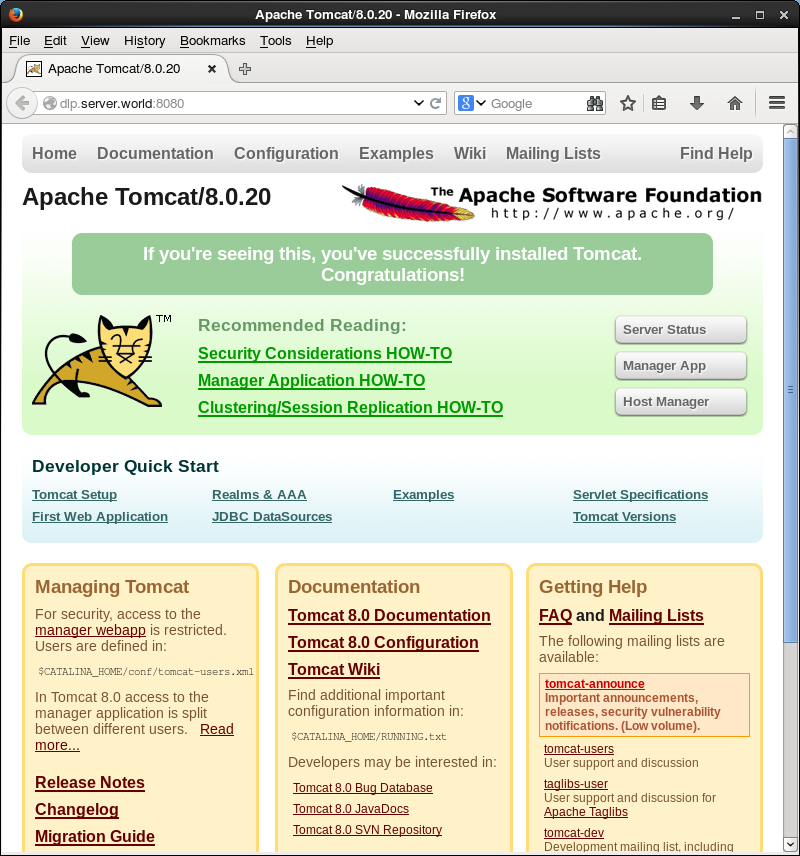
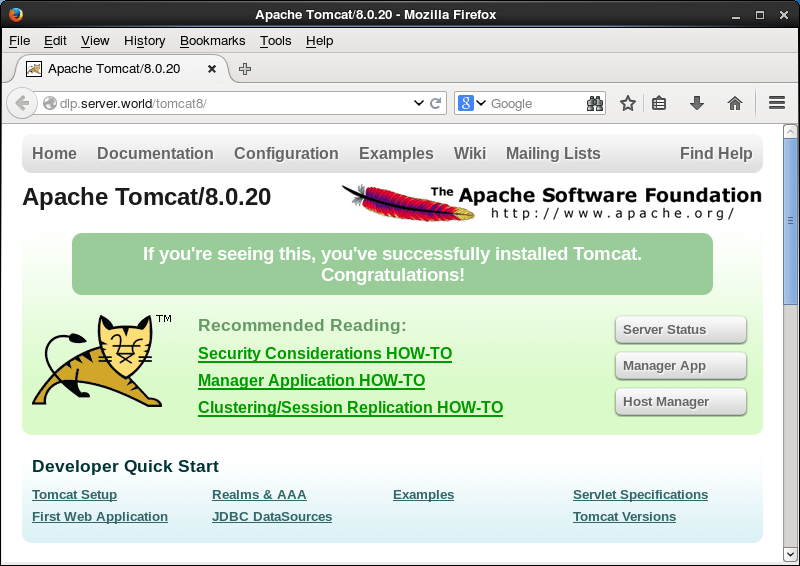

## 13.5. Java

### 13.5.1. 安装JDK 8

安装[Java SE Development Kit 8（JDK8）](https://www.oracle.com/java/index.html)以构建Java开发环境。

如果安装了OpenJDK，可以先卸载：

`yum -y remove java-*`

检查系统是否自带OpenJDK：

```
rpm -qa |grep java
rpm -qa |grep jdk
rpm -qa |grep gcj
```

卸载：

`rpm -qa | grep java | xargs rpm -e --nodeps`

[下载](http://www.oracle.com/technetwork/java/javase/downloads/index.html)（确认最新版本的下载链接）并安装JDK 8（目前最新版是9了）：

```
curl -LO -H "Cookie: oraclelicense=accept-securebackup-cookie" \
"http://download.oracle.com/otn-pub/java/jdk/8u71-b15/jdk-8u71-linux-x64.rpm"
```

`rpm -Uvh jdk-8u71-linux-x64.rpm`

```
Preparing...                ############################## [100%]
   1:jdk1.8.0_71            ############################## [100%]
Unpacking JAR files...
        rt.jar...
        jsse.jar...
        charsets.jar...
        tools.jar...
        localedata.jar...
        jfxrt.jar...
```

安装JDK 9.0.4时，最后会出现类似下面的一些提示，没具体研究，不过应该不影响使用：

```
cp: cannot stat ‘/usr/java/jdk-9.0.4/lib/desktop/icons/hicolor/16x16/apps/sun-java.png’: No such file or directory
```

查看版本：

`java -version`

编辑`/etc/profile`文件：

```
# 添加以下内容到最后
export JAVA_HOME=/usr/java/default
export PATH=$PATH:$JAVA_HOME/bin
export CLASSPATH=.:$JAVA_HOME/jre/lib:$JAVA_HOME/lib:$JAVA_HOME/lib/tools.jar
```

`source /etc/profile`

如果已安装另一个版本的JDK，按如下所示更改默认值：

`alternatives --config java`

```
There are 2 programs which provide 'java'.

  Selection    Command
-----------------------------------------------
*+ 1           /usr/lib/jvm/java-1.8.0-openjdk-1.8.0.65-3.b17.el7.x86_64/jre/bin/java
   2           /usr/java/jdk1.8.0_71/jre/bin/java

# 选择需要的版本（“2”）
Enter to keep the current selection[+], or type selection number: 2
```

创建测试程序并确认是否正常工作：

编辑`day.java`文件：

```
import java.util.Calendar;

class day {
    public static void main(String[] args) {
        Calendar cal = Calendar.getInstance();
        int year = cal.get(Calendar.YEAR);
        int month = cal.get(Calendar.MONTH) + 1;
        int day = cal.get(Calendar.DATE);
        int hour = cal.get(Calendar.HOUR_OF_DAY);
        int minute = cal.get(Calendar.MINUTE);
        System.out.println(year + "/" + month + "/" + day + " " + hour + ":" + minute);
    }
}
```

`javac day.java` # 编译

`java day` # 运行

```
2015/3/16 20:30
```

### 13.5.2. 安装OpenJDK 8

安装[OpenJDK](http://openjdk.java.net/) 8以配置Java开发环境。

Oracle JDK包括编译器，但OpenJDK 8的编译器包含在openjdk-devel中：

`yum -y install java-1.8.0-openjdk java-1.8.0-openjdk-devel`

`dirname $(readlink $(readlink $(which java)))` # 确认路径

```
/usr/lib/jvm/java-1.8.0-openjdk-1.8.0.102-1.b14.el7_2.x86_64/jre/bin
```

编辑`/etc/profile`文件：

```
# 添加以下内容到最后
export JAVA_HOME=/usr/lib/jvm/java-1.8.0-openjdk-1.8.0.102-1.b14.el7_2.x86_64
export PATH=$PATH:$JAVA_HOME/bin
export CLASSPATH=.:$JAVA_HOME/jre/lib:$JAVA_HOME/lib:$JAVA_HOME/lib/tools.jar
```

`source /etc/profile`

如果已安装另一个版本的JDK，按如下所示更改默认值：

`alternatives --config java`

```
There are 2 programs which provide 'java'.

  Selection    Command
-----------------------------------------------
   1           /usr/lib/jvm/java-1.8.0-openjdk-1.8.0.102-1.b14.el7.x86_64/jre/bin/java
*+ 2           /usr/java/jdk1.8.0_71/jre/bin/java

# # 选择需要的版本（“1”）
Enter to keep the current selection[+], or type selection number: 1
```

创建测试程序并确认是否正常工作：

编辑`day.java`文件：

```
import java.util.Calendar;

class day {
    public static void main(String[] args) {
        Calendar cal = Calendar.getInstance();
        int year = cal.get(Calendar.YEAR);
        int month = cal.get(Calendar.MONTH) + 1;
        int day = cal.get(Calendar.DATE);
        int hour = cal.get(Calendar.HOUR_OF_DAY);
        int minute = cal.get(Calendar.MINUTE);
        System.out.println(year + "/" + month + "/" + day + " " + hour + ":" + minute);
    }
}
```

`javac day.java` # 编译

`java day` # 运行

```
2016/9/30 19:46
```

### 13.5.3. 安装Tomcat 8

[Tomcat](http://tomcat.apache.org/)是一个小型的轻量级应用服务器，在中小型系统和并发访问用户不是很多的场合下被普遍使用，是开发和调试JSP程序的首选。

先按照前面的内容安装好JDK。

[下载Tomcat 8](http://mirror.bit.edu.cn/apache/tomcat/tomcat-8/)（确认最新版本的下载链接）：

`curl -O http://ftp.riken.jp/net/apache/tomcat/tomcat-8/v8.0.20/bin/apache-tomcat-8.0.20.tar.gz`

`tar zxvf apache-tomcat-8.0.20.tar.gz`

`mv apache-tomcat-8.0.20 /usr/tomcat8`

`useradd -M -d /usr/tomcat8 tomcat8`

`chown -R tomcat8. /usr/tomcat8`

创建Systemd设置文件：

编辑`/usr/lib/systemd/system/tomcat8.service`文件：

```
[Unit]
Description=Apache Tomcat 8
After=network.target

[Service]
Type=oneshot
ExecStart=/usr/tomcat8/bin/startup.sh
ExecStop=/usr/tomcat8/bin/shutdown.sh
RemainAfterExit=yes
User=tomcat8
Group=tomcat8

[Install]
WantedBy=multi-user.target
```

```
systemctl start tomcat8
systemctl enable tomcat8
```

在客户端上启动Web浏览器并访问`http://(服务器的主机名或IP地址):8080/`，Tomcat默认站点显示如下：



创建一个测试servlet，显示当前日期和时间，以确认是否正常工作：

`mkdir /usr/tomcat8/webapps/ROOT/WEB-INF/classes`

`chown tomcat8. /usr/tomcat8/webapps/ROOT/WEB-INF/classes`

`cd /usr/tomcat8/webapps/ROOT/WEB-INF/classes`

编辑`daytime.java`文件：

```
import java.io.*;
import javax.servlet.*;
import javax.servlet.http.*;
import java.util.Calendar;

public class daytime extends HttpServlet {
    public void doGet(HttpServletRequest request
    ,HttpServletResponse response)

    throws IOException, ServletException{
        response.setContentType("text/html");
        PrintWriter out = response.getWriter();
        Calendar cal = Calendar.getInstance();
        out.println("<html>\n<head>\n<title>DayTime</title>\n</head>\n<body>");
        out.println("<div style=\"font-size: 40px; text-align: center; font-weight: bold\">");
        out.println(cal.get(Calendar.YEAR) + "/" + (cal.get(Calendar.MONTH) + 1) + "/" + 
        cal.get(Calendar.DATE) + " " + cal.get(Calendar.HOUR_OF_DAY) + ":" + cal.get(Calendar.MINUTE));
        out.println("</div>\n</body>\n</html>");
    }
}
```

`javac -classpath /usr/tomcat8/lib/servlet-api.jar daytime.java`

编辑`/usr/tomcat8/webapps/ROOT/WEB-INF/web.xml`文件：

```
# 在<web-app> - </web-app>之间添加以下内容
  <servlet>
     <servlet-name>daytime</servlet-name>
     <servlet-class>daytime</servlet-class>
  </servlet>
  <servlet-mapping>
     <servlet-name>daytime</servlet-name>
     <url-pattern>/daytime</url-pattern>
  </servlet-mapping>
```

访问`http://(服务器的主机名或IP地址):8080/daytime`，以确认是否正常工作：


如果想不指定8080访问，如下配置Apache http服务器（首先[安装并启动Apache http服务器](../5. Web服务器/5.1. Apache httpd.html)）：

编辑`/etc/httpd/conf.d/proxy_ajp.conf`文件：

```
# 添加到最后
ProxyPass /tomcat8/ ajp://localhost:8009/
```

`systemctl restart httpd`

访问`http://(服务器的主机名或IP地址)/tomcat8/`，以确认是否正常工作：


