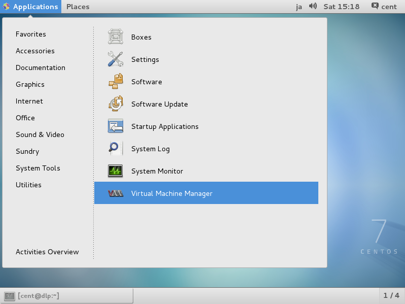
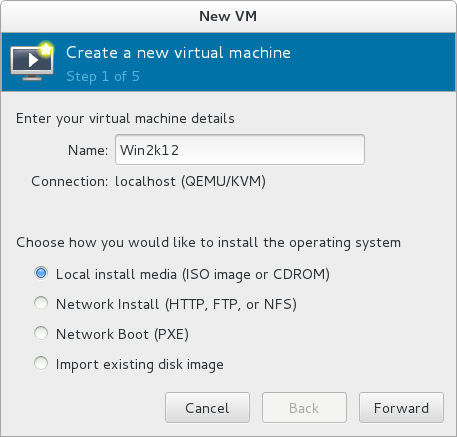
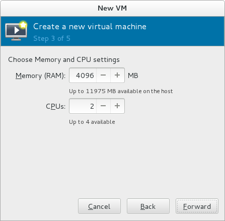
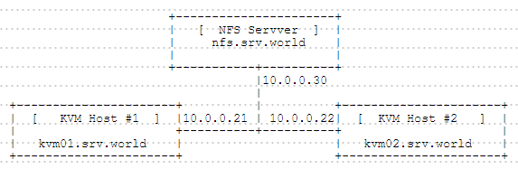

## 2.1. KVM

是使用KVM（Kernel-based Virtual Machine）加QEMU的虚拟化。这要求计算机CPU具有Intel VT或AMD-V功能。运行`egrep '^flags.*(vmx|svm)' /proc/cpuinfo`验证是否支持（运行后有显示则支持）。

### 2.1.1. 安装KVM

`yum -y install qemu-kvm libvirt virt-install bridge-utils`

`lsmod | grep kvm` # 确保模块已加载

启动并设置开机启动：

```
systemctl start libvirtd
systemctl enable libvirtd
```

**为KVM虚拟机配置桥接网络：**

这里以“eth0”为例，实际操作中替换为你自己环境的接口名称（IP和网关等也是）。

`nmcli c add type bridge autoconnect yes con-name br0 ifname br0` # 添加桥接“br0”

`nmcli c modify br0 ipv4.addresses 10.0.0.30/24 ipv4.method manual` # 给br0设置IP

`nmcli c modify br0 ipv4.gateway 10.0.0.1` # 给br0设置网关

`nmcli c modify br0 ipv4.dns 10.0.0.1` # 给br0设置DNS

`nmcli c delete eth0` # 删除eth0的当前设置（如果是远程操作会断开，最好是本机操作或双网卡）

`nmcli c add type bridge-slave autoconnect yes con-name eth0 ifname eth0 master br0` # 添加eth0接口作为br0的成员

设置完成后重启电脑，运行`ip addr`查看。

### 2.1.2. 创建一个虚拟机

以安装CentOS7为例

通过网络以文本模式安装客户机，可以在控制台或Putty等远程连接上使用。此外，虚拟机的映像默认放置在`/var/lib/libvirt/images`作为存储池，但本示例演示创建和使用新的存储池。

```
virt-install \
--name centos7 \
--ram 4096 \
--disk path=/var/kvm/images/centos7.img,size=30 \
--vcpus 2 \
--os-type linux \
--os-variant centos7.0 \
--network bridge=br0 \
--graphics none \
--console pty,target_type=serial \
--location 'http://mirrors.163.com/centos/7/os/x86_64/' \
--extra-args 'console=ttyS0,115200n8 serial'
```

上面选项的意思如下（更多的选项可使用`man virt-install`命令查看）。

`--name` 指定虚拟机的名称

`--ram` 指定虚拟机的内存大小

`--disk path=xxx ,size=xxx` “path=”指定虚拟机磁盘的位置，“size=”指定虚拟机的磁盘空间

`--vcpus` 指定虚拟CPU

`--os-type` 指定客户机的类型

`--os-variant` 指定客户机的种类（可以使用命令`osinfo-query os`查看列表）

`--network` 指定虚拟机的网络类型

`--graphics` 指定图像的种类。如果设置为“none”，则意味着没有图像。

`--console` 指定控制台类型

`--location` 指定安装源位置

`--extra-args` 指定在内核中设置的参数

**创建模板：**

在文本模式下安装，与普通的安装过程相同。安装完成后，首先重新启动，然后登录。

使用快捷键“Ctrl + ]”从客户机转到主机

使用命令`virsh console 虚拟机名称`从主机转到客户机，如：

`virsh console centos7`

因为从网络安装客户机后，它是最小化安装，因此可以将其保存为模板以便以后创建新虚拟机。

```
virt-clone --original centos7 --name template --file /var/kvm/images/template.img
ll /var/kvm/images/template.img
ll /etc/libvirt/qemu/template.xml
```

在使用之前，[对客户机设置基本初始配置](../1.%20初始化设置/Introduction.html)。

**定义新的存储池：**

`mkdir /etc/libvirt/storage`

编辑`/etc/libvirt/storage/disk01.xml`文件：

```
  # 新建
<pool type='dir'>
  # 设置一个名称
  <name>disk01</name>
  <capacity>0</capacity>
  <allocation>0</allocation>
  <available>0</available>
  <source>
  </source>
  <target>
    # 指定池目录
    <path>/var/kvm/images</path>
    <permissions>
        <mode>0700</mode>
        <owner>-1</owner>
        <group>-1</group>
    </permissions>
  </target>
</pool>
```

`virsh pool-define /etc/libvirt/storage/disk01.xml` # 定义池

`virsh pool-start disk01` # 启动池

`virsh pool-autostart disk01` # 设置自动启动

`virsh pool-list` # 显示池列表

`virsh pool-info disk01` # 显示详细信息

### 2.1.3. 图形界面管理

如果安装了[桌面环境](https://www.server-world.info/en/note?os=CentOS_7&p=x)，则可以在图形界面上创建虚拟机。此示例显示在图形界面上安装Windows Server 2012 R2。

先安装管理工具：

`yum -y install virt-manager`

启动桌面并运行“Virtual Machine Manager”：



单击“New”按钮（左上角的电脑图标），然后打开向导以创建新的虚拟机：


指定虚拟机和安装源的名称。此示例选择本地媒体：



选择安装介质或ISO映像，并指定操作系统类型和版本。Windows Server 2012没有被列出，可以选择Windows 2008来安装：


指定内存大小和虚拟CPU数量：



指定磁盘大小：


打开“Advanced options”，确保网络等的设置正确：


Windows Server 2012 R2安装开始：


### 2.1.4. 基本操作

virsh命令的基本操作

**启动虚拟机：**

`virsh start centos7` # 启动虚拟机“centos7”

`virsh start centos7 --console` # 启动并连接到“centos7”的控制台

**停止虚拟机：**

`virsh shutdown centos7` # 停止虚拟机“centos7”

`virsh destroy centos7` # 强制停止虚拟机“centos7”

**虚拟机设置自动启动：**

`virsh autostart centos7` # 启用“centos7”的自动启动

`virsh autostart --disable centos7` # 禁用“centos7”的自动启动

**列出所有虚拟机：**

`virsh list` # 列出所有活动的虚拟机

`virsh list --all` # 列出所有虚拟机（包括非活动）

**切换控制台：**

使用快捷键“Ctrl + ]”从客户机转到主机

使用命令`virsh console 虚拟机名称`从主机转到客户机，如：

`virsh console centos7`

其他选项：

`virsh --help` # 通过此命令查看更多

### 2.1.5. 虚拟管理工具

为虚拟管理安装有用的工具。

`yum -y install libguestfs-tools virt-top`

`virt-ls -l -d centos7 /root` # “ls”虚拟机中的目录

`virt-cat -d centos7 /etc/passwd` # “cat”虚拟机中的文件

`virt-edit -d centos7 /etc/fstab` # 编辑虚拟机中的文件

`virt-df -d centos7` # 显示虚拟机中的磁盘使用情况

`guestmount -d centos7 -i /media` # 装载虚拟机的磁盘，`ll /media`查看

`virt-top` # 显示虚拟机的状态

### 2.1.6. 实时迁移

需要2个KVM主机服务器和一个存储服务器（先设置好DNS或hosts以正常解析域名或IP地址），如下所示：



配置存储虚拟机映像的存储服务器。存储服务器可以使用[NFS](https://www.server-world.info/en/note?os=CentOS_7&p=nfs&f=1)，[iSCSI](https://www.server-world.info/en/note?os=CentOS_7&p=iscsi&f=1)，[GlusterFS](https://www.server-world.info/en/note?os=CentOS_7&p=glusterfs&f=1)。本示例使用[NFS存储服务器](https://www.server-world.info/en/note?os=CentOS_7&p=nfs&f=1)。

配置两台KVM主机服务器，并将存储服务器提供的目录（本示例为`/var/kvm/images`）挂载到KVM服务器上的相同挂载点上。

在一台KVM主机服务器（本示例10.0.0.21）上创建并启动虚拟机。

在虚拟机运行的服务器上执行实时迁移。完成后，虚拟机将迁移到另一台KVM主机上，如下所示：

`virsh list` # 在10.0.0.21列出运行中的虚拟机（本示例为“centos7”）

```
 Id    Name             State
--------------------------------------
 3     centos7          running
```

`virsh migrate --live centos7 qemu+ssh://10.0.0.22/system` # 执行后提示输入10.0.0.22的root密码

`virsh list` # 再次列出，“centos7”不再显示，已迁移

```
Id    Name             State
--------------------------------------
```

`virsh list` # 在10.0.0.22列出运行中的虚拟机

```
Id    Name              State
---------------------------------------
 1     centos7           running
```

`virsh migrate --live centos7 qemu+ssh://10.0.0.21/system` # 迁移回到10.0.0.21

`virsh list`

```
 Id    Name             State
--------------------------------------
```

### 2.1.7. SPICE服务器

安装桌面虚拟化“SPICE ( Simple Protocol for Independent Computing Environment )”。可以从远程客户端计算机连接到虚拟机。

`yum -y install spice-server spice-protocol` # 通常会作为KVM的依赖已安装

编辑现有虚拟机的xml文件并使用SPICE启动虚拟机，如下所示。如果是没有图形的虚拟机，可以更改为如下设置，但如果您创建了带有图形的虚拟机，删除xml文件中的`<graphics>***`和`<video>***`部分，因为qxl用于图形。

`virsh edit centos7` # 编辑“centos7”的配置

```
<domain type='kvm'>
  <name>centos7</name>
  <uuid>b38a50ca-a1ae-4d37-ba10-caf1e05b43ce</uuid>
  <memory unit='KiB'>4194304</memory>
  <currentMemory unit='KiB'>4194304</currentMemory>
  <vcpu placement='static'>2</vcpu>
  .
  .
  .
      # add follows
      # set any password for "passwd=***" section
      # specify a uniq number for "sound" section "slot='0x06'"
      # the "slot='0x02'" in video section is fixed number for graphics
     <graphics type='spice' port='5900' autoport='no' listen='0.0.0.0' passwd='password'>
      <listen type='address' address='0.0.0.0'/>
    </graphics>
    <sound model='ac97'>
      <address type='pci' domain='0x0000' bus='0x00' slot='0x06' function='0x0'/>
    </sound>
    <video>
      <model type='qxl' ram='65536' vram='32768' heads='1'/>
      <address type='pci' domain='0x0000' bus='0x00' slot='0x02' function='0x0'/>
    </video>
     <memballoon model='virtio'>
      <address type='pci' domain='0x0000' bus='0x00' slot='0x05' function='0x0'/>
    </memballoon>
  </devices>
</domain>
```

`virsh start centos7` # 启动虚拟机

如果想在初始创建虚拟机时启用SPICE，请如下指定。然后，可以使用SPICE安装需要图形界面的系统（如Windows），而不用在KVM主机上安装桌面环境。

```
virt-install \
--name Win2k12R2 \
--ram 6144 \
--disk path=/var/kvm/images/Win2k12R2.img,size=100 \
--vcpus=4 \
--os-type windows \
--os-variant=win2k12r2 \
--network bridge=br0 \
--graphics spice,listen=0.0.0.0,password=password,keymap=en \
--video qxl \
--cdrom /tmp/en_windows_server_2012_r2_vl_with_update_x64_dvd_4065221.iso
```

firewalld防火墙设置（端口5900/TCP）：

```
firewall-cmd --add-port=5900/tcp --permanent
firewall-cmd --reload
```

配置完成。参阅[从SPICE客户端连接到SPICE服务器](#218-spice客户端)。

### 2.1.8. SPICE客户端


### 2.1.9. KVM嵌套

配置KVM嵌套。可以在KVM主机上安装KVM并创建虚拟机作为KVM嵌套。

启用KVM嵌套的设置：

编辑`/etc/modprobe.d/kvm-nested.conf`文件，加入以下内容：

`options kvm_intel nested=1`

`modprobe -r kvm_intel` # 卸载

`modprobe kvm_intel` # 重载

`cat /sys/module/kvm_intel/parameters/nested` # 显示`Y`表示已启用

可以配置KVM嵌套，并且可以在嵌套的虚拟机上创建虚拟机。编辑要嵌套的虚拟机的配置，如下所示：

`virsh edit centos7` # 编辑虚拟机“centos7”

`<cpu mode='host-passthrough'>` # 更改“cpu mode”部分


