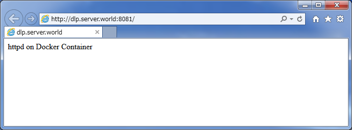

## 2.4. Docker

[Docker](https://www.docker.com/)是操作系统级虚拟化工具，它可以在容器中自动部署应用程序。

### 2.4.1. 安装Docker

`yum -y install docker`

```
systemctl start docker
systemctl enable docker
```

下载官方镜像并创建一个容器，并在容器中输出“Welcome to the Docker World”：

`docker pull centos` # 下载centos镜像

```
Trying to pull repository docker.io/library/centos ...
latest: Pulling from library/centos
47d44cb6f252: Extracting     32 B/32 B
...
...
```

`docker run centos /bin/echo "Welcome to the Docker World"` # 在容器内部运行`echo`

```
Welcome to the Docker World
```

使用`i`和`t`选项连接到容器的交互会话，如下所示（如果从容器会话退出，则容器的进程结束）：

```
[root@dlp ~]# docker run -i -t centos /bin/bash
[root@06c8cbea8dc3 /]#  # 容器的控制台

bash-4.3# uname -a
Linux 06c8cbea8dc3 3.10.0-123.13.2.el7.x86_64 #1 SMP Thu Dec 18 14:09:13 UTC 2014 x86_64 x86_64 x86_64 GNU/Linux
[root@06c8cbea8dc3 /]# exit
exit
[root@dlp ~]#  # 回到主机的控制台
```

如果要从容器会话中退出并保持容器的进程，按“Ctrl + p”和“Ctrl + q”：

```
[root@dlp ~]# docker run -i -t centos /bin/bash
[root@64241ed538ed /]#  # 按“Ctrl + p”和“Ctrl + q”回到主机的控制台
[root@dlp ~]#
```

`docker ps` # 显示docker进程

```
CONTAINER ID   IMAGE      COMMAND       CREATED         STATUS         PORTS  NAMES
64241ed538ed   centos:7   "/bin/bash"   35 seconds ago  Up 34 seconds         clever_bartik
```

```
[root@dlp ~]# docker attach 64241ed538ed  # 连接到容器的会话
[root@64241ed538ed /]#  # 已连接
```

`docker kill 64241ed538ed` # 从主机的控制台关闭容器的进程

`docker ps`

```
CONTAINER ID    IMAGE          COMMAND       CREATED          STATUS          PORTS     NAMES
```

### 2.4.2. 添加镜像

为容器添加镜像。

例如，使用安装httpd来更新官方镜像，并将其添加为容器的新镜像。每次执行`docker run`命令时都会生成容器，因此要添加最新执行的容器，如下所示：

`docker images` # 显示镜像

```
REPOSITORY          TAG                 IMAGE ID            CREATED             VIRTUAL SIZE
centos              7                   8efe422e6104        4 days ago          224 MB
centos              centos7             8efe422e6104        4 days ago          224 MB
centos              latest              8efe422e6104        4 days ago          224 MB
```

`docker run centos /bin/bash -c "yum -y update; yum -y install httpd"` # 启动一个容器并安装httpd

`docker ps -a | head -2`

```
CONTAINER ID   IMAGE      COMMAND                CREATED         STATUS                     PORTS  NAMES
a0294a053f8c   centos:7   "/bin/bash -c 'yum -   37 seconds ago  Exited (0) 19 seconds ago         suspicious_morse
```

`docker commit a0294a053f8c my_image/centos_httpd` # 添加镜像

```
d0938f54bfd62c2a108249c1f969aaeb80be51fbbaee15b594004d4875327609
```

`docker images` # 显示镜像

```
REPOSITORY              TAG                 IMAGE ID            CREATED             VIRTUAL SIZE
my_image/centos_httpd   latest              d0938f54bfd6        17 seconds ago      338.3 MB
centos                  7                   8efe422e6104        4 days ago          224 MB
centos                  centos7             8efe422e6104        4 days ago          224 MB
centos                  latest              8efe422e6104        4 days ago          224 MB
```

`docker run my_image/centos_httpd /usr/bin/which httpd` # 从新镜像生成容器并执行`which`命令以确认httpd存在

```
/usr/sbin/httpd
```

### 2.4.3. 访问容器

如果想要访问作为守护进程在容器中运行的HTTP或SSH服务，按如下设置：

使用上一节安装httpd的容器为例：

`docker run -it -p 8081:80 my_image/centos_httpd /bin/bash` # 启动容器并连接到shell会话，将主机的端口和容器的端口映射，格式为`-p xxx:xxx`

```
[root@821bc61cb2e6 /]# /usr/sbin/httpd &
[root@821bc61cb2e6 /]# echo "httpd on Docker Container" > /var/www/html/index.html
[root@821bc61cb2e6 /]#  # 按“Ctrl + p”和“Ctrl + q”回到主机的控制台
```

`docker ps`

```
CONTAINER ID  IMAGE                        COMMAND      CREATED        STATUS        PORTS
821bc61cb2e6  my_image/centos_httpd:latest "/bin/bash"  54 seconds ago Up 53 seconds 0.0.0.0:8081->80/tcp
```

从与容器在同一局域网的客户端通过HTTP访问URL，并确认可以正常访问：



### 2.4.4. 使用Dockerfile


### 2.4.5. 使用Docker-Registry

### 2.4.6. 持久化存储
