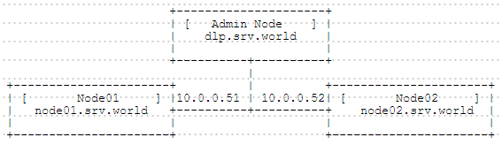

## 2.5. Kubernetes

[Kubernetes](https://kubernetes.io/)是来自Google云平台的开源容器集群管理系统。基于[Docker](../2. 虚拟化/2.4. Docker.html)构建一个容器的调度服务。该系统可以自动在一个容器集群中选择一个工作容器供使用。

例如，使用一个管理节点和两个容器节点配置Kubernetes集群，如下所示：



### 2.5.1. 配置管理节点

安装所需的软件包：

`yum -y install kubernetes etcd flannel`

配置Kubernetes：

`openssl genrsa -out /etc/kubernetes/service.key 2048` # 生成RSA密钥

编辑`/etc/kubernetes/controller-manager`文件：

```
# 添加
KUBE_CONTROLLER_MANAGER_ARGS="--service_account_private_key_file=/etc/kubernetes/service.key"
```

编辑`/etc/kubernetes/apiserver`文件：

```
# 更改
KUBE_API_ADDRESS="--address=0.0.0.0"

# 更改为管理节点的主机名或IP地址
KUBE_ETCD_SERVERS="--etcd_servers=http://dlp.srv.world:2379"

# Kubernetes服务的IP范围（如需要可更改）
KUBE_SERVICE_ADDRESSES="--service-cluster-ip-range=10.254.0.0/16"

# 添加
KUBE_API_ARGS="--service_account_key_file=/etc/kubernetes/service.key"
```

编辑`/etc/etcd/etcd.conf`文件：

```
# 取消注释
ETCD_LISTEN_PEER_URLS="http://localhost:2380"

# 添加etcd主机的主机名或IP地址
ETCD_LISTEN_CLIENT_URLS="http://dlp.srv.world:2379,http://localhost:2379"
```

编辑`/etc/kubernetes/config`文件：

```
# 更改为管理节点的主机名或IP地址
KUBE_MASTER="--master=http://dlp.srv.world:8080"
```

```
systemctl start etcd kube-apiserver kube-controller-manager kube-scheduler
systemctl enable etcd kube-apiserver kube-controller-manager kube-scheduler
```

配置Flannel网络：

编辑`flannel-config.json`文件：

```
# 指定想要在容器节点内使用的网络范围
{
  "Network":"172.16.0.0/16",
  "SubnetLen":24,
  "Backend":{
    "Type":"vxlan",
    "VNI":1
  }
}
```

编辑`/etc/sysconfig/flanneld`文件：

```
# # 更改为Flannel主机的主机名或IP地址
FLANNEL_ETCD="http://dlp.srv.world:2379"

# 确认参数
FLANNEL_ETCD_KEY="/atomic.io/network"
```

`etcdctl set atomic.io/network/config < flannel-config.json`

```
systemctl start flanneld
systemctl enable flanneld
```

确认设置。如果显示以下结果，表示正常：

`kubectl cluster-info`

```
Kubernetes master is running at http://localhost:8080
```

### 2.5.2. 配置容器节点


### 2.5.3. 创建Pod


### 2.5.4. 持久化存储


