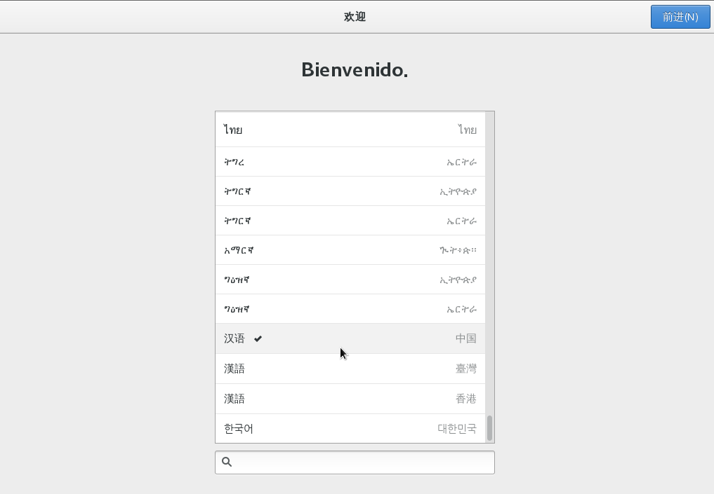
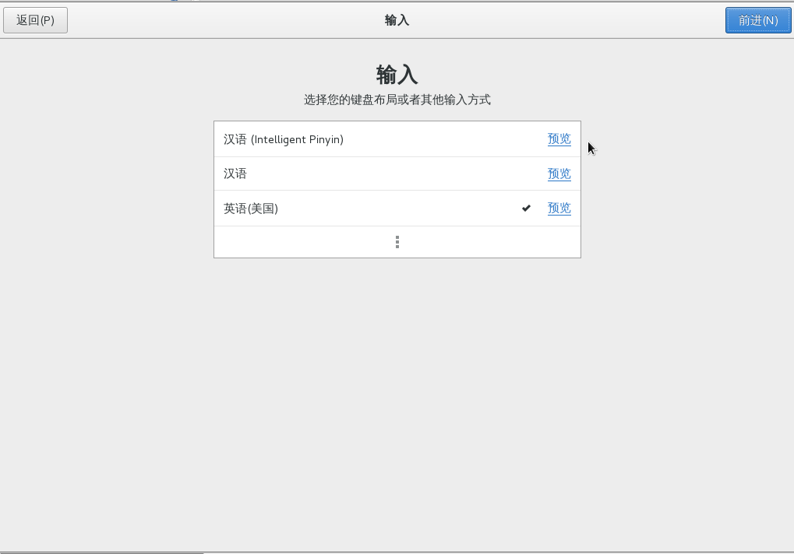
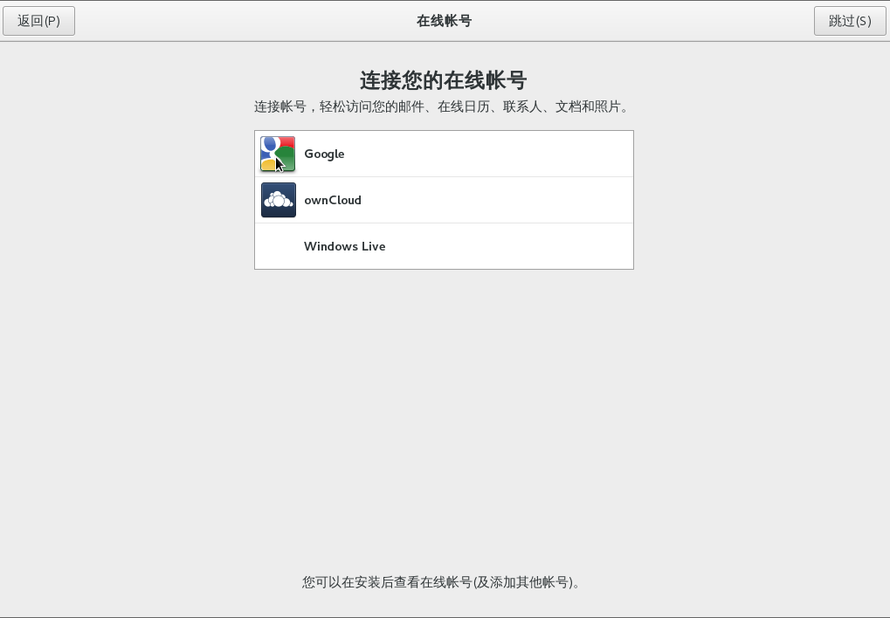
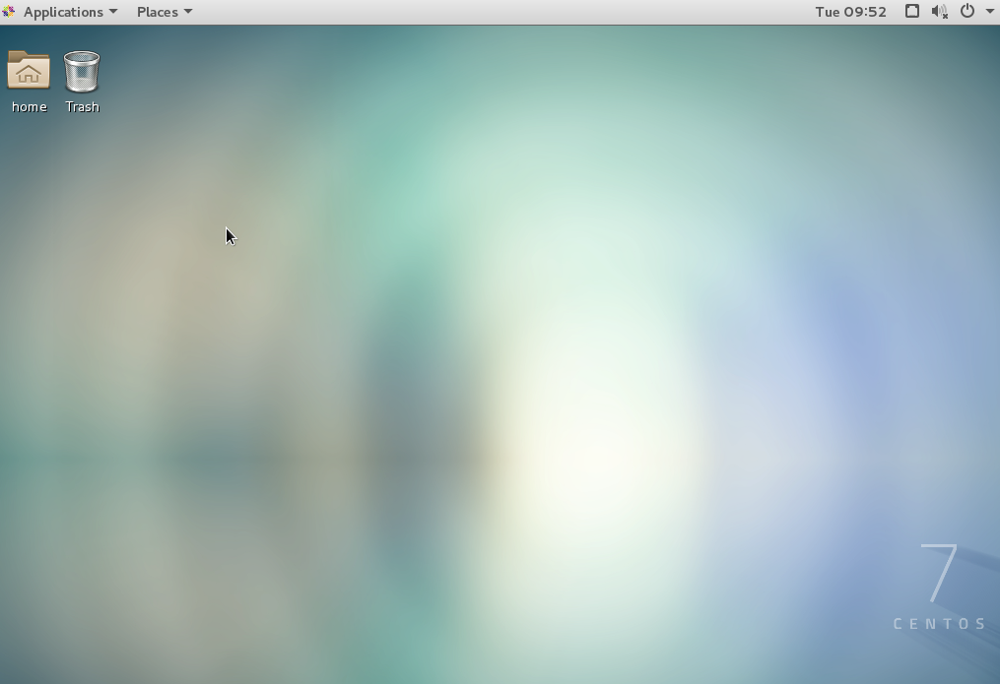
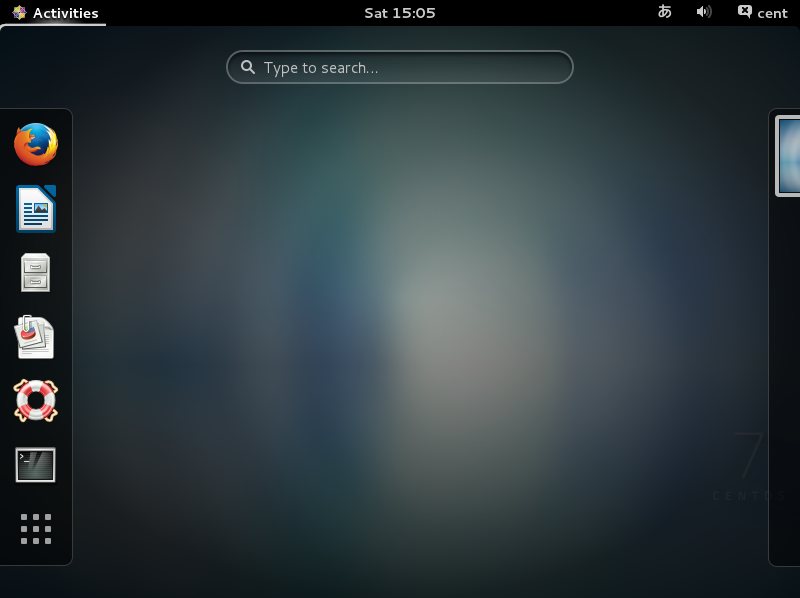
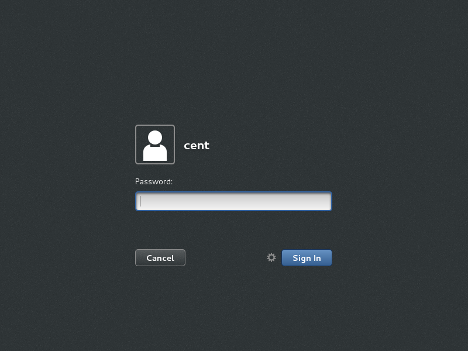
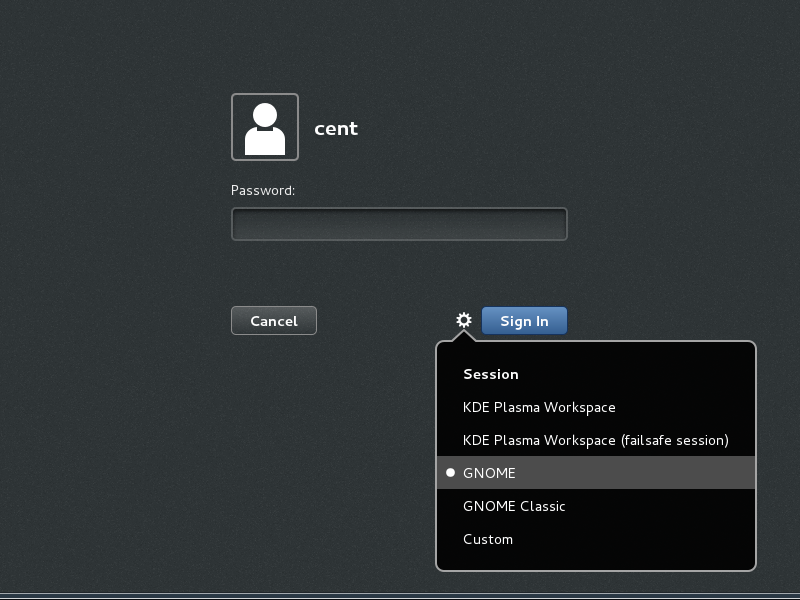
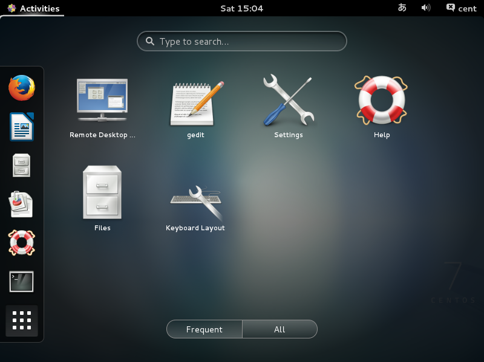

## 3.1. GNOME桌面

`yum -y groups install "GNOME Desktop"` # 安装[GNOME](https://www.gnome.org/)桌面环境

`startx` # 安装后运行

GNOME桌面环境启动。第一次引导，初始设置运行如下。

选择系统语言：

选择键盘类型：

是否需要设置在线帐号：

配置完成后，单击“开始使用CentOS Linux”：

GNOME桌面环境启动后：

CentOS7的GNOME桌面默认以经典模式启动，如果要使用**GNOME Shell**，按以下设置：

`echo "exec gnome-session" >> ~/.xinitrc`

`startx`

GNOME Shell启动：

如果[设置了系统图形登录](https://www.server-world.info/en/note?os=CentOS_7&p=runlevel)，也可以切换到GNOME Shell。单击位于“Sign In”按钮旁边的按钮：

在列表中选择“GNOME”（默认为GNOME Classic）：

登录GNOME Shell：

