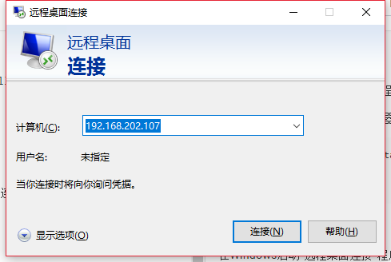
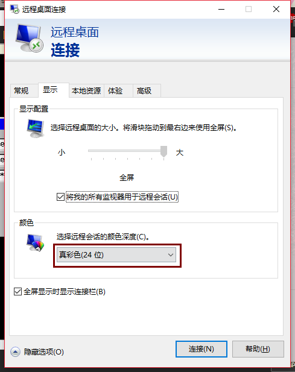
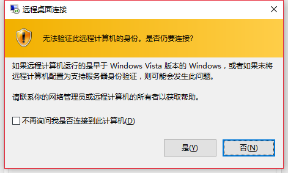
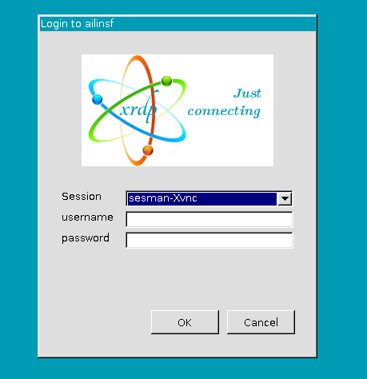
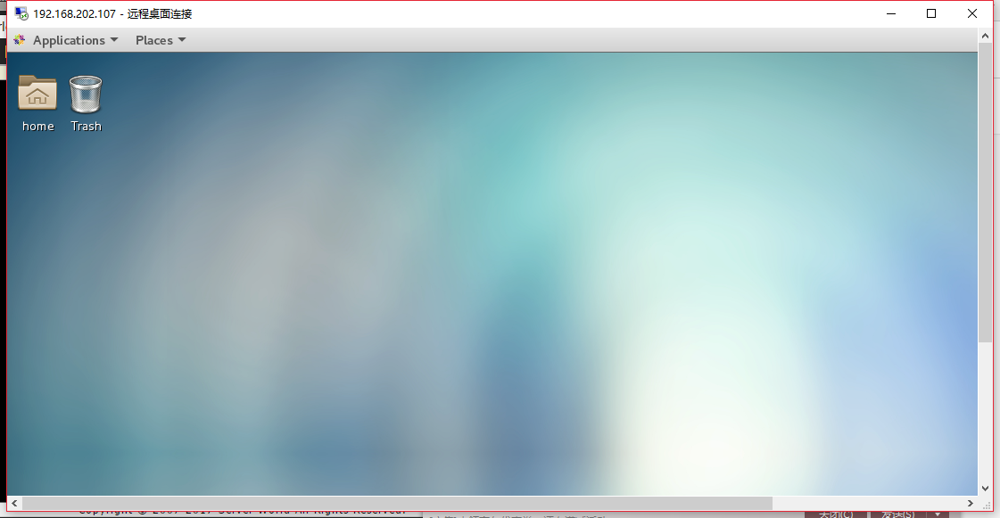

## 3.3. Xrdp服务器

安装Xrdp服务器以从Windows远程桌面功能连接到CentOS。

（从EPEL）安装并启动Xrdp服务器：

```
yum --enablerepo=epel -y install xrdp
systemctl start xrdp
systemctl enable xrdp
```

打开防火墙端口3389/TCP

在Windows启动“远程桌面连接”程序，“计算机”后面输入CentOS的IP地址：



点击左下角“显示选项”，上面标签栏从“常规”改到“显示”并将下面“颜色”改为“真彩色(24位)”（默认为32位，但Xrdp目前最高只支持24位，可以选择比24位低的）：



选择好“颜色”后，点击“连接”，出现确认信息，可以选择“不再询问”然后点“是”



连接成功后出现登录界面，输入CentOS系统的用户名密码：



进入桌面后：




