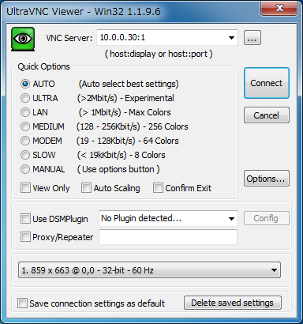
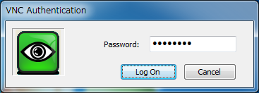
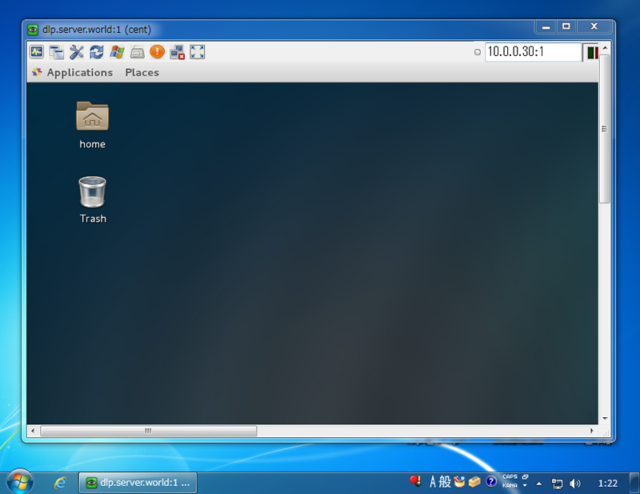
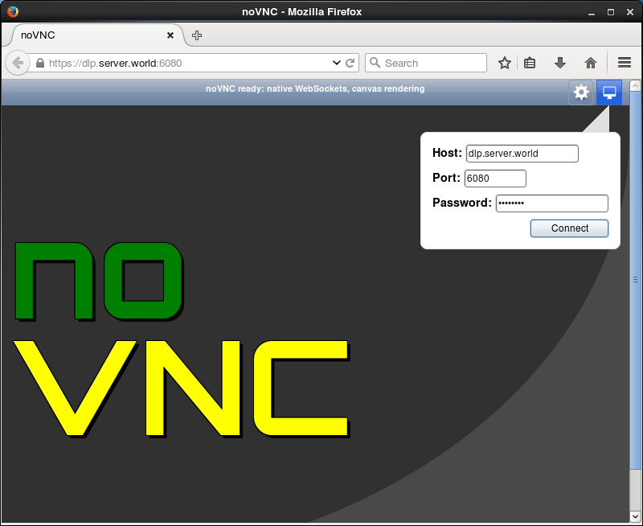
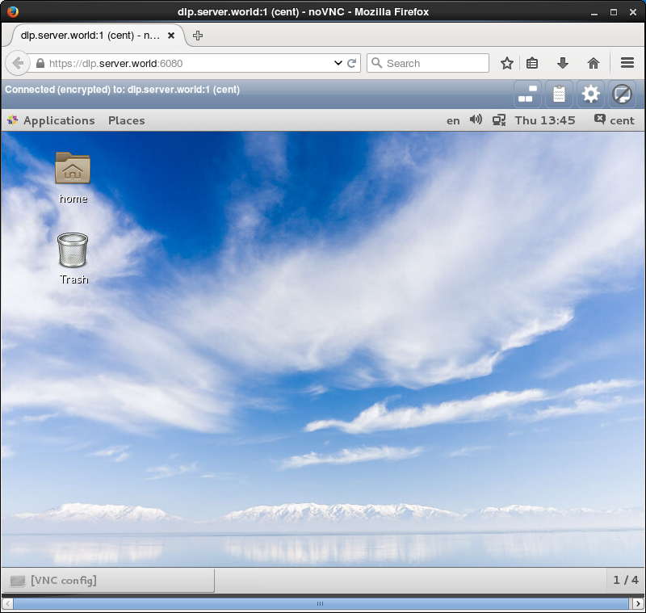

## 3.4. VNC服务器

### 3.4.1. VNC服务器

安装VNC服务器以从远程客户端连接GUI。此示例基于[GNOME桌面环境](../3. 桌面环境/3.1. GNOME桌面.html)。

`yum -y install tigervnc-server` # 安装[TigerVNC](http://tigervnc.org/)服务器

`su - cent` # 切换到要配置VNC的用户

`vncpasswd` # 设置VNC密码

```
Password:  # 输入密码
Verify:  # 确认密码
```

`vncserver :1 -geometry 800x600 -depth 24` # 运行时显示编号'1'，屏幕分辨率'800x600'，颜色深度'24'

打开防火墙端口5901/TCP（对应上面的数字“1”）。

**更多配置**：

拷贝一份配置文件示例：

`cp /lib/systemd/system/vncserver@.service /etc/systemd/system/vncserver@:1.service`

编辑`/etc/systemd/system/vncserver@:1.service`文件，找到对应的内容进行修改：

```
User=<USER>

PIDFile=/home/<USER>/.vnc/%H%i.pid
```

改为

```
#新版本这里有变化，总之就是把<USER>替换为对应的用户名
User=cent  # cent为使用的用户

PIDFile=/home/cent/.vnc/%H%i.pid

# 如果使用root则修改对应
User=root

PIDFile=/root/.vnc/%H%i.pid
```

重启systemd：

```
systemctl daemon-reload
```

启动并添加开机启动：

```
systemctl start vncserver@:1.service
systemctl enable vncserver@:1.service
```

注：非root用户时，如果用上面的方法启动报错，可以尝试（在对应用户非root权限下）运行`vncserver :1 -geometry 800x600 -depth 24`（对应的关闭命令`vncserver -kill :1`）。在可以启动服务后再使用`systemctl`尝试。修改密码时，先将用户目录下`passwd`文件删除后，使用`vncserver :1`来重新生成。

### 3.4.2. VNC客户端

#### 3.4.2.1. Windows客户端

在客户机上安装VNC viewer，如[UltraVNC](http://www.uvnc.com/downloads/ultravnc.html)。

安装完成后，运行“UltraVNC Viewer”，输入`IP地址:显示编号`（10.0.0.30:1）：



输入在服务端设置的密码：



连接成功：



#### 3.4.2.2. noVNC

[noVNC](http://novnc.com/info.html)是通过Web浏览器连接到VNC服务器的VNC客户端。

`yum --enablerepo=epel -y install novnc python-websockify numpy` # 从EPEL安装

`cd /etc/pki/tls/certs`

`openssl req -x509 -nodes -newkey rsa:2048 -keyout /etc/pki/tls/certs/novnc.pem -out /etc/pki/tls/certs/novnc.pem -days 365`

```
Generating a 2048 bit RSA private key
..........................................+++
..........................................+++
writing new private key to '/etc/pki/tls/certs/novnc.pem'
-----
You are about to be asked to enter information that will be incorporated
into your certificate request.
What you are about to enter is what is called a Distinguished Name or a DN.
There are quite a few fields but you can leave some blank
For some fields there will be a default value,
If you enter '.', the field will be left blank.
-----
Country Name (2 letter code) [AU]:CN  # 国家
State or Province Name (full name) [Some-State]:SC # 省
Locality Name (eg, city) []:CD  # 城市
Organization Name (eg, company) [Internet Widgits Pty Ltd]:Server World  # 公司
Organizational Unit Name (eg, section) []:IT Solution  # 部门
Common Name (eg, YOUR name) []:dlp.srv.world  # 服务器域名全称
Email Address []:xxx@srv.world  # 管理员邮箱
```

运行VNC服务器（见[VNC服务器章节](#341-vnc服务器)）。

在运行VNC服务器并在端口“6080”上代理`localhost:5901`的用户启动Websockify：

`websockify -D --web=/usr/share/novnc/ --cert=/etc/pki/tls/certs/novnc.pem 6080 localhost:5901`

```
WebSocket server settings:
  - Listen on :6080
  - Flash security policy server
  - Web server. Web root: /usr/share/novnc
  - SSL/TLS support
  - Backgrounding (daemon)
```

在防火墙打开端口6080/TCP。

在客户端浏览器上访问`http(s)://服务器IP地址或域名:6080/`，使用VNC密码登录：



登录后可以在浏览器中操作CentOS：



上面的方式每个端口（6080/tcp）只能访问一个vnc服务端，如果有多个服务端需要访问，这样的方法不是很方便，需如下操作。

创建`vnc_tokens`文件，如`/root/vnc_tokens`，内容如下：

```
# 以"token: host:port"的格式输入实际需要连接的vnc服务端
host1: 192.168.0.100:5901
host2: 192.168.0.110:5901
```

运行：

```
websockify -D --web=/usr/share/novnc/ --cert=/etc/pki/tls/certs/novnc.pem --ssl-only --target-config /root/vnc_tokens 6080
```

`--ssl-only`指仅允许通过`https://`方式访问

`--target-config`指定配置文件路径（可以是文件，也可以是包含配置文件的目录）

如果使用单独的证书文件和密钥文件，则`--cert=`指定证书文件，`--key=`指定密钥文件

更多内容可以运行`websockify --help`查看。

运行后在浏览器打开地址：`https://主机名:6080/vnc_auto.html?path=websockify/?token=host1`连接host1（连接host2，则修改为`token=host2`即可）

**Apache配置反向代理示例**：

代理`https://主机名:6080/`：

```
<VirtualHost *:80>
ServerAdmin webmaster@localhost
ServerName vnc.x.com
RewriteEngine On
RewriteCond %{HTTPS} !=On
RewriteRule (.*) https://%{SERVER_NAME}%{REQUEST_URI} [R=301,L]
</VirtualHost>

<VirtualHost *:443>
ServerName vnc.x.com
ServerAdmin webmaster@localhost
ErrorLog logs/vnc-ssl_error_log
TransferLog logs/vnc-ssl_access_log
LogLevel warn
SSLEngine On

# 关闭证书检查保护(如果不启用，连接会报错)
SSLProxyVerify none
SSLProxyCheckPeerCN off
SSLProxyCheckPeerName off
SSLProxyCheckPeerExpire off

SSLProtocol -All +TLSv1 +TLSv1.1 +TLSv1.2
SSLCertificateFile /etc/pki/tls/certs/localhost.crt
SSLCertificateKeyFile /etc/pki/tls/private/localhost.key
SSLProxyEngine on
ProxyRequests Off 

RewriteEngine On
RewriteCond %{HTTP:Upgrade} =websocket
RewriteRule /(.*) wss://localhost:6080/$1 [P,L]
RewriteCond %{HTTP:Upgrade} !=websocket
RewriteRule /(.*) https://localhost:6080/$1 [P,L]

<Proxy *>
Require all granted
</Proxy>
ProxyPass / https://localhost:6080/
ProxyPassReverse / https://localhost:6080/
</VirtualHost>
```

配置完成后使用`http://vnc.x.com`或`https://vnc.x.com`访问

可以将`/usr/share/novnc/index.html`备份，然后替换自己的网页，在网页上将不同主机对应的链接放上去方便进入，在此不再赘述。

#### 3.4.2.3. Guacamole

[Guacamole](http://guacamole.apache.org/)是一个基于HTML 5和JavaScript的VNC查看器（支持VNC，RDP，SSH等），服务端基于Java的VNC-to-XML代理开发。要求浏览器支持HTML 5。

安装教程<http://guacamole.apache.org/doc/gug/installing-guacamole.html>。

参照[官方文档](http://guacamole.apache.org/doc/gug/)安装配置后，可以正常使用，不过感觉内容较多配置比较复杂（安装算比较简单），如果想使用轻量的还是noVNC吧。

简单记录下安装过程，更多内容和介绍在文档中查看。

##### 3.4.2.3.1. 安装Guacamole

**构建guacamole-server**

必须的依赖：

`yum -y install cairo-devel libjpeg-turbo-devel libjpeg-devel libpng-devel uuid-devel`

可选的依赖（具体对应关系查看官方文档，不安装则无法使用对应的功能）：

`yum -y install ffmpeg-devel freerdp-devel pango-devel libssh2-devel libtelnet-devel libvncserver-devel pulseaudio-libs-devel openssl-devel libvorbis-devel libwebp-devel`

注意：上面的安装可能有找不到的软件包，在[这里](../1. 初始化设置/1.6. 软件仓库.html)添加软件仓库或查看安装方法。

安装编译环境：

`yum -y groupinstall "Development tools"`

下载`guacamole-server`，下载前可以[查看](http://guacamole.apache.org/releases/)最新版本。

`wget http://mirrors.shu.edu.cn/apache/guacamole/0.9.14/source/guacamole-server-0.9.14.tar.gz`

解压安装：

```
tar -xzf guacamole-server-0.9.14.tar.gz
cd guacamole-server-0.9.14
./configure --with-init-dir=/etc/init.d
make
make install
ldconfig
```

**部署Guacamole**

先参考[这里](../13. 语言开发环境/13.5. Java.html)安装JDK和Tomcat，假设Tomcat路径为`/usr/tomcat9`。

```
cd ~
wget http://mirrors.shu.edu.cn/apache/guacamole/0.9.14/binary/guacamole-0.9.14.war
cp guacamole-0.9.14.war /usr/tomcat9/webapps/guacamole.war
systemctl restart tomcat9
/etc/init.d/guacd start  # 也可以用service命令来控制(如service guacd start)
chkconfig --add guacd  # 设置guacd服务开机启动
```

启动完成后，在浏览器打开`http://主机名:8080/guacamole`。

##### 3.4.2.3.2. 配置反向代理

修改Tomcat配置，编辑`/usr/tomcat9/conf/server.xml`文件：

```
<Connector port="8080" protocol="HTTP/1.1"
           connectionTimeout="20000"
           URIEncoding="UTF-8"  # 增加此行
           redirectPort="8443" />
```

重启Tomcat。

反向代理设置可以参考Apache的[反向代理设置](../5. Web服务器/5.1. Apache httpd.html#51172-反向代理)和[WebSocket代理](../5. Web服务器/5.1. Apache httpd.html#5118-配置modproxywstunnel)。

下面给一个示例：

```
<VirtualHost *:80>
ServerAdmin webmaster@localhost
ServerName guacamole.x.com
RewriteEngine On
RewriteCond %{HTTPS} !=On
RewriteRule (.*) https://%{SERVER_NAME}%{REQUEST_URI} [R=301,L]
</VirtualHost>

<VirtualHost *:443>
ServerName guacamole.x.com
ServerAdmin webmaster@localhost
ErrorLog logs/guacamole-ssl_error_log
TransferLog logs/guacamole-ssl_access_log
LogLevel warn
SSLEngine On
SSLProtocol -All +TLSv1 +TLSv1.1 +TLSv1.2
SSLCertificateFile /etc/pki/tls/certs/localhost.crt
SSLCertificateKeyFile /etc/pki/tls/private/localhost.key
SSLProxyEngine on
ProxyRequests Off
<Proxy *>
Require all granted
</Proxy>
ProxyPass / http://localhost:8080/guacamole/ flushpackets=on
ProxyPassReverse / http://localhost:8080/guacamole/
ProxyPass /websocket-tunnel ws://localhost:8080/guacamole/websocket-tunnel
ProxyPassReverse /websocket-tunnel ws://localhost:8080/guacamole/websocket-tunnel
</VirtualHost>
```

完成后通过`http://guacamole.x.com/`访问。

官方的介绍如下：

```
<Location /guacamole/>
    Order allow,deny
    Allow from all
    ProxyPass http://HOSTNAME:8080/guacamole/ flushpackets=on  # “flushpackets=on”不要忘记添加
    ProxyPassReverse http://HOSTNAME:8080/guacamole/
</Location>

<Location /guacamole/websocket-tunnel>  # “/guacamole/websocket-tunnel”的Location需要在“/guacamole/”后面
    Order allow,deny
    Allow from all
    ProxyPass ws://HOSTNAME:8080/guacamole/websocket-tunnel
    ProxyPassReverse ws://HOSTNAME:8080/guacamole/websocket-tunnel
</Location>
```

通过类似`http://guacamole.x.com/guacamole/`的链接来访问。

如果需要更改路径：

```
<Location /new-path/>
    Order allow,deny
    Allow from all
    ProxyPass http://HOSTNAME:8080/guacamole/ flushpackets=on
    ProxyPassReverse http://HOSTNAME:8080/guacamole/
    ProxyPassReverseCookiePath /guacamole/ /new-path/
</Location>

<Location /new-path/websocket-tunnel>
    Order allow,deny
    Allow from all
    ProxyPass ws://HOSTNAME:8080/guacamole/websocket-tunnel
    ProxyPassReverse ws://HOSTNAME:8080/guacamole/websocket-tunnel
</Location>
```

通过类似`http://guacamole.x.com/new-path/`的链接来访问。

##### 3.4.2.3.3. 配置Guacamole

**GUACAMOLE_HOME**

`GUACAMOLE_HOME`是Guacamole配置目录（默认为`/etc/guacamole`）的名称，由以下可选文件组成：

* guacamole.properties`：Guacamole的主要配置文件。这个文件中的属性决定了Guacamole如何连接到guacd，并且可以配置安装扩展认证。
* `logback.xml`：使用称为Logback的日志记录系统来记录所有消息。默认Guacamole只会记录控制台日志，可以通过提供自己的Logback配置文件来改变。
* `extensions/`：所有Guacamole扩展的安装位置。Guacamole将在启动时自动加载该目录下的所有`.jar`文件。
* `lib/`：Guacamole扩展所需的库的搜索目录。Guacamole使这个目录内的`.jar`文件对所有扩展可用。如果扩展需要额外的库，如数据库驱动程序，应当放在这里。

如果不能或不想使用`/etc/guacamole`作为`GUACAMOLE_HOME`，位置可通过以下任一方法来覆盖：

* 在运行servlet容器的用户的主目录中创建一个名为`.guacamole`，如果存在这个目录，将自动用作`GUACAMOLE_HOME`
* 使用环境变量指定`GUACAMOLE_HOME`备用目录的完整路径，务必查阅servlet容器的文档，以确定如何正确设置环境变量
* 使用系统属性`guacamole.home`指定备用目录的完整路径

**`guacamole.properties`**：


