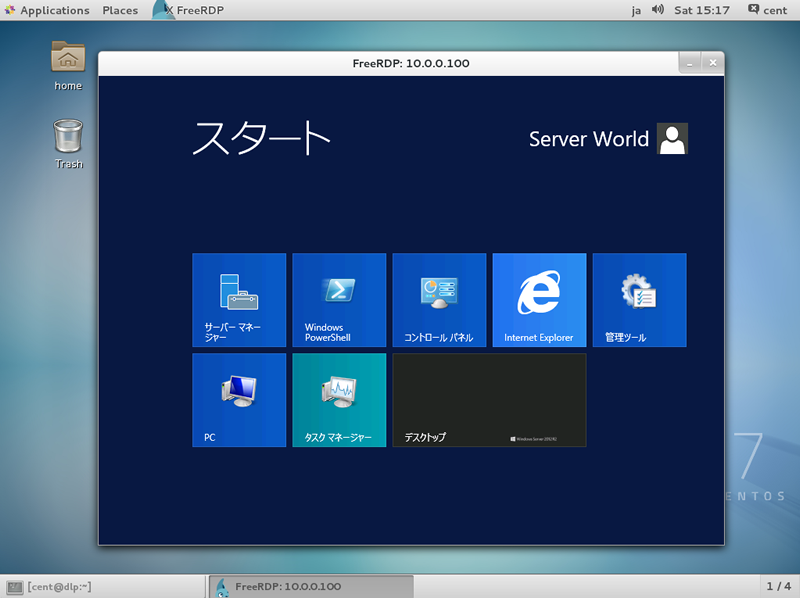

## 3.5. RDP连接到Windows

安装FreeRDP来使用RDP（Remote Desktop Protocol 远程桌面协议）连接到Windows计算机。

`yum -y install freerdp`

在桌面环境的终端下运行：

`xfreerdp -g 800x600 -u Windows用户名 10.0.0.100` # 连接到Windows，如果RDP端口非默认，则使用`IP:端口`格式：

```
connected to 10.0.0.100:3389
Password:   # Windows用户对应的密码
```

连接成功：

