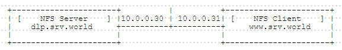

## 4.1. NFS服务器

配置NFS服务器以共享目录到网络。

此示例基于以下环境：



`yum -y install nfs-utils`

编辑`/etc/idmapd.conf`文件，将`Domain =`一行取消注释并修改为自己的域名`Domain = srv.world`。

编辑`/etc/exports`文件，写入NFS输出设置`/home 10.0.0.0/24(rw,no_root_squash)`。

```
systemctl start rpcbind nfs-server
systemctl enable rpcbind nfs-server
```

firewalld防火墙设置：

```
firewall-cmd --add-service=nfs --permanent
firewall-cmd --reload
```

输出设置的基本选项：

|选项|描述|
|-|-|
|rw|在NFS卷上同时允许读取和写入请求。|
|ro|在NFS卷上只允许读取请求。|
|sync|只有在更改已提交到稳定存储后才会对请求进行回复。（默认）|
|async|此选项允许NFS服务器违反NFS协议并在该请求所做的任何更改已提交到稳定存储器之前对请求进行回复。|
|secure|此选项要求请求源自小于IPPORT_RESERVED（1024）的Internet端口。（默认）|
|insecure|此选项接受所有端口。|
|wdelay|如果其怀疑另一个相关的写请求可能正在进行或可能很快到达，则延迟向磁盘稍微提交写入请求。（默认）|
|no_wdelay|如果同时设置了async，此选项不起作用。如果NFS服务器怀疑另一个相关的写请求可能正在进行或可能很快到达，则NFS服务器通常会将写请求提交到磁盘。这允许多个写请求提交到磁盘，其中一个操作可以提高性能。如果NFS服务器主要收到小的无关的请求，这种行为实际上可能会降低性能，因此no_wdelay可用来关闭它。|
|subtree_check|This option enables subtree checking. (Default)|
|no_subtree_check|This option disables subtree checking, which has mild security implications, but can improve reliability in some circumstances.|
|root_squash|Map requests from uid/gid 0 to the anonymous uid/gid. Note that this does not apply to any other uids or gids that might be equally sensitive, such as user bin or group staff.|
|no_root_squash|Turn off root squashing. This option is mainly useful for disk-less clients.|
|all_squash|Map all uids and gids to the anonymous user. Useful for NFS exported public FTP directories, news spool directories, etc.|
|no_all_squash|Turn off all squashing. (Default)|
|anonuid=UID|These options explicitly set the uid and gid of the anonymous account. This option is primarily useful for PC/NFS clients, where you might want all requests appear to be from one user. As an example, consider the export entry for /home/joe in the example section below, which maps all requests to uid 150.|
|anongid=GID|Read above (anonuid=UID)|


