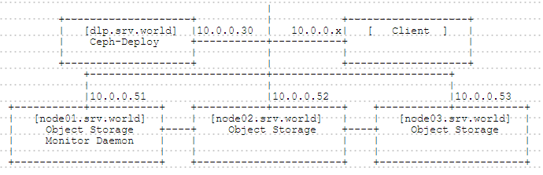

## 4.3. Ceph

### 4.3.1. 配置Ceph集群

安装分布式文件系统“[Ceph](http://ceph.com/)”以配置存储集群。

本例配置具有1个管理节点和3个存储节点的集群，如下所示：



在所有节点上为Ceph管理员添加一个用户，本例添加“cent”用户。

使用sudo设置授予root权限给刚刚添加的Ceph管理员用户：

`echo -e 'Defaults:cent !requiretty\ncent ALL = (root) NOPASSWD:ALL' | tee /etc/sudoers.d/ceph`

`chmod 440 /etc/sudoers.d/ceph`

安装所需的软件包：

`yum -y install centos-release-ceph-hammer epel-release yum-plugin-priorities`

`sed -i -e "s/enabled=1/enabled=1\npriority=1/g" /etc/yum.repos.d/CentOS-Ceph-Hammer.repo`

firewalld防火墙规则，允许SSH服务：

```
firewall-cmd --add-service=ssh --permanent
firewall-cmd --reload
```

在所有节点上设置以上所有。

在监视节点（监视守护程序）上，firewalld防火墙规则，允许所需的端口（6789/TCP）：

```
firewall-cmd --add-port=6789/tcp --permanent
firewall-cmd --reload
```

在存储节点（对象存储）上，firewalld防火墙规则，允许所需的端口（6800-7100/TCP）：

```
firewall-cmd --add-port=6800-7100/tcp --permanent
firewall-cmd --reload
```

以Ceph管理员用户身份登录并配置Ceph，从Ceph管理员节点（本例为“dlp.srv.world”）为所有存储节点设置SSH密钥对：

`ssh-keygen`

```
Generating public/private rsa key pair.
Enter file in which to save the key (/home/cent/.ssh/id_rsa):
Created directory '/home/cent/.ssh'.
Enter passphrase (empty for no passphrase):
Enter same passphrase again:
Your identification has been saved in /home/cent/.ssh/id_rsa.
Your public key has been saved in /home/cent/.ssh/id_rsa.pub.
The key fingerprint is:
54:c3:12:0e:d3:65:11:49:11:73:35:1b:e3:e8:63:5a cent@dlp.srv.world
The key's randomart image is:
```

编辑`~/.ssh/config`文件：

```
Host dlp
    Hostname dlp.srv.world
    User cent
Host node01
    Hostname node01.srv.world
    User cent
Host node02
    Hostname node02.srv.world
    User cent
Host node03
    Hostname node03.srv.world
    User cent
```

`chmod 600 ~/.ssh/config`

`ssh-copy-id node01` # 传输密钥文件

```
cent@node01.srv.world's password: 

Number of key(s) added: 1

Now try logging into the machine, with:   "ssh 'node01'"
and check to make sure that only the key(s) you wanted were added.
```

`ssh-copy-id node02`

`ssh-copy-id node03`

从管理节点将Ceph安装到所有节点：

`sudo yum -y install ceph-deploy`

```
mkdir ceph
cd ceph
```

`ceph-deploy new node01`

编辑`./ceph.conf`文件：

```
# 添加到最后
osd pool default size = 2
```

在每个节点上安装Ceph：

`ceph-deploy install dlp node01 node02 node03`

监视和密钥的设置：

`ceph-deploy mon create-initial`

从管理节点配置Ceph集群（在此之前，在Node01上创建目录/storage01，在Node02上创建/storage02，在node03上创建/storage03）：

`ceph-deploy osd prepare node01:/storage01 node02:/storage02 node03:/storage03` # 准备对象存储守护程序

`ceph-deploy osd activate node01:/storage01 node02:/storage02 node03:/storage03` # 激活对象存储守护程序

传输配置文件：

`ceph-deploy admin dlp node01 node02 node03`

`sudo chmod 644 /etc/ceph/ceph.client.admin.keyring`

显示状态（如果没有问题，显示如下）：

`ceph health`

```
HEALTH_OK
```

BTW，如果想清理设置并重新配置，参照下面的步骤：

`ceph-deploy purge dlp node01 node02 node03` # 删除包

删除设置：

`ceph-deploy purgedata dlp node01 node02 node03`

`ceph-deploy forgetkeys`

### 4.3.2. 客户端

基于上面示例相同环境，将客户端配置为使用Ceph存储

#### 4.3.2.1. 用作块设备

创建块设备并将其挂载到客户端上。

首先，参照上一节为客户端上的用户配置Sudo和SSH密钥对，然后从Ceph管理节点安装Ceph，如下所示：

`ceph-deploy install client`

`ceph-deploy admin client`

创建块设备并将其挂载到客户端上：

`sudo chmod 644 /etc/ceph/ceph.client.admin.keyring`

`rbd create disk01 --size 10240` # 创建一个10G的磁盘

`rbd ls -l` # 显示列表

```
NAME     SIZE PARENT FMT PROT LOCK
disk01 10240M          2
```

`sudo rbd map disk01` # 将映像映射到设备

```
/dev/rbd0
```

`rbd showmapped` # 显示映射

```
id pool image  snap device
0  rbd  disk01 -    /dev/rbd0
```

`sudo mkfs.xfs /dev/rbd0` # 格式化为XFS

`sudo mount /dev/rbd0 /mnt` # 挂载设备

`df -hT`

```
Filesystem              Type      Size  Used Avail Use% Mounted on
/dev/mapper/centos-root xfs        27G  1.3G   26G   5% /
devtmpfs                devtmpfs  2.0G     0  2.0G   0% /dev
tmpfs                   tmpfs     2.0G     0  2.0G   0% /dev/shm
tmpfs                   tmpfs     2.0G  8.4M  2.0G   1% /run
tmpfs                   tmpfs     2.0G     0  2.0G   0% /sys/fs/cgroup
/dev/vda1               xfs       497M  151M  347M  31% /boot
/dev/rbd0               xfs        10G   33M   10G   1% /mnt
```

#### 4.3.2.2. 用作文件系统

在客户端上用作文件系统挂载。

在要设置MDS的节点上创建MDS（MetaData Server），本例设置为node01：

`ceph-deploy mds create node01`

在MDS节点上创建至少2个RADOS池并激活MetaData Server，对于在创建命令结束时指定的pg_num，参考[官方文档](http://docs.ceph.com/docs/master/rados/operations/placement-groups/)并确定适当的值：

`sudo chmod 644 /etc/ceph/ceph.client.admin.keyring`

创建池：

`ceph osd pool create cephfs_data 128`

```
pool 'cephfs_data' created
```

`ceph osd pool create cephfs_metadata 128`

```
pool 'cephfs_metadata' created
```

启用池：

`ceph fs new cephfs cephfs_metadata cephfs_data`

```
new fs with metadata pool 2 and data pool 1
```

显示列表：

`ceph fs ls`

```
name: cephfs, metadata pool: cephfs_metadata, data pools: [cephfs_data ]
```

`ceph mds stat`

```
e5: 1/1/1 up {0=node01=up:active}
```

在客户端上挂载CephFS：

`yum -y install ceph-fuse`

获取管理员密钥

`ssh cent@node01.srv.world "sudo ceph-authtool -p /etc/ceph/ceph.client.admin.keyring" > admin.key`

```
cent@node01.srv.world's password:
```

`chmod 600 admin.key`

`mount -t ceph node01.srv.world:6789:/ /mnt -o name=admin,secretfile=admin.key`

`df -hT`

```
Filesystem              Type      Size  Used Avail Use% Mounted on
/dev/mapper/centos-root xfs        27G  1.3G   26G   5% /
devtmpfs                devtmpfs  2.0G     0  2.0G   0% /dev
tmpfs                   tmpfs     2.0G     0  2.0G   0% /dev/shm
tmpfs                   tmpfs     2.0G  8.3M  2.0G   1% /run
tmpfs                   tmpfs     2.0G     0  2.0G   0% /sys/fs/cgroup
/dev/vda1               xfs       497M  151M  347M  31% /boot
10.0.0.51:6789:/        ceph       80G   19G   61G  24% /mnt
```
