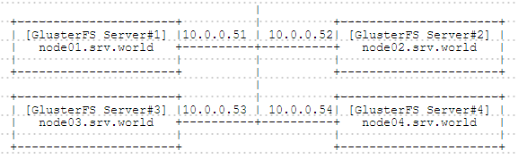

## 4.4. GlusterFS

安装[GlusterFS](https://www.gluster.org/)以配置存储集群。

### 4.4.1. 安装GlusterFS

在集群中的所有节点上安装GlusterFS服务器：

`yum -y install centos-release-gluster38`

`sed -i -e "s/enabled=1/enabled=0/g" /etc/yum.repos.d/CentOS-Gluster-3.8.repo`

`yum --enablerepo=centos-gluster38,epel -y install glusterfs-server`

```
systemctl start glusterd
systemctl enable glusterd
```

firewalld防火墙规则，允许所有节点上的GlusterFS服务：

```
firewall-cmd --add-service=glusterfs --permanent
firewall-cmd --reload
```

可以从使用GlusterFS Native Client的客户端挂载GlusterFS卷。

GlusterFS支持NFS（v3），因此如果从客户端用NFS挂载GlusterFS卷，配置如下：

`yum -y install rpcbind`

```
systemctl start rpcbind
systemctl enable rpcbind
systemctl restart glusterd
```

firewalld防火墙规则：

```
firewall-cmd --add-service={nfs,rpc-bind} --permanent
firewall-cmd --reload
```

GlusterFS的安装和基本设置已完成，下一节是有关集群的设置。

### 4.4.2. 配置存储集群

建议对不同于`/`的分区使用GlusterFS卷，本例环境设置为sdb1挂载在所有节点上为GlusterFS配置的`/glusterfs`目录。

#### 4.4.2.1. 分布式配置

创建具有多个服务器的分布式卷，本例演示使用两个服务器的配置，也可以使用三个以上的服务器。


先在所有节点安装GlusterFS。

在所有节点创建GlusterFS卷的目录：

`mkdir /glusterfs/distributed`

在节点（任一节点）上按如下方式配置集群：

探测节点：

`gluster peer probe node02`

```
peer probe: success.
```

显示状态：

`gluster peer status`

```
Number of Peers: 1

Hostname: node02
Uuid: 2ca22769-28a1-4204-9957-886579db2231
State: Peer in Cluster (Connected)
```

创建卷：

```
gluster volume create vol_distributed transport tcp \
node01:/glusterfs/distributed \
node02:/glusterfs/distributed
```

```
volume create: vol_distributed: success: please start the volume to access data
```

启动卷：

`gluster volume start vol_distributed`

```
volume start: vol_distributed: success
```

显示卷信息：

`gluster volume info`

```
Volume Name: vol_distributed
Type: Distribute
Volume ID: 5dc9f392-2bfe-4100-b8a5-1f9a817cf54a
Status: Started
Number of Bricks: 2
Transport-type: tcp
Bricks:
Brick1: node01:/glusterfs/distributed
Brick2: node02:/glusterfs/distributed
Options Reconfigured:
transport.address-family: inet
performance.readdir-ahead: on
nfs.disable: on
```

如果要从客户端使用NFS挂载，首先启动所需的服务，并配置如下：

`gluster volume set vol_distributed nfs.disable off`

```
volume set: success
```

#### 4.4.2.2. 复制配置

创建具有多个服务器的复制卷，本例演示使用两个服务器的配置，也可以使用三个以上的服务器。


先在所有节点安装GlusterFS。

在所有节点创建GlusterFS卷的目录：

`mkdir /glusterfs/replica`

在节点（任一节点）上按如下方式配置集群：

探测节点：

`gluster peer probe node02`

```
peer probe: success.
```

显示状态：

`gluster peer status`

```
Number of Peers: 1

Hostname: node02
Uuid: 2ca22769-28a1-4204-9957-886579db2231
State: Peer in Cluster (Connected)
```

创建卷：

```
gluster volume create vol_replica replica 2 transport tcp \
node01:/glusterfs/replica \
node02:/glusterfs/replica
```

```
volume create: vol_replica: success: please start the volume to access data
```

启动卷：

`gluster volume start vol_replica`

```
volume start: vol_replica: success
```

显示卷信息：

`gluster volume info`

```
Volume Name: vol_replica
Type: Replicate
Volume ID: 0d5d5ef7-bdfa-416c-8046-205c4d9766e6
Status: Started
Number of Bricks: 1 x 2 = 2
Transport-type: tcp
Bricks:
Brick1: node01:/glusterfs/replica
Brick2: node02:/glusterfs/replica
Options Reconfigured:
transport.address-family: inet
performance.readdir-ahead: on
nfs.disable: on
```

如果要从客户端使用NFS挂载，首先启动所需的服务，并配置如下：

`gluster volume set vol_replica nfs.disable off`

```
volume set: success
```

#### 4.4.2.3. 条带卷配置

创建具有多个服务器的条带卷，本例演示使用两个服务器的配置，也可以使用三个以上的服务器。


先在所有节点安装GlusterFS。

在所有节点创建GlusterFS卷的目录：

`mkdir /glusterfs/striped`

在节点（任一节点）上按如下方式配置集群：

探测节点：

`gluster peer probe node02`

```
peer probe: success.
```

显示状态：

`gluster peer status`

```
Number of Peers: 1

Hostname: node02
Uuid: 2ca22769-28a1-4204-9957-886579db2231
State: Peer in Cluster (Connected)
```

创建卷：

```
gluster volume create vol_striped stripe 2 transport tcp \
node01:/glusterfs/striped \
node02:/glusterfs/striped
```

```
volume create: vol_striped: success: please start the volume to access data
```

启动卷：

`gluster volume start vol_striped`

```
volume start: vol_striped: success
```

显示卷信息：

`gluster volume info`

```
Volume Name: vol_striped
Type: Stripe
Volume ID: b6f6b090-3856-418c-aed3-bc430db91dc6
Status: Started
Number of Bricks: 1 x 2 = 2
Transport-type: tcp
Bricks:
Brick1: node01:/glusterfs/striped
Brick2: node02:/glusterfs/striped
Options Reconfigured:
transport.address-family: inet
performance.readdir-ahead: on
nfs.disable: on
```

如果要从客户端使用NFS挂载，首先启动所需的服务，并配置如下：

`gluster volume set vol_striped nfs.disable off`

```
volume set: success
```

#### 4.4.2.4. 分布式 + 复制

本例创建具有四个服务器的分布式 + 复制卷



先在所有节点安装GlusterFS。

在所有节点创建GlusterFS卷的目录：

`mkdir /glusterfs/dist-replica`

在节点（任一节点）上按如下方式配置集群：

探测节点：

`gluster peer probe node02`

```
peer probe: success.
```

`gluster peer probe node03`

```
peer probe: success.
```

`gluster peer probe node04`

```
peer probe: success.
```

显示状态：

`gluster peer status`

```
Number of Peers: 3

Hostname: node02
Uuid: 2ca22769-28a1-4204-9957-886579db2231
State: Peer in Cluster (Connected)

Hostname: node03
Uuid: 79cff591-1e98-4617-953c-0d3e334cf96a
State: Peer in Cluster (Connected)

Hostname: node04
Uuid: 779ab1b3-fda9-46da-af95-ba56477bf638
State: Peer in Cluster (Connected)
```

创建卷：

```
gluster volume create vol_dist-replica replica 2 transport tcp \
node01:/glusterfs/dist-replica \
node02:/glusterfs/dist-replica \
node03:/glusterfs/dist-replica \
node04:/glusterfs/dist-replica
```

```
volume create: vol_dist-replica: success: please start the volume to access data
```

启动卷：

`gluster volume start vol_dist-replica`

```
volume start: vol_dist-replica: success
```

显示卷信息：

`gluster volume info`

```
Volume Name: vol_dist-replica
Type: Distributed-Replicate
Volume ID: 784d2953-6599-4102-afc2-9069932894cc
Status: Started
Number of Bricks: 2 x 2 = 4
Transport-type: tcp
Bricks:
Brick1: node01:/glusterfs/dist-replica
Brick2: node02:/glusterfs/dist-replica
Brick3: node03:/glusterfs/dist-replica
Brick4: node04:/glusterfs/dist-replica
Options Reconfigured:
transport.address-family: inet
performance.readdir-ahead: on
nfs.disable: on
```

如果要从客户端使用NFS挂载，首先启动所需的服务，并配置如下：

`gluster volume set vol_dist-replica nfs.disable off`

```
volume set: success
```

#### 4.4.2.5. 条带 + 复制

本例创建具有四个服务器的条带 + 复制卷


先在所有节点安装GlusterFS。

在所有节点创建GlusterFS卷的目录：

`mkdir /glusterfs/strip-replica`

在节点（任一节点）上按如下方式配置集群：

探测节点：

`gluster peer probe node02`

```
peer probe: success.
```

`gluster peer probe node03`

```
peer probe: success.
```

`gluster peer probe node04`

```
peer probe: success.
```

显示状态：

`gluster peer status`

```
Number of Peers: 3

Hostname: node02
Uuid: 2ca22769-28a1-4204-9957-886579db2231
State: Peer in Cluster (Connected)

Hostname: node03
Uuid: 79cff591-1e98-4617-953c-0d3e334cf96a
State: Peer in Cluster (Connected)

Hostname: node04
Uuid: 779ab1b3-fda9-46da-af95-ba56477bf638
State: Peer in Cluster (Connected)
```

创建卷：

```
gluster volume create vol_strip-replica stripe 2 replica 2 transport tcp \
node01:/glusterfs/strip-replica \
node02:/glusterfs/strip-replica \
node03:/glusterfs/strip-replica \
node04:/glusterfs/strip-replica
```

```
volume create: vol_strip-replica: success: please start the volume to access data
```

启动卷：

`gluster volume start vol_strip-replica`

```
volume start: vol_strip-replica: success
```

显示卷信息：

`gluster volume info`

```
Volume Name: vol_strip-replica
Type: Striped-Replicate
Volume ID: ec36b0d3-8467-47f6-aa83-1020555f58b6
Status: Started
Number of Bricks: 1 x 2 x 2 = 4
Transport-type: tcp
Bricks:
Brick1: node01:/glusterfs/strip-replica
Brick2: node02:/glusterfs/strip-replica
Brick3: node03:/glusterfs/strip-replica
Brick4: node04:/glusterfs/strip-replica
Options Reconfigured:
transport.address-family: inet
performance.readdir-ahead: on
nfs.disable: on
```

如果要从客户端使用NFS挂载，首先启动所需的服务，并配置如下：

`gluster volume set vol_strip-replica nfs.disable off`

```
volume set: success
```

### 4.4.3. 客户端设置

这是GlusterFS客户端安装GlusterFS卷的设置。

使用**GlusterFS Native Client**安装，配置如下：

`yum -y install centos-release-gluster38`

`yum -y install glusterfs glusterfs-fuse`

将卷vol_distributed挂载到`/mnt`：

`mount -t glusterfs node01.srv.world:/vol_distributed /mnt`

`df -hT`

```
Filesystem                        Type            Size  Used Avail Use% Mounted on
/dev/mapper/centos-root           xfs              27G  1.5G   26G   6% /
devtmpfs                          devtmpfs        2.0G     0  2.0G   0% /dev
tmpfs                             tmpfs           2.0G     0  2.0G   0% /dev/shm
tmpfs                             tmpfs           2.0G  8.4M  2.0G   1% /run
tmpfs                             tmpfs           2.0G     0  2.0G   0% /sys/fs/cgroup
/dev/vda1                         xfs             497M  208M  290M  42% /boot
tmpfs                             tmpfs           396M     0  396M   0% /run/user/0
node01.srv.world:/vol_distributed fuse.glusterfs   53G  3.0G   51G   6% /mnt
```

也支持**NFS（v3）**，因此可以使用NFS进行装载（需要先在GlusterFS服务器上配置）：

`yum -y install nfs-utils`

```
systemctl start rpcbind rpc-statd
systemctl enable rpcbind rpc-statd
```

`mount -t nfs -o mountvers=3 node01.srv.world:/vol_distributed /mnt`

`df -hT`

```
Filesystem                        Type      Size  Used Avail Use% Mounted on
/dev/mapper/centos-root           xfs        27G  1.5G   26G   6% /
devtmpfs                          devtmpfs  2.0G     0  2.0G   0% /dev
tmpfs                             tmpfs     2.0G     0  2.0G   0% /dev/shm
tmpfs                             tmpfs     2.0G  8.4M  2.0G   1% /run
tmpfs                             tmpfs     2.0G     0  2.0G   0% /sys/fs/cgroup
/dev/vda1                         xfs       497M  208M  290M  42% /boot
tmpfs                             tmpfs     396M     0  396M   0% /run/user/0
node01.srv.world:/vol_distributed nfs        53G  3.0G   51G   6% /mnt
```
