## 5.1. Apache httpd

[Apache HTTP Server（简称Apache）](http://httpd.apache.org/)是Apache软件基金会的一个开放源码的网页服务器

### 5.1.1. 安装httpd

`yum -y install httpd` # 安装httpd

`rm -f /etc/httpd/conf.d/welcome.conf` # 删除欢迎界面

根据自己的环境配置httpd，编辑`/etc/httpd/conf/httpd.conf`文件：

```
# 改为管理员邮件地址
ServerAdmin root@srv.world

# 更改为你服务器的名称
ServerName www.srv.world:80

# 不读取“.htaccess”文件
AllowOverride None

# 将Options Indexes FollowSymLinks改为
Options FollowSymLinks

# 添加目录索引
DirectoryIndex index.html index.cgi index.php

# 添加服务器响应头到结尾
ServerTokens Prod

# 打开keepalive
KeepAlive On
```

相关资料（其他配置或更进一步的内容可自己查阅资料）：

**AllowOverride**：

是否读取“.htaccess”文件。“All”为是，“None”为否

语法为：`AllowOverride All|None|directive-type [directive-type] ...`

从安全性考虑，根目录的AllowOverride属性一般配置成“None”

**FollowSymLinks**选项：

`Options FollowSymLinks` 禁止显示Apache目录列表

`Options Indexes FollowSymLinks` 显示Apache目录列表

**ServerTokens**的一些可能的赋值：

`ServerTokens Prod` 显示“Server: Apache”

`ServerTokens Major` 显示“Server: Apache/2″

`ServerTokens Minor` 显示“Server: Apache/2.2″

`ServerTokens Min` 显示“Server: Apache/2.2.17″

`ServerTokens OS` 显示“Server: Apache/2.2.17 (Unix)”

`ServerTokens Full` 显示“Server: Apache/2.2.17 (Unix) PHP/5.3.5″

**KeepAlive**的总结：

在内存非常充足的服务器上，不管是否关闭KeepAlive功能，服务器性能不会有明显变化；如果服务器内存较少，或者服务器有非常大量的文件系统访问时，或者主要处理动态网页服务，关闭KeepAlive后可以节省很多内存，而节省出来的内存用于文件系统Cache，可以提高文件系统访问的性能，并且系统会更加稳定。 

```
systemctl start httpd
systemctl enable httpd
```

**客户端访问控制**：

```
# 禁止访问
# httpd 2.2上的配置
Order deny,allow
Deny from all
# httpd 2.4上的配置
Require all denied

# 允许访问
# httpd 2.2上的配置
Order allow,deny
Allow from all
# httpd 2.4上的配置
Require all granted
```

httpd 2.4上的示例配置：

```
# 仅允许IP为192.168.1.1和192.168.1.2的主机访问
# <RequireAll> ... </RequireAll>写在<Directory ""> ... </Directory>内
<RequireAll>
    require all granted
    require ip 192.168.1.1 192.168.1.2
</RequireAll>

# 仅允许192.168.0.0/24网段的主机访问
<RequireAll>
    require all granted
    require ip 192.168.0.0/24
</RequireAll>

# 禁止192.168.1.3的主机访问（其他的都允许访问）
<RequireAll>
    require all granted
    require not ip 192.168.1.3
</RequireAll>

# 允许或拒绝所有访问（可以不用加容器<RequireAll> ... </RequireAll>，直接写在<Directory ""> ... </Directory>内）
require all granted  # 允许所有访问
require all denied  # 拒绝所有访问
```

firewalld防火墙设置（HTTP默认端口80/TCP）：

```
firewall-cmd --add-service=http --permanent
firewall-cmd --reload
```

使用非80端口（如81）：

编辑`/etc/httpd/conf/httpd.conf`文件：

```
# 添加（或修改）一行
Listen 81
```

`systemctl restart httpd`

添加对应端口的防火墙规则。

编辑`/var/www/html/index.html`，创建一个HTML测试页：

```
<html>
<body>
<div style="width: 100%; font-size: 40px; font-weight: bold; text-align: center;">
Test Page
</div>
</body>
</html>
```

使用Web浏览器从客户端电脑访问，如果显示以下页面，则运行正常：

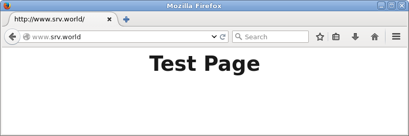

### 5.1.2. 使用Perl脚本

启用CGI执行并使用Perl脚本。

`yum -y install perl perl-CGI` # 安装Perl

默认情况下，在`/var/www/cgi-bin`目录下允许CGI。目录下可以使用Perl脚本。其下的所有文件都被处理为CGI。

`grep -n "^ *ScriptAlias" /etc/httpd/conf/httpd.conf` # 显示CGI的设置

```
247: ScriptAlias /cgi-bin/ "/var/www/cgi-bin/"
```

如果要在其他目录中允许CGI（例如，在`/var/www/html/cgi-enabled`允许），请如下配置：

编辑`/etc/httpd/conf.d/cgi-enabled.conf`文件：

```
# 创建内容，将.cgi和.pl作为CGI脚本
<Directory "/var/www/html/cgi-enabled">
    Options +ExecCGI
    AddHandler cgi-script .cgi .pl
</Directory>
```

`systemctl restart httpd` # 重启httpd

如果启用了SELinux，并允许CGI在不是默认的目录下，如上面新加的目录，更改规则如下：

```
chcon -R -t httpd_sys_script_exec_t /var/www/html/cgi-enabled
semanage fcontext -a -t httpd_sys_script_exec_t /var/www/html/cgi-enabled
```

编辑`/var/www/html/cgi-enabled/index.cgi`文件，创建一个CGI测试页：

```
#!/usr/bin/perl

print "Content-type: text/html\n\n";
print "<html>\n<body>\n";
print "<div style=\"width: 100%; font-size: 40px; font-weight: bold; text-align: center;\">\n";
print "CGI Test Page";
print "\n</div>\n";
print "</body>\n</html>\n";
```

`chmod 705 /var/www/html/cgi-enabled/index.cgi` # 更改权限

使用Web浏览器从客户端电脑访问，如果显示以下页面，则运行正常：

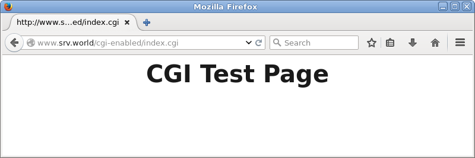

### 5.1.3. 使用PHP脚本

`yum -y install php php-mbstring php-pear` # 安装PHP

编辑`/etc/php.ini`文件，将`date.timezone =`一行取消注释并设置为自己的时区：`date.timezone = "Asia/Shanghai"`

`systemctl restart httpd`

编辑`/var/www/html/index.php`文件，创建一个PHP测试页面：

```
<html>
<body>
<div style="width: 100%; font-size: 40px; font-weight: bold; text-align: center;">
<?php
   print Date("Y/m/d");
?>
</div>
</body>
</html>
```

使用Web浏览器从客户端电脑访问，如果显示以下页面，则运行正常：

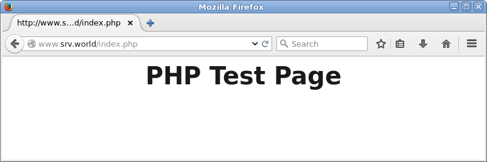

### 5.1.4. 使用Ruby脚本

配置httpd以使用Ruby脚本作为CGI。

`yum -y install ruby` # 安装Ruby

默认情况下，在`/var/www/cgi-bin`目录下允许CGI。目录下可以使用Perl脚本。其下的所有文件都被处理为CGI。

`grep -n "^ *ScriptAlias" /etc/httpd/conf/httpd.conf` # 显示CGI的设置

```
247: ScriptAlias /cgi-bin/ "/var/www/cgi-bin/"
```

如果要在其他目录中允许CGI（例如，在`/var/www/html/cgi-enabled`允许），请如下配置：

编辑`/etc/httpd/conf.d/cgi-enabled.conf`文件：

```
# 创建内容，将.rb作为CGI脚本
<Directory "/var/www/html/cgi-enabled">
    Options +ExecCGI
    AddHandler cgi-script .rb
</Directory>
```

`systemctl restart httpd` # 重启httpd

如果启用了SELinux，并允许CGI在不是默认的目录下，如上面新加的目录，更改规则如下：

```
chcon -R -t httpd_sys_script_exec_t /var/www/html/cgi-enabled
semanage fcontext -a -t httpd_sys_script_exec_t /var/www/html/cgi-enabled
```

编辑`/var/www/html/cgi-enabled/index.rb`文件，创建一个CGI测试页面：

```
#!/usr/bin/ruby

print "Content-type: text/html\n\n"
print "<html>\n<body>\n"
print "<div style=\"width: 100%; font-size: 40px; font-weight: bold; text-align: center;\">\n"
print "Ruby Script Test Page"
print "\n</div>\n"
print "</body>\n</html>\n"
```

`chmod 705 /var/www/html/cgi-enabled/index.rb`

使用Web浏览器从客户端电脑访问，如果显示以下页面，则运行正常：

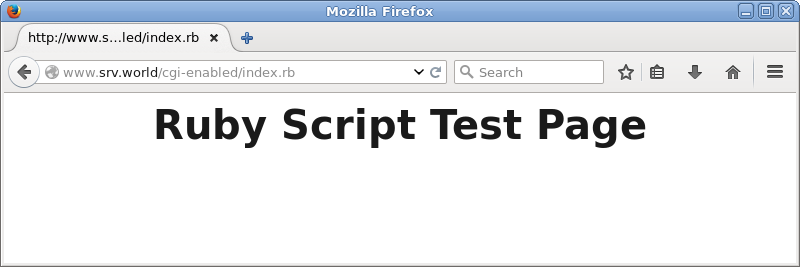

### 5.1.5. 使用Python脚本

启用CGI执行并使用Python脚本。

`yum -y install python` # 安装Python

默认情况下，在`/var/www/cgi-bin`目录下允许CGI。目录下可以使用Perl脚本。其下的所有文件都被处理为CGI。

`grep -n "^ *ScriptAlias" /etc/httpd/conf/httpd.conf` # 显示CGI的设置

```
247: ScriptAlias /cgi-bin/ "/var/www/cgi-bin/"
```

如果要在其他目录中允许CGI（例如，在`/var/www/html/cgi-enabled`允许），请如下配置：

编辑`/etc/httpd/conf.d/cgi-enabled.conf`文件：

```
# 创建内容，将.py作为CGI脚本
<Directory "/var/www/html/cgi-enabled">
    Options +ExecCGI
    AddHandler cgi-script .py
</Directory>
```

`systemctl restart httpd` # 重启httpd

如果启用了SELinux，并允许CGI在不是默认的目录下，如上面新加的目录，更改规则如下：

```
chcon -R -t httpd_sys_script_exec_t /var/www/html/cgi-enabled
semanage fcontext -a -t httpd_sys_script_exec_t /var/www/html/cgi-enabled
```

编辑`/var/www/html/cgi-enabled/index.py`文件，创建一个CGI测试页面：

```
#!/usr/bin/env python

print "Content-type: text/html\n\n"
print "<html>\n<body>"
print "<div style=\"width: 100%; font-size: 40px; font-weight: bold; text-align: center;\">"
print "Python Script Test Page"
print "</div>\n</body>\n</html>"
```

`chmod 705 /var/www/html/cgi-enabled/index.py`

使用Web浏览器从客户端电脑访问，如果显示以下页面，则运行正常：

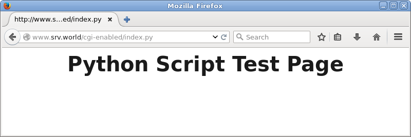

### 5.1.6. 启用Userdir

启用Userdir，用户可以使用此设置创建网站。

配置httpd，编辑`/etc/httpd/conf.d/userdir.conf`：

```
# 注释掉下面一行
#UserDir disabled

# 取消下面一行注释
UserDir public_html

<Directory "/home/*/public_html">
    # 修改下面两行
    AllowOverride All
    Options None
    Require method GET POST OPTIONS
</Directory>
```

`systemctl restart httpd`

创建一个用户的测试页：

```
mkdir public_html
chmod 711 /home/cent
chmod 755 /home/cent/public_html
```
编辑`./public_html/index.html`文件：

```
<html>
<body>
<div style="width: 100%; font-size: 40px; font-weight: bold; text-align: center;">
UserDir Test Page
</div>
</body>
</html>
```

使用Web浏览器从客户端电脑访问，如果显示以下页面，则运行正常：


### 5.1.7. 虚拟主机

配置虚拟主机以使用多个域名，以下示例在域名为`srv.world`，虚拟域名为`virtual.host`（根目录`/home/cent/public_html`）的环境中设置。

编辑`/etc/httpd/conf.d/vhost.conf`文件：

```
# 原始域名
<VirtualHost *:80>
   DocumentRoot /var/www/html
   ServerName www.srv.world
</VirtualHost>

# 虚拟域名
<VirtualHost *:80>
   DocumentRoot /home/cent/public_html
   ServerName www.virtual.host
   ServerAdmin webmaster@virtual.host
   ErrorLog logs/virtual.host-error_log  # log目录/var/log/httpd
   CustomLog logs/virtual.host-access_log combined
   LogLevel warn
</VirtualHost>
```

**个人建议的配置**：

`mkdir /var/www/tmp` # 创建一个临时目录，下面不放任何内容

编辑`/etc/httpd/conf/httpd.conf`文件：

```
# 在最后一行“IncludeOptional conf.d/*.conf”上面添加以下内容
<VirtualHost *:80>
   DocumentRoot /var/www/tmp
   ServerName localhost
   ServerSignature off
<Directory /var/www/tmp>
   AllowOverride None
   Options FollowSymLinks
   Require all denied
</Directory>
</VirtualHost>
```

`systemctl restart httpd`

如果未设置其他虚拟主机，通过IP或域名访问Web服务器默认访问不到网页，然后再根据自己的需要设置虚拟主机。

编辑`/etc/httpd/conf.d/vhost.conf`文件：

```
<VirtualHost *:80>
   DocumentRoot /home/cent/public_html
   ServerName www.virtual.host
   ServerAlias www2.virtual.host  # 如果有多个域名指向同一路径，则每个域名写一行ServerAlias
   ServerAdmin webmaster@virtual.host
   ErrorLog logs/virtual.host-error_log
   CustomLog logs/virtual.host-access_log combined
   LogLevel warn
<Directory /home/cent/public_html>
   AllowOverride All
   Options FollowSymLinks
   Require all granted
</Directory>
</VirtualHost>
```

`systemctl restart httpd`

编辑`~/public_html/virtual.php`文件，创建测试页：

```
<html>
<body>
<div style="width: 100%; font-size: 40px; font-weight: bold; text-align: center;">
Virtual Host Test Page
</div>
</body>
</html>
```

使用Web浏览器从客户端电脑访问，如果显示以下页面，则运行正常：

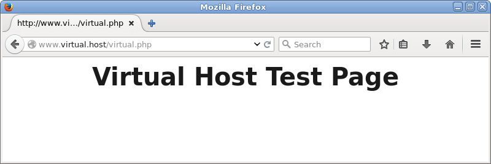

另CentOS6的虚拟主机配置，编辑`/etc/httpd/conf/httpd.conf`文件：

```
NameVirtualHost *:80  # 取消该行注释

# 在下面加入以下内容

<VirtualHost *:80>
DocumentRoot /var/www/pma
ServerName www.virtual.host
ServerAlias www2.virtual.host
ServerAdmin webmaster@virtual.host
ErrorLog logs/virtual.host-error_log
CustomLog logs/virtual.host-access_log combined
</VirtualHost>

<VirtualHost *:80>
DocumentRoot /var/www/tmp  # 指向一个不存在或是空的文件夹
ServerName *
ServerAlias *
</VirtualHost>
```

CentOS6是把允许访问的放在前面，然后再设置一个统一阻止访问的规则。

### 5.1.8. 配置SSL

配置SSL以使用安全加密连接。

首先[创建证书](../5. Web服务器/5.3. 创建SSL证书.html)。

`yum -y install mod_ssl`

根据自己的环境配置SSL，编辑`/etc/httpd/conf.d/ssl.conf`文件：

```
# 取消下面一行注释
DocumentRoot "/var/www/html"

# 取消注释并指定服务器名称
ServerName www.srv.world:443

# 更改下面一行
SSLProtocol -All +TLSv1 +TLSv1.1 +TLSv1.2

# 更改为在上一步创建的文件
SSLCertificateFile /etc/pki/tls/certs/server.crt

# 更改为在上一步创建的文件
SSLCertificateKeyFile /etc/pki/tls/certs/server.key
```

`systemctl restart httpd`

firewalld防火墙设置（HTTPS默认端口443/TCP）：

```
firewall-cmd --add-service=https --permanent
firewall-cmd --reload
```

使用非443端口（如1443）：

编辑`/etc/httpd/conf.d/ssl.conf`文件：

```
# 添加（或修改）一行
Listen 1443 https
```

`systemctl restart httpd`

添加对应端口的防火墙规则。

配置虚拟主机：

编辑`/etc/httpd/conf/httpd.conf`文件：

```
# 在最后一行“IncludeOptional conf.d/*.conf”上面添加以下内容
<VirtualHost *:443>
   DocumentRoot /var/www/tmp
   ServerName localhost:443
   ServerSignature off
   SSLEngine On
   SSLProtocol -All +TLSv1 +TLSv1.1 +TLSv1.2
   SSLCertificateFile /etc/pki/tls/certs/server.crt
   SSLCertificateKeyFile /etc/pki/tls/certs/server.key
<Directory /var/www/tmp>
   AllowOverride None
   Options FollowSymLinks
   Require all denied
</Directory>
</VirtualHost>
```

编辑`/etc/httpd/conf.d/ssl.conf`文件，将“VirtualHost”内容注释掉（可以先做个备份）。

编辑`/etc/httpd/conf.d/vhost.conf`文件：

```
<VirtualHost *:80> # 将80端口的HTTP访问转到443端口的HTTPS
   ServerName www.virtual.host
   ServerAlias www2.virtual.host
   ServerAdmin webmaster@localhost
   ServerSignature Off
   RewriteEngine On
   RewriteCond %{HTTPS} !=On
   RewriteRule (.*) https://%{HTTP_HOST}%{REQUEST_URI} [R=301,L]
   # RewriteRule ^ https://%{SERVER_NAME}%{REQUEST_URI} [END,QSA,R=permanent]
   # 如果是转到非443的HTTPS（如1443），%{HTTP_HOST}改为%{SERVER_NAME}:1443
</VirtualHost>
<VirtualHost *:443>
   DocumentRoot /home/cent/public_html
   ServerName www.virtual.host:443
   ServerAlias www2.virtual.host
   ServerAdmin webmaster@localhost
   ErrorLog logs/virtual.host-ssl_error_log
   TransferLog logs/virtual.host-ssl_access_log
   LogLevel warn
   SSLEngine On
   SSLProtocol -All +TLSv1 +TLSv1.1 +TLSv1.2
   SSLCertificateFile /etc/pki/tls/certs/server.crt
   SSLCertificateKeyFile /etc/pki/tls/certs/server.key
<Directory /home/cent/public_html>
   AllowOverride All
   Options FollowSymLinks
   Require all granted
</Directory>
</VirtualHost>
```

使用Web浏览器通过HTTPS从客户端计算机访问测试页。下面的示例是Fiorefix，显示以下屏幕，因为证书是自己创建的，但它没有问题，继续下一步：

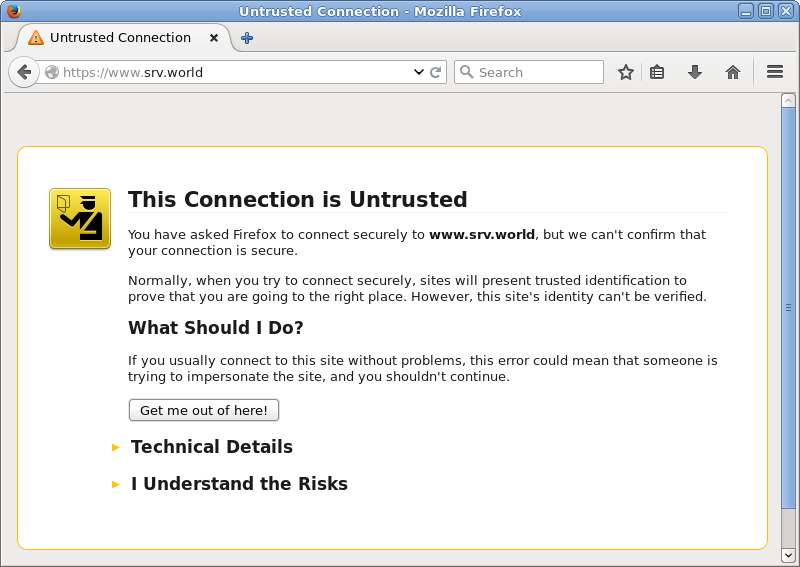

访问成功：

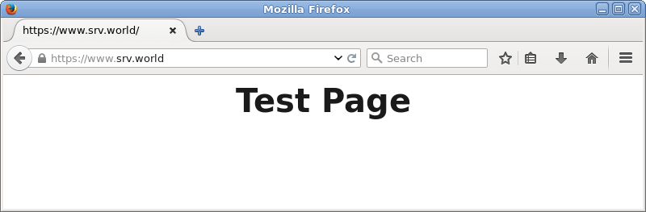

### 5.1.9. 启用基本身份验证

启用基本身份验证以限制特定网页上的访问。

以在目录`/var/www/html/auth-basic`下设置基本身份验证设置为例：

编辑`/etc/httpd/conf.d/auth_basic.conf`文件：

```
# 创建
<Directory /var/www/html/auth-basic>
    AuthType Basic
    AuthName "Basic Authentication"
    AuthUserFile /etc/httpd/conf/.htpasswd
    require valid-user
</Directory>
```

`htpasswd -c /etc/httpd/conf/.htpasswd cent` # 添加用户：使用`-c`创建一个新文件（添加`-c`选项仅用于初始注册）

```
New password:  # 设置密码
Re-type new password:  # 确认密码
Adding password for user cent
```

`systemctl restart httpd`

`mkdir /var/www/html/auth-basic`

编辑`/var/www/html/auth-basic/index.html`文件，创建测试页：

```
<html>
<body>
<div style="width: 100%; font-size: 40px; font-weight: bold; text-align: center;">
Test Page for Basic Auth
</div>
</body>
</html>
```

使用Web浏览器从客户端电脑访问，如下所示需要认证，使用上面添加的用户密码验证：


访问成功：

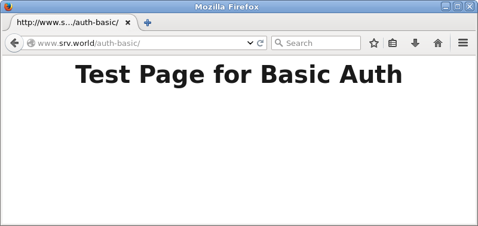

### 5.1.10. 基本身份验证 + PAM

限制特定网页上的访问，并使用系统用户通过SSL连接进行身份验证。

[先配置SSL](#518-配置ssl)

以在`/var/www/html/auth-pam`目录下设置基本认证为例：

`yum --enablerepo=epel -y install mod_authnz_external pwauth` # 从EPEL安装

编辑`/etc/httpd/conf.d/authnz_external.conf`文件，创建测试页：

```
# 将以下内容添加到最后
<Directory /var/www/html/auth-pam>
    SSLRequireSSL
    AuthType Basic
    AuthName "PAM Authentication"
    AuthBasicProvider external
    AuthExternal pwauth
    require valid-user
</Directory>
```

`mkdir /var/www/html/auth-pam`

编辑`/var/www/html/auth-pam/index.html`文件：

```
<html>
<body>
<div style="width: 100%; font-size: 40px; font-weight: bold; text-align: center;">
Test Page for PAM Auth
</div>
</body>
</html>
```

`systemctl restart httpd`

在客户端上使用Web浏览器访问测试页面，使用系统上的用户进行身份验证：

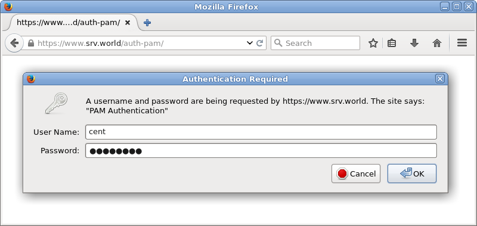

访问成功：

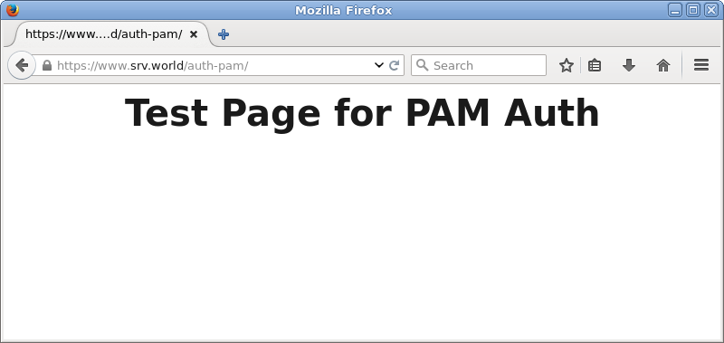

### 5.1.11. 基本身份验证 + LDAP

限制特定网页上的访问，并使用LDAP用户通过SSL连接进行身份验证。

[配置LDAP服务器](../7. 目录服务/7.2. OpenLDAP.html)

[配置SSL](#518-配置ssl)

以在`/var/www/html/auth-ldap`目录下设置基本认证为例：

`yum -y install mod_ldap`

编辑`/etc/httpd/conf.d/auth_ldap.conf`文件：

```
# 将以下内容添加到最后
<Directory /var/www/html/auth-ldap>
    SSLRequireSSL
    AuthName "LDAP Authentication"
    AuthType Basic
    AuthBasicProvider ldap
    AuthLDAPURL ldap://dlp.srv.world/dc=srv,dc=world?uid?sub?(objectClass=*)
    Require ldap-filter objectClass=posixAccount
</Directory>
```

`mkdir /var/www/html/auth-ldap`

编辑`/var/www/html/auth-ldap/index.html`文件，创建测试页：

```
<html>
<body>
<div style="width: 100%; font-size: 40px; font-weight: bold; text-align: center;">
Test Page for LDAP Auth
</div>
</body>
</html>
```

在客户端上使用Web浏览器访问测试页面，使用LDAP上的用户进行身份验证：

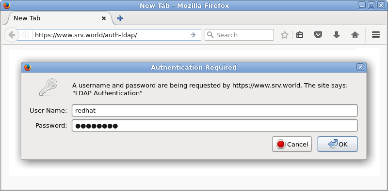

访问成功：

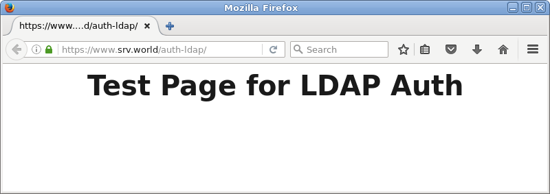

### 5.1.12. 启用Kerberos身份验证

启用Kerberos身份验证以限制对特定网页的访问。用户可以通过Windows Active Directory进行身份验证。因此，必须在LAN中运行Windows Active Directory。

本例基于下面的环境：

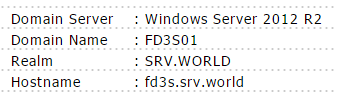

[配置SSL](#518-配置ssl)

以在`/var/www/html/auth-kerberos`目录下设置Kerberos身份验证为例：

`yum -y install mod_auth_kerb`

编辑`/etc/krb5.conf`文件：

```
# 取消注释并更改为Realm名称
default_realm = SRV.WORLD

# 在[realms]下添加以下内容
[realms]
  SRV.WORLD = {
  kdc = fd3s.srv.world
  admin_server = fd3s.srv.world
 }

# 在[domain_realm]下添加以下内容
[domain_realm]
 .srv.world = SRV.WORLD
 srv.world = SRV.WORLD
```

`echo "HTTP/fd3s.srv.world@SRV.WORLD" > /etc/httpd/conf.d/krb5.keytab` # 创建keytab，格式`HTTP/[AD's hostname or IP address]@[Realm name]`

编辑`/etc/httpd/conf.d/auth_kerberos.conf`文件：

```
<Directory /var/www/html/auth-kerberos>
    SSLRequireSSL
    AuthType Kerberos
    AuthName "Kerberos Authntication"
    KrbAuthRealms SRV.WORLD
    Krb5Keytab /etc/httpd/conf.d/krb5.keytab
    KrbMethodNegotiate Off
    KrbSaveCredentials Off
    KrbVerifyKDC Off
    Require valid-user
</Directory>
```

`mkdir /var/www/html/auth-kerberos`

编辑`/var/www/html/auth-kerberos/index.html`文件，创建测试页：

```
<html>
<body>
<div style="width: 100%; font-size: 40px; font-weight: bold; text-align: center;">
Test Page for Kerberos Auth
</div>
</body>
</html>
```

在客户端上使用Web浏览器访问测试页面，使用Active Directory上的用户进行身份验证：


访问成功：

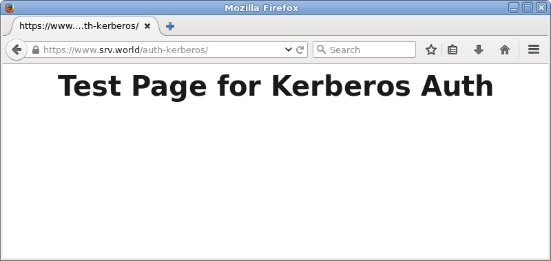

### 5.1.13. 使用WebDAV

这是使用SSL连接配置WebDAV设置的示例。

[配置SSL](#518-配置ssl)

例如，创建一个目录`webdav`，使它仅可以通过SSL连接到WebDAV目录：

```
mkdir /home/webdav
chown apache. /home/webdav
chmod 770 /home/webdav
```

编辑`/etc/httpd/conf.d/webdav.conf`文件：

```
DavLockDB "/tmp/DavLock"
Alias /webdav /home/webdav
<Location /webdav>
    DAV On
    SSLRequireSSL
    Options None
    AuthType Basic
    AuthName WebDAV
    AuthUserFile /etc/httpd/conf/.htpasswd
    <RequireAny>
        Require method GET POST OPTIONS
        Require valid-user
    </RequireAny>
</Location>
```

`htpasswd -c /etc/httpd/conf/.htpasswd cent` # 添加用户：使用`-c`创建一个新文件（添加`-c`选项仅用于初始注册）

```
New password:  # 设置密码
Re-type new password:  # 确认密码
Adding password for user cent
```

`systemctl restart httpd`

如果启用了SELinux，更改规则如下：

```
chcon -R -t httpd_sys_rw_content_t /home/webdav
semanage fcontext -a -t httpd_sys_rw_content_t /home/webdav
```

这里是PC上的WebDAV客户端设置（Windows 10）。

下载“[CarotDAV](http://www.rei.to/carotdav_en.html#download)”，这是一个免费的WebDAV客户端。安装并启动CarotDAV，显示以下屏幕，单击“File”按钮并选择“WebDAV”：

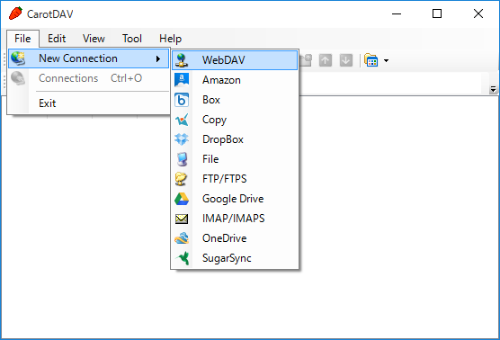

在“Setting Name”字段中输入任意名称，在“URI”字段中输入`服务器名称/ webdav目录`，并输入用户名和密码，如下所示：

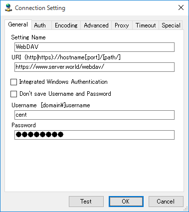

配置添加如下，点击它连接到服务器：

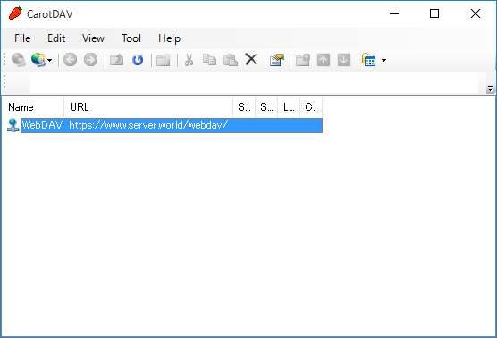

警告如下所示，因为电脑上没有安装SSL证书，这没有问题，点击“Ignore”，然后下一步：


访问成功：

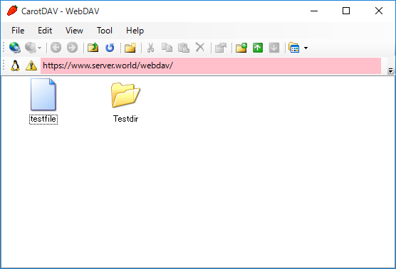

### 5.1.14. Perl + mod_perl

安装mod_perl使Perl脚本速度更快。

`yum --enablerepo=epel -y install mod_perl` # 从EPEL安装

配置PerlRun模式，总是将Perl解释器放在内存上：

编辑`/etc/httpd/conf.d/perl.conf`文件：

```
# 取消注释（检查代码并向日志输出警告）
PerlSwitches -w

# 取消注释
PerlSwitches -T

# 取消注释如下
Alias /perl /var/www/perl
<Directory /var/www/perl>  # mod_perl环境的目录
    SetHandler perl-script  # 在此目录下将文件作为perl脚本处理
#    AddHandler perl-script .cgi  # 如果不想将所有文件作为CGI处理，则设置特定扩展
#    PerlResponseHandler ModPerl::Registry
    PerlResponseHandler ModPerl::PerlRun  # 指定PerlRun模式
    PerlOptions +ParseHeaders
    Options +ExecCGI
</Directory>

# 取消注释和添加以下内容
<Location /perl-status>
    SetHandler perl-script
    PerlResponseHandler Apache2::Status
    Require ip 127.0.0.1 10.0.0.0/24  # 添加访问权限
#    Order deny,allow
#    Deny from all
#    Allow from .example.com
</Location>
```

`systemctl restart httpd`

创建测试脚本以确保设置没有问题：

`mkdir /var/www/perl`

编辑`/var/www/perl/test-mod_perl.cgi`文件：

```
#!/usr/bin/perl

use strict;
use warnings;

print "Content-type: text/html\n\n";
print "<html>\n<body>\n";
print "<div style=\"width:100%; font-size:40px; font-weight:bold; text-align:center;\">";

my $a = 0;
&number();

print "</div>\n</body>\n</html>";

sub number {
    $a++;
    print "number \$a = $a";
}
```

`chmod 705 /var/www/perl/test-mod_perl.cgi`

如果显示如下所示的结果，表示正常：

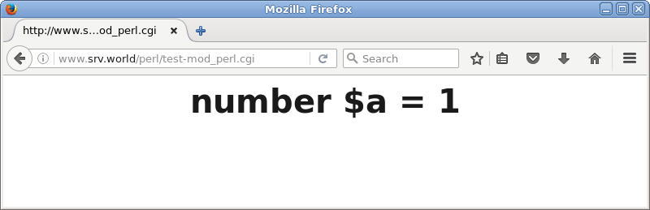

配置在内存上具有代码缓存的Registry模式：

编辑`/etc/httpd/conf.d/perl.conf`文件：

```
Alias /perl /var/www/perl
<Directory /var/www/perl>
    SetHandler perl-script
    PerlResponseHandler ModPerl::Registry  # 取消注释
#   PerlResponseHandler ModPerl::PerlRun  # 注释
    PerlOptions +ParseHeaders
    Options +ExecCGI
</Directory>
```

`systemctl restart httpd`

访问上面示例的测试脚本，然后变量通过重新加载而增加，因为变量被高速缓存在内存上。所以有必要编辑Registry模式的代码：

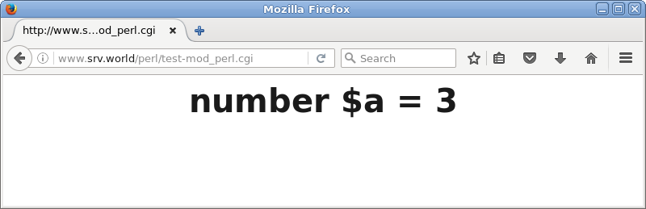

编辑`/var/www/perl/test-mod_perl.cgi`文件：

```
#!/usr/bin/perl

use strict;
use warnings;

print "Content-type: text/html\n\n";
print "<html>\n<body>\n";
print "<div style=\"width:100%; font-size:40px; font-weight:bold; text-align:center;\">";

my $a = 0;
&number($a);
print "</div>\n</body>\n</html>";

sub number {
    my($a) = @_; 
    $a++;
    print "number \$a = $a";
}
```

可以访问`http://(hostname or IP address)/perl-status`查看mod_perl的状态

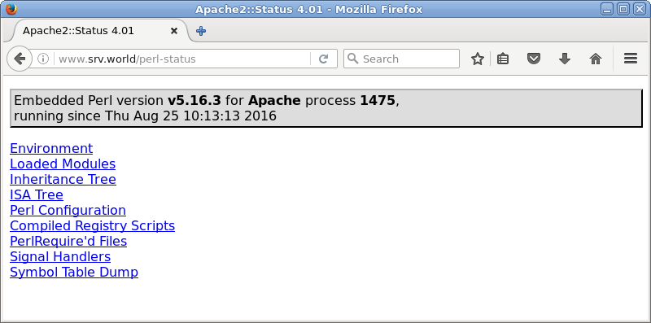

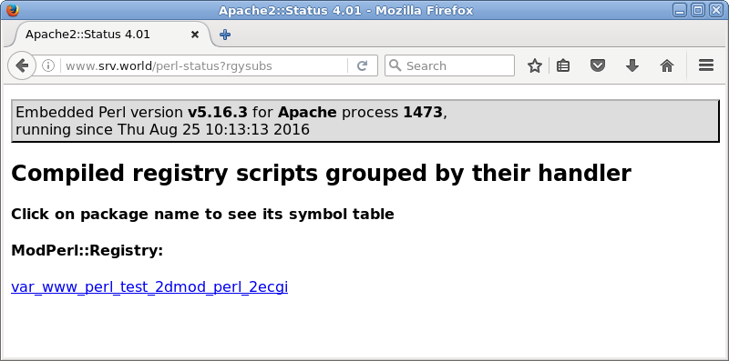

### 5.1.15. PHP + PHP-FPM

[先安装PHP](#513-使用php脚本)

`yum -y install php-fpm` # 安装PHP-FPM

配置Apache httpd：

编辑`/etc/httpd/conf.d/php.conf`文件：

```
# 作如下更改
<FilesMatch \.php$>
#    SetHandler application/x-httpd-php
    SetHandler "proxy:fcgi://127.0.0.1:9000" 
</FilesMatch>
```

```
systemctl start php-fpm
systemctl enable php-fpm
systemctl restart httpd
```

`echo '<?php phpinfo(); ?>' > /var/www/html/info.php` # 创建phpinfo

访问它，如果显示“FPM/FastCGI”则表示安装成功：

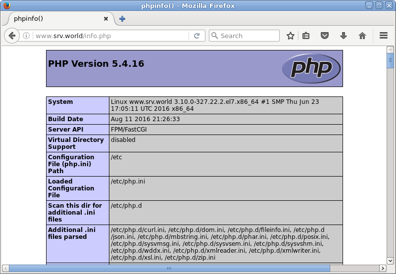

### 5.1.16. Python + mod_wsgi

安装mod_wsgi（WSGI：Web Server Gateway Interface/Web服务器网关接口），使Python脚本更快。

`yum -y install mod_wsgi` # 安装mod_wsgi

编辑`/etc/httpd/conf.d/wsgi.conf`，配置mod_wsgi：

示例为让可以访问`/test_wsgi`的后端是`/var/www/html/test_wsgi.py`：

```
WSGIScriptAlias /test_wsgi /var/www/html/test_wsgi.py
```

`systemctl restart httpd`

创建在上面设置的测试脚本：

编辑`/var/www/html/test_wsgi.py`文件：

```
def application(environ,start_response):
    status = '200 OK'
    html = '<html>\n' \
           '<body>\n' \
           '<div style="width: 100%; font-size: 40px; font-weight: bold; text-align: center;">\n' \
           'mod_wsgi Test Page\n' \
           '</div>\n' \
           '</body>\n' \
           '</html>\n'
    response_header = [('Content-type','text/html')]
    start_response(status,response_header)
    return [html]
```

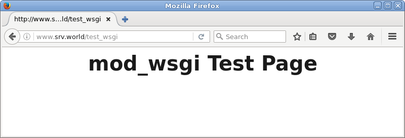

如果[使用Django](../13. 语言开发环境/13.4. Python.html#1344-安装django)

编辑`/etc/httpd/conf.d/django.conf`文件，配置：

示例为在“cent”用户的`/home/cent/venv/testproject`下配置“testapp”：

```
WSGIDaemonProcess testapp python-path=/home/cent/venv/testproject:/home/cent/venv/lib/python2.7/site-packages
WSGIProcessGroup testapp
WSGIScriptAlias /django /home/cent/venv/testproject/testproject/wsgi.py

<Directory /home/cent/venv/testproject>
    Require all granted
</Directory>
```

`systemctl restart httpd`

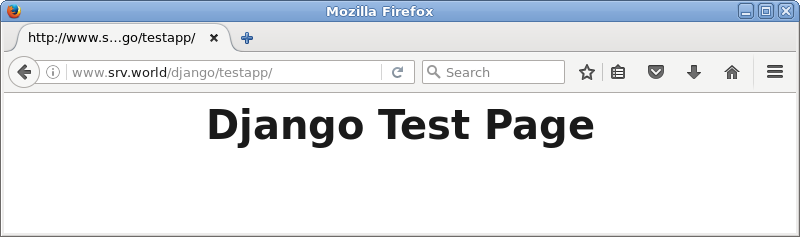

### 5.1.17. 配置mod_proxy

#### 5.1.17.1. 正向代理

启用mod_proxy模块以配置正向代理设置。

mod_proxy包含在httpd包中，默认启用，因此可以快速配置：

`grep "mod_proxy" /etc/httpd/conf.modules.d/00-proxy.conf` # 模块默认启用

```
LoadModule proxy_module modules/mod_proxy.so
LoadModule proxy_ajp_module modules/mod_proxy_ajp.so
.....
LoadModule proxy_http_module modules/mod_proxy_http.so
LoadModule proxy_scgi_module modules/mod_proxy_scgi.so
```

编辑`/etc/httpd/conf.d/f_proxy.conf`文件：

```
<IfModule mod_proxy.c>
    # 正向代理功能On
    ProxyRequests On
    <Proxy *>
        # 访问权限
        Require ip 127.0.0.1 10.0.0.0/24
    </Proxy>
</IfModule>
```

编辑`/etc/httpd/conf/httpd.conf`文件：

```
# 更改监听端口
Listen 8080
```

`systemctl restart httpd`

firewalld防火墙设置，添加上面设置的端口（8080/TCP）：

```
firewall-cmd --add-port=8080/tcp --permanent
firewall-cmd --reload
```

如果启用了SELinux，更改布尔值：

`setsebool -P httpd_can_network_relay on`

[在客户端上配置代理客户端设置](../10. 网络服务/10.2. 代理服务器.html#1022-配置客户端)，并确保可以正常访问任何网站。

#### 5.1.17.2. 反向代理

启用mod_proxy模块以配置反向代理设置。本例基于以下环境：

```
(1) www.srv.world       [10.0.0.31]    - Web Server#1
(2) node01.srv.world    [10.0.0.51]    - Web Server#2
```

本例配置将(1)Web服务器的请求转发到(2)Web服务器。

mod_proxy包含在httpd包中，默认启用，因此可以快速配置：

`grep "mod_proxy" /etc/httpd/conf.modules.d/00-proxy.conf` # 模块默认启用

```
LoadModule proxy_module modules/mod_proxy.so
LoadModule proxy_ajp_module modules/mod_proxy_ajp.so
.....
LoadModule proxy_http_module modules/mod_proxy_http.so
LoadModule proxy_scgi_module modules/mod_proxy_scgi.so
```

编辑`/etc/httpd/conf.d/r_proxy.conf`文件：

```
<IfModule mod_proxy.c>
    ProxyRequests Off
    <Proxy *>
        Require all granted
    </Proxy>
    # 后端服务器和转发路径
    ProxyPass / http://node01.srv.world/
    ProxyPassReverse / http://node01.srv.world/
</IfModule>
```

`systemctl restart httpd`

访问前端服务器以确保后端服务器响应如下所示：


可以配置负载均衡设置：

```
(1) www.srv.world       [10.0.0.31]    - Web Server#1
(2) node01.srv.world    [10.0.0.51]    - Web Server#2
(3) node02.srv.world    [10.0.0.52]    - Web Server#3
```

本例配置将(1)Web服务器的http请求转发到(2)Web服务器和(3)Web服务器：

编辑`/etc/httpd/conf.d/r_proxy.conf`文件：

```
<IfModule mod_proxy.c>
    ProxyRequests Off
    <Proxy *>
        Require all granted
    </Proxy>
    # 指定使用“lbmethod”进行负载均衡的方式。也可以设置“bytraffic”。
    ProxyPass / balancer://cluster lbmethod=byrequests
    <proxy balancer://cluster>
        BalancerMember http://node01.srv.world/ loadfactor=1
        BalancerMember http://node02.srv.world/ loadfactor=1
    </proxy>
</IfModule>
```

`systemctl restart httpd`

访问前端服务器以确保后端服务器响应如下所示：

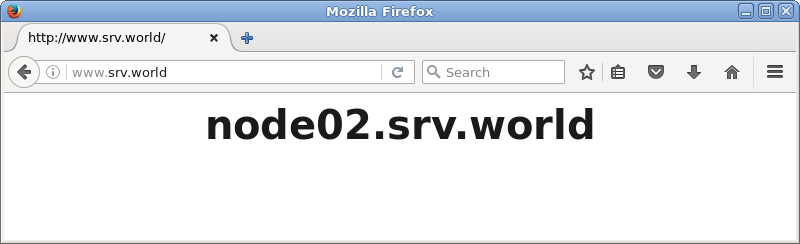

### 5.1.18. 配置mod_proxy_wstunnel

启用mod_proxy_wstunnel模块以设置WebSocket代理。

例如，对于在`localhost:1337`上侦听的应用程序（[示例应用程序来自这里](../13. 语言开发环境/13.2. JavaScript.html#1321-安装nodejs)），配置httpd在/chat设置代理：

编辑`/etc/httpd/conf.modules.d/00-proxy.conf`文件：

```
# 添加到最后
LoadModule proxy_wstunnel_module modules/mod_proxy_wstunnel.so
```

编辑`/etc/httpd/conf.d/wstunnel.conf`文件：

```
ProxyRequests Off
<Proxy *>
    Require all granted
</Proxy>

ProxyPass /socket.io/ http://127.0.0.1:1337/socket.io/
ProxyPassReverse /socket.io/ http://127.0.0.1:1337/socket.io/

ProxyPass /chat http://127.0.0.1:1337/
ProxyPassReverse /chat http://127.0.0.1:1337/
```

`systemctl restart httpd`

如果启用了SELinux，更改规则如下：

`semanage port -a -t http_port_t -p tcp 1337`

访问示例应用程序以确保它在代理环境中正常工作：


### 5.1.19. 配置mod_ratelimit

启用mod_ratelimit模块以限制客户端的带宽。

mod_ratelimit包含在httpd包中，因此可以快速配置。

编辑`/etc/httpd/conf.modules.d/00-base.conf`文件：

```
# 取消注释
LoadModule ratelimit_module modules/mod_ratelimit.so
```

编辑`/etc/httpd/conf.d/ratelimit.conf`文件：

```
# 例如，在/download目录下限制带宽为500KB/秒
<IfModule mod_ratelimit.c>
    <Location /download>
        SetOutputFilter RATE_LIMIT
        SetEnv rate-limit 500
    </Location>
</IfModule>
```

`systemctl restart httpd`

访问位置以确保设置有效（上面是从限制的目录下载，下面是没有限制的）：

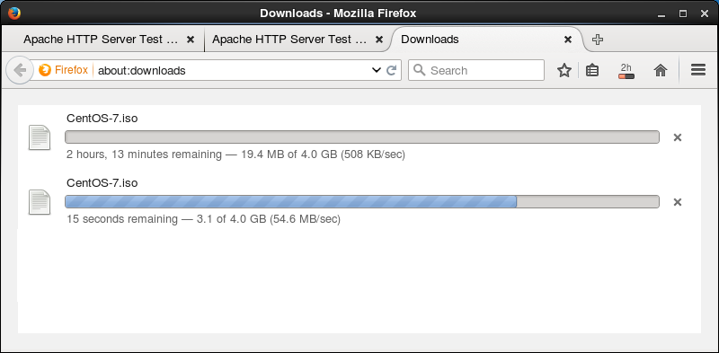

### 5.1.20. 配置mod_limitipconn

使用mod_limitipconn限制每个IP地址的并发连接。

`yum --enablerepo=epel -y install mod_limitipconn` # 从EPEL安装

编辑`/etc/httpd/conf.d/limitipconn.conf`文件：

```
# 默认设置没有限制
MaxConnPerIP 0

# /limit目录设置
<Location /limit>
    # 限制并发连接3
    MaxConnPerIP 3
    # 如果MIME类型为“text/*”，则不适用上面规则
    NoIPLimit text/*
</Location>

# /limit2目录设置
<Location /limit2>
    # 限制并发连接2
    MaxConnPerIP 2
    # 如果MIME类型为“application/x-tar”，则不适用上面规则
    OnlyIPLimit application/x-tar
</Location>
```

`systemctl restart httpd`

使用httpd-tools包中包含的命令“ab”验证是否正常工作，如下所示：

`ab -n 10 -c 10 http://localhost/limit/index.html`

```
This is ApacheBench, Version 2.3 <$Revision: 1430300 $>
Copyright 1996 Adam Twiss, Zeus Technology Ltd, http://www.zeustech.net/
Licensed to The Apache Software Foundation, http://www.apache.org/

Benchmarking localhost (be patient).....done

Server Software:        Apache/2.4.6
Server Hostname:        localhost
Server Port:            80

Document Path:          /limit/index.html
Document Length:        130 bytes

Concurrency Level:      10
Time taken for tests:   0.004 seconds
Complete requests:      10
Failed requests:        0
Write errors:           0
Total transferred:      3910 bytes
HTML transferred:       1300 bytes
Requests per second:    2223.21 [#/sec] (mean)
Time per request:       4.498 [ms] (mean)
Time per request:       0.450 [ms] (mean, across all concurrent requests)
Transfer rate:          848.90 [Kbytes/sec] received
.....
.....
```

`ab -n 10 -c 10 http://localhost/limit/test.gif`

```
This is ApacheBench, Version 2.3 <$Revision: 1430300 $>
Copyright 1996 Adam Twiss, Zeus Technology Ltd, http://www.zeustech.net/
Licensed to The Apache Software Foundation, http://www.apache.org/

Benchmarking localhost (be patient).....done


Server Software:        Apache/2.4.6
Server Hostname:        localhost
Server Port:            80

Document Path:          /limit/test.gif
Document Length:        228 bytes

Concurrency Level:      10
Time taken for tests:   0.005 seconds
Complete requests:      10
Failed requests:        7
   (Connect: 0, Receive: 0, Length: 7, Exceptions: 0)
Write errors:           0
Non-2xx responses:      7
Total transferred:      4838 bytes
HTML transferred:       2777 bytes
Requests per second:    2182.45 [#/sec] (mean)
Time per request:       4.582 [ms] (mean)
Time per request:       0.458 [ms] (mean, across all concurrent requests)
Transfer rate:          1031.12 [Kbytes/sec] received
.....
.....
```

`ab -n 10 -c 10 http://localhost/limit2/test.tar`

```
This is ApacheBench, Version 2.3 <$Revision: 1430300 $>
Copyright 1996 Adam Twiss, Zeus Technology Ltd, http://www.zeustech.net/
Licensed to The Apache Software Foundation, http://www.apache.org/

Benchmarking localhost (be patient).....done


Server Software:        Apache/2.4.6
Server Hostname:        localhost
Server Port:            80

Document Path:          /limit2/test.tar
Document Length:        10240 bytes

Concurrency Level:      10
Time taken for tests:   0.006 seconds
Complete requests:      10
Failed requests:        8
   (Connect: 0, Receive: 0, Length: 8, Exceptions: 0)
Write errors:           0
Non-2xx responses:      8
Total transferred:      24900 bytes
HTML transferred:       22872 bytes
Requests per second:    1785.40 [#/sec] (mean)
Time per request:       5.601 [ms] (mean)
Time per request:       0.560 [ms] (mean, across all concurrent requests)
Transfer rate:          4341.44 [Kbytes/sec] received
.....
.....
```

### 5.1.21. 配置mod_evasive

启用mod_evasive模块来防御DoS攻击等。

`yum --enablerepo=epel -y install mod_evasive` # 从EPEL安装

编辑`/etc/httpd/conf.d/mod_evasive.conf`文件：

```
# 每页间隔相同页面的请求数量的阈值
DOSPageCount   5

# 每个站点间隔相同侦听器上的同一客户端对任何对象的请求总数的阈值
DOSSiteCount   50

# 页计数阈值的时间间隔
DOSPageInterval   1

# 站点计数阈值的时间间隔
DOSSiteInterval   1

# 如果将客户端添加到阻止列表中，则客户端将被阻止的时间量（以秒为单位）
DOSBlockingPeriod   300

# 如果IP地址被列入黑名单，通知邮件地址
DOSEmailNotify   root@localhost

# 指定日志目录
DOSLogDir   "/var/log/mod_evasive"
```

```
mkdir /var/log/mod_evasive
chown apache. /var/log/mod_evasive
systemctl restart httpd
```

使用RPM软件包中包含的测试工具进行测试：

`perl /usr/share/doc/mod_evasive-*/test.pl`

```
HTTP/1.1 200 OK
HTTP/1.1 200 OK
HTTP/1.1 200 OK
HTTP/1.1 200 OK
HTTP/1.1 200 OK
.....
.....
HTTP/1.1 403 Forbidden  # 如果被阻止，转到“403 Forbidden”
HTTP/1.1 403 Forbidden
HTTP/1.1 403 Forbidden
.....
.....
HTTP/1.1 403 Forbidden
```

`ll /var/log/mod_evasive`

```
total 4
-rw-r--r-- 1 apache apache 5 Aug  5 15:42 dos-127.0.0.1
```

如果设置了通知，则发送如下：

`mail`

```
Heirloom Mail version 12.5 7/5/10.  Type ? for help.
"/var/spool/mail/root": 1 message 1 new
>N  1 Apache                Wed Aug  3 19:42  20/673
& 1
Message  1:
From apache@www.srv.world  Wed Aug  3 19:42:55 2015
Return-Path: <apache@www.srv.world>
X-Original-To: root@localhost
Delivered-To: root@localhost.srv.world
Date: Wed, 05 Aug 2015 15:42:54 +0900
To: root@localhost.srv.world
User-Agent: Heirloom mailx 12.5 7/5/10
Content-Type: text/plain; charset=us-ascii
From: apache@www.srv.world (Apache)
Status: R

To: root@localhost
Subject: HTTP BLACKLIST 127.0.0.1

mod_evasive HTTP Blacklisted 127.0.0.1
```

### 5.1.22. 配置mod_security

使用mod_security模块配置Web应用程序防火墙（WAF）。

`yum -y install mod_security`

安装后，配置文件放在下面的目录中，并且设置被启用。其中有一些设置，还可以添加自己的规则：

`cat /etc/httpd/conf.d/mod_security.conf`

```
<IfModule mod_security2.c>
    # ModSecurity Core Rules Set configuration
        IncludeOptional modsecurity.d/*.conf
        IncludeOptional modsecurity.d/activated_rules/*.conf

    # Default recommended configuration
    SecRuleEngine On
    SecRequestBodyAccess On
    SecRule REQUEST_HEADERS:Content-Type "text/xml" \
         "id:'200000',phase:1,t:none,t:lowercase,pass,nolog,ctl:requestBodyProcessor=XML"

.....
.....
# 如果不希望在匹配规则时阻止请求，指定对参数“SecRuleEngine DetectionOnly”的更改
```

可以如下编写规则：

`SecRule VARIABLES OPERATOR [ACTIONS]`

每个参数有许多种值，请参考[官方文档](https://github.com/SpiderLabs/ModSecurity/wiki/Reference-Manual)。

举例设置一些规则并验证它正常工作：

编辑`/etc/httpd/modsecurity.d/activated_rules/rules-01.conf`文件：

```
# 匹配规则时的默认操作
SecDefaultAction "phase:2,deny,log,status:406"

# “etc/passwd”包含在请求URI中
SecRule REQUEST_URI "etc/passwd" "id:'500001'"

# “../”包括在请求URI中
SecRule REQUEST_URI "\.\./" "id:'500002'"

# “<SCRIPT”包含在参数中
SecRule ARGS "<[Ss][Cc][Rr][Ii][Pp][Tt]" "id:'500003'"

# “SELECT FROM”包含在参数中
SecRule ARGS "[Ss][Ee][Ll][Ee][Cc][Tt][[:space:]]+[Ff][Rr][Oo][Mm]" "id:'500004'"
```

`systemctl restart httpd`

访问包含您设置的字词的URI，并验证其是否正常工作：

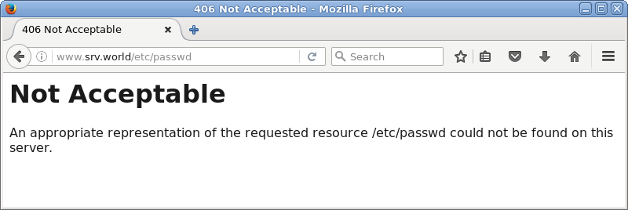

mod_security的日志放在如下所示的目录中：

`cat /var/log/httpd/modsec_audit.log`

```
--75d36531-A--
[28/Oct/2015:13:52:52 +0900] VjBUpAKZ9yAFgyhKj8zyyAAAAAE 10.0.0.108 53545 10.0.0.31 80
--75d36531-B--
GET /?../../etc/passwd HTTP/1.1
Host: www.srv.world
User-Agent: Mozilla/5.0 (X11; Linux x86_64; rv:38.0) Gecko/20100101 Firefox/38.0
Accept: text/html,application/xhtml+xml,application/xml;q=0.9,*/*;q=0.8
Accept-Language: en-US,en;q=0.5
Accept-Encoding: gzip, deflate
Connection: keep-alive

--75d36531-F--
HTTP/1.1 406 Not Acceptable
Content-Length: 251
Keep-Alive: timeout=5, max=100
Connection: Keep-Alive
Content-Type: text/html; charset=iso-8859-1

--75d36531-E--

--75d36531-H--
Message: Access denied with code 406 (phase 2). Pattern match "etc/passwd" 
at REQUEST_URI. [file "/etc/httpd/modsecurity.d/activated_rules/rules-01.conf"] [line "3"] [id "500001"]
Action: Intercepted (phase 2)
Stopwatch: 1446007972909468 1333 (- - -)
Stopwatch2: 1446007972909468 1333; combined=418, p1=395, p2=17, p3=0, p4=0, p5=6, sr=116, sw=0, l=0, gc=0
Response-Body-Transformed: Dechunked
Producer: ModSecurity for Apache/2.7.3 (http://www.modsecurity.org/); OWASP_CRS/2.2.6.
Server: Apache/2.4.6 (CentOS)
Engine-Mode: "ENABLED"

--75d36531-Z--
```

普通规则由官方存储库提供，很容易应用。但可能需要自定义它们让自己的网站不阻止必要的请求：

`yum -y install mod_security_crs`

规则放置如下，它们被链接到目录`/etc/httpd/modsecurity.d/activated_rules`：

`ll /usr/lib/modsecurity.d/base_rules`

```
total 332
-rw-r--r-- 1 root root  1980 Jun 10  2014 modsecurity_35_bad_robots.data
-rw-r--r-- 1 root root   386 Jun 10  2014 modsecurity_35_scanners.data
-rw-r--r-- 1 root root  3928 Jun 10  2014 modsecurity_40_generic_attacks.data
-rw-r--r-- 1 root root  2610 Jun 10  2014 modsecurity_41_sql_injection_attacks.data
-rw-r--r-- 1 root root  2224 Jun 10  2014 modsecurity_50_outbound.data
-rw-r--r-- 1 root root 56714 Jun 10  2014 modsecurity_50_outbound_malware.data
-rw-r--r-- 1 root root 22861 Jun 10  2014 modsecurity_crs_20_protocol_violations.conf
-rw-r--r-- 1 root root  6915 Jun 10  2014 modsecurity_crs_21_protocol_anomalies.conf
-rw-r--r-- 1 root root  3792 Jun 10  2014 modsecurity_crs_23_request_limits.conf
-rw-r--r-- 1 root root  6933 Jun 10  2014 modsecurity_crs_30_http_policy.conf
-rw-r--r-- 1 root root  5394 Jun 10  2014 modsecurity_crs_35_bad_robots.conf
-rw-r--r-- 1 root root 19157 Jun 10  2014 modsecurity_crs_40_generic_attacks.conf
-rw-r--r-- 1 root root 43961 Jun 10  2014 modsecurity_crs_41_sql_injection_attacks.conf
-rw-r--r-- 1 root root 87470 Jun 10  2014 modsecurity_crs_41_xss_attacks.conf
-rw-r--r-- 1 root root  1795 Jun 10  2014 modsecurity_crs_42_tight_security.conf
-rw-r--r-- 1 root root  3660 Jun 10  2014 modsecurity_crs_45_trojans.conf
-rw-r--r-- 1 root root  2253 Jun 10  2014 modsecurity_crs_47_common_exceptions.conf
-rw-r--r-- 1 root root  2787 Jun 10  2014 modsecurity_crs_48_local_exceptions.conf.example
-rw-r--r-- 1 root root  1835 Jun 10  2014 modsecurity_crs_49_inbound_blocking.conf
-rw-r--r-- 1 root root 22314 Jun 10  2014 modsecurity_crs_50_outbound.conf
-rw-r--r-- 1 root root  1448 Jun 10  2014 modsecurity_crs_59_outbound_blocking.conf
-rw-r--r-- 1 root root  2674 Jun 10  2014 modsecurity_crs_60_correlation.conf
```
