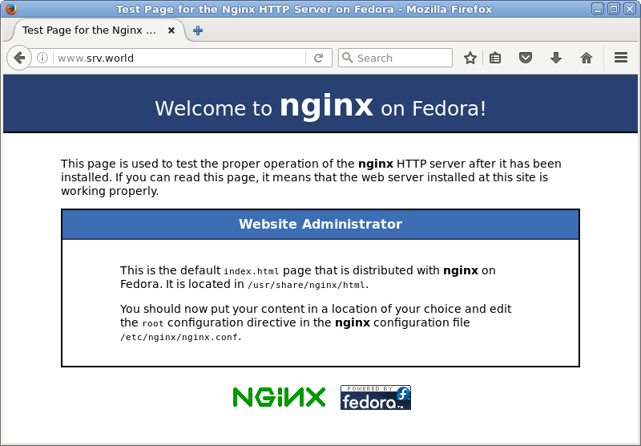

## 5.2. Nginx

### 5.2.1. 安装Nginx

`yum --enablerepo=epel -y install nginx` # 从EPEL安装

配置基本设置，编辑`/etc/nginx/nginx.conf`文件：

```
# 更改主机名
server_name www.srv.world;
```

```
systemctl start nginx
systemctl enable nginx
```

firewalld防火墙设置（HTTP默认端口80/TCP）：

```
firewall-cmd --add-service=http --permanent
firewall-cmd --reload
```

使用Web浏览器从客户端电脑访问Nginx的默认页面，如果显示以下页面，则运行正常：



### 5.2.2. 虚拟主机

本例配置其他域名为“virtual.host”：

编辑`/etc/nginx/conf.d/virtual.host.conf`文件：

```
server {
    listen       80;
    server_name  www.virtual.host;

    location / {
        root   /usr/share/nginx/virtual.host;
        index  index.html index.htm;
    }
}
```

编辑`/usr/share/nginx/virtual.host/index.html`文件，创建测试页以确保其正常工作：

```
<html>
<body>
<div style="width: 100%; font-size: 40px; font-weight: bold; text-align: center;">
Nginx Virtual Host Test Page
</div>
</body>
</html>
```


### 5.2.3. 启用Userdir

启用普通用户的Userdir在主目录中打开其网站。

编辑`/etc/nginx/nginx.conf`文件：

```
# 在“server”部分添加以下内容
        location ~ ^/~(.+?)(/.*)?$ {
            alias /home/$1/public_html$2;
            index  index.html index.htm;
            autoindex on;
        }
```

`systemctl restart nginx`

使用普通用户创建测试页以确保其正常工作：

```
chmod 711 /home/cent
mkdir ~/public_html
chmod 755 ~/public_html
```

编辑`~/public_html/index.html`文件：

```
<html>
<body>
<div style="width: 100%; font-size: 40px; font-weight: bold; text-align: center;">
Nginx UserDir Test Page
</div>
</body>
</html>
```


