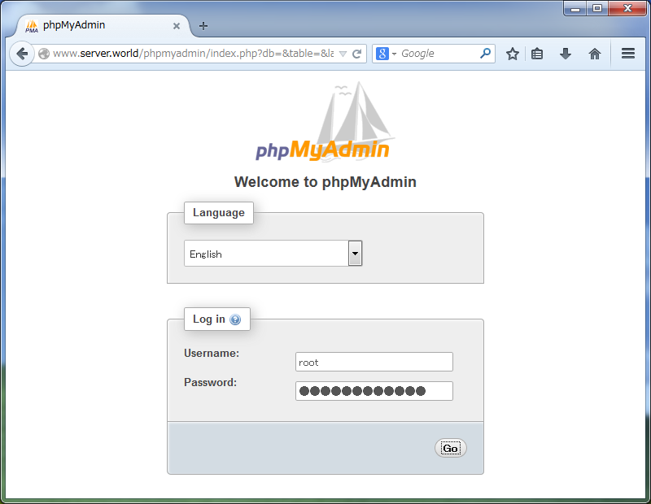
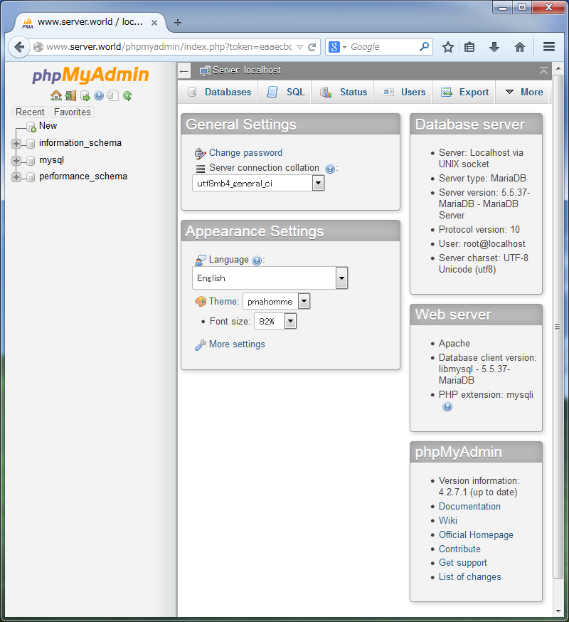
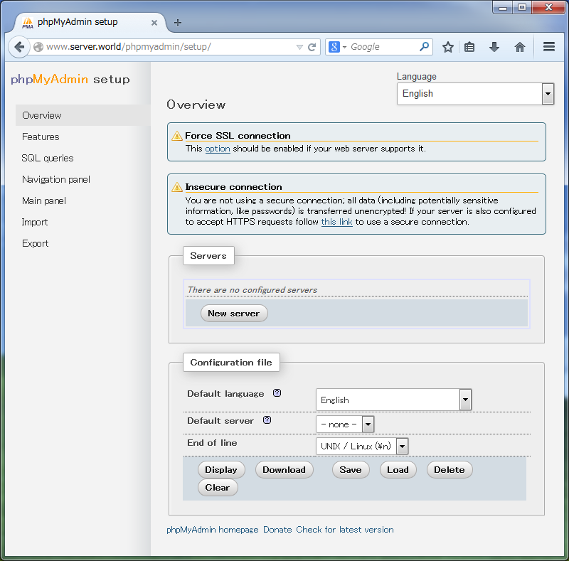

## 6.1. MariaDB

[MariaDB](https://mariadb.com/)数据库管理系统是MySQL的一个分支，主要由开源社区在维护，采用GPL授权许可MariaDB的目的是完全兼容MySQL，包括API和命令行。

官网的[yum安装方法](https://mariadb.com/kb/en/mariadb/yum/)

另：[MySQL](https://www.mysql.com/)与MariaDB类似，官网[yum源](https://dev.mysql.com/downloads/repo/yum/)

### 6.1.1. MariaDB 5.5

#### 6.1.1.1. 安装MariaDB

安装MariaDB 5.5（CentOS7默认版本）以配置数据库服务器。

`yum -y install mariadb-server`

编辑`/etc/my.cnf`文件：

```
# 在[mysqld]下面添加以下内容
character-set-server=utf8
```

```
systemctl start mariadb
systemctl enable mariadb
```

<span id="mariadb-initial">MariaDB的初始设置</span>：

`mysql_secure_installation`

```
NOTE: RUNNING ALL PARTS OF THIS SCRIPT IS RECOMMENDED FOR ALL MariaDB
      SERVERS IN PRODUCTION USE!  PLEASE READ EACH STEP CAREFULLY!

In order to log into MariaDB to secure it, we'll need the current
password for the root user.  If you've just installed MariaDB, and
you haven't set the root password yet, the password will be blank,
so you should just press enter here.

Enter current password for root (enter for none):
OK, successfully used password, moving on...

Setting the root password ensures that nobody can log into the MariaDB
root user without the proper authorisation.

# 设置root密码
Set root password? [Y/n] y  # 输入y确认
New password:  # 设置密码
Re-enter new password:  # 确认密码
Password updated successfully!
Reloading privilege tables..
 ... Success!

By default, a MariaDB installation has an anonymous user, allowing anyone
to log into MariaDB without having to have a user account created for
them.  This is intended only for testing, and to make the installation
go a bit smoother.  You should remove them before moving into a
production environment.
# 移除anonymous（匿名）用户
Remove anonymous users? [Y/n] y  # 输入y确认
 ... Success!

Normally, root should only be allowed to connect from 'localhost'.  This
ensures that someone cannot guess at the root password from the network.

# 禁止远程root登录
Disallow root login remotely? [Y/n] y  # 输入y确认
 ... Success!

By default, MariaDB comes with a database named 'test' that anyone can
access.  This is also intended only for testing, and should be removed
before moving into a production environment.

# 移除测试数据库
Remove test database and access to it? [Y/n] y  # 输入y确认
 - Dropping test database...
 ... Success!
 - Removing privileges on test database...
 ... Success!

Reloading the privilege tables will ensure that all changes made so far
will take effect immediately.

# 重新加载权限表
Reload privilege tables now? [Y/n] y  # 输入y确认
 ... Success!

Cleaning up...

All done!  If you've completed all of the above steps, your MariaDB
installation should now be secure.

Thanks for using MariaDB!
```

<span id="mariadb-connect">使用root连接MariaDB</span>：

`mysql -u root -p`

```
Enter password:  # 输入上面设置的MariaDB的root密码
Welcome to the MariaDB monitor.  Commands end with ; or \g.
Your MariaDB connection id is 3
Server version: 5.5.37-MariaDB MariaDB Server

Copyright (c) 2000, 2014, Oracle, Monty Program Ab and others.

Type 'help;' or '\h' for help. Type '\c' to clear the current input statement.

MariaDB [(none)]> select user,host,password from mysql.user;  # 显示用户列表
+------+-----------+-------------------------------------------+
| user | host      | password                                  |
+------+-----------+-------------------------------------------+
| root | localhost | *xxxxxxxxxxxxxxxxxxxxxxxxxxxxxxxxxxxxxxxx |
| root | 127.0.0.1 | *xxxxxxxxxxxxxxxxxxxxxxxxxxxxxxxxxxxxxxxx |
| root | ::1       | *xxxxxxxxxxxxxxxxxxxxxxxxxxxxxxxxxxxxxxxx |
+------+-----------+-------------------------------------------+
3 rows in set (0.00 sec)

MariaDB [(none)]> show databases;  # 显示数据库列表
+--------------------+
| Database           |
+--------------------+
| information_schema |
| mysql              |
| performance_schema |
+--------------------+
3 rows in set (0.00 sec)

MariaDB [(none)]> exit  # 退出连接
Bye
```

如果MariaDB用于远程主机，firewalld防火墙设置（MariaDB使用端口3306/TCP）：

```
firewall-cmd --add-service=mysql --permanent
firewall-cmd --reload
```

#### 6.1.1.2. 安装phpMyAdmin

安装phpMyAdmin以在Web浏览器上从客户端运行MariaDB。

[安装Apache httpd](../5. 服务器/5.1. Apache httpd.html)

[安装PHP](../5. 服务器/5.1. Apache httpd.html#513-使用php脚本)

`yum --enablerepo=epel -y install phpMyAdmin php-mysql php-mcrypt` # 从EPEL安装phpMyAdmin

编辑`/etc/httpd/conf.d/phpMyAdmin.conf`文件：

```
# 在几个Require ip后添加允许访问的IP地址（10.0.0.0/24根据实际情况替换）
Require ip 127.0.0.1 10.0.0.0/24
```

`systemctl restart httpd`

使用Web浏览器从客户端访问`http://(主机名或IP地址)/phpmyadmin/`，然后使用MariaDB的用户在以下界面登录。此示例使用root用户：



登录成功，可以在这里操作MariaDB：



可以在`http://(主机名或IP地址)/phpmyadmin/setup`更改MariaDB的设置：



#### 6.1.1.3. MariaDB复制

此配置是通用的主从设置。

在MariaDB主服务器上，编辑`/etc/my.cnf`文件，更改设置：

```
[mysqld]
# 在[mysqld]部分添加以下内容：获取二进制日志
log-bin=mysql-bin
# 定义唯一的服务器ID
server-id=101
```

`systemctl restart mariadb`

创建用于复制的用户：

`mysql -u root -p`

```
Enter password:  # 输入root密码
Welcome to the MariaDB monitor.  Commands end with ; or \g.
Your MariaDB connection id is 2
Server version: 5.5.41-MariaDB-log MariaDB Server

Copyright (c) 2000, 2014, Oracle, MariaDB Corporation Ab and others.

Type 'help;' or '\h' for help. Type '\c' to clear the current input statement.

# 创建用户（在“password”部分设置任意密码）
MariaDB [(none)]> grant replication slave on *.* to replica@'%' identified by 'password'; 
Query OK, 0 rows affected (0.00 sec)

MariaDB [(none)]> flush privileges; 
Query OK, 0 rows affected (0.00 sec)

MariaDB [(none)]> exit
Bye
```

[在从服务器上安装和启动MariaDB服务器](#6111-安装mariadb)：

在主服务器配置防火墙规则（如果从服务器也有读取访问，使用同样的方法设置firewalld防火墙）：

```
firewall-cmd --add-service=mysql --permanent
firewall-cmd --reload
```

编辑`/etc/my.cnf`文件，更改从服务器上的设置：

```
[mysqld]
# 在[mysqld]部分添加以下内容：获取二进制日志
log-bin=mysql-bin
# 定义唯一的服务器ID（与主服务器ID不同）
server-id=102
# 只读
read_only=1
# 定义自己的主机名
report-host=node01.server.world
```

`systemctl restart mariadb`

在主服务器上获取转储数据：

`mysql -u root -p`

```
Enter password:
Your MariaDB connection id is 3
Server version: 5.5.41-MariaDB-log MariaDB Server

Copyright (c) 2000, 2014, Oracle, MariaDB Corporation Ab and others.

Type 'help;' or '\h' for help. Type '\c' to clear the current input statement.

# 锁定所有表
MariaDB [(none)]> flush tables with read lock; 
Query OK, 0 rows affected (0.00 sec)

# 显示状态（记住File，Position的值）
MariaDB [(none)]> show master status; 
+------------------+----------+--------------+------------------+
| File             | Position | Binlog_Do_DB | Binlog_Ignore_DB |
+------------------+----------+--------------+------------------+
| mysql-bin.000001 |      465 |              |                  |
+------------------+----------+--------------+------------------+
1 row in set (0.00 sec)
```

保持上面的窗口，打开另一个窗口执行转储：

`mysqldump -u root -p --all-databases --lock-all-tables --events > mysql_dump.sql`

```
Enter password:
```

回到之前的窗口：

```
# 解锁
MariaDB [(none)]> unlock tables; 
Query OK, 0 rows affected (0.00 sec)

MariaDB [(none)]> exit
Bye
```

将转储传输到从服务器：

`scp mysql_dump.sql node01.server.world:/tmp/`

```
root@node01.server.world's password:
mysql_dump.sql 100% 515KB 514.7KB/s 00:00
```

确保设置正常工作在主服务器上创建数据库。在从服务器上配置复制设置：

`mysql -u root -p < /tmp/mysql_dump.sql` # 从服务器导入主服务器转储

```
Enter password:
```

`mysql -u root -p`

```
Enter password:
Welcome to the MariaDB monitor.  Commands end with ; or \g.
Your MariaDB connection id is 3
Server version: 5.5.41-MariaDB-log MariaDB Server

Copyright (c) 2000, 2014, Oracle, MariaDB Corporation Ab and others.

Type 'help;' or '\h' for help. Type '\c' to clear the current input statement.

MariaDB [(none)]> change master to 
    -> master_host='10.0.0.31',  # 主服务器的IP
    -> master_user='replica',  # 复制ID（上面主服务器创建的用户复制的用户）
    -> master_password='password',  # 复制ID的密码
    -> master_log_file='mysql-bin.000001',  # File值在主机上确认
    -> master_log_pos=465;  # Position值在主机上确认
Query OK, 0 rows affected (0.58 sec)

# 开始复制
MariaDB [(none)]> start slave;
Query OK, 0 rows affected (0.00 sec)

# 显示状态
MariaDB [(none)]> show slave status\G
*************************** 1. row ***************************
               Slave_IO_State: Waiting for master to send event
                  Master_Host: 10.0.0.31
                  Master_User: replica
                  Master_Port: 3306
                Connect_Retry: 60
              Master_Log_File: mysql-bin.000001
          Read_Master_Log_Pos: 536
               Relay_Log_File: mariadb-relay-bin.000002
                Relay_Log_Pos: 600
        Relay_Master_Log_File: mysql-bin.000001
             Slave_IO_Running: Yes
            Slave_SQL_Running: Yes
              Replicate_Do_DB:
          Replicate_Ignore_DB:
           Replicate_Do_Table:
       Replicate_Ignore_Table:
      Replicate_Wild_Do_Table:
  Replicate_Wild_Ignore_Table:
                   Last_Errno: 0
                   Last_Error:
                 Skip_Counter: 0
          Exec_Master_Log_Pos: 536
              Relay_Log_Space: 896
              Until_Condition: None
               Until_Log_File:
                Until_Log_Pos: 0
           Master_SSL_Allowed: No
           Master_SSL_CA_File:
           Master_SSL_CA_Path:
              Master_SSL_Cert:
            Master_SSL_Cipher:
               Master_SSL_Key:
        Seconds_Behind_Master: 0
Master_SSL_Verify_Server_Cert: No
                Last_IO_Errno: 0
                Last_IO_Error:
               Last_SQL_Errno: 0
               Last_SQL_Error:
  Replicate_Ignore_Server_Ids:
             Master_Server_Id: 101
1 row in set (0.00 sec)
```

### 6.1.2. MariaDB 10.1

#### 6.1.2.1. 安装MariaDB

CentOS7官方仓库中的MariaDB版本是5.5，可以使用RPM包安装10.1。

可以从[CentOS SCLo软件集合](../1. 初始化设置/1.6. 软件仓库.html)安装（即使已经安装了5.5，也可以安装，因为10.1位于另一路径）：

`yum --enablerepo=centos-sclo-rh -y install rh-mariadb101-mariadb-server` # 从SCLo安装

此方法将MariaDB 10.1安装在`/opt`目录下，要使用它，需加载如下的环境变量：

`scl enable rh-mariadb101 bash`

`mysql -V`

```
mysql Ver 15.1 Distrib 10.1.14-MariaDB, for Linux (x86_64) using EditLine wrapper
```

`which mysql`

```
/opt/rh/rh-mariadb101/root/usr/bin/mysql
```

如果希望在登录时自动启用MariaDB 10.1，需如下配置：

编辑`/etc/profile.d/rh-mariadb101.sh`文件：

```
#!/bin/bash

source /opt/rh/rh-mariadb101/enable
export X_SCLS="`scl enable rh-mariadb101 'echo $X_SCLS'`"
```

启用MariaDB 10.1并配置初始设置：

编辑`/etc/opt/rh/rh-mariadb101/my.cnf.d/mariadb-server.cnf`文件：

```
# 在[mysqld]下面添加以下内容
character-set-server=utf8
```

```
systemctl start rh-mariadb101-mariadb
systemctl enable rh-mariadb101-mariadb
```

以下[初始设置](#mariadb-initial)，[连接数据库](#mariadb-connect)等操作与MariaDB 5.5一样

`mysql_secure_installation`

`mysql -u root -p`

如果MariaDB用于远程主机，firewalld防火墙设置（MariaDB使用端口3306/TCP）：

```
firewall-cmd --add-service=mysql --permanent
firewall-cmd --reload
```

[安装phpMyAdmin](#6112-安装phpmyadmin)和[MariaDB复制](#6113-mariadb复制)基本与MariaDB 5.5一样。
#### 6.1.2.2. MariaDB Galera集群

集群中的所有节点在此配置中成为主服务器。

在所有节点上安装MariaDB Galera软件包，如下所示：

`yum --enablerepo=centos-sclo-rh -y install rh-mariadb101-mariadb-server-galera` # 从SCLo安装

firewalld防火墙设置（MariaDB使用端口3306/TCP）：

```
firewall-cmd --add-service=mysql --permanent
firewall-cmd --add-port={3306/tcp,4567/tcp,4568/tcp,4444/tcp} --permanent
firewall-cmd --reload
```

配置第一个节点，如下所示：

`mv /etc/opt/rh/rh-mariadb101/my.cnf.d/galera.cnf /etc/opt/rh/rh-mariadb101/my.cnf.d/galera.cnf.org`

编辑`/etc/opt/rh/rh-mariadb101/my.cnf.d/mariadb-server.cnf`文件：

```
# 取消注释并作如下更改
[galera]
# Mandatory settings
wsrep_on=ON
wsrep_provider=/opt/rh/rh-mariadb101/root/usr/lib64/galera/libgalera_smm.so
wsrep_cluster_address=gcomm://

# 取消注释如下
binlog_format=row
default_storage_engine=InnoDB
innodb_autoinc_lock_mode=2
bind-address=0.0.0.0

# 添加：集群名称
wsrep_cluster_name="MariaDB_Cluster"

# 本机IP地址
wsrep_node_address="10.0.0.31"

# 复制提供程序
wsrep_sst_method=rsync
```

启动Galera集群：

`/opt/rh/rh-mariadb101/root/usr/bin/galera_new_cluster`

运行基本初始设置：

`mysql_secure_installation`

配置除上一节点以外的其他节点，如下所示：

`mv /etc/opt/rh/rh-mariadb101/my.cnf.d/galera.cnf /etc/opt/rh/rh-mariadb101/my.cnf.d/galera.cnf.org`

编辑`/etc/opt/rh/rh-mariadb101/my.cnf.d/mariadb-server.cnf`文件：

```
# 取消注释并作如下更改
[galera]
# Mandatory settings
wsrep_on=ON
wsrep_provider=/opt/rh/rh-mariadb101/root/usr/lib64/galera/libgalera_smm.so

# 指定集群中的所有节点
wsrep_cluster_address="gcomm://10.0.0.31,10.0.0.51"
binlog_format=row
default_storage_engine=InnoDB
innodb_autoinc_lock_mode=2
bind-address=0.0.0.0

# 添加：集群名称
wsrep_cluster_name="MariaDB_Cluster"

# 本机IP地址
wsrep_node_address="10.0.0.51"

# 复制提供程序
wsrep_sst_method=rsync
```

`systemctl start rh-mariadb101-mariadb`

群集设置完成，确保状态如下（“wsrep_local_state_comment”应该为“Synced”）：

`mysql -u root -p`

```
Enter password:
Welcome to the MariaDB monitor.  Commands end with ; or \g.
Your MariaDB connection id is 5
Server version: 10.1.14-MariaDB MariaDB Server

Copyright (c) 2000, 2016, Oracle, MariaDB Corporation Ab and others.

Type 'help;' or '\h' for help. Type '\c' to clear the current input statement.

MariaDB [(none)]> show status like 'wsrep_%'; 
+------------------------------+-------------------------------------------------+
| Variable_name                | Value                                           |
+------------------------------+-------------------------------------------------+
| wsrep_apply_oooe             | 0.000000                                        |
| wsrep_apply_oool             | 0.000000                                        |
| wsrep_apply_window           | 0.000000                                        |
| wsrep_causal_reads           | 0                                               |
| wsrep_cert_deps_distance     | 0.000000                                        |
| wsrep_cert_index_size        | 0                                               |
| wsrep_cert_interval          | 0.000000                                        |
| wsrep_cluster_conf_id        | 2                                               |
| wsrep_cluster_size           | 2                                               |
| wsrep_cluster_state_uuid     | d3305600-5ed1-11e6-a6aa-736abc91d198            |
| wsrep_cluster_status         | Primary                                         |
| wsrep_commit_oooe            | 0.000000                                        |
| wsrep_commit_oool            | 0.000000                                        |
| wsrep_commit_window          | 0.000000                                        |
| wsrep_connected              | ON                                              |
| wsrep_evs_delayed            |                                                 |
| wsrep_evs_evict_list         |                                                 |
| wsrep_evs_repl_latency       | 0.000462792/0.000761504/0.0010234/0.000230342/3 |
| wsrep_evs_state              | OPERATIONAL                                     |
| wsrep_flow_control_paused    | 0.000000                                        |
| wsrep_flow_control_paused_ns | 0                                               |
| wsrep_flow_control_recv      | 0                                               |
| wsrep_flow_control_sent      | 0                                               |
| wsrep_gcomm_uuid             | 1eac02a8-5ed2-11e6-baa3-4e9858304c9a            |
| wsrep_incoming_addresses     | 10.0.0.31:3306,10.0.0.51:3306                   |
| wsrep_last_committed         | 0                                               |
| wsrep_local_bf_aborts        | 0                                               |
| wsrep_local_cached_downto    | 18446744073709551615                            |
| wsrep_local_cert_failures    | 0                                               |
| wsrep_local_commits          | 0                                               |
| wsrep_local_index            | 1                                               |
| wsrep_local_recv_queue       | 0                                               |
| wsrep_local_recv_queue_avg   | 0.000000                                        |
| wsrep_local_recv_queue_max   | 1                                               |
| wsrep_local_recv_queue_min   | 0                                               |
| wsrep_local_replays          | 0                                               |
| wsrep_local_send_queue       | 0                                               |
| wsrep_local_send_queue_avg   | 0.500000                                        |
| wsrep_local_send_queue_max   | 2                                               |
| wsrep_local_send_queue_min   | 0                                               |
| wsrep_local_state            | 4                                               |
| wsrep_local_state_comment    | Synced                                          |
| wsrep_local_state_uuid       | d3305600-5ed1-11e6-a6aa-736abc91d198            |
| wsrep_protocol_version       | 7                                               |
| wsrep_provider_name          | Galera                                          |
| wsrep_provider_vendor        | Codership Oy <info@codership.com>               |
| wsrep_provider_version       | 3.12(r9921e73)                                  |
| wsrep_ready                  | ON                                              |
| wsrep_received               | 2                                               |
| wsrep_received_bytes         | 194                                             |
| wsrep_repl_data_bytes        | 0                                               |
| wsrep_repl_keys              | 0                                               |
| wsrep_repl_keys_bytes        | 0                                               |
| wsrep_repl_other_bytes       | 0                                               |
| wsrep_replicated             | 0                                               |
| wsrep_replicated_bytes       | 0                                               |
| wsrep_thread_count           | 2                                               |
+------------------------------+-------------------------------------------------+
57 rows in set (0.01 sec)
```
