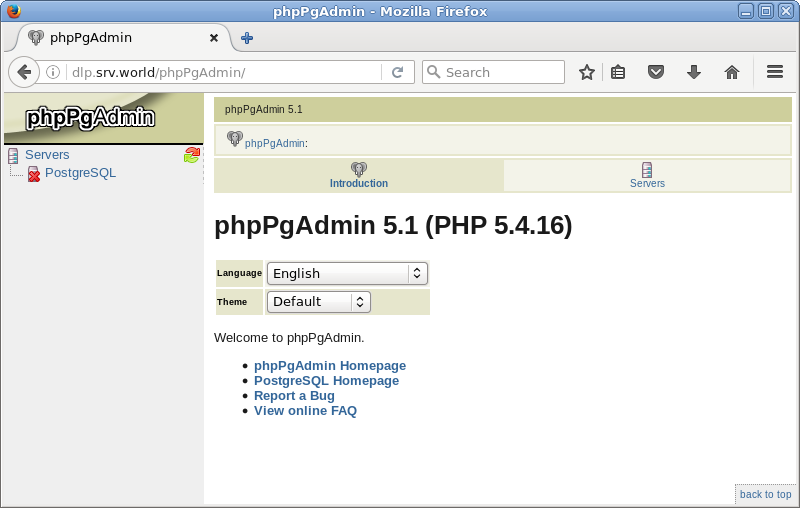
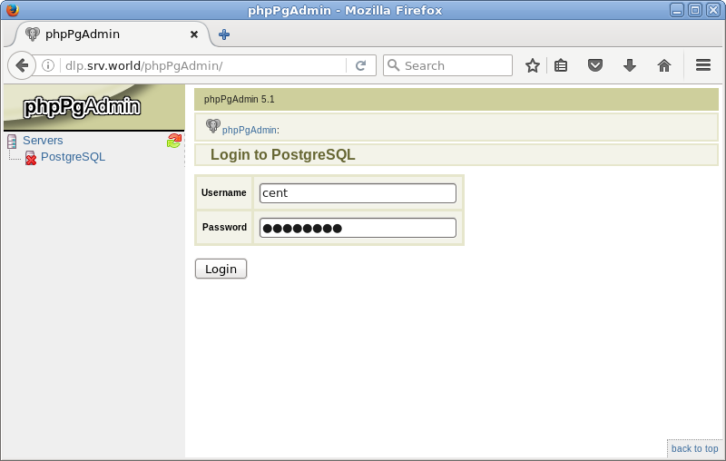

## 6.2. PostgreSQL

PostgreSQL[官方网站](https://www.postgresql.org/)及官网的[yum安装方法](https://www.postgresql.org/download/linux/redhat/)

### 6.2.1. PostgreSQL 9.2

#### 6.2.1.1. 安装PostgreSQL

`yum -y install postgresql-server`

`postgresql-setup initdb`

```
Initializing database ... OK
```

编辑`/var/lib/pgsql/data/postgresql.conf`文件：

```
# 如果允许从远程主机访问，取消注释并更改
listen_addresses = '*'

# 如果更改日志格式，取消注释并更改，下面的示例是[日期 用户 数据库 ***]格式
log_line_prefix = '%t %u %d '
```

```
systemctl start postgresql
systemctl enable postgresql
```

如果PostgreSQL用于远程主机，firewalld防火墙设置（PostgreSQL使用端口5432/TCP）：

```
firewall-cmd --add-service=postgresql --permanent
firewall-cmd --reload
```

设置PostgreSQL管理员用户的密码，添加一个用户并添加一个测试数据库：

`su - postgres`

```
-bash-4.2$ psql -c "alter user postgres with password 'password'"  # 设置密码
ALTER ROLE

-bash-4.2$ createuser cent # 添加数据库用户（“cent”为例）

-bash-4.2$ createdb testdb -O cent # 创建一个测试数据库（所有者是上面的用户“cent”）
```

以刚刚添加的用户身份登录系统并操作数据库作为测试操作：

`psql -l` # 显示数据库

```
                                  List of databases
   Name    |  Owner   | Encoding |   Collate   |    Ctype    |   Access privileges
-----------+----------+----------+-------------+-------------+-----------------------
 postgres  | postgres | UTF8     | en_US.UTF-8 | en_US.UTF-8 |
 template0 | postgres | UTF8     | en_US.UTF-8 | en_US.UTF-8 | =c/postgres    +
           |          |          |             |             | postgres=CTc/postgres
 template1 | postgres | UTF8     | en_US.UTF-8 | en_US.UTF-8 | =c/postgres    +
           |          |          |             |             | postgres=CTc/postgres
 testdb    | cent     | UTF8     | en_US.UTF-8 | en_US.UTF-8 |
(4 rows)
```

`psql testdb` # 连接到测试数据库

```
psql (9.2.13)
Type "help" for help.

# 设置密码
testdb=# alter user cent with password 'password';
ALTER ROLE

# 创建test表
testdb=# create table test ( no int,name text );
CREATE TABLE

# 插入测试数据
testdb=# insert into test (no,name) values (1,'cent');
INSERT 0 1

# 显示表
testdb=# select * from test;
 no | name
----+-------
  1 | cent
(1 row)

# 删除test表
testdb=# drop table test;
DROP TABLE

# 退出
testdb=# \q
```

`dropdb testdb` # 删除测试数据库

#### 6.2.1.2. 安装phpPgAdmin

[安装Apache httpd](../5. 服务器/5.1. Apache httpd.html)

[安装PHP](../5. 服务器/5.1. Apache httpd.html#513-使用php脚本)

`yum --enablerepo=epel -y install phpPgAdmin php-pgsql` # 从EPEL安装

编辑`/etc/phpPgAdmin/config.inc.php`文件：

```
# 添加
$conf['servers'][0]['host'] = 'localhost';

# 如果允许使用特权用户登录（如postgres，root）更改为false
$conf['extra_login_security'] = false;

# 更改
$conf['owned_only'] = true;
```

编辑`/var/lib/pgsql/data/pg_hba.conf`文件：

```
# 更改如下并添加访问权限
host    all         all         127.0.0.1/32          md5
host    all         all         10.0.0.0/24           md5
host    all         all         ::1/128               md5
```

编辑`/etc/httpd/conf.d/phpPgAdmin.conf`文件：

```
# 添加访问权限
Require local
Require ip 10.0.0.0/24
```

`systemctl restart postgresql httpd`

如果启用了SELinux：

`setsebool -P httpd_can_network_connect_db on`

访问`http://(主机名或IP地址)/phpPgAdmin/`，单击左侧菜单上的“PostgreSQL”：



验证PostgreSQL中的用户和密码：



登录成功，可以在这里操作PostgreSQL：


#### 6.2.1.3. PostgreSQL复制

此配置是主从设置。

配置主服务器：

`yum -y install postgresql-server`

`postgresql-setup initdb`

```
Initializing database ... OK
```

编辑`/var/lib/pgsql/data/postgresql.conf`文件：

```
# 取消注释并更改
listen_addresses = '*'

# 取消注释并更改
wal_level = hot_standby

# 取消注释并更改
# on ⇒ sync
# remote_write ⇒ memory sync
# local ⇒ slave is asynchronous
# off ⇒ asynchronous
synchronous_commit = local

# 取消注释并更改（启用archive_mode）
archive_mode = on

# 取消注释并更改（获取档案命令）
archive_command = 'cp %p /var/lib/pgsql/archive/%f'

# 取消注释并更改（从服务器 + 1）
max_wal_senders = 2

# 取消注释并更改
wal_keep_segments = 10

# 取消注释并更改（任意名称）
synchronous_standby_names = 'slave01'
```

编辑`/var/lib/pgsql/data/pg_hba.conf`文件：

```
# 添加到最后
# host replication [复制用户] [允许的IP地址] password
host    replication     replica          127.0.0.1/32            md5
host    replication     replica          10.0.0.30/32            md5
host    replication     replica          10.0.0.51/32            md5
```

```
systemctl start postgresql
systemctl enable postgresql
```

创建用于复制的用户：
`su - postgres`

```
-bash-4.2$ createuser --replication -P replica 
Enter password for new role:
Enter it again:
```

firewalld防火墙规则：

```
firewall-cmd --add-service=postgresql --permanent
firewall-cmd --reload
```

配置从服务器：

`yum -y install postgresql-server`

`su - postgres`

```
# 从主服务器获取备份
-bash-4.2$ pg_basebackup -h 10.0.0.30 -U replica -D /var/lib/pgsql/data -P --xlog
Password:  # 用户“replica”的密码

-bash-4.2$ vi /var/lib/pgsql/data/postgresql.conf

# 取消注释并更改
hot_standby = on

-bash-4.2$ cp /usr/share/pgsql/recovery.conf.sample /var/lib/pgsql/data/recovery.conf

-bash-4.2$ vi /var/lib/pgsql/data/recovery.conf

# 取消注释并更改（获取档案命令）
restore_command = 'scp 10.0.0.30:/var/lib/pgsql/archive/%f %p'

# 取消注释并更改
standby_mode = on

# 取消注释并更改（连接信息到主服务器）
primary_conninfo = 'host=10.0.0.30 port=5432 user=replica password=password application_name=slave01'

-bash-4.2$ exit
logout
```

```
systemctl start postgresql
systemctl enable postgresql
```

确保设置正常：

`su - postgres`

```
-bash-4.2$ psql -c "select application_name, state, sync_priority, sync_state from pg_stat_replication;"

 application_name |   state   | sync_priority | sync_state
------------------+-----------+---------------+------------
 slave01          | streaming |             1 | sync
(1 row)
```
