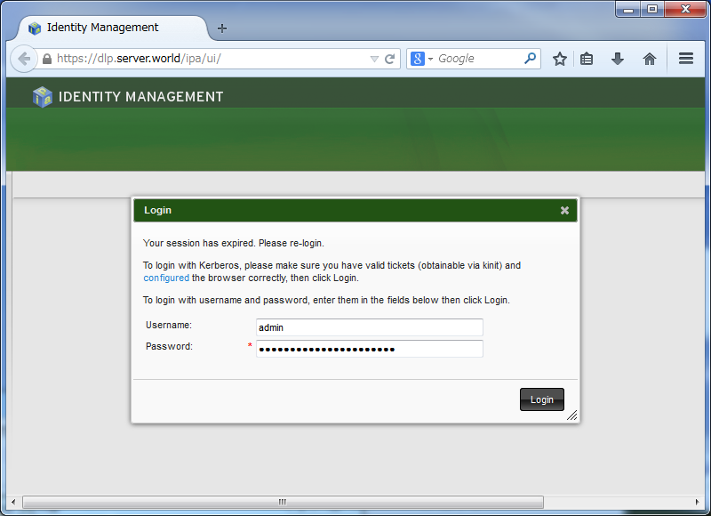
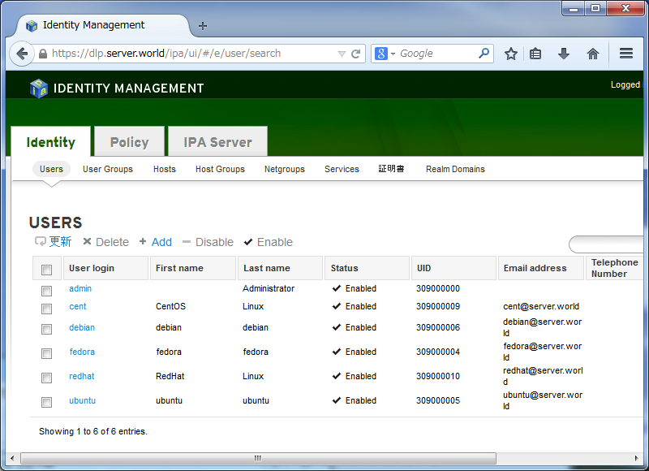

## 7.1. FreeIPA

### 7.1.1. 配置IPA服务器

配置IPA服务器以在本地网络中共享用户的帐户。

安装[FreeIPA](http://www.freeipa.org/page/Main_Page)：

`yum -y install ipa-server ipa-server-dns bind bind-dyndb-ldap`

设置FreeIPA服务器：

编辑`/etc/hosts`文件：

```
# 添加本机IP
10.0.0.30   dlp.srv.world dlp
```

`ipa-server-install --setup-dns`

```
The log file for this installation can be found in /var/log/ipaserver-install.log
==============================================================================
This program will set up the IPA Server.

This includes:
  * Configure a stand-alone CA (dogtag) for certificate management
  * Configure the Network Time Daemon (ntpd)
  * Create and configure an instance of Directory Server
  * Create and configure a Kerberos Key Distribution Center (KDC)
  * Configure Apache (httpd)

To accept the default shown in brackets, press the Enter key.

# 设置DNS（现有BIND设置被覆盖）
Existing BIND configuration detected, overwrite? [no]: yes
Enter the fully qualified domain name of the computer
on which you're setting up server software. Using the form
<hostname>.<domainname>
Example: master.example.com.

# 确认主机名并回车
Server host name [dlp.srv.world]:

The domain name has been determined based on the host name.

# 确认域名并回车
Please confirm the domain name [srv.world]:

The kerberos protocol requires a Realm name to be defined.
This is typically the domain name converted to uppercase.

# 确认领域名称并回车
Please provide a realm name [SRV.WORLD]:
Certain directory server operations require an administrative user.
This user is referred to as the Directory Manager and has full access
to the Directory for system management tasks and will be added to the
instance of directory server created for IPA.
The password must be at least 8 characters long.

# 目录管理器的密码
Directory Manager password:
Password (confirm):

The IPA server requires an administrative user, named 'admin'.
This user is a regular system account used for IPA server administration.

# IPA管理员密码
IPA admin password:
Password (confirm):

# 设置DNS转发器，回答yes或no
Do you want to configure DNS forwarders? [yes]:
Enter the IP address of DNS forwarder to use, or press Enter to finish.
# 如果设置DNS转发器，指定DNS转发器的IP
Enter IP address for a DNS forwarder: 10.0.0.10
DNS forwarder 10.0.0.10 added
# 如果DNS转发器正常，则不用输入
Enter IP address for a DNS forwarder:
# 设置反向区域，回答yes或no
Do you want to configure the reverse zone? [yes]:
# 反向区域名称（如果设置了反向区域）
Please specify the reverse zone name [0.0.10.in-addr.arpa.]:

The IPA Master Server will be configured with:
Hostname:      dlp.srv.world
IP address:    10.0.0.30
Domain name:   srv.world
Realm name:    SRV.WORLD

BIND DNS server will be configured to serve IPA domain with:
Forwarders:    10.0.0.10
Reverse zone:  0.0.10.in-addr.arpa.

# 确认设置并输入“yes”继续
Continue to configure the system with these values? [no]: yes

The following operations may take some minutes to complete.
Please wait until the prompt is returned.

Configuring NTP daemon (ntpd)
...
...
...
==============================================================================
Setup complete

Next steps:
        1. You must make sure these network ports are open:
                TCP Ports:
                  * 80, 443: HTTP/HTTPS
                  * 389, 636: LDAP/LDAPS
                  * 88, 464: kerberos
                UDP Ports:
                  * 88, 464: kerberos
                  * 123: ntp

        2. You can now obtain a kerberos ticket using the command: 'kinit admin'
           This ticket will allow you to use the IPA tools (e.g., ipa user-add)
           and the web user interface.

Be sure to back up the CA certificate stored in /root/cacert.p12
This file is required to create replicas. The password for this
file is the Directory Manager password
```

获取Kerberos票证并更改默认shell：

`kinit admin`

```
Password for admin@SRV.WORLD:  # IPA admin密码
```

`klist` # 确认

```
Ticket cache: KEYRING:persistent:0:0
Default principal: admin@SRV.WORLD

Valid starting       Expires              Service principal
03/21/2015 14:25:53  03/24/2015 14:25:50  krbtgt/SRV.WORLD@SRV.WORLD
```

`ipa config-mod --defaultshell=/bin/bash`

```
Maximum username length: 32
Home directory base: /home
Default shell: /bin/bash
Default users group: ipausers
Default e-mail domain: srv.world
Search time limit: 2
Search size limit: 100
User search fields: uid,givenname,sn,telephonenumber,ou,title
Group search fields: cn,description
Enable migration mode: FALSE
Certificate Subject base: O=SRV.WORLD
Password Expiration Notification (days): 4
Password plugin features: AllowNThash
SELinux user map order: guest_u:s0$xguest_u:s0$user_u:s0$staff_u:s0-s0:c0.c1023$unconfined_u:s0-s0:c0.c1023
Default SELinux user: unconfined_u:s0-s0:c0.c1023
Default PAC types: MS-PAC
```

firewalld防火墙规则：

```
firewall-cmd --add-service={ssh,dns,freeipa-ldap,freeipa-ldaps} --permanent
firewall-cmd --reload
```

### 7.1.2. 添加用户帐户

在FreeIPA服务器上添加用户帐户。

添加用户（在此设置的密码需要在初始登录时更改）：

`ipa user-add cent --first=CentOS --last=Linux --password`

```
Password:  # 设置密码
Enter Password again to verify:
-----------------
Added user "cent"
-----------------
  User login: cent
  First name: CentOS
  Last name: Linux
  Full name: CentOS Linux
  Display name: CentOS Linux
  Initials: CL
  Home directory: /home/cent
  GECOS field: CentOS Linux
  Login shell: /bin/bash
  Kerberos principal: cent@SRV.WORLD
  Email address: cent@srv.world
  UID: 1219600001
  GID: 1219600001
  Password: True
  Kerberos keys available: True
```

`ipa user-find cent` # 确认

```
--------------
1 user matched
--------------
  User login: cent
  First name: CentOS
  Last name: Linux
  Home directory: /home/cent
  Login shell: /bin/bash
  Email address: cent@srv.world
  UID: 1219600001
  GID: 1219600001
  Account disabled: False
  Password: True
  Kerberos keys available: True
----------------------------
Number of entries returned 1
----------------------------
```

将现有本地用户添加到IPA目录（本例的用户名设置相同的密码，但是在初始登录时需要更改）：

编辑`ipauser.sh`文件：

```
# 提取UID为1000-9999的本地用户，下面为示例
#!/bin/bash

for line in `grep "x:[1-9][0-9][0-9][0-9]:" /etc/passwd`
do
   USER=`echo $line | cut -d: -f1`
   FIRST=`echo $line | cut -d: -f5 | awk {'print $1'}`
   LAST=`echo $line | cut -d: -f5 | awk {'print $2'}`

   [ ! "$FIRST" ] && FIRST=$USER
   [ ! "$LAST" ] && LAST=$USER

   echo $USER | ipa user-add $USER --first=$FIRST --last=$LAST --password
done
```

`sh ipauser.sh`

```
-------------------
Added user "redhat"
-------------------
  User login: redhat
  First name: redhat
  Last name: redhat
  Full name: redhat redhat
  Display name: redhat redhat
  Initials: rr
  Home directory: /home/redhat
  GECOS field: redhat redhat
  Login shell: /bin/bash
  Kerberos principal: redhat@SRV.WORLD
  Email address: redhat@srv.world
  UID: 1219600003
  GID: 1219600003
  Password: True
  Kerberos keys available: True
-------------------
Added user "ubuntu"
-------------------
  User login: ubuntu
  First name: ubuntu
  Last name: ubuntu
  Full name: ubuntu ubuntu
  Display name: ubuntu ubuntu
  Initials: uu
  Home directory: /home/ubuntu
  GECOS field: ubuntu ubuntu
  Login shell: /bin/bash
  Kerberos principal: ubuntu@SRV.WORLD
  Email address: ubuntu@srv.world
  UID: 1219600004
  GID: 1219600004
  Password: True
  Kerberos keys available: True
```

### 7.1.3. 配置IPA客户端

配置FreeIPA客户端连接到FreeIPA服务器。

首先在FreeIPA服务器上为FreeIPA客户端添加DNS条目。

`ipa dnsrecord-add srv.world client01 --a-rec 10.0.0.51` # 格式为：ipa dnsrecord-add [domain name] [record name] [record type] [record]

```
Record name: client01
A record: 10.0.0.51
```

在FreeIPA客户端主机上安装客户端工具并更改DNS设置：

`yum -y install ipa-client`

`nmcli c modify eno16777736 ipv4.dns 10.0.0.30`

`nmcli c down eno16777736; nmcli c up eno16777736`

在设置为FreeIPA客户端之前与FreeIPA服务器同步时间。

`ipa-client-install`

```
Discovery was successful!
Hostname: client01.srv.world
Realm: SRV.WORLD
DNS Domain: srv.world
IPA Server: dlp.srv.world
BaseDN: dc=srv,dc=world

Continue to configure the system with these values? [no]: yes  # 确认设置并点击“yes”继续：

User authorized to enroll computers: admin  # 输入“admin”

Synchronizing time with KDC...
Unable to sync time with IPA NTP server, assuming the time is in sync. Please check that 123 UDP port is opened.
Password for admin@SRV.WORLD:
Successfully retrieved CA cert
    Subject:     CN=Certificate Authority,O=SRV.WORLD
    Issuer:      CN=Certificate Authority,O=SRV.WORLD
    Valid From:  Fri Mar 20 01:42:15 2015 UTC
    Valid Until: Tue Mar 20 01:42:15 2035 UTC

Enrolled in IPA realm SRV.WORLD
.....
.....
Configured /etc/ssh/ssh_config
Configured /etc/ssh/sshd_config
Client configuration complete.
```

如果需要，配置mkhomedir（用户的homedirs在初始登录时创建）

`authconfig --enablemkhomedir --update`

```
getsebool: SELinux is disabled
```

`exit`

```
logout

CentOS Linux 7 (Core)
Kernel 3.10.0-123.20.1.el7.x86_64 on an x86_64

client01 login: redhat  # IPA用户
Password:  # 密码
Password expired. Change your password now.  # 需要在初始登录时更改密码
Current Password:  # 当前密码
New password:  # 新密码
Retype new password:  # 确认新密码
Creating home directory for redhat.
[redhat@client01 ~]$  # 登录成功
```

### 7.1.4. 用户管理基本操作

添加一个FreeIPA用户帐户：

`ipa user-add cent --first=CentOS --last=Linux --password`

```
Password:
Enter Password again to verify:
-----------------
Added user "cent"
-----------------
  User login: cent
  First name: CentOS
  Last name: Linux
  Full name: CentOS Linux
  Display name: CentOS Linux
  Initials: CL
  Home directory: /home/cent
  GECOS field: CentOS Linux
  Login shell: /bin/bash
  Kerberos principal: cent@SRV.WORLD
  Email address: cent@srv.world
  UID: 1781800001
  GID: 1781800001
  Password: True
  Kerberos keys available: True
```

锁定或解锁FreeIPA用户：

`ipa user-disable cent`

```
----------------------------
Disabled user account "cent"
----------------------------
```

`ipa user-enable cent`

```
---------------------------
Enabled user account "cent"
---------------------------
```

搜索FreeIPA用户：

`ipa user-find cent`

```
--------------
1 user matched
--------------
  User login: cent
  First name: CentOS
  Last name: Linux
  Home directory: /home/cent
  Login shell: /bin/bash
  Email address: cent@srv.world
  UID: 1781800001
  GID: 1781800001
  Account disabled: False
  Password: True
  Kerberos keys available: True
----------------------------
Number of entries returned 1
----------------------------
```

`ipa user-show --raw cent`

```
  uid: cent
  givenname: CentOS
  sn: Linux
  homedirectory: /home/cent
  loginshell: /bin/bash
  mail: cent@srv.world
  uidnumber: 1781800001
  gidnumber: 1781800001
  nsaccountlock: False
  has_password: True
  has_keytab: True
```

删除FreeIPA用户：

`ipa user-del cent`

```
-------------------------
Added group "development"
-------------------------
  Group name: development
  Description: Development Group
  GID: 1781800006
```

在FreeIPA组中添加成员：

`ipa group-add-member --users=redhat,ubuntu development`

```
  Group name: development
  Description: Development Group
  GID: 1781800006
  Member users: redhat, ubuntu
-------------------------
Number of members added 2
-------------------------
```

在FreeIPA组中添加组：

`ipa group-add-member --groups=development hiroshima`

```
  Group name: hiroshima
  Description: State Group
  GID: 1781800007
  Member groups: development
-------------------------
Number of members added 1
-------------------------
```

搜索FreeIPA组：

`ipa group-find development`

```
---------------
1 group matched
---------------
  Group name: development
  Description: Development Group
  GID: 1781800006
  Member users: redhat, ubuntu
  Member of groups: hiroshima
----------------------------
Number of entries returned 1
----------------------------
```

删除一个FreeIPA组：

`ipa group-del hiroshima`

```
-------------------------
Deleted group "hiroshima"
-------------------------
```

### 7.1.5. Web管理控制台

可以在Web管理控制台上操作FreeIPA服务器。

在FreeIPA服务器的同一网络上的任何客户端上启动Web浏览器并访问`https://(FreeIPA服务器主机名或IP)`，使用FreeIPA用户登录到IPA服务器（本例使用管理员用户）：



正常登录。可以轻松地在图形界面上操作FreeIPA服务器：



### 7.1.6. FreeIPA复制

在副本主机上安装FreeIPA服务器的工具，并更改DNS设置：

`yum -y install ipa-server ipa-server-dns bind bind-dyndb-ldap`

将DNS更改为FreeIPA服务器：

`nmcli c modify eno16777736 ipv4.dns 10.0.0.30`

`nmcli c down eno16777736; nmcli c up eno16777736`

在FreeIPA服务器上为副本主机添加DNS条目：

`ipa dnsrecord-add srv.world repl01 --a-rec 10.0.0.61`

```
  Record name: repl01
  A record: 10.0.0.61
```

`ipa-replica-prepare repl01.srv.world --ip-address 10.0.0.61`

```
Directory Manager (existing master) password:  # 目录管理器密码

Preparing replica for repl01.srv.world from dlp.srv.world
Creating SSL certificate for the Directory Server
Creating SSL certificate for the dogtag Directory Server
Creating SSL certificate for the Web Server
Exporting RA certificate
Copying additional files
Finalizing configuration
Packaging replica information into /var/lib/ipa/replica-info-repl01.srv.world.gpg
Adding DNS records for repl01.srv.world
Using reverse zone 0.0.10.in-addr.arpa.
```

`scp /var/lib/ipa/replica-info-repl01.srv.world.gpg root@repl01.srv.world:/var/lib/ipa/` # 将生成的密钥传输到副本主机

```
root@repl01.srv.world's password:
replica-info-repl01.srv.world.gpg 100% 35KB 34.6KB/s 00:00
```

在FreeIPA服务器上，添加firewalld防火墙规则，允许FreeIPA复制服务：

```
firewall-cmd --add-service=freeipa-replication --permanent
firewall-cmd --reload
```

在FreeIPA复制主机上，添加firewalld防火墙规则，允许FreeIPA服务：

```
firewall-cmd --add-service={ssh,dns,freeipa-ldap,freeipa-ldaps,freeipa-replication} --permanent
firewall-cmd --reload
```

下例为DNS设置`--no-forwarders`，但如果设置它，需指定类似于`--forwarder=x.x.x.x`：

```
Directory Manager (existing master) password:  # 目录管理器密码

Run connection check to master
Check connection from replica to remote master 'dlp.srv.world':
   Directory Service: Unsecure port (389): OK
   Directory Service: Secure port (636): OK
   Kerberos KDC: TCP (88): OK
   Kerberos Kpasswd: TCP (464): OK
   HTTP Server: Unsecure port (80): OK
   HTTP Server: Secure port (443): OK
   PKI-CA: Directory Service port (7389): OK

The following list of ports use UDP protocol and would need to be
checked manually:
   Kerberos KDC: UDP (88): SKIPPED
   Kerberos Kpasswd: UDP (464): SKIPPED

Connection from replica to master is OK.
Start listening on required ports for remote master check
Get credentials to log in to remote master
admin@SRV.WORLD password:     # admin密码

Execute check on remote master
.....
.....
Global DNS configuration in LDAP server is empty
You can use 'dnsconfig-mod' command to set global DNS options that
would override settings in local named.conf files

Restarting the web server
```

在副本主机上获取Kerberos票证，并确保可以获取FreeIPA目录上的数据。如果可能，可以设置复制设置：

对于FreeIPA客户端，没有必要设置其他设置，即使一个服务器关闭，客户端仍可继续进行身份验证。

`kinit admin`

```
Password for admin@SRV.WORLD:  # admin密码
```

`klist`

```
Ticket cache: KEYRING:persistent:0:0
Default principal: admin@SRV.WORLD

Valid starting       Expires              Service principal
03/21/2015 15:13:38  03/24/2015 15:13:35  krbtgt/SRV.WORLD@SRV.WORLD
```

`ipa user-find`

```
---------------
4 users matched
---------------
  User login: admin
  Last name: Administrator
  Home directory: /home/admin
  Login shell: /bin/bash
  UID: 1219600000
  GID: 1219600000
  Account disabled: False
  Password: True
  Kerberos keys available: True

  User login: cent
  First name: CentOS
  Last name: Linux
  Home directory: /home/cent
  Login shell: /bin/bash
  Email address: cent@srv.world
  UID: 1219600001
  GID: 1219600001
  Account disabled: False
  Password: True
  Kerberos keys available: True
.....
.....
```
