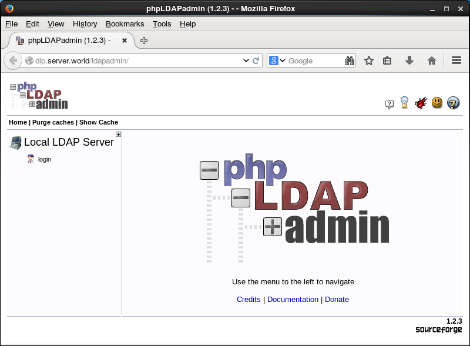
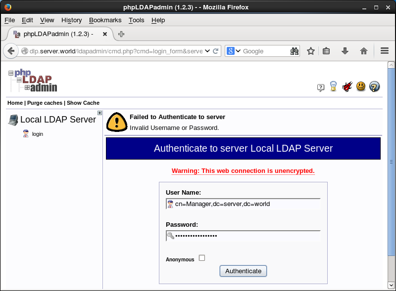

## 7.2. OpenLDAP

### 7.2.1. 配置LDAP服务器

配置LDAP服务器为本地网络共享用户帐户。

安装[OpenLDAP](http://www.openldap.org/)服务器：

`yum -y install openldap-servers openldap-clients` 

`cp /usr/share/openldap-servers/DB_CONFIG.example /var/lib/ldap/DB_CONFIG`

`chown ldap. /var/lib/ldap/DB_CONFIG`

```
systemctl start slapd
systemctl enable slapd
```

设置OpenLDAP管理员密码：

`slappasswd` # 生成加密密码

```
New password:
Re-enter new password:
{SSHA}xxxxxxxxxxxxxxxxxxxxxxxx
```

编辑`chrootpw.ldif`文件：

```
# 指定上面为“olcRootPW”部分生成的密码
dn: olcDatabase={0}config,cn=config
changetype: modify
add: olcRootPW
olcRootPW: {SSHA}xxxxxxxxxxxxxxxxxxxxxxxx
```

`ldapadd -Y EXTERNAL -H ldapi:/// -f chrootpw.ldif`

```
SASL/EXTERNAL authentication started
SASL username: gidNumber=0+uidNumber=0,cn=peercred,cn=external,cn=auth
SASL SSF: 0
modifying entry "olcDatabase={0}config,cn=config"
```

导入基本schema：

`ldapadd -Y EXTERNAL -H ldapi:/// -f /etc/openldap/schema/cosine.ldif`

```
SASL/EXTERNAL authentication started
SASL username: gidNumber=0+uidNumber=0,cn=peercred,cn=external,cn=auth
SASL SSF: 0
adding new entry "cn=cosine,cn=schema,cn=config"
```

`ldapadd -Y EXTERNAL -H ldapi:/// -f /etc/openldap/schema/nis.ldif`

```
SASL/EXTERNAL authentication started
SASL username: gidNumber=0+uidNumber=0,cn=peercred,cn=external,cn=auth
SASL SSF: 0
adding new entry "cn=nis,cn=schema,cn=config"
```

`ldapadd -Y EXTERNAL -H ldapi:/// -f /etc/openldap/schema/inetorgperson.ldif`

```
SASL/EXTERNAL authentication started
SASL username: gidNumber=0+uidNumber=0,cn=peercred,cn=external,cn=auth
SASL SSF: 0
adding new entry "cn=inetorgperson,cn=schema,cn=config"
```

在LDAP DB上设置域名：

`slappasswd` # 生成目录管理器密码

```
New password:
Re-enter new password:
{SSHA}xxxxxxxxxxxxxxxxxxxxxxxx
```

编辑`chdomain.ldif`文件：

```
# 将“dc=***,dc=***”部分替换为自己的域名
# 指定上面为“olcRootPW”部分生成的密码
dn: olcDatabase={1}monitor,cn=config
changetype: modify
replace: olcAccess
olcAccess: {0}to * by dn.base="gidNumber=0+uidNumber=0,cn=peercred,cn=external,cn=auth"
  read by dn.base="cn=Manager,dc=srv,dc=world" read by * none

dn: olcDatabase={2}hdb,cn=config
changetype: modify
replace: olcSuffix
olcSuffix: dc=srv,dc=world

dn: olcDatabase={2}hdb,cn=config
changetype: modify
replace: olcRootDN
olcRootDN: cn=Manager,dc=srv,dc=world

dn: olcDatabase={2}hdb,cn=config
changetype: modify
add: olcRootPW
olcRootPW: {SSHA}xxxxxxxxxxxxxxxxxxxxxxxx

dn: olcDatabase={2}hdb,cn=config
changetype: modify
add: olcAccess
olcAccess: {0}to attrs=userPassword,shadowLastChange by
  dn="cn=Manager,dc=srv,dc=world" write by anonymous auth by self write by * none
olcAccess: {1}to dn.base="" by * read
olcAccess: {2}to * by dn="cn=Manager,dc=srv,dc=world" write by * read
```

`ldapmodify -Y EXTERNAL -H ldapi:/// -f chdomain.ldif`

```
SASL/EXTERNAL authentication started
SASL username: gidNumber=0+uidNumber=0,cn=peercred,cn=external,cn=auth
SASL SSF: 0
modifying entry "olcDatabase={1}monitor,cn=config"

modifying entry "olcDatabase={2}hdb,cn=config"

modifying entry "olcDatabase={2}hdb,cn=config"

modifying entry "olcDatabase={2}hdb,cn=config"
```

编辑`basedomain.ldif`文件：

```
# 将“dc=***,dc=***”部分替换为自己的域名
dn: dc=srv,dc=world
objectClass: top
objectClass: dcObject
objectclass: organization
o: Server World
dc: Srv

dn: cn=Manager,dc=srv,dc=world
objectClass: organizationalRole
cn: Manager
description: Directory Manager

dn: ou=People,dc=srv,dc=world
objectClass: organizationalUnit
ou: People

dn: ou=Group,dc=srv,dc=world
objectClass: organizationalUnit
ou: Group
```

`ldapadd -x -D cn=Manager,dc=srv,dc=world -W -f basedomain.ldif`

```
Enter LDAP Password:  # 目录管理器密码
adding new entry "dc=srv,dc=world"

adding new entry "cn=Manager,dc=srv,dc=world"

adding new entry "ou=People,dc=srv,dc=world"

adding new entry "ou=Group,dc=srv,dc=world"
```

firewalld防火墙规则：

```
firewall-cmd --add-service=ldap --permanent
firewall-cmd --reload
```

### 7.2.2. 添加用户帐户

添加用户：

`slappasswd` # 生成加密密码

```
New password:
Re-enter new password:
{SSHA}xxxxxxxxxxxxxxxxx
```

编辑`ldapuser.ldif`文件：

```
# 将“dc=***,dc=***”部分替换为自己的域名
dn: uid=cent,ou=People,dc=srv,dc=world
objectClass: inetOrgPerson
objectClass: posixAccount
objectClass: shadowAccount
cn: Cent
sn: Linux
userPassword: {SSHA}xxxxxxxxxxxxxxxxx
loginShell: /bin/bash
uidNumber: 1000
gidNumber: 1000
homeDirectory: /home/cent

dn: cn=cent,ou=Group,dc=srv,dc=world
objectClass: posixGroup
cn: Cent
gidNumber: 1000
memberUid: cent
```

`ldapadd -x -D cn=Manager,dc=srv,dc=world -W -f ldapuser.ldif`

```
Enter LDAP Password:
adding new entry "uid=cent,ou=People,dc=srv,dc=world"

adding new entry "cn=cent,ou=Group,dc=srv,dc=world"
```

将本地passwd/group中的用户和组添加到LDAP目录：

编辑`ldapuser.sh`文件：

```
# 提取UID为1000-9999的本地用户和组
# 这里是一个示例，将“SUFFIX=***”替换为自己的域名
#!/bin/bash

SUFFIX='dc=srv,dc=world'
LDIF='ldapuser.ldif'

echo -n > $LDIF
GROUP_IDS=()
grep "x:[1-9][0-9][0-9][0-9]:" /etc/passwd | (while read TARGET_USER
do
    USER_ID="$(echo "$TARGET_USER" | cut -d':' -f1)"

    USER_NAME="$(echo "$TARGET_USER" | cut -d':' -f5 | cut -d' ' -f1,2)"
    [ ! "$USER_NAME" ] && USER_NAME="$USER_ID"

    LDAP_SN="$(echo "$USER_NAME" | cut -d' ' -f2)"
    [ ! "$LDAP_SN" ] && LDAP_SN="$USER_NAME"

    LASTCHANGE_FLAG="$(grep "${USER_ID}:" /etc/shadow | cut -d':' -f3)"
    [ ! "$LASTCHANGE_FLAG" ] && LASTCHANGE_FLAG="0"

    SHADOW_FLAG="$(grep "${USER_ID}:" /etc/shadow | cut -d':' -f9)"
    [ ! "$SHADOW_FLAG" ] && SHADOW_FLAG="0"

    GROUP_ID="$(echo "$TARGET_USER" | cut -d':' -f4)"
    [ ! "$(echo "${GROUP_IDS[@]}" | grep "$GROUP_ID")" ] && GROUP_IDS=("${GROUP_IDS[@]}" "$GROUP_ID")

    echo "dn: uid=$USER_ID,ou=People,$SUFFIX" >> $LDIF
    echo "objectClass: inetOrgPerson" >> $LDIF
    echo "objectClass: posixAccount" >> $LDIF
    echo "objectClass: shadowAccount" >> $LDIF
    echo "sn: $LDAP_SN" >> $LDIF
    echo "givenName: $(echo "$USER_NAME" | awk '{print $1}')" >> $LDIF
    echo "cn: $USER_NAME" >> $LDIF
    echo "displayName: $USER_NAME" >> $LDIF
    echo "uidNumber: $(echo "$TARGET_USER" | cut -d':' -f3)" >> $LDIF
    echo "gidNumber: $(echo "$TARGET_USER" | cut -d':' -f4)" >> $LDIF
    echo "userPassword: {crypt}$(grep "${USER_ID}:" /etc/shadow | cut -d':' -f2)" >> $LDIF
    echo "gecos: $USER_NAME" >> $LDIF
    echo "loginShell: $(echo "$TARGET_USER" | cut -d':' -f7)" >> $LDIF
    echo "homeDirectory: $(echo "$TARGET_USER" | cut -d':' -f6)" >> $LDIF
    echo "shadowExpire: $(passwd -S "$USER_ID" | awk '{print $7}')" >> $LDIF
    echo "shadowFlag: $SHADOW_FLAG" >> $LDIF
    echo "shadowWarning: $(passwd -S "$USER_ID" | awk '{print $6}')" >> $LDIF
    echo "shadowMin: $(passwd -S "$USER_ID" | awk '{print $4}')" >> $LDIF
    echo "shadowMax: $(passwd -S "$USER_ID" | awk '{print $5}')" >> $LDIF
    echo "shadowLastChange: $LASTCHANGE_FLAG" >> $LDIF
    echo >> $LDIF
done

for TARGET_GROUP_ID in "${GROUP_IDS[@]}"
do
    LDAP_CN="$(grep ":${TARGET_GROUP_ID}:" /etc/group | cut -d':' -f1)"

    echo "dn: cn=$LDAP_CN,ou=Group,$SUFFIX" >> $LDIF
    echo "objectClass: posixGroup" >> $LDIF
    echo "cn: $LDAP_CN" >> $LDIF
    echo "gidNumber: $TARGET_GROUP_ID" >> $LDIF

    for MEMBER_UID in $(grep ":${TARGET_GROUP_ID}:" /etc/passwd | cut -d':' -f1,3)
    do
        UID_NUM=$(echo "$MEMBER_UID" | cut -d':' -f2)
        [ $UID_NUM -ge 1000 -a $UID_NUM -le 9999 ] && echo "memberUid: $(echo "$MEMBER_UID" | cut -d':' -f1)" >> $LDIF
    done
    echo >> $LDIF
done
)
```

`sh ldapuser.sh`

`ldapadd -x -D cn=Manager,dc=srv,dc=world -W -f ldapuser.ldif`

```
Enter LDAP Password:
adding new entry "uid=cent,ou=People,dc=srv,dc=world"
adding new entry "uid=redhat,ou=People,dc=srv,dc=world"
adding new entry "uid=ubuntu,ou=People,dc=srv,dc=world"
adding new entry "uid=debian,ou=People,dc=srv,dc=world"
adding new entry "cn=cent,ou=Group,dc=srv,dc=world"
adding new entry "cn=redhat,ou=Group,dc=srv,dc=world"
adding new entry "cn=ubuntu,ou=Group,dc=srv,dc=world"
adding new entry "cn=debian,ou=Group,dc=srv,dc=world"
```

如果要删除LDAP用户或组，执行以下操作：

`ldapdelete -x -W -D 'cn=Manager,dc=srv,dc=world' "uid=cent,ou=People,dc=srv,dc=world"`

```
Enter LDAP Password:
```

`ldapdelete -x -W -D 'cn=Manager,dc=srv,dc=world' "cn=cent,ou=Group,dc=srv,dc=world"`

```
Enter LDAP Password:
```

### 7.2.3. 配置LDAP客户端

安装OpenLDAP客户端：

`yum -y install openldap-clients nss-pam-ldapd`

配置（`ldapserver=(LDAP服务器主机名或IP)`，`ldapbasedn="dc=(自己的域名)"`）：

```
authconfig --enableldap \
--enableldapauth \
--ldapserver=dlp.srv.world \
--ldapbasedn="dc=srv,dc=world" \
--enablemkhomedir \
--update
```

`exit`

```
logout

CentOS Linux 7 (Core)
Kernel 3.10.0-123.20.1.el7.x86_64 on an x86_64

www login: redhat  # LDAP用户
Password:  # 密码
Creating directory '/home/redhat'.

[redhat@www ~]$  # 正常登录

[redhat@www ~]$ passwd  # 尝试更改LDAP密码
Changing password for user redhat.
Enter login(LDAP) password:  # 当前密码
New password:  # 新密码
Retype new password:  # 确认新密码
LDAP password information changed for redhat
passwd: all authentication tokens updated successfully.
```
如果启用了SELinux，需要添加一个规则以允许通过mkhomedir自动创建主目录：

编辑`mkhomedir.te`文件：

```
module mkhomedir 1.0;

require {
        type unconfined_t;
        type oddjob_mkhomedir_exec_t;
        class file entrypoint;
}

#============= unconfined_t ==============
allow unconfined_t oddjob_mkhomedir_exec_t:file entrypoint;
```

`checkmodule -m -M -o mkhomedir.mod mkhomedir.te`

```
checkmodule: loading policy configuration from mkhomedir.te
checkmodule: policy configuration loaded
checkmodule: writing binary representation (version 17) to mkhomedir.mod
```

`semodule_package --outfile mkhomedir.pp --module mkhomedir.mod`

`semodule -i mkhomedir.pp`

### 7.2.4. 配置TLS

配置LDAP通过TLS以使连接安全。

首先[创建SSL证书](../5. Web服务器/5.3. 创建SSL证书.html)。

配置LDAP服务器：

```
cp /etc/pki/tls/certs/server.key \
/etc/pki/tls/certs/server.crt \
/etc/pki/tls/certs/ca-bundle.crt \
/etc/openldap/certs/
```

```
chown ldap. /etc/openldap/certs/server.key \
/etc/openldap/certs/server.crt \
/etc/openldap/certs/ca-bundle.crt
```

编辑`mod_ssl.ldif`文件：

```
dn: cn=config
changetype: modify
add: olcTLSCACertificateFile
olcTLSCACertificateFile: /etc/openldap/certs/ca-bundle.crt
-
replace: olcTLSCertificateFile
olcTLSCertificateFile: /etc/openldap/certs/server.crt
-
replace: olcTLSCertificateKeyFile
olcTLSCertificateKeyFile: /etc/openldap/certs/server.key
```

`ldapmodify -Y EXTERNAL -H ldapi:/// -f mod_ssl.ldif`

```
SASL/EXTERNAL authentication started
SASL username: gidNumber=0+uidNumber=0,cn=peercred,cn=external,cn=auth
SASL SSF: 0
modifying entry "cn=config"
```

编辑`/etc/sysconfig/slapd`文件：

```
# 在“SLAPD_URLS=”部分添加“ldaps:///”
SLAPD_URLS="ldapi:/// ldap:/// ldaps:///"
```

`systemctl restart slapd`

为TLS连接配置LDAP客户端：

`echo "TLS_REQCERT allow" >> /etc/openldap/ldap.conf`

`echo "tls_reqcert allow" >> /etc/nslcd.conf`

`authconfig --enableldaptls --update`

```
getsebool: SELinux is disabled
```

`exit`

```
logout

CentOS Linux 7 (Core)
Kernel 3.10.0-123.20.1.el7.x86_64 on an x86_64

www login: redhat
Password:
Last login: Tue Aug 19 19:55:52 on ttyS0
[redhat@www ~]$  # 登录正常
```

### 7.2.5. OpenLDAP复制

如果OpenLDAP主服务器关闭，配置OpenLDAP复制以继续目录服务。

OpenLDAP主服务器称为“**Provider**”，OpenLDAP从服务器在OpenLDAP上称为“**Consumer**”。

先按照[第一节内容](#721-配置ldap服务器)在Provider和Consumer上配置好基本的LDAP服务。

配置LDAP Provider，添加syncprov模块：

编辑`mod_syncprov.ldif`文件：

```
dn: cn=module,cn=config
objectClass: olcModuleList
cn: module
olcModulePath: /usr/lib64/openldap
olcModuleLoad: syncprov.la
```

`ldapadd -Y EXTERNAL -H ldapi:/// -f mod_syncprov.ldif`

```
SASL/EXTERNAL authentication started
SASL username: gidNumber=0+uidNumber=0,cn=peercred,cn=external,cn=auth
SASL SSF: 0
adding new entry "cn=module,cn=config"
```

编辑`syncprov.ldif`文件：

```
dn: olcOverlay=syncprov,olcDatabase={2}hdb,cn=config
objectClass: olcOverlayConfig
objectClass: olcSyncProvConfig
olcOverlay: syncprov
olcSpSessionLog: 100
```

ldapadd -Y EXTERNAL -H ldapi:/// -f syncprov.ldif

```
SASL/EXTERNAL authentication started
SASL username: gidNumber=0+uidNumber=0,cn=peercred,cn=external,cn=auth
SASL SSF: 0
adding new entry "olcOverlay=syncprov,olcDatabase={2}hdb,cn=config"
```

配置LDAP Consumer：

编辑`syncrepl.ldif`文件：

```
dn: olcDatabase={2}hdb,cn=config
changetype: modify
add: olcSyncRepl
olcSyncRepl: rid=001
  # LDAP服务器URI
  provider=ldap://10.0.0.30:389/
  bindmethod=simple
  # 自己的域名
  binddn="cn=Manager,dc=srv,dc=world"
  # 目录管理器密码
  credentials=password
  searchbase="dc=srv,dc=world"
  # 包括子树
  scope=sub
  schemachecking=on
  type=refreshAndPersist
  # [retry interval重试间隔] [retry times重试次数] [interval of re-retry重试间隔] [re-retry times重试次数]
  retry="30 5 300 3"
  # 复制间隔
  interval=00:00:05:00
```

`ldapadd -Y EXTERNAL -H ldapi:/// -f syncrepl.ldif`

```
SASL/EXTERNAL authentication started
SASL username: gidNumber=0+uidNumber=0,cn=peercred,cn=external,cn=auth
SASL SSF: 0
modifying entry "olcDatabase={2}hdb,cn=config"
```

确认设置以搜索数据：

`ldapsearch -x -b 'ou=People,dc=srv,dc=world'`

```
# People, srv.world
dn: ou=People,dc=srv,dc=world
objectClass: organizationalUnit
ou: People
...
...
```

配置LDAP客户端以绑定LDAP Consumer：

`authconfig --ldapserver=dlp.srv.world,slave.srv.world --update`

### 7.2.6. OpenLDAP多主复制

Provider/Consumer的配置,不能在Consumer服务器上添加数据，但如果配置多主设置，则可以在任何主服务器上添加。

先按照[第一节内容](#721-配置ldap服务器)在所有服务器上配置好基本的LDAP服务。

在所有服务器如下配置，添加syncprov模块：

编辑`mod_syncprov.ldif`文件：

```
dn: cn=module,cn=config
objectClass: olcModuleList
cn: module
olcModulePath: /usr/lib64/openldap
olcModuleLoad: syncprov.la
```

`ldapadd -Y EXTERNAL -H ldapi:/// -f mod_syncprov.ldif`

```
SASL/EXTERNAL authentication started
SASL username: gidNumber=0+uidNumber=0,cn=peercred,cn=external,cn=auth
SASL SSF: 0
adding new entry "cn=module,cn=config"
```

编辑`syncprov.ldif`文件：

```
dn: olcOverlay=syncprov,olcDatabase={2}hdb,cn=config
objectClass: olcOverlayConfig
objectClass: olcSyncProvConfig
olcOverlay: syncprov
olcSpSessionLog: 100
```

`ldapadd -Y EXTERNAL -H ldapi:/// -f syncprov.ldif`

```
SASL/EXTERNAL authentication started
SASL username: gidNumber=0+uidNumber=0,cn=peercred,cn=external,cn=auth
SASL SSF: 0
adding new entry "olcOverlay=syncprov,olcDatabase={2}hdb,cn=config"
```

在所有服务器如下配置，但只有参数`olcServerID`和`provider=***`，在每个服务器上设置不同的值：

编辑`master01.ldif`文件：

```
dn: cn=config
changetype: modify
replace: olcServerID
# 在每个服务器上指定唯一的ID号
olcServerID: 0

dn: olcDatabase={2}hdb,cn=config
changetype: modify
add: olcSyncRepl
olcSyncRepl: rid=001
  # 指定其他LDAP服务器的URI
  provider=ldap://10.0.0.50:389/
  bindmethod=simple
  
  # 自己的域名
  binddn="cn=Manager,dc=srv,dc=world"
  # 目录管理器密码
  credentials=password
  searchbase="dc=srv,dc=world"
  # 包括子树
  scope=sub
  schemachecking=on
  type=refreshAndPersist
  # [retry interval重试间隔] [retry times重试次数] [interval of re-retry重试间隔] [re-retry times重试次数]
  retry="30 5 300 3"
  # 复制间隔
  interval=00:00:05:00
-
add: olcMirrorMode
olcMirrorMode: TRUE

dn: olcOverlay=syncprov,olcDatabase={2}hdb,cn=config
changetype: add
objectClass: olcOverlayConfig
objectClass: olcSyncProvConfig
olcOverlay: syncprov
```

`ldapmodify -Y EXTERNAL -H ldapi:/// -f master01.ldif`

```
SASL/EXTERNAL authentication started
SASL username: gidNumber=0+uidNumber=0,cn=peercred,cn=external,cn=auth
SASL SSF: 0
modifying entry "cn=config"

modifying entry "olcDatabase={2}hdb,cn=config"

adding new entry "olcOverlay=syncprov,olcDatabase={2}hdb,cn=config"
```

配置LDAP客户端绑定所有LDAP服务器：

`authconfig --ldapserver=slapd01.srv.world,slapd02.srv.world --update`

### 7.2.7. 安装phpLDAPadmin

安装phpLDAPadmin以通过Web浏览器操作LDAP服务器。

先[安装Apache httpd](../5. Web服务器/5.1. Apache httpd.html)并[安装PHP](../5. Web服务器/5.1. Apache httpd.html#513-使用php脚本)。

安装phpLDAPadmin：

`yum --enablerepo=epel -y install phpldapadmin` # 从EPEL安装

编辑`/etc/phpldapadmin/config.php`文件：

```
# 将下面一行取消注释
$servers->setValue('login','attr','dn');
# 将下面一行注释
// $servers->setValue('login','attr','uid');
```

编辑`/etc/httpd/conf.d/phpldapadmin.conf`文件：

```
Alias /phpldapadmin /usr/share/phpldapadmin/htdocs
Alias /ldapadmin /usr/share/phpldapadmin/htdocs
<Directory /usr/share/phpldapadmin/htdocs>
  <IfModule mod_authz_core.c>
    # Apache 2.4
    # 添加访问权限
    Require local
    Require ip 10.0.0.0/24
```

`systemctl restart httpd`

从http服务器允许的网络中的客户端访问`http://(服务器主机名或IP)/ldapadmin/`，然后单击“login”：



使用目录管理器帐户进行身份验证。如下指定uname name（也可以用普通用户登录）：



登录成功，在这里可以管理LDAP服务器：


