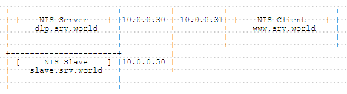

## 7.3. NIS

### 7.3.1. 配置NIS服务器

配置NIS服务器为本地网络共享用户帐户。

本例基于以下环境：


`yum -y install ypserv rpcbind` # 安装

设置NIS域名：

`ypdomainname srv.world`

`echo "NISDOMAIN=srv.world" >> /etc/sysconfig/network`

编辑`/var/yp/securenets`文件：

```
# 添加允许访问NIS服务器的IP地址
255.0.0.0       127.0.0.0
255.255.255.0   10.0.0.0
```

编辑`/etc/hosts`文件：

```
# 为NIS数据库添加服务器和客户端的IP地址
10.0.0.30   dlp.srv.world dlp
10.0.0.31   www.srv.world www
```

```
systemctl start rpcbind ypserv ypxfrd yppasswdd
systemctl enable rpcbind ypserv ypxfrd yppasswdd
```

更新NIS数据库：

`/usr/lib64/yp/ypinit -m`

```
At this point, we have to construct a list of the hosts which will run NIS servers. dlp is in the list of NIS server hosts. Please continue to add the names for the other hosts, one per line. When you are done with the
list, type a <control D>.
next host to add: dlp.srv.world
next host to add:  # 按Ctrl + D
The current list of NIS servers looks like this:
dlp.srv.world
Is this correct? [y/n: y] y  # 输入y并回车
We need a few minutes to build the databases...
Building /var/yp/srv.world/ypservers...
Running /var/yp/Makefile...
gmake[1]: Entering directory `/var/yp/srv.world'
Updating passwd.byname...
Updating passwd.byuid...
Updating shadow.byname...
Updating group.byname...
Updating group.bygid...
Updating hosts.byname...
Updating hosts.byaddr...
Updating rpc.byname...
Updating rpc.bynumber...
Updating services.byname...
Updating services.byservicename...
Updating netid.byname...
Updating protocols.bynumber...
Updating protocols.byname...
Updating mail.aliases...
gmake[1]: Leaving directory `/var/yp/srv.world'
dlp.srv.world has been set up as a NIS master server.
Now you can run ypinit -s dlp on all slave server.
```

如果在本地服务器中添加了用户，也将它们应用于NIS数据库：

`cd /var/yp`

`make`

firewalld防火墙规则，需要允许NIS服务或端口。某些服务在重新启动时侦听不同的端口，因此修复端口并让firewalld允许它们：

编辑`/etc/sysconfig/network`文件：

```
# 添加到结尾
YPSERV_ARGS="-p 944"
YPXFRD_ARGS="-p 945"
```

编辑`/etc/sysconfig/yppasswdd`文件：

```
# 添加如下
YPPASSWDD_ARGS="--port 946"
```

`systemctl restart rpcbind ypserv ypxfrd yppasswdd`

```
firewall-cmd --add-service=rpc-bind --permanent
firewall-cmd --add-port=944/tcp --permanent
firewall-cmd --add-port=944/udp --permanent
firewall-cmd --add-port=945/tcp --permanent
firewall-cmd --add-port=945/udp --permanent
firewall-cmd --add-port=946/udp --permanent
firewall-cmd --reload 
```

### 7.3.2. 配置NIS客户端

`yum -y install ypbind rpcbind` # 在客户端安装

设置NIS域：

`ypdomainname srv.world`

`echo "NISDOMAIN=srv.world" >> /etc/sysconfig/network`

编辑`/etc/hosts`文件：

```
# 添加NIS服务器和客户端的IP地址
10.0.0.30   dlp.srv.world dlp
10.0.0.31   www.srv.world www
```

```
authconfig \
--enablenis \
--nisdomain=srv.world \
--nisserver=dlp.srv.world \
--enablemkhomedir \
--update
```

```
systemctl start rpcbind ypbind
systemctl enable rpcbind ypbind
```

`exit`

```
www login: redhat  # NIS用户
Password:  # NIS密码
Creating directory '/home/redhat'.
[redhat@www ~]$  # 登录成功

# 验证
[redhat@www ~]$ ypwhich
dlp.srv.world

# 尝试更改NIS密码
[redhat@www ~]$ yppasswd
Changing NIS account information for redhat on dlp.srv.world.
Please enter old password:  # 当前密码
Changing NIS password for redhat on dlp.srv.world.
Please enter new password:  # 新密码
Please retype new password:  #确认新密码
The NIS password has been changed on dlp.srv.world.
```

如果启用了SELinux，需要添加一个规则以允许通过mkhomedir自动创建主目录：

编辑`mkhomedir.te`文件：

```
module mkhomedir 1.0;

require {
        type unconfined_t;
        type oddjob_mkhomedir_exec_t;
        class file entrypoint;
}

#============= unconfined_t ==============
allow unconfined_t oddjob_mkhomedir_exec_t:file entrypoint;
```

`checkmodule -m -M -o mkhomedir.mod mkhomedir.te`

```
checkmodule: loading policy configuration from mkhomedir.te
checkmodule: policy configuration loaded
checkmodule: writing binary representation (version 17) to mkhomedir.mod
```

`semodule_package --outfile mkhomedir.pp --module mkhomedir.mod`

`semodule -i mkhomedir.pp`

### 7.3.3. 配置NIS从服务器

配置NIS从服务器以在NIS主服务器关闭时继续NIS服务。



先参照上一节内容，将NIS从服务器配置为一个NIS客户端。

在NIS从服务器上安装配置Ypserv（防火墙规则按照第一节NIS服务器的firewalld规则配置）：

`yum -y install ypserv rpcbind`

设置NIS域：

`ypdomainname srv.world`

`echo "NISDOMAIN=srv.world" >> /etc/sysconfig/network`

编辑`/var/yp/securenets`文件：

```
# 指定允许访问的网络
255.0.0.0       127.0.0.0
255.255.255.0   10.0.0.0
```

编辑`/etc/hosts`文件：

```
# 添加NIS服务器和客户端的IP地址
10.0.0.30   dlp.srv.world dlp
10.0.0.50   slave.srv.world slave
```

```
systemctl start rpcbind ypserv ypxfrd yppasswdd
systemctl enable rpcbind ypserv ypxfrd yppasswdd
```

与NIS主服务器同步：

`/usr/lib64/yp/ypinit -s dlp.srv.world`

```
We will need a few minutes to copy the data from dlp.srv.world.
Transferring group.bygid...
Trying ypxfrd ... success
...
...
At this point, make sure that /etc/passwd and /etc/group have
been edited so that when the NIS is activated, the data bases you
have just created will be used, instead of the /etc ASCII files.
```

NIS主服务器也需要是NIS客户端。参照上一节内容将NIS主服务器配置为NIS客户端：

编辑`/var/yp/Makefile`文件：

```
# 更改
NOPUSH=false
```

更新NIS数据库：

`/usr/lib64/yp/ypinit -m`

```
At this point, we have to construct a list of the hosts which will run NIS
servers.  dlp.srv.world is in the list of NIS server hosts.  Please continue to add
the names for the other hosts, one per line.  When you are done with the
list, type a <control D>.
        next host to add:  dlp.srv.world
        # 指定NIS从服务器
        next host to add: slave.srv.world
        next host to add:  # 按Ctrl + D
The current list of NIS servers looks like this:

dlp.srv.world
slave.srv.world

Is this correct? [y/n: y] y  # 输入y并回车
We need a few minutes to build the databases...
Building /var/yp/srv.world/ypservers...
...
...
Now you can run ypinit -s dlp.srv.world on all slave server.
```

在NIS客户端上配置绑定NIS从服务器：

编辑`/etc/yp.conf`文件：

```
# 添加从服务器设置到最后
domain srv.world server dlp.srv.world
domain srv.world server slave.srv.world
```

`systemctl restart ypbind`
