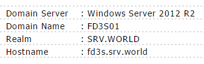

## 8.2. Samba

安装[Samba](https://www.samba.org/)以配置文件服务器。

### 8.2.1. 完全访问共享文件夹

本例演示创建一个完全访问的共享文件夹，任何人都可以读取和写入，并且不需要身份验证。

`yum -y install samba samba-client`

`mkdir /home/share`

`chmod 777 /home/share`

编辑`/etc/samba/smb.conf`文件：

```
# 添加如下内容
unix charset = UTF-8
dos charset = CP932

# 如下更改（Windows默认）
workgroup = WORKGROUP

# 取消注释并更改为允许的IP地址
hosts allow = 127. 10.0.0.

# 添加（无验证）
security = user
passdb backend = tdbsam
map to guest = Bad User

# 将以下内容添加到最后
[Share]  # 任意名称
    path = /home/share  # 共享目录
    writable = yes  # 可写
    guest ok = yes  # 允许guest
    guest only = yes  # 仅guest
    create mode = 0777  # 完全访问的文件
    directory mode = 0777  # 完全访问的目录
```

```
systemctl start smb nmb
systemctl enable smb nmb
```

firewalld防火墙规则：

```
setsebool -P samba_enable_home_dirs on
restorecon -R /home/share
```

### 8.2.2. 受限访问的共享文件夹

本例演示创建需要用户身份验证的共享文件夹。

`yum -y install samba samba-client`

`groupadd security`

`mkdir /home/security`

`chgrp security /home/security`

`chmod 770 /home/security`

编辑`/etc/samba/smb.conf`文件：

```
# 添加如下内容
unix charset = UTF-8

# 如下更改（Windows默认）
workgroup = WORKGROUP

# 取消注释并更改为允许的IP地址
hosts allow = 127. 10.0.0.

# 将以下内容添加到最后
[Security]  # 任意名称
    path = /home/security
    writable = yes
    create mode = 0770
    directory mode = 0770
    guest ok = no  # 不允许guest
    valid users = @security  # 仅允许security组
```

```
systemctl start smb nmb
systemctl enable smb nmb
```

在Samba中添加用户：

`smbpasswd -a cent`

```
New SMB password:  # 设置密码
Retype new SMB password:  # 确认密码
Added user cent.
```

`usermod -G security cent`

firewalld防火墙规则：

```
setsebool -P samba_enable_home_dirs on
restorecon -R /home/share
```

如果启用了SELinux：

`setsebool -P samba_enable_home_dirs on`

`restorecon -R /home/security`

### 8.2.3. Samba Winbind

使用Samba Winbind加入Windows Active Directory域。

本教程需要LAN中的Windows Active Directory域服务。

本例演示在以下环境中进行配置：



`yum -y install samba-winbind samba-winbind-clients pam_krb5`

配置Winbind：

将DNS更改为Active Directory主机：

`nmcli c modify ens3 ipv4.dns 10.0.0.100`

`nmcli c down ens3; nmcli c up ens3`

```
authconfig \
--enablekrb5 \
--krb5kdc=fd3s.srv.world \
--krb5adminserver=fd3s.srv.world \
--krb5realm=SRV.WORLD \
--enablewinbind \
--enablewinbindauth \
--smbsecurity=ads \
--smbrealm=SRV.WORLD \
--smbservers=fd3s.srv.world \
--smbworkgroup=FD3S01 \
--winbindtemplatehomedir=/home/%U \
--winbindtemplateshell=/bin/bash \
--enablemkhomedir \
--enablewinbindusedefaultdomain \
--update
```

如果提示下面的错误，没有关系：

```
Job for winbind.service failed. See 'systemctl status winbind.service' and 'journalctl -xn' for details.
```

加入Windows Active Directory域：

`net ads join -U Administrator` # 格式：net ads join -U [AD的管理员用户]

```
Enter Serverworld's password:
Using short domain name -- FD3S01
Joined 'SMB' to dns domain 'srv.world'
```

```
systemctl start winbind 
systemctl enable winbind
```

显示域信息：

`net ads info`

```
LDAP server: 10.0.0.100
LDAP server name: fd3s.srv.world
Realm: SRV.WORLD
Bind Path: dc=SRV,dc=WORLD
LDAP port: 389
Server time: Sat, 09 Jul 2016 01:03:54 JST
KDC server: 10.0.0.100
Server time offset: -4
```

显示AD用户信息：

`wbinfo -u`

```
administrator
guest
serverworld
krbtgt
```

尝试切换到AD用户：

`su - serverworld`

```
Creating directory '/home/serverworld'.
[serverworld@smb ~]$
```

### 8.2.4. Samba AD DC

配置Samba Active Directory域控制器（Domain Controller）。

有兴趣的话参考[这里](https://www.server-world.info/en/note?os=CentOS_7&p=samba&f=4)
