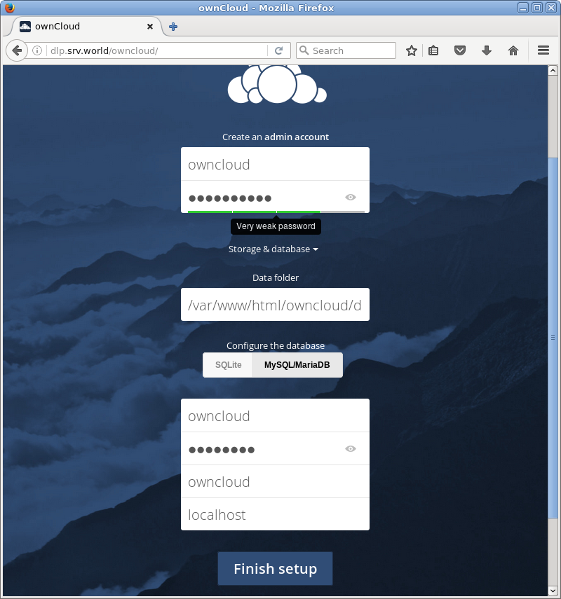
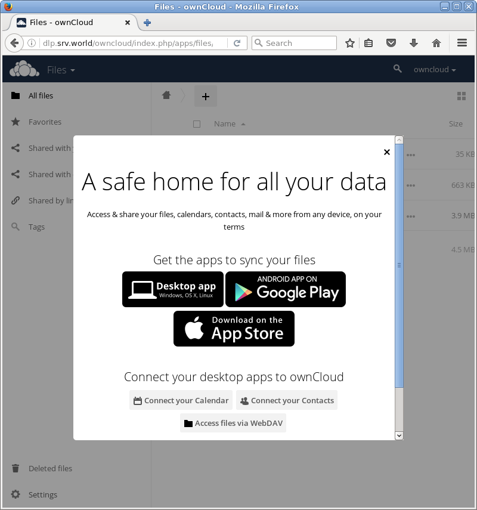
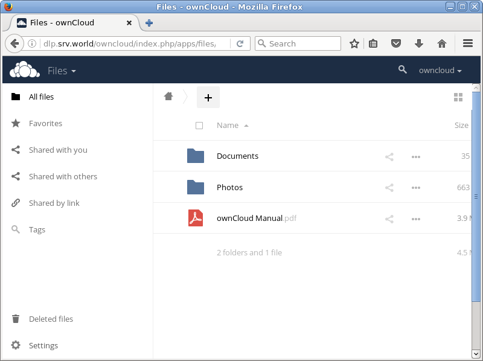

## 8.3. ownCloud

[ownCloud](https://owncloud.org/)是一个基于PHP的自建网盘，主要功能包括文件管理（内建文件分享）、音乐、日历、联系人等。有电脑和手机的客户端。与之类似的还有[Nextcloud](https://nextcloud.com/)。

安装[MariaDB数据库服务器](../6. 数据库/6.1. MariaDB.html)，[Apache httpd](../5. Web服务器/5.1. Apache httpd.html)并配置好[PHP](../5. Web服务器/5.1. Apache httpd.html#513-使用php脚本)和[使用SSL](../5. Web服务器/5.1. Apache httpd.html#518-配置ssl)。

`yum --enablerepo=epel -y install php-pear-MDB2-Driver-mysqli php-pear-Net-Curl` # 从EPEL安装一些需要的软件包

`wget http://download.owncloud.org/download/repositories/stable/CentOS_7/ce:stable.repo -P /etc/yum.repos.d`

`yum -y install owncloud`

`systemctl restart httpd`

在MariaDB中为ownCloud添加用户和数据库：

`mysql -u root -p`

```
Enter password:
Welcome to the MariaDB monitor.  Commands end with ; or \g.
Your MariaDB connection id is 10
Server version: 5.5.47-MariaDB MariaDB Server

Copyright (c) 2000, 2015, Oracle, MariaDB Corporation Ab and others.

Type 'help;' or '\h' for help. Type '\c' to clear the current input statement.

MariaDB [(none)]> create database owncloud; 
Query OK, 1 row affected (0.00 sec)
MariaDB [(none)]> grant all privileges on owncloud.* to owncloud@'localhost' identified by 'password'; 
Query OK, 0 rows affected (0.00 sec)
MariaDB [(none)]> flush privileges; 
Query OK, 0 rows affected (0.00 sec)
MariaDB [(none)]> exit 
Bye
```

如果启用了SELinux，如下更改规则：

```
semanage fcontext -a -t httpd_sys_rw_content_t /var/www/html/owncloud/apps
semanage fcontext -a -t httpd_sys_rw_content_t /var/www/html/owncloud/config
restorecon /var/www/html/owncloud/apps
restorecon /var/www/html/owncloud/apps
```

客户端计算机的Web浏览器访问`http://(服务器的主机名或IP地址)/owncloud/`。显示以下界面，为ownCloud添加管理员帐号，并在数据库部分中点击“MySQL/MariaDB”，输入MariaDB的用户名密码及数据库名称。所有完成后，点击“Finish Setup”继续：



如果数据库连接正确，显示如下欢迎界面：



下面是ownCloud主页。可以使用ownCloud作为云存储：


