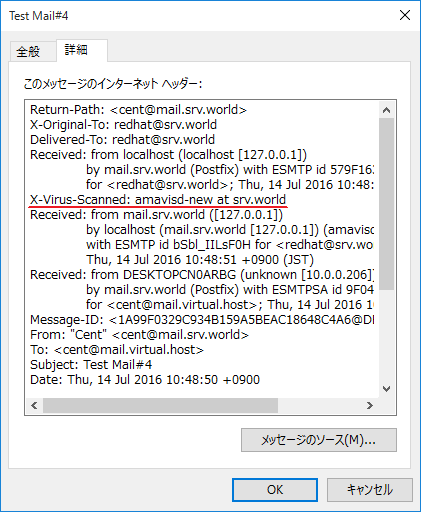

## 9.1. 安装Postfix

### 9.1.1. 安装Postfix

安装[Postfix](http://www.postfix.org/)以配置SMTP服务器。

CentOS系统最小安装也会安装Postfix，如果没有，则运行以下命令：

`yum -y install postfix`

本例演示配置[SMTP-Auth以使用Dovecot的SASL功能](../9. 邮件服务器/9.2. 安装Dovecot.html)

编辑`/etc/postfix/main.cf`文件:

```
# 取消注释并指定主机名
myhostname = mail.srv.world

# 取消注释并指定域名
mydomain = srv.world

# 取消注释
myorigin = $mydomain

# 更改
inet_interfaces = all

# 添加
mydestination = $myhostname, localhost.$mydomain, localhost, $mydomain

# 取消注释并指定您的本地网络
mynetworks = 127.0.0.0/8, 10.0.0.0/24

# 取消注释（使用Maildir）
home_mailbox = Maildir/

# 添加
smtpd_banner = $myhostname ESMTP

# 添加以下内容到最后
# 将电子邮件大小限制为10M
message_size_limit = 10485760
# 将邮箱限制为1G
mailbox_size_limit = 1073741824

# SMTP-Auth
smtpd_sasl_type = dovecot
smtpd_sasl_path = private/auth
smtpd_sasl_auth_enable = yes
smtpd_sasl_security_options = noanonymous
smtpd_sasl_local_domain = $myhostname
smtpd_recipient_restrictions = permit_mynetworks,permit_auth_destination,permit_sasl_authenticated,reject
```

```
systemctl restart postfix
systemctl enable postfix
```

firewalld防火墙规则，允许SMTP服务（25/TCP）：

```
firewall-cmd --add-service=smtp --permanent
firewall-cmd --reload
```

### 9.1.2. 虚拟域

配置Postfix以使用虚拟域发送另一个不同于原始域的域名的电子邮件。

例如：

当前域名为：`srv.world`

新域名为：`virtual.host`

用户“cent”有一个电子邮件地址：`cent@mail.srv.world`

用户“redhat”有一个电子邮件地址：`cent@mail.virtual.host`

“redhat”用户使用的邮件地址“@”前面的名称和“cent”用户一样：

设置虚拟域：

编辑`/etc/postfix/main.cf`文件:

```
# 添加到文件的最后
virtual_alias_domains = virtual.host
virtual_alias_maps = hash:/etc/postfix/virtual
```

编辑`/etc/postfix/virtual`文件:

```
# 添加到文件的开头
cent@mail.virtual.host redhat
```

`postmap /etc/postfix/virtual`

`systemctl reload postfix`

### 9.1.3. Postfix + Clamav + Amavisd

使用Postfix + Clamav配置病毒扫描。

[安装Clamav](../附1. 一些可能有用的/附1.1. Clam AntiVirus（防毒软件）.html)。

安装Amavisd和Clamav Server，并首先启动Clamav Server：

`yum --enablerepo=epel -y install amavisd-new clamav-server clamav-server-systemd` # 从EPEL安装

`cp /usr/share/doc/clamav-server*/clamd.sysconfig /etc/sysconfig/clamd.amavisd`

编辑`/etc/sysconfig/clamd.amavisd`文件:

```
# 取消注释并更改
CLAMD_CONFIGFILE=/etc/clamd.d/amavisd.conf
CLAMD_SOCKET=/var/run/clamd.amavisd/clamd.sock
```

编辑`/etc/tmpfiles.d/clamd.amavisd.conf`文件:

```
d /var/run/clamd.amavisd 0755 amavis amavis -
```

编辑`/usr/lib/systemd/system/clamd@.service`文件:

```
# 添加到最后
[Install]
WantedBy=multi-user.target
```

```
systemctl start clamd@amavisd
systemctl enable clamd@amavisd
```

配置Amavisd：

编辑`/etc/amavisd/amavisd.conf`文件:

```
# 更改为自己的域名
$mydomain = 'srv.world';

# 更改为自己的主机名
$myhostname = 'mail.srv.world';

# 取消注释
$notify_method = 'smtp:[127.0.0.1]:10025';
$forward_method = 'smtp:[127.0.0.1]:10025';
```

```
systemctl start amavisd spamassassin
systemctl enable amavisd spamassassin
```

配置Postfix：

编辑`/etc/postfix/main.cf`文件:

```
# 添加到最后
content_filter=smtp-amavis:[127.0.0.1]:10024
```

编辑`/etc/postfix/master.cf`文件:

```
# 添加到最后
smtp-amavis unix -    -    n    -    2 smtp
    -o smtp_data_done_timeout=1200
    -o smtp_send_xforward_command=yes
    -o disable_dns_lookups=yes
127.0.0.1:10025 inet n    -    n    -    - smtpd
    -o content_filter=
    -o local_recipient_maps=
    -o relay_recipient_maps=
    -o smtpd_restriction_classes=
    -o smtpd_client_restrictions=
    -o smtpd_helo_restrictions=
    -o smtpd_sender_restrictions=
    -o smtpd_recipient_restrictions=permit_mynetworks,reject
    -o mynetworks=127.0.0.0/8
    -o strict_rfc821_envelopes=yes
    -o smtpd_error_sleep_time=0
    -o smtpd_soft_error_limit=1001
    -o smtpd_hard_error_limit=1000
```

`systemctl restart postfix`

以下几行在此配置后添加到电子邮件的标头部分，并且已知病毒的电子邮件将不会发送到客户端。


