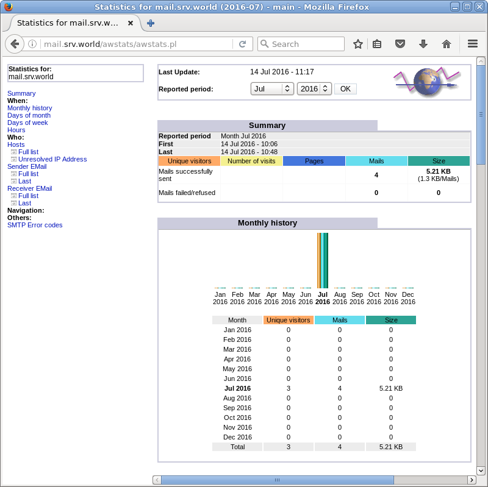

## 9.4. 邮件日志报告

### 9.4.1. pflogsumm

安装Postfix日志报告工具[pflogsumm](http://jimsun.linxnet.com/postfix_contrib.html)。

安装postfix-perl-scripts软件包：

`yum -y install postfix-perl-scripts`

生成昨天的日志摘要：

`perl /usr/sbin/pflogsumm -d yesterday /var/log/maillog`

```
Postfix log summaries for Jul 14

Grand Totals
------------
messages

      2   received
      5   delivered
      0   forwarded
      0   deferred
      0   bounced
      0   rejected (0%)
      0   reject warnings
      0   held
      0   discarded (0%)

   2879   bytes received
   6572   bytes delivered
      1   senders
      1   sending hosts/domains
      2   recipients
      2   recipient hosts/domains


Per-Hour Traffic Summary
------------------------
    time          received  delivered   deferred    bounced     rejected
    --------------------------------------------------------------------
    0000-0100           0          0          0          0          0
    0100-0200           0          0          0          0          0
    0200-0300           0          0          0          0          0
    0300-0400           0          0          0          0          0
    0400-0500           0          0          0          0          0
    0500-0600           0          0          0          0          0
    0600-0700           0          0          0          0          0
    0700-0800           0          0          0          0          0
    0800-0900           0          0          0          0          0
    0900-1000           0          0          0          0          0
    1000-1100           2          5          0          0          0
    1100-1200           0          0          0          0          0
    1200-1300           0          0          0          0          0
    1300-1400           0          0          0          0          0
    1400-1500           0          0          0          0          0
    1500-1600           0          0          0          0          0
    1600-1700           0          0          0          0          0
    1700-1800           0          0          0          0          0
    1800-1900           0          0          0          0          0
    1900-2000           0          0          0          0          0
    2000-2100           0          0          0          0          0
    2100-2200           0          0          0          0          0
    2200-2300           0          0          0          0          0
    2300-2400           0          0          0          0          0

Host/Domain Summary: Message Delivery
--------------------------------------
 sent cnt  bytes   defers   avg dly max dly host/domain
 -------- -------  -------  ------- ------- -----------
      3     4119        0     0.4 s    0.8 s  srv.world
      2     2453        0     0.1 s    0.1 s  mail.srv.world

Host/Domain Summary: Messages Received
---------------------------------------
 msg cnt   bytes   host/domain
 -------- -------  -----------
      2     2879   mail.srv.world

Senders by message count
------------------------
      2   cent@mail.srv.world

Recipients by message count
---------------------------
      3   redhat@srv.world
      2   cent@mail.srv.world

Senders by message size
-----------------------
   2879   cent@mail.srv.world

Recipients by message size
--------------------------
   4119   redhat@srv.world
   2453   cent@mail.srv.world

message deferral detail: none

message bounce detail (by relay): none

message reject detail: none

message reject warning detail: none

message hold detail: none

message discard detail: none

smtp delivery failures: none

Warnings
--------
  tlsmgr (total: 6)
         3   redirecting the request to postfix-owned data_directory /var/li...
         3   request to update table btree:/etc/postfix/smtpd_scache in non-...

Fatal Errors: none

Panics: none

Master daemon messages
----------------------
      4   daemon started -- version 2.10.1, configuration /etc/postfix
      3   terminating on signal 15
      1   reload -- version 2.10.1, configuration /etc/postfix
```

`crontab -e`

```
# 每天1:00AM发送邮件日志摘要到root
00 01 * * * perl /usr/sbin/pflogsumm -e -d yesterday /var/log/maillog | mail -s 'Logwatch for Postfix' root
```

### 9.4.2. AWstats

安装邮件日志报告工具[AWstats](http://www.awstats.org/)。

先[安装Apache httpd](../5. Web服务器/5.1. Apache httpd.html)

安装AWstats：

`yum --enablerepo=epel -y install awstats` # 从EPEL安装

编辑`/etc/awstats/awstats.mail.srv.world.conf`文件（自动生成的“awstas.(主机名).conf”文件）：

```
# 更改
LogFile="/usr/share/awstats/tools/maillogconvert.pl standard < /var/log/maillog |"

# 更改
LogType=M

# 注释并添加以下内容
#LogFormat=1
LogFormat="%time2 %email %email_r %host %host_r %method %url %code %bytesd"

# 如下更改
LevelForBrowsersDetection=0
LevelForOSDetection=0
LevelForRefererAnalyze=0
LevelForRobotsDetection=0
LevelForSearchEnginesDetection=0
LevelForKeywordsDetection=0
LevelForFileTypesDetection=0
LevelForWormsDetection=0

# 如下更改
ShowMonthStats=UHB
ShowDaysOfMonthStats=HB
ShowDaysOfWeekStats=HB
ShowHoursStats=HB
ShowDomainsStats=0
ShowHostsStats=HBL
ShowRobotsStats=0
ShowEMailSenders=HBML
ShowEMailReceivers=HBML
ShowSessionsStats=0
ShowPagesStats=0
ShowFileTypesStats=0
ShowOSStats=0
ShowBrowsersStats=0
ShowOriginStats=0
ShowKeyphrasesStats=0
ShowKeywordsStats=0
ShowMiscStats=0
ShowHTTPErrorsStats=0
ShowSMTPErrorsStats=1
```

编辑`/etc/httpd/conf.d/awstats.conf`文件：

```
# 添加允许访问的IP范围
Require ip 10.0.0.0/24
```

`systemctl restart httpd`

`/usr/share/awstats/wwwroot/cgi-bin/awstats.pl -update -config=mail.srv.world -configdir=/etc/awstats` # 手动更新报告（每小时Cron自动更新）

```
Create/Update database for config "/etc/awstats/awstats.mail.srv.world.conf" by AWStats version 7.4 (build 20150714)
From data in log file "/usr/share/awstats/tools/maillogconvert.pl standard < /var/log/maillog |"...
Phase 1 : First bypass old records, searching new record...
Searching new records from beginning of log file...
Phase 2 : Now process new records (Flush history on disk after 20000 hosts)...
Jumped lines in file: 0
Parsed lines in file: 5
 Found 1 dropped records,
 Found 0 comments,
 Found 0 blank records,
 Found 0 corrupted records,
 Found 0 old records,
 Found 4 new qualified records.
```

通过客户端上的Web浏览器访问`http://(主机名或IP)/awstats/awstats.pl`。显示以下页面，可以查看邮件日志摘要：


