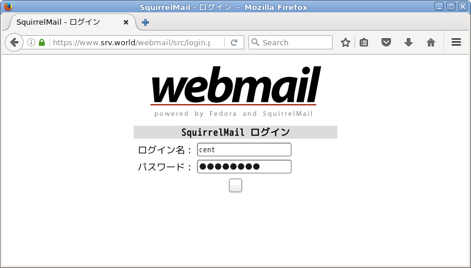
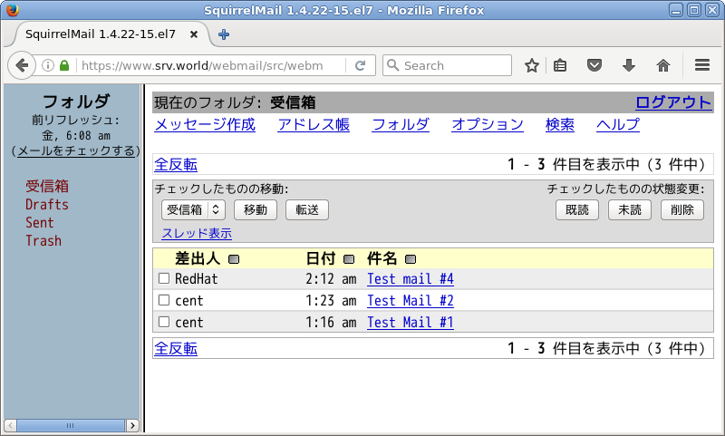
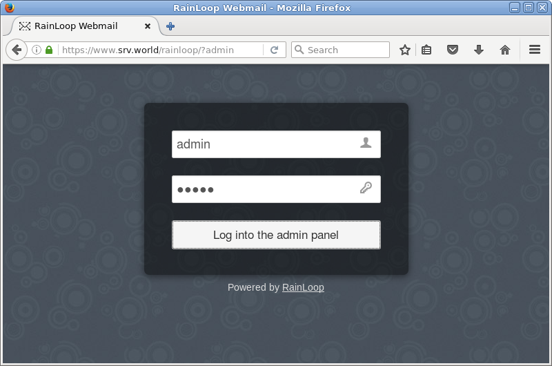
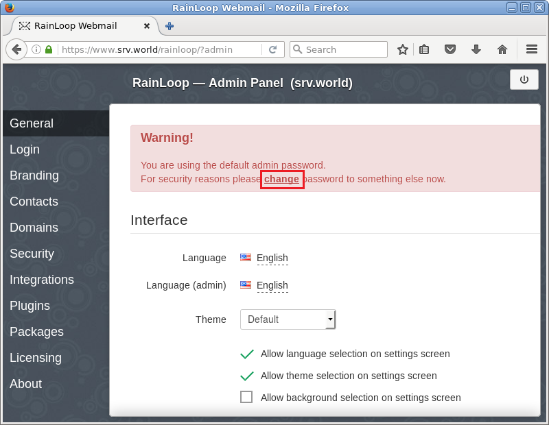
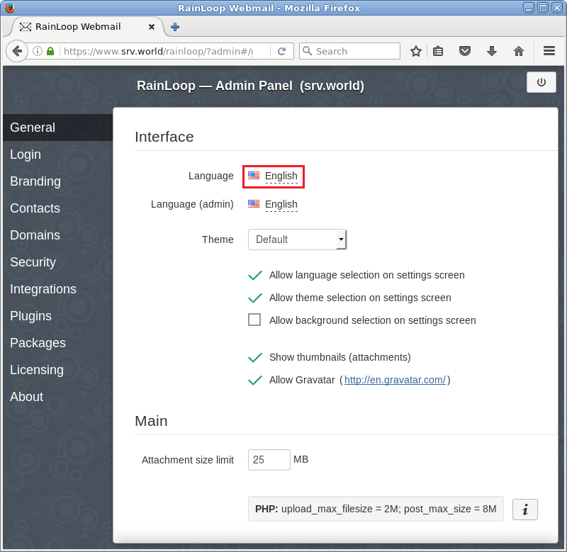
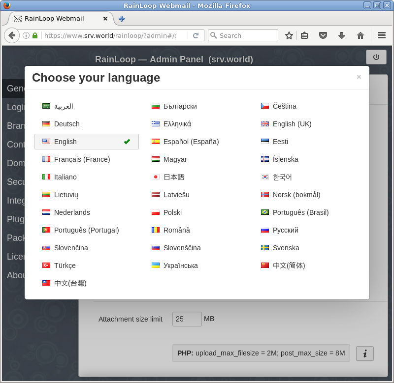
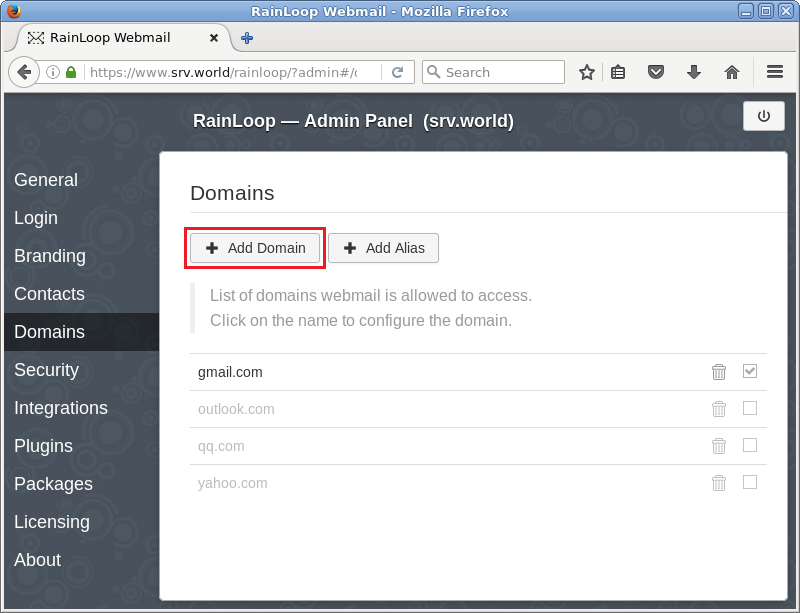
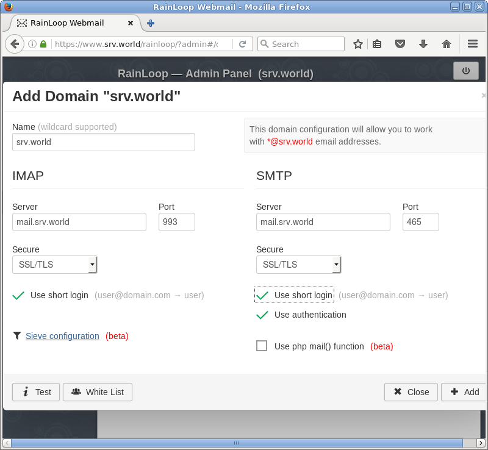
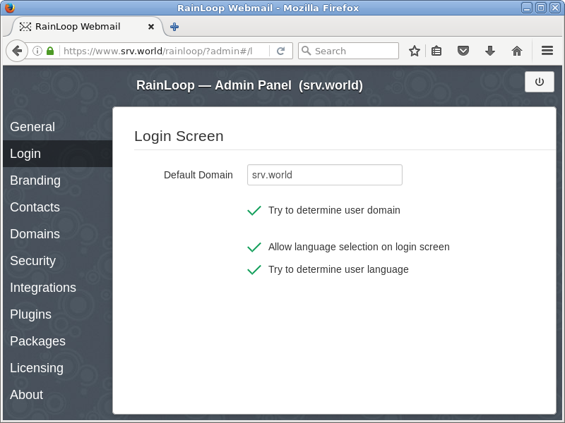
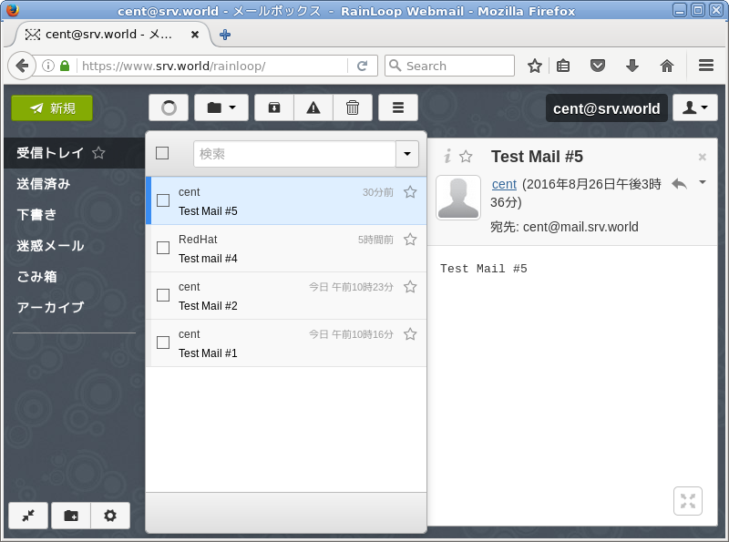

## 9.5. WebMail

安装好[SMTP服务器](../9. 邮件服务器/9.1. 安装Postfix.html)，[IMAP服务器](../9. 邮件服务器/9.2. 安装Dovecot.html)，[MariaDB数据库服务器](../6. 数据库/6.1. MariaDB.html)，[Apache httpd](../5. Web服务器/5.1. Apache httpd.html)并配置好[PHP](../5. Web服务器/5.1. Apache httpd.html#513-使用php脚本)和[使用SSL](../5. Web服务器/5.1. Apache httpd.html#518-配置ssl)。

所有示例基于以下环境：`www.srv.world`为WebMail安装的服务器，`mail.srv.world`为SMTP/IMAP服务器。

## 9.5.1. SquirrelMail

[SquirrelMail](https://www.squirrelmail.org/)是一个用PHP开发的Web邮件系统。它具备一个客户端邮件程序所应拥有的一切功能，包括支持增强型的MIME、地址薄、文件夹操作等等功能。

`yum --enablerepo=epel -y install squirrelmail` 从EPEL安装

`curl -O http://www.squirrelmail.org/plugins/compatibility-2.0.16-1.0.tar.gz`

`curl -O http://www.squirrelmail.org/plugins/empty_trash-2.0-1.2.2.tar.gz`

`curl -O http://www.squirrelmail.org/plugins/secure_login-1.4-1.2.8.tar.gz`

`tar zxvf compatibility-2.0.16-1.0.tar.gz -C /usr/share/squirrelmail/plugins`

`tar zxvf empty_trash-2.0-1.2.2.tar.gz -C /usr/share/squirrelmail/plugins`

`tar zxvf secure_login-1.4-1.2.8.tar.gz -C /usr/share/squirrelmail/plugins`

`rm -f ./*.tar.gz`

`/usr/share/squirrelmail/config/conf.pl` # 运行配置脚本

```
SquirrelMail Configuration : Read: config.php (1.4.0)
---------------------------------------------------------
Main Menu --
1.  Organization Preferences
2.  Server Settings
3.  Folder Defaults
4.  General Options
5.  Themes
6.  Address Books
7.  Message of the Day (MOTD)
8.  Plugins
9.  Database
10. Languages

D.  Set pre-defined settings for specific IMAP servers

C   Turn color off
S   Save data
Q   Quit

Command >> 1  # 选择
SquirrelMail Configuration : Read: config.php (1.4.0)
---------------------------------------------------------
Organization Preferences
1.  Organization Name      : SquirrelMail
2.  Organization Logo      : ../images/sm_logo.png
3.  Org. Logo Width/Height : (308/111)
4.  Organization Title     : SquirrelMail $version
5.  Signout Page           :
6.  Top Frame              : _top
7.  Provider link          : http://squirrelmail.org/
8.  Provider name          : SquirrelMail

R   Return to Main Menu
C   Turn color off
S   Save data
Q   Quit

Command >> 5  # 选择

When users click the Sign Out button they will be logged out and
then sent to signout_page.  If signout_page is left empty,
(hit space and then return) they will be taken, as normal,
to the default and rather sparse SquirrelMail signout page.

[]: /webmail  # 更改注销页面
SquirrelMail Configuration : Read: config.php (1.4.0)
---------------------------------------------------------
Organization Preferences
1.  Organization Name      : SquirrelMail
2.  Organization Logo      : ../images/sm_logo.png
3.  Org. Logo Width/Height : (308/111)
4.  Organization Title     : SquirrelMail $version
5.  Signout Page           : /webmail
6.  Top Frame              : _top
7.  Provider link          : http://squirrelmail.org/
8.  Provider name          : SquirrelMail

R   Return to Main Menu
C   Turn color off
S   Save data
Q   Quit

Command >> r  # 返回菜单
SquirrelMail Configuration : Read: config.php (1.4.0)
---------------------------------------------------------
Main Menu --
1.  Organization Preferences
2.  Server Settings
3.  Folder Defaults
4.  General Options
5.  Themes
6.  Address Books
7.  Message of the Day (MOTD)
8.  Plugins
9.  Database
10. Languages

D.  Set pre-defined settings for specific IMAP servers

C   Turn color off
S   Save data
Q   Quit

Command >> 2  # 选择
SquirrelMail Configuration : Read: config.php (1.4.0)
---------------------------------------------------------
Server Settings

General
-------
1.  Domain                 : localhost
2.  Invert Time            : false
3.  Sendmail or SMTP       : Sendmail

A.  Update IMAP Settings   : localhost:143 (uw)
B.  Change Sendmail Config : /usr/sbin/sendmail

R   Return to Main Menu
C   Turn color off
S   Save data
Q   Quit

Command >> 1  # 选择

The domain name is the suffix at the end of all email addresses.  If
for example, your email address is jdoe@example.com, then your domain
would be example.com.

[localhost]: srv.world  # 更改为自己的域名
SquirrelMail Configuration : Read: config.php (1.4.0)
---------------------------------------------------------
Server Settings

General
-------
1.  Domain                 : srv.world
2.  Invert Time            : false
3.  Sendmail or SMTP       : Sendmail

A.  Update IMAP Settings   : localhost:143 (uw)
B.  Change Sendmail Config : /usr/sbin/sendmail

R   Return to Main Menu
C   Turn color off
S   Save data
Q   Quit

Command >> 3  # 选择

You now need to choose the method that you will use for sending
messages in SquirrelMail.  You can either connect to an SMTP server
or use sendmail directly.

  1.  Sendmail
  2.  SMTP

Your choice [1/2] [1]: 2  # 更改为SMTP
SquirrelMail Configuration : Read: config.php (1.4.0)
---------------------------------------------------------
Server Settings

General
-------
1.  Domain                 : srv.world
2.  Invert Time            : false
3.  Sendmail or SMTP       : SMTP

A.  Update IMAP Settings   : localhost:143 (uw)
B.  Update SMTP Settings   : localhost:25

R   Return to Main Menu
C   Turn color off
S   Save data
Q   Quit

Command >> A  # 选择
SquirrelMail Configuration : Read: config.php (1.4.0)
---------------------------------------------------------
Server Settings

General
-------
1.  Domain                 : srv.world
2.  Invert Time            : false
3.  Sendmail or SMTP       : SMTP

IMAP Settings
--------------
4.  IMAP Server            : localhost
5.  IMAP Port              : 143
6.  Authentication type    : login
7.  Secure IMAP (TLS)      : false
8.  Server software        : uw
9.  Delimiter              : /

B.  Update SMTP Settings   : localhost:25
H.  Hide IMAP Server Settings

R   Return to Main Menu
C   Turn color off
S   Save data
Q   Quit

Command >> 4  # 选择

This is the hostname where your IMAP server can be contacted.
[localhost]: mail.srv.world  # 指定IMAP服务器
SquirrelMail Configuration : Read: config.php (1.4.0)
---------------------------------------------------------
Server Settings

General
-------
1.  Domain                 : srv.world
2.  Invert Time            : false
3.  Sendmail or SMTP       : SMTP

IMAP Settings
--------------
4.  IMAP Server            : mail.srv.world
5.  IMAP Port              : 143
6.  Authentication type    : login
7.  Secure IMAP (TLS)      : false
8.  Server software        : uw
9.  Delimiter              : /

B.  Update SMTP Settings   : localhost:25
H.  Hide IMAP Server Settings

R   Return to Main Menu
C   Turn color off
S   Save data
Q   Quit

Command >> 8  # 选择

Each IMAP server has its own quirks.  As much as we tried to stick
to standards, it doesn't help much if the IMAP server doesn't follow
the same principles.  We have made some work-arounds for some of
these servers.  If you would like to use them, please select your
IMAP server.  If you do not wish to use these work-arounds, you can
set this to "other", and none will be used.
    bincimap    = Binc IMAP server
    courier     = Courier IMAP server
    cyrus       = Cyrus IMAP server
    dovecot     = Dovecot Secure IMAP server
    exchange    = Microsoft Exchange IMAP server
    hmailserver = hMailServer
    macosx      = Mac OS X Mailserver
    mercury32   = Mercury/32
    uw          = University of Washington's IMAP server
    gmail       = IMAP access to Google mail (Gmail) accounts
    other       = Not one of the above servers

[uw]: dovecot  # 更改为Dovecot
SquirrelMail Configuration : Read: config.php (1.4.0)
---------------------------------------------------------
Server Settings

General
-------
1.  Domain                 : srv.world
2.  Invert Time            : false
3.  Sendmail or SMTP       : SMTP

IMAP Settings
--------------
4.  IMAP Server            : mail.srv.world
5.  IMAP Port              : 143
6.  Authentication type    : login
7.  Secure IMAP (TLS)      : false
8.  Server software        : dovecot
9.  Delimiter              : /

B.  Update SMTP Settings   : localhost:25
H.  Hide IMAP Server Settings

R   Return to Main Menu
C   Turn color off
S   Save data
Q   Quit

Command >> 9  # 选择

This is the delimiter that your IMAP server uses to distinguish between
folders.  For example, Cyrus uses '.' as the delimiter and a complete
folder would look like 'INBOX.Friends.Bob', while UW uses '/' and would
look like 'INBOX/Friends/Bob'.  Normally this should be left at 'detect'
but if you are sure you know what delimiter your server uses, you can
specify it here.

To have it autodetect the delimiter, set it to 'detect'.

[/]: detect  # 输入“detect”
SquirrelMail Configuration : Read: config.php (1.4.0)
---------------------------------------------------------
Server Settings

General
-------
1.  Domain                 : srv.world
2.  Invert Time            : false
3.  Sendmail or SMTP       : SMTP

IMAP Settings
--------------
4.  IMAP Server            : mail.srv.world
5.  IMAP Port              : 143
6.  Authentication type    : login
7.  Secure IMAP (TLS)      : false
8.  Server software        : dovecot
9.  Delimiter              : detect

B.  Update SMTP Settings   : localhost:25
H.  Hide IMAP Server Settings

R   Return to Main Menu
C   Turn color off
S   Save data
Q   Quit

Command >> B  # 选择
SquirrelMail Configuration : Read: config.php (1.4.0)
---------------------------------------------------------
Server Settings

General
-------
1.  Domain                 : srv.world
2.  Invert Time            : false
3.  Sendmail or SMTP       : SMTP

SMTP Settings
-------------
4.   SMTP Server           : localhost
5.   SMTP Port             : 25
6.   POP before SMTP       : false
7.   SMTP Authentication   : none
8.   Secure SMTP (TLS)     : false
9.   Header encryption key :

A.  Update IMAP Settings   : mail.srv.world:143 (dovecot)
H.  Hide SMTP Settings

R   Return to Main Menu
C   Turn color off
S   Save data
Q   Quit

Command >> 4  # 选择

This is the hostname of your SMTP server.
[localhost]: mail.srv.world  # 指定SMTP服务器
SquirrelMail Configuration : Read: config.php (1.4.0)
---------------------------------------------------------
Server Settings

General
-------
1.  Domain                 : srv.world
2.  Invert Time            : false
3.  Sendmail or SMTP       : SMTP

SMTP Settings
-------------
4.   SMTP Server           : mail.srv.world
5.   SMTP Port             : 25
6.   POP before SMTP       : false
7.   SMTP Authentication   : none
8.   Secure SMTP (TLS)     : false
9.   Header encryption key :

A.  Update IMAP Settings   : mail.srv.world:143 (dovecot)
H.  Hide SMTP Settings

R   Return to Main Menu
C   Turn color off
S   Save data
Q   Quit

Command >> 7  # 选择

If you have already set the hostname and port number, I can try to
automatically detect the mechanisms your SMTP server supports.
Auto-detection is *optional* - you can safely say "n" here.

Try to detect auth mechanisms? [y/N]: y  # “yes”（自动）
Trying to detect supported methods (SMTP)...
Testing none:           SUPPORTED
Testing login:          SUPPORTED
Testing plain:          SUPPORTED
Testing CRAM-MD5:       NOT SUPPORTED
Testing DIGEST-MD5:     NOT SUPPORTED

What authentication mechanism do you want to use for SMTP connections?
none - Your SMTP server does not require authorization.
login - Plaintext. If you can do better, you probably should.
plain - Plaintext. If you can do better, you probably should.
cram-md5 - Slightly better than plaintext.
digest-md5 - Privacy protection - better than cram-md5.

*** YOUR SMTP SERVER MUST SUPPORT THE MECHANISM YOU CHOOSE HERE ***
If you don't understand or are unsure, you probably want "none"

none, login, plain, cram-md5, or digest-md5 [none]: login  # 本例选择“login”

SMTP authentication uses IMAP username and password by default.

Would you like to use other login and password for all SquirrelMail
SMTP connections? [y/N]: n  # “no”（使用IMAP认证）
SquirrelMail Configuration : Read: config.php (1.4.0)
---------------------------------------------------------
Server Settings

General
-------
1.  Domain                 : srv.world
2.  Invert Time            : false
3.  Sendmail or SMTP       : SMTP

SMTP Settings
-------------
4.   SMTP Server           : mail.srv.world
5.   SMTP Port             : 25
6.   POP before SMTP       : false
7.   SMTP Authentication   : login (with IMAP username and password)
8.   Secure SMTP (TLS)     : false
9.   Header encryption key :

A.  Update IMAP Settings   : mail.srv.world:143 (dovecot)
H.  Hide SMTP Settings

R   Return to Main Menu
C   Turn color off
S   Save data
Q   Quit

Command >> r  # 返回菜单
SquirrelMail Configuration : Read: config.php (1.4.0)
---------------------------------------------------------
Main Menu --
1.  Organization Preferences
2.  Server Settings
3.  Folder Defaults
4.  General Options
5.  Themes
6.  Address Books
7.  Message of the Day (MOTD)
8.  Plugins
9.  Database
10. Languages

D.  Set pre-defined settings for specific IMAP servers

C   Turn color off
S   Save data
Q   Quit

Command >> 10  # 选择
SquirrelMail Configuration : Read: config.php (1.4.0)
---------------------------------------------------------
Language preferences
1.  Default Language       : en_US
2.  Default Charset        : iso-8859-1
3.  Enable lossy encoding  : false

R   Return to Main Menu
C   Turn color off
S   Save data
Q   Quit

Command >> 1  # 选择

SquirrelMail attempts to set the language in many ways.  If it
can not figure it out in another way, it will default to this
language.  Please use the code for the desired language.

[en_US]: zh_CN  # 指定自己的语言（没有实际操作，中文可以自己看着选）
SquirrelMail Configuration : Read: config.php (1.4.0)
---------------------------------------------------------
Language preferences
1.  Default Language       : zh_CN
2.  Default Charset        : iso-8859-1
3.  Enable lossy encoding  : false

R   Return to Main Menu
C   Turn color off
S   Save data
Q   Quit

Command >> 2  # 选择

This option controls what character set is used when sending
mail and when sending HTML to the browser.

This option is used only when default language is 'en_US'.

[iso-8859-1]: iso-8859-1  # 指定自己的语言（没有实际操作，中文可以自己看着选）
SquirrelMail Configuration : Read: config.php (1.4.0)
---------------------------------------------------------
Language preferences
1.  Default Language       : zh_CN
2.  Default Charset        : iso-8859-1
3.  Enable lossy encoding  : false

R   Return to Main Menu
C   Turn color off
S   Save data
Q   Quit

Command >> r  # 返回菜单
SquirrelMail Configuration : Read: config.php (1.4.0)
---------------------------------------------------------
Main Menu --
1.  Organization Preferences
2.  Server Settings
3.  Folder Defaults
4.  General Options
5.  Themes
6.  Address Books
7.  Message of the Day (MOTD)
8.  Plugins
9.  Database
10. Languages

D.  Set pre-defined settings for specific IMAP servers

C   Turn color off
S   Save data
Q   Quit

Command >> 4  # 选择
SquirrelMail Configuration : Read: config.php (1.4.0)
---------------------------------------------------------
General Options
1.  Data Directory               : /var/lib/squirrelmail/prefs/
2.  Attachment Directory         : /var/spool/squirrelmail/attach/
3.  Directory Hash Level         : 0
4.  Default Left Size            : 150
5.  Usernames in Lowercase       : false
6.  Allow use of priority        : true
7.  Hide SM attributions         : false
8.  Allow use of receipts        : true
9.  Allow editing of identity    : true
    Allow editing of name        : true
    Remove username from header  : false
10. Allow server thread sort     : true
11. Allow server-side sorting    : true
12. Allow server charset search  : true
13. Enable UID support           : true
14. PHP session name             : SQMSESSID
15. Location base                :
16. Only secure cookies if poss. : true
17. Disable secure forms         : false
18. Page referal requirement     :

R   Return to Main Menu
C   Turn color off
S   Save data
Q   Quit

Command >> 7  # 选择“Hide SM attributions”
Hide SM attributions (y/n) [n]: y  # “Yes”
SquirrelMail Configuration : Read: config.php (1.4.0)
---------------------------------------------------------
General Options
1.  Data Directory               : /var/lib/squirrelmail/prefs/
2.  Attachment Directory         : /var/spool/squirrelmail/attach/
3.  Directory Hash Level         : 0
4.  Default Left Size            : 150
5.  Usernames in Lowercase       : false
6.  Allow use of priority        : true
7.  Hide SM attributions         : true
8.  Allow use of receipts        : true
9.  Allow editing of identity    : true
    Allow editing of name        : true
    Remove username from header  : false
10. Allow server thread sort     : true
11. Allow server-side sorting    : true
12. Allow server charset search  : true
13. Enable UID support           : true
14. PHP session name             : SQMSESSID
15. Location base                :
16. Only secure cookies if poss. : true
17. Disable secure forms         : false
18. Page referal requirement     :

R   Return to Main Menu
C   Turn color off
S   Save data
Q   Quit

Command >> r  # 返回菜单
SquirrelMail Configuration : Read: config.php (1.4.0)
---------------------------------------------------------
Main Menu --
1.  Organization Preferences
2.  Server Settings
3.  Folder Defaults
4.  General Options
5.  Themes
6.  Address Books
7.  Message of the Day (MOTD)
8.  Plugins
9.  Database
10. Languages

D.  Set pre-defined settings for specific IMAP servers

C   Turn color off
S   Save data
Q   Quit

Command >> 8  # 选择
SquirrelMail Configuration : Read: config.php (1.4.0)
---------------------------------------------------------
Plugins
  Installed Plugins
    1. delete_move_next
    2. squirrelspell
    3. newmail

  Available Plugins:
    4. administrator
    5. bug_report
    6. calendar
    7. compatibility
    8. empty_trash
    9. filters
    10. fortune
    11. info
    12. listcommands
    13. mail_fetch
    14. message_details
    15. secure_login
    16. sent_subfolders
    17. spamcop
    18. test
    19. translate
    20. undelete

R   Return to Main Menu
C   Turn color off
S   Save data
Q   Quit

Command >> 7  # 添加“compatibility”
SquirrelMail Configuration : Read: config.php (1.4.0)
---------------------------------------------------------
Plugins
  Installed Plugins
    1. delete_move_next
    2. squirrelspell
    3. newmail
    4. compatibility

  Available Plugins:
    5. administrator
    6. bug_report
    7. calendar
    8. empty_trash
    9. filters
    10. fortune
    11. info
    12. listcommands
    13. mail_fetch
    14. message_details
    15. secure_login
    16. sent_subfolders
    17. spamcop
    18. test
    19. translate
    20. undelete

R   Return to Main Menu
C   Turn color off
S   Save data
Q   Quit

Command >> 8  # 添加“empty_trash”
SquirrelMail Configuration : Read: config.php (1.4.0)
---------------------------------------------------------
Plugins
  Installed Plugins
    1. delete_move_next
    2. squirrelspell
    3. newmail
    4. compatibility
    5. empty_trash

  Available Plugins:
    6. administrator
    7. bug_report
    8. calendar
    9. filters
    10. fortune
    11. info
    12. listcommands
    13. mail_fetch
    14. message_details
    15. secure_login
    16. sent_subfolders
    17. spamcop
    18. test
    19. translate
    20. undelete

R   Return to Main Menu
C   Turn color off
S   Save data
Q   Quit

Command >> 15  # 添加“secure_login”
SquirrelMail Configuration : Read: config.php (1.4.0)
---------------------------------------------------------
Plugins
  Installed Plugins
    1. delete_move_next
    2. squirrelspell
    3. newmail
    4. compatibility
    5. empty_trash
    6. secure_login

  Available Plugins:
    7. administrator
    8. bug_report
    9. calendar
    10. filters
    11. fortune
    12. info
    13. listcommands
    14. mail_fetch
    15. message_details
    16. sent_subfolders
    17. spamcop
    18. test
    19. translate
    20. undelete

R   Return to Main Menu
C   Turn color off
S   Save data
Q   Quit

Command >> q  # 退出

You have not saved your data.
Save? [Y/n]: y  # 保存
Data saved in config.php

Exiting conf.pl.
You might want to test your configuration by browsing to
http://your-squirrelmail-location/src/configtest.php
Happy SquirrelMailing!
```

`cp /usr/share/squirrelmail/plugins/secure_login/config.sample.php /usr/share/squirrelmail/plugins/secure_login/config.php`

编辑`/usr/share/squirrelmail/plugins/secure_login/config.php`文件：

```
# 更改（登录后继续SSL连接）
$change_back_to_http_after_login = 0;
```

`systemctl restart httpd`

如果启用了SELinux，如下更改规则：

`setsebool -P httpd_can_network_connect on`

访问`https://(服务器的主机名或IP地址)/webmail/`，登录表单如下所示。验证用户名和密码进行登录：



登录成功，尝试在这里发送或接收消息：



## 9.5.2. RainLoop

[Rainloop](https://www.rainloop.net/)是非常现代化的WebMail平台，如果你在使用Gmail或者其他商业邮件客户端，RainLoop的界面非常适合你。

`curl -O http://repository.rainloop.net/v2/webmail/rainloop-latest.zip`

`mkdir /var/www/html/rainloop`

`unzip rainloop-latest.zip -d /var/www/html/rainloop`

`find /var/www/html/rainloop -type d -exec chmod 755 {} \;`

`find /var/www/html/rainloop -type f -exec chmod 644 {} \;`

`chown -R apache. /var/www/html/rainloop`

如果启用了SELinux，如下更改规则：

```
chcon -R -t httpd_sys_rw_content_t /var/www/html/rainloop/data
semanage fcontext -a -t httpd_sys_rw_content_t /var/www/html/rainloop/data
```

使用客户端的Web浏览器访问`https://(服务器的主机名或IP地址)/rainloop/?admin`，然后使用用户“admin”和密码“12345”进行初始登录：



登录后，立即更改管理员初始密码。点击“change”：



输入旧密码和新密码，然后点击“Update Password”。更改后，注销一次并再次登录以确认：


更改显示语言。点击“English”：



在列表中选择自己的语言并关闭它：



虽然管理面板没有更改，但用户界面已更改为自己的语言。接下来，选择左侧菜单中的“Domains”，然后单击“Add Domain”：



输入邮件服务器的信息，如下所示，然后点击右下角的“Add”：



选择左侧菜单中的“Login”，并在“Default Domain”字段中输入名称，该字段是在上面的“Name”字段中设置的名称，并选中“Try to determine user domain”复选框。 最小设置完成，从管理面板注销：



使用RainLoop：访问`https://(服务器的主机名或IP地址)/rainloop/`，并用邮件服务器中存在的用户登录：


登录成功，下面是RainLoop的用户界面：



## 9.5.3. RoundCube
