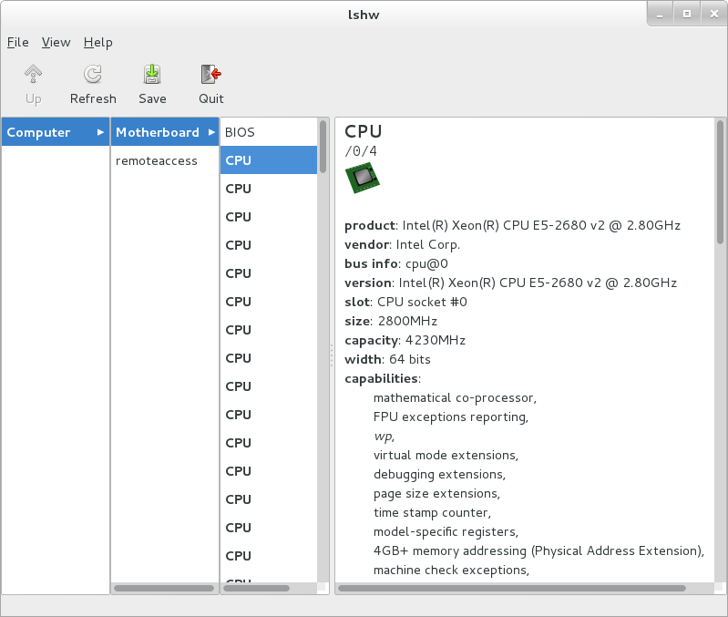

## 附0.4. 显示硬件信息

使用`lshw`命令显示硬件信息。

安装lshw：

`yum -y install lshw`

显示硬件信息：

`lshw`

```
dlp.srv.world
    description: Computer
    product: VMware Virtual Platform
    vendor: VMware, Inc.
    version: None
    serial: VMware-56 4d fb 94 3f 44 93 ea-4b 19 25 db 1d cd 9c 2d
    width: 64 bits
    capabilities: smbios-2.4 dmi-2.4 vsyscall32
    configuration: administrator_password=enabled boot=normal frontpanel_password=unknown 
    keyboard_password=unknown power-on_password=disabled uuid=564DFB94-3F44-93EA-4B19-25DB1DCD9C2D
  *-core
       description: Motherboard
       product: 440BX Desktop Reference Platform
       vendor: Intel Corporation
       physical id: 0
       version: None
       serial: None
     *-firmware
          description: BIOS
          vendor: Phoenix Technologies LTD
          physical id: 0
          version: 6.00
          date: 05/20/2014
          size: 89KiB
          capabilities: isa pci pcmcia pnp apm upgrade shadowing escd cdboot bootselect edd 
          int5printscreen int9keyboard int14serial int17printer int10video acpi smartbattery 
          biosbootspecification netboot inter int10video acpi smartbattery biosbootspecification netboot
     *-cpu:0
          description: CPU
          product: Intel(R) Xeon(R) CPU E5-2680 v2 @ 2.80GHz
          vendor: Intel Corp.
          physical id: 4
          bus info: cpu@0
          version: Intel(R) Xeon(R) CPU E5-2680 v2 @ 2.80GHz
          slot: CPU socket #0
          size: 2800MHz
          capacity: 4230MHz
          width: 64 bits
          capabilities: fpu fpu_exception wp vme de pse tsc msr pae mce cx8 apic sep mtrr pge mca 
          cmov pat pse36 clflush dts mmx fxsr sse sse2 ss syscall nx rdtscp x86-64 constant_tsc arch_perfmon 
          pebs bts nopl xtopology tsc_reliable nonstop_tsc aperfmperf pni pclmulqdq vmx ssse3 cx16 pcid sse4_1 
          sse4_2 x2apic popcnt tsc_deadline_timer aes xsave avx f16c rdrand hypervisor lahf_lm ida arat epb pln 
          pts dtherm tpr_shadow vnmi ept vpid fsgsbase tsc_adjust smep
        *-cache
             description: L1 cache
             physical id: 94
             slot: L1 Cache
             size: 16KiB
             capacity: 16KiB
             capabilities: asynchronous internal write-back
.....
.....
```

`lshw -html > hwinfo.html` # 用HTML格式显示

`lshw -xml > hwinfo.xml` # 用XML格式显示

如果[安装了桌面环境](../3. 桌面环境/3.1. GNOME桌面.html)，可以使用GUI工具：

`yum -y install lshw-gui`

在应用程序菜单中选择“Hardware Lister”，硬件信息显示如下：


