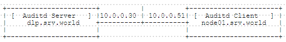
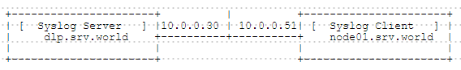

## 附1.1. 系统安全

### 附1.1.1. Clam AntiVirus

[Clam AntiVirus（ClamAV）](https://www.clamav.net/)是免费而且开放源代码的防毒软件，软件与病毒码的的更新皆由社群免费发布。目前ClamAV主要是使用在由Linux、FreeBSD等Unix-like系统架设的邮件服务器上，提供电子邮件的病毒扫描服务。

`yum --enablerepo=epel -y install clamav clamav-update` # 从EPEL安装

`sed -i -e "s/^Example/#Example/" /etc/freshclam.conf`

`freshclam` # 更新病毒库

```
ClamAV update process started at Fri Aug 29 22:03:30 2014
main.cld is up to date (version: 55, sigs: 2424225, f-level: 60, builder: neo)
daily.cvd is up to date (version: 19314, sigs: 1094505, f-level: 63, builder: neo)
bytecode.cvd is up to date (version: 242, sigs: 46, f-level: 63, builder: dgoddard)
```

尝试扫描：

`clamscan --infected --remove --recursive /home`

```
----------- SCAN SUMMARY -----------
Known viruses: 3575245
Engine version: 0.98.4
Scanned directories: 2
Scanned files: 3
Infected files: 0
Data scanned: 0.00 MB
Data read: 0.00 MB (ratio 0.00:1)
Time: 10.369 sec (0 m 10 s)
```

`curl -O http://www.eicar.org/download/eicar.com` # 下载试用病毒

`clamscan --infected --remove --recursive .`

```
./eicar.com: Eicar-Test-Signature FOUND
./eicar.com: Removed.  # 检测到病毒

----------- SCAN SUMMARY -----------
Known viruses: 3575245
Engine version: 0.98.4
Scanned directories: 3
Scanned files: 10
Infected files: 1
Data scanned: 0.00 MB
Data read: 256.57 MB (ratio 0.00:1)
Time: 10.307 sec (0 m 10 s)
```

### 附1.1.2. RKHunter

安装Rootkit检测工具[RKHunter](http://rkhunter.cvs.sourceforge.net/viewvc/rkhunter/rkhunter/files/README)。

`yum --enablerepo=epel -y install rkhunter` # 从EPEL安装

配置和使用RKHunter（为了定期检查，检查脚本安装在`cron.daily`目录下，每天由Cron执行）：

编辑`/etc/sysconfig/rkhunter`文件：

```
# 报告的收件人地址
MAILTO=root@localhost
# 如果指定“yes”，扫描更详细
DIAG_SCAN=no
```

`rkhunter --update` # 更新数据库

`rkhunter --propupd` # 更新系统文件属性

执行检查（`--sk`表示跳过按回车键，如果指定`--rwo`只显示警告）：

`rkhunter --check --sk`

```
[ Rootkit Hunter version 1.4.2 ]

Checking system commands...

  Performing 'strings' command checks
    Checking 'strings' command                               [ OK ]

  Performing 'shared libraries' checks
    Checking for preloading variables                        [ None found ]
    Checking for preloaded libraries                         [ None found ]
    Checking LD_LIBRARY_PATH variable                        [ Not found ]

  Performing file properties checks
    Checking for prerequisites                               [ OK ]
    /usr/sbin/adduser                                        [ OK ]
    /usr/sbin/chkconfig                                      [ OK ]
    /usr/sbin/chroot                                         [ OK ]
    /usr/sbin/depmod                                         [ OK ]
    /usr/sbin/fsck                                           [ OK ]

.....
.....

System checks summary
=====================

File properties checks...
    Files checked: 121
    Suspect files: 0

Rootkit checks...
    Rootkits checked : 365
    Possible rootkits: 0

Applications checks...
    All checks skipped

The system checks took: 1 minute and 35 seconds

All results have been written to the log file: /var/log/rkhunter/rkhunter.log

No warnings were found while checking the system.
```

### 附1.1.3. 审计与日志

#### 附1.1.3.1. Lynis

[Lynis](https://cisofy.com/lynis/)扫描系统的配置，并创建概述系统信息与安全问题所使用的专业审计。

`yum --enablerepo=epel -y install lynis` 从EPEL安装

使用Lynis：

`lynis audit system` # 初始扫描运行如下

```
.....
.....
================================================================================

  Lynis security scan details:

  Hardening index : 65 [#############       ]
  Tests performed : 200
  Plugins enabled : 0

  Components:
  - Firewall               [V]
  - Malware scanner        [X]

  Lynis Modules:
  - Compliance Status      [?]
  - Security Audit         [V]
  - Vulnerability Scan     [V]

  Files:
  - Test and debug information      : /var/log/lynis.log
  - Report data                     : /var/log/lynis-report.dat

================================================================================

  Lynis 2.3.2

  Auditing, system hardening, and compliance for UNIX-based systems
  (Linux, macOS, BSD, and others)

  2007-2016, CISOfy - https://cisofy.com/lynis/
  Enterprise support available (compliance, plugins, interface and tools)

================================================================================

  [TIP]: Enhance Lynis audits by adding your settings to custom.prf (see /etc/lynis/default.prf for all settings)
```

扫描结果的报告保存在`/var/log/lynis-report.dat`中。使用单词“warning”或“suggestion”搜索文件，然后如下显示推荐的设置：

`grep -E "^warning|^suggestion" /var/log/lynis-report.dat`

```
suggestion[]=BOOT-5122|Set a password on GRUB bootloader to prevent altering boot configuration (e.g. boot 
suggestion[]=AUTH-9286|Configure minimum password age in /etc/login.defs|-|-|
suggestion[]=AUTH-9286|Configure maximum password age in /etc/login.defs|-|-|
suggestion[]=AUTH-9328|Default umask in /etc/profile or /etc/profile.d/custom.sh could be more strict (e.g. 
suggestion[]=FILE-6310|To decrease the impact of a full /home file system, place /home on a separated partit
suggestion[]=FILE-6310|To decrease the impact of a full /tmp file system, place /tmp on a separated partitio
suggestion[]=FILE-6310|To decrease the impact of a full /var file system, place /var on a separated partitio
suggestion[]=STRG-1840|Disable drivers like USB storage when not used, to prevent unauthorized storage or da
suggestion[]=STRG-1846|Disable drivers like firewire storage when not used, to prevent unauthorized storage 
suggestion[]=NAME-4404|Add the IP name and FQDN to /etc/hosts for proper name resolving|-|-|
suggestion[]=PKGS-7384|Install package 'yum-utils' for better consistency checking of the package database|-
suggestion[]=NETW-3032|Consider running ARP monitoring software (arpwatch)|-|-|
warning[]=MAIL-8818|Found mail_name in SMTP banner, and/or mail_name contains 'Postfix'|-|-|
suggestion[]=MAIL-8818|You are advised to hide the mail_name (option: smtpd_banner) from your postfix config 
suggestion[]=FIRE-4513|Check iptables rules to see which rules are currently not used|-|-|
suggestion[]=SSH-7408|Consider hardening SSH configuration|AllowTcpForwarding (YES --> NO)|-|
suggestion[]=SSH-7408|Consider hardening SSH configuration|ClientAliveCountMax (3 --> 2)|-|
suggestion[]=SSH-7408|Consider hardening SSH configuration|Compression (DELAYED --> NO)|-|
suggestion[]=SSH-7408|Consider hardening SSH configuration|LogLevel (INFO --> VERBOSE)|-|
suggestion[]=SSH-7408|Consider hardening SSH configuration|MaxAuthTries (6 --> 1)|-|
suggestion[]=SSH-7408|Consider hardening SSH configuration|MaxSessions (10 --> 2)|-|
suggestion[]=SSH-7408|Consider hardening SSH configuration|PermitRootLogin (YES --> NO)|-|
suggestion[]=SSH-7408|Consider hardening SSH configuration|Port (22 --> )|-|
suggestion[]=SSH-7408|Consider hardening SSH configuration|TCPKeepAlive (YES --> NO)|-|
suggestion[]=SSH-7408|Consider hardening SSH configuration|UseDNS (YES --> NO)|-|
suggestion[]=SSH-7408|Consider hardening SSH configuration|X11Forwarding (YES --> NO)|-|
suggestion[]=SSH-7408|Consider hardening SSH configuration|AllowAgentForwarding (YES --> NO)|-|
suggestion[]=BANN-7126|Add a legal banner to /etc/issue, to warn unauthorized users|-|-|
suggestion[]=BANN-7130|Add legal banner to /etc/issue.net, to warn unauthorized users|-|-|
suggestion[]=ACCT-9622|Enable process accounting|-|-|
suggestion[]=ACCT-9626|Enable sysstat to collect accounting (no results)|-|-|
suggestion[]=ACCT-9630|Audit daemon is enabled with an empty ruleset. Disable the daemon or define rules|-|-
suggestion[]=TIME-3160|Some time servers missing in step-tickers file|-|-|
suggestion[]=FINT-4350|Install a file integrity tool to monitor changes to critical and sensitive files|-|-|
suggestion[]=TOOL-5002|Determine if automation tools are present for system management|-|-|
suggestion[]=KRNL-6000|One or more sysctl values differ from the scan profile and could be tweaked|-|-|
suggestion[]=HRDN-7222|Harden compilers like restricting access to root user only|-|-|
suggestion[]=HRDN-7230|Harden the system by installing at least one malware scanner, to perform periodic fil
```

#### 附1.1.3.2. Auditd

通过[Auditd](https://access.redhat.com/documentation/en-US/Red_Hat_Enterprise_Linux/7/html/Security_Guide/chap-system_auditing.html)配置系统审计，可以监控系统调用，安全事件，文件访问，命令执行等。

##### 附1.1.3.2.1. 安装Auditd
CentOS7默认安装Audit软件包，如果没有，则如下安装：

`yum -y install audit`

```
service auditd start
systemctl enable auditd
```

注：`service`命令是与Auditd守护进程正确交互的唯一方法。需要使用`service`命令，以便auid值被正确记录。使用`systemctl`命令只能执行两个操作：enable和status。

编辑`/etc/audit/auditd.conf`文件，更改Auditd的一些设置：

```
# 指定日志文件
log_file = /var/log/audit/audit.log

# 日志文件数（如果指定了“max_log_file_action=ROTATE”）
num_logs = 5

# 日志文件中的主机名
# 有效值：NONE，HOSTNAME，FQD，NUMERIC，USER
name_format = NONE

# 任意主机名（如果指定了“name_format=USER”）
name = mydomain

# 日志文件的最大大小（MB兆字节）
max_log_file = 6

# 指定如果日志文件的大小超过限制的操作
# 有效值：IGNORE，SYSLOG，SUSPEND，ROTATE，KEEP_LOGS
max_log_file_action = ROTATE
```

##### 附1.1.3.2.2. 输出日志到远程主机

本例基于以下环境：



配置从远程主机接收审计日志的Auditd主机（Auditd Server）：

编辑`/etc/audit/auditd.conf`文件：

```
# 取消注释并指定侦听端口
tcp_listen_port = 60
```

`service auditd restart`

配置发送审核日志的Auditd客户端主机（Auditd Client）：

`yum -y install audispd-plugins`

编辑`/etc/audisp/plugins.d/au-remote.conf`文件：

```
# 更改
active = yes
```

编辑`/etc/audisp/audisp-remote.conf`文件：

```
# 接收日志的远程服务器
remote_server = dlp.srv.world

# 指定端口（远程服务器侦听的端口）
port = 60
```

编辑`/etc/audit/auditd.conf`文件：

```
# 更改（不在本地文件系统上记录日志）
log_format = NOLOG
```

`service auditd restart`

配置完成，远程主机上的审计日志记录如下：

`tail -5 /var/log/audit/audit.log`

```
node=node01.srv.world type=USER_START msg=audit(1456385789.273:101): pid=1141 uid=0 auid=0 ses=1 msg='op=.....
node=node01.srv.world type=USER_END msg=audit(1456385789.278:102): pid=1141 uid=0 auid=0 ses=1 msg='op=PA.....
node=node01.srv.world type=CRED_DISP msg=audit(1456385789.278:103): pid=1141 uid=0 auid=0 ses=1 msg='op=P.....
node=node01.srv.world type=USER_END msg=audit(1456385791.441:104): pid=1120 uid=0 auid=0 ses=1 msg='op=PA.....
node=node01.srv.world type=CRED_DISP msg=audit(1456385791.442:105): pid=1120 uid=0 auid=0 ses=1 msg='op=P.....
```

如果[TCP Wrapper](../附1. 一些可能有用的/附1.3. 访问控制.html#附132-tcp-wrapper)安装在审核日志接收主机上，可以对Auditd使用TCP访问控制：

编辑`/etc/audit/auditd.conf`文件：

```
# 添加到最后
use_libwrap = yes
```

`service auditd restart`

编辑`/etc/hosts.deny`文件：

```
# 默认拒绝所有
auditd: ALL
```

编辑`/etc/hosts.allow`文件：

```
# 设置允许的主机
auditd: 10.0.0.51
```

##### 附1.1.3.2.3. 使用ausearch搜索日志

一些默认审计规则，如：系统登录，用户帐户修改，Sudo操作等，这些日志记录在`/var/log/audit/audit.log`中。

日志是文本格式，可以直接查看：

`tail -5 /var/log/audit/audit.log`

```
node=dlp.srv.world type=USER_START msg=audit(1456386950.783:116): pid=10697 uid=0 auid=0 ses=1 msg='op=P...
node=dlp.srv.world type=USER_END msg=audit(1456386950.799:117): pid=10697 uid=0 auid=0 ses=1 msg='op=PAM...
node=dlp.srv.world type=CRED_DISP msg=audit(1456386950.799:118): pid=10697 uid=0 auid=0 ses=1 msg='op=PA...
node=dlp.srv.world type=USER_END msg=audit(1456386952.872:119): pid=10676 uid=0 auid=0 ses=1 msg='op=PAM...
node=dlp.srv.world type=CRED_DISP msg=audit(1456386952.872:120): pid=10676 uid=0 auid=0 ses=1 msg='op=PA...
```

许多日志都被记录在“audit.log”中，很复杂，所以由Audit软件包提供的`ausearch`命令来搜索具体的日志：

`ausearch --message USER_LOGIN --interpret` # 搜索USER_LOGIN日志

```
----
node=dlp.srv.world type=USER_LOGIN msg=audit(02/26/2016 09:21:35.121:44) : pid=610 uid=root auid=root ses=...
----
node=node01.srv.world type=USER_LOGIN msg=audit(02/26/2016 09:40:29.419:46) : pid=625 uid=root auid=root s...
.....
.....
node=node01.srv.world type=USER_LOGIN msg=audit(02/26/2016 10:34:51.089:44) : pid=620 uid=root auid=root s...
```

`ausearch -x sudo -ua 1000` # 搜索UserID：1000的Sudo操作

```
----
time->Tue Feb 23 09:52:23 2016
node=dlp.srv.world type=USER_AUTH msg=audit(1456188743.819:49): pid=960 uid=1000 auid=0 ses=1 msg='op=...
----
time->Tue Feb 23 09:52:23 2016
node=dlp.srv.world type=USER_ACCT msg=audit(1456188743.819:50): pid=960 uid=1000 auid=0 ses=1 msg='op=...
.....
.....
time->Fri Feb 26 09:48:50 2016
node=node01.srv.world type=USER_ACCT msg=audit(1456447730.031:52): pid=966 uid=1000 auid=0 ses=1 msg='...
```

`ausearch --node dlp.srv.world --success no` # 在`dlp.svv.world`上搜索失败事件

```
----
time->Thu Feb 25 17:46:57 2016
node=dlp.srv.world type=USER_END msg=audit(1456390017.044:129): pid=608 uid=0 auid=0 ses=1 msg='..... res=failed'
----
time->Thu Feb 25 17:46:57 2016
node=dlp.srv.world type=SERVICE_START msg=audit(1456390017.111:147): pid=1 uid=0 auid=429496729 ..... res=failed'
.....
.....
time->Fri Feb 26 09:50:10 2016
node=dlp.srv.world type=SERVICE_STOP msg=audit(1456447810.331:63): pid=1 uid=0 auid=4294967295  ..... res=failed'
```

`ausearch --start 02/07/2016 --end 02/21/2016 -ul 1000` # 搜索UserID：1000从2016/2/7到2016/2/21的登录日志

```
----
time->Tue Feb 7 09:54:51 2016
type=LOGIN msg=audit(1456188891.234:69): pid=976 uid=0 old-auid=4294967295 auid=1000 old-ses=4294967295 s...
----
time->Tue Feb 7 09:54:51 2016
 ype=USER_START msg=audit(1456188891.244:70): pid=976 uid=0 auid=1000 ses=2 msg='op=PAM:session_open gran...

time->Tue Feb 21 11:13:38 2016
 ype=USER_END msg=audit(1456193618.644:159): pid=8105 uid=0 auid=1000 ses=6 msg='op=PAM:session_close gra...
```

##### 附1.1.3.2.4. 使用aureport显示日志

可以使用Audit软件包提供的`aureport`命令来简要显示审计日志。

下面演示如何使用aureport命令：

`aureport` # 不使用参数显示整个摘要

```
Summary Report
======================
Range of time in logs: 08/08/2015 02:09:42.093 - 02/25/2016 17:01:01.950
Selected time for report: 08/08/2015 02:09:42 - 02/25/2016 17:01:01.950
Number of changes in configuration: 299
Number of changes to accounts, groups, or roles: 18
Number of logins: 18
Number of failed logins: 3
Number of authentications: 30
Number of failed authentications: 3
Number of users: 3
Number of terminals: 7
Number of host names: 3
Number of executables: 15
Number of commands: 41
Number of files: 0
Number of AVC's: 0
Number of MAC events: 2
Number of failed syscalls: 0
Number of anomaly events: 2
Number of responses to anomaly events: 0
Number of crypto events: 74
Number of integrity events: 0
Number of virt events: 0
Number of keys: 0
Number of process IDs: 407
Number of events: 1955
```

`aureport -au` # 显示身份验证类日志

```
Authentication Report
============================================
# date time acct host term exe success event
============================================
1. 08/08/2015 02:09:52 root ? ttyS0 /usr/bin/login yes 332
2. 08/08/2015 02:20:27 root ? ttyS0 /usr/bin/login yes 34
3. 08/17/2015 10:40:03 root ? ttyS0 /usr/bin/login yes 33
.....
.....
20. 02/23/2016 11:09:46 cent 10.0.0.20 ssh /usr/sbin/sshd yes 118
21. 02/23/2016 11:13:26 cent ? ttyS0 /usr/bin/login no 147
```

`aureport -au --failed --summary` # 显示身份验证失败类日志

```
Failed Authentication Summary Report
=============================
total  acct
=============================
1  root
1  cent
```

`aureport -m -i` # 显示用户帐户修改类日志

```
Account Modifications Report
=================================================
# date time auid addr term exe acct success event
=================================================
1. 08/08/2015 02:10:21 root ? ttyS0 /usr/sbin/useradd cent no 342
2. 08/08/2015 02:19:25 root ? ? /usr/sbin/groupadd ? yes 370
3. 08/08/2015 02:19:26 root ? ? /usr/sbin/groupadd ? yes 371
.....
.....
17. 02/08/2016 11:12:41 root ? ? /usr/sbin/groupadd ntp no 45
18. 02/08/2016 11:12:41 root ? ? /usr/sbin/useradd ntp no 46
```

`aureport -m -i --start this-month` # 显示自本月以来用户帐户修改类日志

```
Account Modifications Report
=================================================
# date time auid addr term exe acct success event
=================================================
1. 02/08/2016 11:12:41 root ? ? /usr/sbin/groupadd ntp no 45
2. 02/08/2016 11:12:41 root ? ? /usr/sbin/useradd ntp no 46
```

`aureport -x -i` # 显示执行类日志

```
Executable Report
====================================
# date time exe term host auid event
====================================
1. 08/08/2015 02:09:42 /usr/lib/systemd/systemd ? ? unset 6
2. 08/08/2015 02:09:42 /usr/lib/systemd/systemd-update-utmp ? ? unset 7
3. 08/08/2015 02:09:42 /usr/lib/systemd/systemd ? ? unset 8
.....
.....
1422. 02/23/2016 17:01:01 /usr/sbin/crond cron ? root 211
1423. 02/23/2016 17:01:01 /usr/sbin/crond cron ? root 212
```

`aureport -x -i --start 02/07/2016 --end 02/21/2016` # 显示从2016/2/7到2016/2/21的执行类日志

```
Executable Report
====================================
# date time exe term host auid event
====================================
1. 02/08/2016 11:11:47 /usr/lib/systemd/systemd ? ? unset 5
2. 02/08/2016 11:11:47 /usr/lib/systemd/systemd-update-utmp ? ? unset 6
3. 02/08/2016 11:11:47 /usr/lib/systemd/systemd ? ? unset 7
.....
.....
87. 02/08/2016 11:14:08 /usr/lib/systemd/systemd ? ? unset 92
88. 02/08/2016 11:14:08 /usr/lib/systemd/systemd ? ? unset 93
```

使用`ausearch`和`aureport`搜索并显示日志如下：

`ausearch --node dlp.srv.world | aureport -au` # 在`dlp.svv.world`上搜索并显示身份验证日志

```
Authentication Report
============================================
# date time acct host term exe success event
============================================
1. 02/25/2016 16:55:35 cent ? ttyS0 /usr/bin/su yes 103
2. 02/25/2016 16:55:44 cent ? /dev/ttyS0 /usr/bin/sudo yes 107
3. 02/26/2016 09:21:35 root ? ttyS0 /usr/bin/login yes 38
4. 02/26/2016 09:50:32 root ? ttyS0 /usr/bin/login yes 38
```

`ausearch -ui 1000 | aureport -x -i` # 搜索并显示UserID：1000的执行日志

```
Executable Report
====================================
# date time exe term host auid event
====================================
1. 02/23/2016 09:52:23 /usr/bin/sudo /dev/ttyS0 ? cent 49
2. 02/23/2016 09:52:23 /usr/bin/sudo /dev/ttyS0 ? cent 50
3. 02/23/2016 09:55:06 /usr/bin/su ttyS0 ? cent 80
.....
.....
15. 02/26/2016 09:48:50 /usr/bin/sudo /dev/ttyS0 ? cent 52
```

##### 附1.1.3.2.5. 添加审计规则

可以添加自己的审计规则。

例如，配置用于记录`/etc/hosts`的写入和属性更改的审计规则：

`auditctl -l` # 显示当前规则（默认情况下无规则）

```
No rules
```

`auditctl -w /etc/hosts -p wa -k hosts_change` # `-p [r|w|x|a]`（r=读，w=写，x=执行，a=属性）；`-k [words]`：设置搜索日志的关键字
`auditctl -l`

```
-w /etc/hosts -p wa -k hosts_change
```

当一些操作完成并且被新的审计规则检测到时，审计日志将记录如下：

`ausearch -k hosts_change | aureport -f -i` # 按关键字搜索

```
File Report
===============================================
# date time file syscall success exe auid event
===============================================
1. 03/09/2016 19:48:32 /etc/hosts open yes /usr/bin/bash root 46
2. 03/10/2016 20:37:52 /etc/hosts open yes /usr/bin/vi root 49
3. 03/10/2016 20:37:52 /etc/hosts chmod yes /usr/bin/vi root 50
4. 03/10/2016 20:38:35 /etc/hosts~ rename yes /usr/bin/vi cent 71
5. 03/10/2016 20:38:35 /etc/hosts ? yes ? cent 72
6. 03/10/2016 20:38:35 /etc/hosts ? yes ? cent 70
7. 03/10/2016 20:38:35 /etc/hosts open yes /usr/bin/vi cent 73
8. 03/10/2016 20:38:35 /etc/hosts chmod yes /usr/bin/vi cent 74
9. 03/10/2016 20:38:35 /etc/hosts setxattr yes /usr/bin/vi cent 75
```

在重新启动系统后，由`auditctl`命令添加的规则不会保留，因此如果想持续保留，需要将它们添加到`/etc/audit/rules.d`下的文件中。可以向`/etc/audit/rules.d`中的任何文件添加规则，但扩展名应为“.rules”：

`auditctl -l >> /etc/audit/rules.d/additional.rules` # 输出当前规则到“additional.rules”

如果为Audit Target设置了一个目录，则所有文件都会以目录的方式递归定位：

`auditctl -w /home/testdir/ -p r -k testdir_audit` # 将审计规则读取到`/home/testdir/`

`auditctl -l`

```
-w /home/testdir/ -p r -k testdir_audit
```

`ausearch -k testdir_audit | aureport -f -i` # 日志记录如下

```
File Report
===============================================
# date time file syscall success exe auid event
===============================================
1. 03/10/2016 19:50:28 /home/testdir getxattr no /usr/bin/ls cent 77
2. 03/10/2016 19:50:28 /home/testdir lgetxattr no /usr/bin/ls cent 76
3. 03/10/2016 19:50:28 /home/testdir getxattr no /usr/bin/ls cent 78
4. 03/10/2016 19:50:32 /home/testdir getxattr no /usr/bin/ls cent 81
5. 03/10/2016 19:50:32 /home/testdir openat yes /usr/bin/ls cent 82
6. 03/10/2016 19:50:32 /home/testdir lgetxattr no /usr/bin/ls cent 79
7. 03/10/2016 19:50:32 /home/testdir getxattr no /usr/bin/ls cent 80
8. 03/10/2016 19:50:32 /home/testdir/test.txt lgetxattr no /usr/bin/ls cent 83
9. 03/10/2016 19:50:32 /home/testdir/test.txt getxattr no /usr/bin/ls cent 84
10. 03/10/2016 19:50:32 /home/testdir/test.txt getxattr no /usr/bin/ls cent 85
11. 03/10/2016 19:50:32 /home/testdir/testdir02 lgetxattr no /usr/bin/ls cent 86
12. 03/10/2016 19:50:32 /home/testdir/testdir02 getxattr no /usr/bin/ls cent 87
13. 03/10/2016 19:50:53 /home/testdir/testdir02/test2.txt open yes /usr/bin/cat cent 89
```

例如，配置监控由UID超过1000的用户删除的文件的审计规则（对于下面的`S`选项，可以在安装`yum install man-pages`后，使用`man syscalls`确认所有系统调用）：

`auditctl -a always,exit -S unlink,unlinkat -F 'auid>=1000' -F 'auid!=-1' -F key=delete_audit`

`auditctl -l`

```
-a always,exit -S unlink,unlinkat -F auid>=1000 -F auid!=-1 -F key=delete_audit
```

`ausearch -k delete_audit | aureport -f -i` # 日志记录如下

```
File Report
===============================================
# date time file syscall success exe auid event
===============================================
1. 03/10/2016 19:11:05 test.txt unlinkat yes /usr/bin/rm redhat 112
2. 03/10/2016 19:13:06 test3.txt unlinkat yes /usr/bin/rm cent 139
3. 03/10/2016 19:41:00 test2.txt unlinkat yes /usr/bin/rm redhat 194
```

#### 附1.1.3.3. Rsyslog

[Rsyslog](http://www.rsyslog.com/)是一个[syslogd](https://en.wikipedia.org/wiki/Syslog)的多线程增强版。

##### 附1.1.3.3.1. 输出日志到远程主机

本例基于以下环境：



配置日志管理服务器以从客户端服务器接收日志（Syslog Server）：

编辑`/etc/rsyslog.conf`文件：

```
# 取消注释
$ModLoad imtcp
$InputTCPServerRun 514
# 指定允许访问的发送者
$AllowedSender TCP, 127.0.0.1, 10.0.0.0/24, *.srv.world
```

`systemctl restart rsyslog`

配置客户端（Syslog Client）：

编辑`/etc/rsyslog.conf`文件：

```
# 例如，输出“authpriv.*”的日志到远程主机
authpriv.*     @@dlp.srv.world:514

# 取消注释
$ActionQueueFileName fwdRule1 # unique name prefix for spool files
$ActionQueueMaxDiskSpace 1g   # 1gb space limit (use as much as possible)
$ActionQueueSaveOnShutdown on # save messages to disk on shutdown
$ActionQueueType LinkedList   # run asynchronously
$ActionResumeRetryCount -1    # infinite retries if host is down
```

`systemctl restart rsyslog`

上述配置后，日志管理服务器上记录的各种身份验证记录如下：

`tail -10 /var/log/secure`

```
Jun 17 11:24:47 dlp sshd[9582]: Connection closed by 127.0.0.1 [preauth]
Jun 17 11:27:46 node01 login: pam_unix(login:session): session closed for user root
Jun 17 11:27:52 node01 login: pam_unix(login:auth): check pass; user unknown
Jun 17 11:27:52 node01 login: pam_unix(login:auth): authentication failure; logname=LOGIN uid=0 euid=0
Jun 17 11:27:54 node01 login: FAILED LOGIN 1 FROM ttyS0 FOR (unknown), User not known to the underlyin
Jun 17 11:27:59 node01 login: pam_unix(login:session): session opened for user root by LOGIN(uid=0)
Jun 17 11:27:59 node01 login: DIALUP AT ttyS0 BY root
Jun 17 11:27:59 node01 login: ROOT LOGIN ON ttyS0
Jun 17 11:28:44 node01 su: pam_unix(su-l:session): session opened for user cent by root(uid=0)
Jun 17 11:28:54 node01 sudo: cent : TTY=ttyS0 ; PWD=/home/cent ; USER=root ; COMMAND=/bin/cat /etc/sha
```

如果要对每个主机，每个日期分隔日志，配置如下：

编辑`/etc/rsyslog.conf`文件：

```
# 添加：定义日志文件
$template Secure_log,"/var/log/secure.d/%fromhost%_%$year%%$month%%$day%.secure"

# 添加：指定上面定义的日志文件
authpriv.*     -?Secure_log
```

`systemctl restart rsyslog`

`ll /var/log/secure.d`

```
total 8
-rw-r--r-- 1 root root 350 Jun 17 11:34 dlp_20150617.secure
-rw-r--r-- 1 root root 380 Jun 17 11:34 node01.srv.world_20150617.secure
```

##### 附1.1.3.3.2. 输出日志到数据库

可以选择很多数据库，本例演示使用MariaDB配置，因此先[安装MariaDB](../6. 数据库/6.1. MariaDB.html)。

为Rsyslog创建一个用户和数据库：

`yum -y install rsyslog-mysql`

`cat /usr/share/doc/rsyslog-mysql-*/createDB.sql | mysql -u root -p`

```
Enter password:
```

`mysql -u root -p`

```
Enter password:
Welcome to the MariaDB monitor.  Commands end with ; or \g.
Your MariaDB connection id is 7291
Server version: 5.5.41-MariaDB MariaDB Server

Copyright (c) 2000, 2014, Oracle, MariaDB Corporation Ab and others.

Type 'help;' or '\h' for help. Type '\c' to clear the current input statement.

# Enter password:
Welcome to the MariaDB monitor.  Commands end with ; or \g.
Your MariaDB connection id is 7291
Server version: 5.5.41-MariaDB MariaDB Server

Copyright (c) 2000, 2014, Oracle, MariaDB Corporation Ab and others.

Type 'help;' or '\h' for help. Type '\c' to clear the current input statement.

# 创建“rsyslog”用户并授予权限到Syslog数据库（在“password”部分设置任意密码）
MariaDB [(none)]> grant all privileges on Syslog.* to rsyslog@'localhost' identified by 'password';
Query OK, 0 rows affected (0.00 sec)
MariaDB [(none)]> flush privileges;
Query OK, 0 rows affected (0.00 sec)
MariaDB [(none)]> exit
Bye
MariaDB [(none)]> grant all privileges on Syslog.* to rsyslog@'localhost' identified by 'password';
Query OK, 0 rows affected (0.00 sec)
MariaDB [(none)]> flush privileges;
Query OK, 0 rows affected (0.00 sec)
MariaDB [(none)]> exit
Bye
```

配置Rsyslog将日志输出到数据库：

编辑`/etc/rsyslog.conf`文件：

```
# 添加
$ModLoad ommysql

# 例如，输出“authpriv.*”的日志。格式：:ommysql:主机,数据库,数据库用户,数据库密码
authpriv.*     :ommysql:localhost,Syslog,rsyslog,password
```

`systemctl restart rsyslog`

上述配置后，数据库中记录的一些日志记录如下：

`mysql -u rsyslog -p Syslog`

```
Enter password:
Reading table information for completion of table and column names
You can turn off this feature to get a quicker startup with -A

Welcome to the MariaDB monitor.  Commands end with ; or \g.
Your MariaDB connection id is 7299
Server version: 5.5.41-MariaDB MariaDB Server

Copyright (c) 2000, 2014, Oracle, MariaDB Corporation Ab and others.

Type 'help;' or '\h' for help. Type '\c' to clear the current input statement.

MariaDB [Syslog]> show tables;
+------------------------+
| Tables_in_Syslog       |
+------------------------+
| SystemEvents           |
| SystemEventsProperties |
+------------------------+
2 rows in set (0.00 sec)

MariaDB [Syslog]> select ReceivedAt,Facility,Priority,FromHost,Message from SystemEvents;
+---------------------+----------+----------+----------+--------------------------------------------------------+
| ReceivedAt          | Facility | Priority | FromHost | Message                                                |
+---------------------+----------+----------+----------+--------------------------------------------------------+
| 2015-06-17 19:40:33 |       10 |        6 | dlp      | pam_unix(login:session): session closed for user root  |
| 2015-06-17 19:40:39 |       10 |        6 | dlp      | pam_unix(login:session): session opened for user root  |
| 2015-06-17 19:40:39 |       10 |        6 | dlp      | DIALUP AT ttyS0 BY root                                |
| 2015-06-17 19:40:39 |       10 |        5 | dlp      | ROOT LOGIN ON ttyS0                                    |
| 2015-06-17 19:40:58 |       10 |        6 | node01   |  Accepted password for cent from 10.0.0.30 port 60492  |
| 2015-06-17 19:40:58 |       10 |        6 | node01   |  pam_unix(sshd:session): session opened for user cent  |
| 2015-06-17 19:40:58 |       10 |        6 | node01   |  Received disconnect from 10.0.0.30: 11: disconnected  |
| 2015-06-17 19:40:58 |       10 |        6 | node01   |  pam_unix(sshd:session): session closed for user cent  |
| 2015-06-17 19:41:13 |       10 |        6 | node01   |  pam_unix(su-l:session): session opened for user cent  |
| 2015-06-17 19:41:23 |       10 |        6 | dlp      | Invalid user cent from 10.0.0.51                       |
| 2015-06-17 19:41:23 |       10 |        6 | dlp      | input_userauth_request: invalid user cent [preauth]    |
| 2015-06-17 19:41:27 |       10 |        4 | dlp      | pam_unix(sshd:auth): check pass; user unknown          |
| 2015-06-17 19:41:27 |       10 |        5 | dlp      | pam_unix(sshd:auth): authentication failure; logname=  |
| 2015-06-17 19:41:28 |       10 |        6 | dlp      | Failed password for invalid user cent from 10.0.0.51 p |
| 2015-06-17 19:41:29 |       10 |        6 | dlp      | Connection closed by 10.0.0.51 [preauth]               |
| 2015-06-17 19:41:40 |       10 |        6 | dlp      | Accepted password for root from 10.0.0.51 port 58750 s |
| 2015-06-17 19:41:40 |       10 |        6 | dlp      | pam_unix(sshd:session): session opened for user root b |
| 2015-06-17 19:41:42 |       10 |        6 | dlp      | Received disconnect from 10.0.0.51: 11: disconnected b |
| 2015-06-17 19:41:42 |       10 |        6 | dlp      | pam_unix(sshd:session): session closed for user root   |
+---------------------+----------+----------+----------+--------------------------------------------------------+
19 rows in set (0.00 sec)
```

### 附1.1.4. 入侵检测系统

#### 附1.1.4.1. AIDE

[AIDE（Advanced Intrusion Detection Environment）](http://aide.sourceforge.net/)是一个文件和目录完整性检查器，基于主机的IDS（Intrusion Detection System入侵检测系统）。

安装AIDE：

`yum -y install aide`

配置AIDE并初始化数据库。可以使用默认配置AIDE，如果要自定义设置，如下所示更改配置文件（设置规则写在26-84行附近，可参考修改）：

编辑`/etc/aide.conf`文件：

```
# 例如，更改监控/var/log的设置
/var/log   p+u+g+i+n+acl+selinux+xattrs
```

`aide --init` # 初始化数据库

```
AIDE, version 0.15.1

### AIDE database at /var/lib/aide/aide.db.new.gz initialized.
```

`cp -p /var/lib/aide/aide.db.new.gz /var/lib/aide/aide.db.gz` # 将生成的数据库复制到主数据库

执行检查：

`aide --check`

```
# 如果没有不匹配，则显示“Okay”
AIDE, version 0.15.1

### All files match AIDE database. Looks okay!
```

尝试更改文件并重新检查：

`chmod 640 /root/anaconda-ks.cfg`

`aide --check`

```
# 检测到如下差异
AIDE 0.15.1 found differences between database and filesystem!!
Start timestamp: 2015-06-17 19:55:20

Summary:
  Total number of files:        39039
  Added files:                  0
  Removed files:                0
  Changed files:                1


---------------------------------------------------
Changed files:
---------------------------------------------------

changed: /root/anaconda-ks.cfg

---------------------------------------------------
Detailed information about changes:
---------------------------------------------------


File: /root/anaconda-ks.cfg
 Perm     : -rw-------                       , -rw-r-----
 Ctime    : 2015-05-24 02:22:04              , 2015-06-19 11:55:15
 ACL      : old = A:
----
user::rw-
group::---
other::---
----
                  D: <NONE>
            new = A:
----
user::rw-
group::r--
other::---
----
                  D: <NONE>
```

如果即使检测到某些差异也没有问题，则更新数据库，如下所示：

`aide --update`

```
AIDE 0.15.1 found differences between database and filesystem!!
Start timestamp: 2015-06-17 19:56:31

Summary:
  Total number of files:        39039
  Added files:                  0
  Removed files:                0
  Changed files:                1


---------------------------------------------------
Changed files:
---------------------------------------------------

changed: /root/anaconda-ks.cfg
.....
.....
```

`cp -p /var/lib/aide/aide.db.new.gz /var/lib/aide/aide.db.gz` # 更新数据库

加入Cron以定期检查。每次执行，日志文件`/var/log/aide/aide.log`都会更新，如果没有区别，它将以零字节更新。因此如果要保存日志文件，则需要创建一个shell脚本或通过电子邮件发送结果或其他方法。以添加每日检查Crontab并通过电子邮件发送结果为例：

编辑`/etc/cron.d/aide`文件：

```
00 01 * * * /usr/sbin/aide --update | mail -s 'Daily Check by AIDE' root
```

#### 附1.1.4.2. Tripwire

当服务器遭到黑客攻击时，在多数情况下，黑客可能对系统文件等等一些重要的文件进行修改。对此，使用Tripwire建立数据完整性监测系统。虽然它不能抵御黑客攻击以及黑客对一些重要文件的修改，但是可以监测文件是否被修改过以及哪些文件被修改过，从而在被攻击后有的放矢的策划出解决办法。Tripwire的原理是Tripwire被安装、配置后，将当前的系统数据状态建立成数据库，随着文件的添加、删除和修改等等变化，通过系统数据现状与不断更新的数据库进行比较，来判定哪些文件被添加、删除和修改过。正因为初始的数据库是在Tripwire本体被安装、配置后建立的原因，务必应该在服务器开放前，或者说操作系统刚被安装后用Tripwire构建数据完整性监测系统。

安装Tripwire：

`yum --enablerepo=epel -y install tripwire` # 从EPEL安装

创建密钥和数据库：

`tripwire-setup-keyfiles` # 生成密钥

```
.....
.....
Enter the site keyfile passphrase:  # 设置site密钥文件密码
Verify the site keyfile passphrase:  # 确认
.....
.....
Enter the local keyfile passphrase:  # 设置本地密钥文件密码
Verify the local keyfile passphrase:  # 确认
.....
.....
Please enter your site passphrase:  # 输入site密钥文件密码
.....
.....
Please enter your site passphrase:  # 输入site密钥文件密码
.....
.....
```

`cd /etc/tripwire`

编辑`twcfg.txt`文件：

```
# 报告级别（4最大）
REPORTLEVEL =4
```

`twadmin -m F -c tw.cfg -S site.key twcfg.txt ` # 生成配置

```
Please enter your site passphrase:  # 输入site密钥文件密码
Wrote configuration file: /etc/tripwire/tw.cfg
```

使用下面的脚本优化策略文件：

编辑`twpolmake.pl`文件：

```
#!/usr/bin/perl
# Tripwire Policy File customize tool
# ----------------------------------------------------------------
# Copyright (C) 2003 Hiroaki Izumi
# This program is free software; you can redistribute it and/or
# modify it under the terms of the GNU General Public License
# as published by the Free Software Foundation; either version 2
# of the License, or (at your option) any later version.
# This program is distributed in the hope that it will be useful,
# but WITHOUT ANY WARRANTY; without even the implied warranty of
# MERCHANTABILITY or FITNESS FOR A PARTICULAR PURPOSE.  See the
# GNU General Public License for more details.
# You should have received a copy of the GNU General Public License
# along with this program; if not, write to the Free Software
# Foundation, Inc., 59 Temple Place - Suite 330, Boston, MA  02111-1307, USA.
# ----------------------------------------------------------------
# Usage:
#     perl twpolmake.pl {Pol file}
# ----------------------------------------------------------------
#
$POLFILE=$ARGV[0];

open(POL,"$POLFILE") or die "open error: $POLFILE" ;
my($myhost,$thost) ;
my($sharp,$tpath,$cond) ;
my($INRULE) = 0 ;

while (<POL>) {
    chomp;
    if (($thost) = /^HOSTNAME\s*=\s*(.*)\s*;/) {
        $myhost = `hostname` ; chomp($myhost) ;
        if ($thost ne $myhost) {
            $_="HOSTNAME=\"$myhost\";" ;
        }
    }
    elsif ( /^{/ ) {
        $INRULE=1 ;
    }
    elsif ( /^}/ ) {
        $INRULE=0 ;
    }
    elsif ($INRULE == 1 and ($sharp,$tpath,$cond) = /^(\s*\#?\s*)(\/\S+)\b(\s+->\s+.+)$/) {
        $ret = ($sharp =~ s/\#//g) ;
        if ($tpath eq '/sbin/e2fsadm' ) {
            $cond =~ s/;\s+(tune2fs.*)$/; \#$1/ ;
        }
        if (! -s $tpath) {
            $_ = "$sharp#$tpath$cond" if ($ret == 0) ;
        }
        else {
            $_ = "$sharp$tpath$cond" ;
        }
    }
    print "$_\n" ;
}
close(POL) ;
```

`perl twpolmake.pl twpol.txt > twpol.txt.new`

`twadmin -m P -c tw.cfg -p tw.pol -S site.key twpol.txt.new`

```
Please enter your site passphrase:
Wrote policy file: /etc/tripwire/tw.pol
```

`tripwire -m i -s -c tw.cfg` # 创建数据库

```
Please enter your local passphrase:
```

手动执行检查（Cron的每日检查脚本包含在软件包中）：

`tripwire -m c -s -c /etc/tripwire/tw.cfg`

```
Open Source Tripwire(R) 2.4.2.2 Integrity Check Report

Report generated by:          root
Report created on:            Fri 18 Jun 2015 19:53:39 PM JST
Database last updated on:     Never

===============================================================================
Report Summary:
===============================================================================

Host name:                    dlp.srv.world
Host IP address:              10.0.0.30
Host ID:                      None
Policy file used:             /etc/tripwire/tw.pol
Configuration file used:      /etc/tripwire/tw.cfg
Database file used:           /var/lib/tripwire/dlp.srv.world.twd
Command line used:            tripwire -m c -s -c /etc/tripwire/tw.cfg

===============================================================================
Rule Summary:
===============================================================================

-------------------------------------------------------------------------------
  Section: Unix File System
-------------------------------------------------------------------------------

  Rule Name                       Severity Level    Added    Removed  Modified
  ---------                       --------------    -----    -------  --------
  User binaries                   66                0        0        0
  Tripwire Binaries               100               0        0        0
  Libraries                       66                0        0        0
  File System and Disk Administraton Programs
                                  100               0        0        0
  Kernel Administration Programs  100               0        0        0
  Networking Programs             100               0        0        0
  System Administration Programs  100               0        0        0
  Hardware and Device Control Programs
                                  100               0        0        0
  System Information Programs     100               0        0        0
  Application Information Programs
                                  100               0        0        0
  (/sbin/rtmon)
  Operating System Utilities      100               0        0        0
  Critical Utility Sym-Links      100               0        0        0
  Shell Binaries                  100               0        0        0
  Critical system boot files      100               0        0        0
* Tripwire Data Files             100               1        0        0
  System boot changes             100               0        0        0
  OS executables and libraries    100               0        0        0
  Critical configuration files    100               0        0        0
  Security Control                100               0        0        0
  Login Scripts                   100               0        0        0
  Root config files               100               0        0        0
  Invariant Directories           66                0        0        0
  Temporary directories           33                0        0        0
  Critical devices                100               0        0        0
  (/proc/kcore)

Total objects scanned:  21739
Total violations found:  1

===============================================================================
Object Summary:
===============================================================================

-------------------------------------------------------------------------------
# Section: Unix File System
-------------------------------------------------------------------------------

-------------------------------------------------------------------------------
Rule Name: Tripwire Data Files (/var/lib/tripwire)
Severity Level: 100
-------------------------------------------------------------------------------

Added:
"/var/lib/tripwire/dlp.srv.world.twd"

===============================================================================
Error Report:
===============================================================================

No Errors

-------------------------------------------------------------------------------
*** End of report ***

Open Source Tripwire 2.4 Portions copyright 2000 Tripwire, Inc. Tripwire is a registered
trademark of Tripwire, Inc. This software comes with ABSOLUTELY NO WARRANTY;
for details use --version. This is free software which may be redistributed
or modified only under certain conditions; see COPYING for details.
All rights reserved.
```

如果即使检测到某些差异也没有问题，则如下更新数据库：

结果保存在下面的目录下：

`ll /var/lib/tripwire/report`

```
total 8
-rw-r--r-- 1 root root 6814 Jun 17 19:53 dlp.srv.world-20150617-125339.twr
```

使用特定报告更新数据库：

```
tripwire -m u -a -s -c /etc/tripwire/tw.cfg \
-r /var/lib/tripwire/report/dlp.srv.world-20150617-125339.twr
```

```
Please enter your local passphrase:
```
