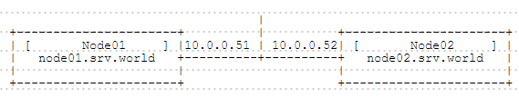
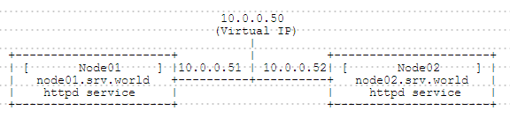
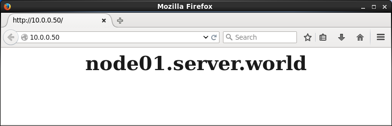
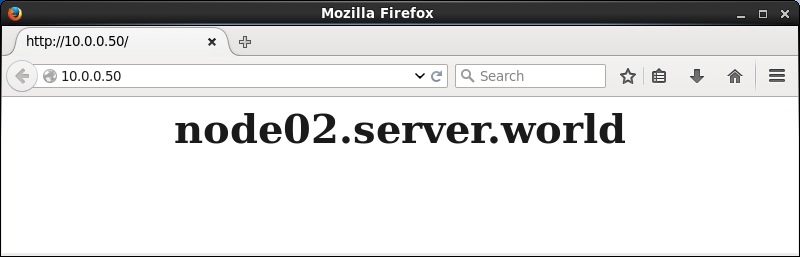
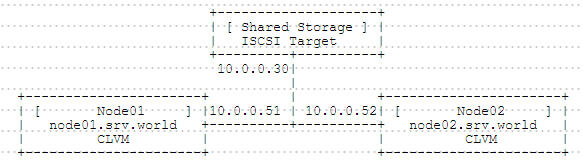

## 附1.10. 高可用性集群

高可用性集群（High-Availability Cluster）

### 附1.10.1. Pacemaker

#### 附1.10.1.1. 安装Pacemaker

[Pacemaker](http://wiki.clusterlabs.org/wiki/Pacemaker)是一个集群管理器。

本例基于以下环境（在这里配置基本的集群环境）：



如下所示，在所有节点上安装Pacemaker：

`yum -y install pacemaker pcs`

```
systemctl start pcsd
systemctl enable pcsd
````

`passwd hacluster` # 设置集群管理员用户的密码

```
Changing password for user hacluster.
New password:
Retype new password:
passwd: all authentication tokens updated successfully.
```

在节点上如下配置：

`pcs cluster auth node01.srv.world node02.srv.world` # 建立授权

`pcs cluster auth node01.srv.world node02.srv.world`

```
Username: hacluster 
Password:
node01.srv.world: Authorized
node02.srv.world: Authorized
```

`pcs cluster setup --name ha_cluster node01.srv.world node02.srv.world` # 配置集群

```
Shutting down pacemaker/corosync services...
Redirecting to /bin/systemctl stop pacemaker.service
Redirecting to /bin/systemctl stop corosync.service
Killing any remaining services...
Removing all cluster configuration files...
node01.srv.world: Succeeded
node02.srv.world: Succeeded
```

`pcs cluster start --all` # 启动集群服务

```
node02.srv.world: Starting Cluster...
node01.srv.world: Starting Cluster...
```

`pcs cluster enable --all` # 启用集群

```
node01.srv.world: Cluster Enabled
node02.srv.world: Cluster Enabled
```

`pcs status cluster` # 显示状态

```
Cluster Status:
 Last updated: Wed Jun 23 19:36:55 2015
 Last change: Wed Jun 23 19:36:47 2015
 Stack: corosync
 Current DC: node01.srv.world (1) - partition with quorum
 Version: 1.1.12-a14efad
 2 Nodes configured
 0 Resources configured
```

`pcs status corosync`

```
Membership information
----------------------
    Nodeid      Votes Name
         1          1 node01.srv.world (local)
         2          1 node02.srv.world
```

#### 附1.10.1.2. 添加资源

将httpd资源添加到集群。

本例基于以下环境：



先参照第一节内容配置好集群的基本设置。

[安装Apache httpd](../5. Web服务器/5.1. Apache httpd.html)（不用启动服务）。

在**所有节点**上启用httpd server-status：

编辑`/etc/httpd/conf.d/server_status.conf`文件：

```
ExtendedStatus On

<Location /server-status>
    SetHandler server-status
    Require local
</Location>
```

更改一些设置并设置虚拟IP地址：

`pcs property set stonith-enabled=false` # 禁用STONITH（Shoot The Other Node In The Head）选项

`pcs property set no-quorum-policy=ignore` # 更改为“ignore”，两个节点的集群不需要

`pcs property set default-resource-stickiness="INFINITY"` # 禁用自动故障恢复

`pcs property list` # 显示设置

```
Cluster Properties:
 cluster-infrastructure: corosync
 cluster-name: ha_cluster
 dc-version: 1.1.12-a14efad
 default-resource-stickiness: INFINITY
 have-watchdog: false
 no-quorum-policy: ignore
 stonith-enabled: false
```

`pcs resource create Virtual_IP ocf:heartbeat:IPaddr2 ip=10.0.0.50 cidr_netmask=32 op monitor interval=30s` # 设置虚拟IP地址

`pcs status resources` # 显示状态

```
Virtual_IP (ocf::heartbeat:IPaddr2): Started
```

添加httpd资源（可以在一个节点上设置）：

```
pcs resource create Web_Cluster \
ocf:heartbeat:apache \
configfile=/etc/httpd/conf/httpd.conf \
statusurl="http://127.0.0.1/server-status" \
op monitor interval=1min
```

`pcs constraint colocation add Web_Cluster with Virtual_IP INFINITY` # 设置Web_Cluster和Virtual_IP始终位于同一个节点上

`pcs constraint order Virtual_IP then Web_Cluster` # 设置启动顺序为Virtual_IP -> Web_Cluster

```
Adding Virtual_IP Web_Cluster (kind: Mandatory) (Options: first-action=start then-action=start)
```

`pcs constraint` # 显示状态

```
Location Constraints:
Ordering Constraints:
  start Virtual_IP then start Web_Cluster (kind:Mandatory)
Colocation Constraints:
  Web_Cluster with Virtual_IP (score:INFINITY)
```

访问虚拟IP地址以验证设置：



手动停止当前活动节点，确认资源正常切换到另一个节点：

`pcs cluster stop node01.srv.world`

```
node01.srv.world: Stopping Cluster (pacemaker)...
node01.srv.world: Stopping Cluster (corosync)...
```



#### 附1.10.1.3. CLVM + GFS2

使用CLVM + GFS2配置存储集群。本例基于以下环境：



先参照第一节内容配置好集群的基本设置。

[创建iscsi共享存储](../4. 存储服务器/4.2. iSCSI.html)。需要两个共享存储设备，用于数据和fence设备。本例使用“iqn.2015-07.world.server:storage.target01”作为数据，使用“iqn.2015-07.world.server:fence.target00”作为fence设备。

在**所有节点**[配置iSCSI启动器](../4. 存储服务器/4.2. iSCSI.html#422-配置iscsi启动器)，没有在上面创建分区也可以。

在**所有节点**上安装所需的软件包：

`yum -y install fence-agents-all lvm2-cluster gfs2-utils`

`lvmconf --enable-cluster`

`reboot`

配置fence设备。可以在一个节点上设置。下例`/dev/sda`只是共享存储设备：

`cat /proc/partitions` # 确认fence设备磁盘（本例设置在“sda”）

```
major minor  #blocks  name
.....
.....
 253        2    1048576 dm-2
   8        0    1048576 sda
   8       16   20971520 sdb
```

`ll /dev/disk/by-id | grep sda` # 确认磁盘的ID

```
lrwxrwxrwx 1 root root  9 Jul 10 11:44 scsi-36001405189b893893594dffb3a2cb3e9 -> ../../sda
lrwxrwxrwx 1 root root  9 Jul 10 11:44 wwn-0x6001405189b893893594dffb3a2cb3e9 -> ../../sda
```

`pcs stonith create scsi-shooter fence_scsi devices=/dev/disk/by-id/wwn-0x6001405189b893893594dffb3a2cb3e9 meta provides=unfencing`

`pcs property set no-quorum-policy=freeze`

`pcs stonith show scsi-shooter`

```
 Resource: scsi-shooter (class=stonith type=fence_scsi)
  Attributes: devices=/dev/disk/by-id/wwn-0x6001405189b893893594dffb3a2cb3e9
  Meta Attrs: provides=unfencing
  Operations: monitor interval=60s (scsi-shooter-monitor-interval-60s)
```

添加所需资源。可以在一个节点上设置：

`pcs resource create dlm ocf:pacemaker:controld op monitor interval=30s on-fail=fence clone interleave=true ordered=true`

`pcs resource create clvmd ocf:heartbeat:clvm op monitor interval=30s on-fail=fence clone interleave=true ordered=true`

`pcs constraint order start dlm-clone then clvmd-clone`

```
Adding dlm-clone clvmd-clone (kind: Mandatory) (Options: first-action=start then-action=start)
```

`pcs constraint colocation add clvmd-clone with dlm-clone`

`pcs status resources`

```
 Clone Set: dlm-clone [dlm]
     Started: [ node01.srv.world node02.srv.world ]
 Clone Set: clvmd-clone [clvmd]
     Started: [ node01.srv.world node02.srv.world ]
```

使用GFS2在共享存储上创建卷并格式化。可以在一个节点上设置。本例在“sdb”上设置并[在其上创建分区，并使用fdisk设置LVM类型](https://www.server-world.info/en/note?os=CentOS_7&p=add_hd)：

`pvcreate /dev/sdb1`

```
Physical volume "/dev/sdb1" successfully created
```

`vgcreate -cy vg_cluster /dev/sdb1` # 创建集群卷组

```
Clustered volume group "vg_cluster" successfully created
```

`lvcreate -l100%FREE -n lv_cluster vg_cluster`

```
Logical volume "lv_cluster" created.
```

`mkfs.gfs2 -p lock_dlm -t ha_cluster:gfs2 -j 2 /dev/vg_cluster/lv_cluster`

```
/dev/vg_cluster/lv_cluster is a symbolic link to /dev/dm-3
This will destroy any data on /dev/dm-3
Are you sure you want to proceed? [y/n] y
Device:                    /dev/vg_cluster/lv_cluster
Block size:                4096
Device size:               0.99 GB (260096 blocks)
Filesystem size:           0.99 GB (260092 blocks)
Journals:                  2
Resource groups:           5
Locking protocol:          "lock_dlm"
Lock table:                "ha_cluster:gfs2"
UUID:                      cdda1b15-8c57-67a1-481f-4ad3bbeb1b2f
```

将共享存储添加到集群资源。可以在一个节点上设置：

```
pcs resource create fs_gfs2 Filesystem \
device="/dev/vg_cluster/lv_cluster" directory="/mnt" fstype="gfs2" \
options="noatime,nodiratime" op monitor interval=10s on-fail=fence clone interleave=true
```

`pcs resource show`

```
 Clone Set: dlm-clone [dlm]
     Started: [ node01.srv.world ]
     Stopped: [ node02.srv.world ]
 Clone Set: clvmd-clone [clvmd]
     Started: [ node01.srv.world ]
     Stopped: [ node02.srv.world ]
 Clone Set: fs_gfs2-clone [fs_gfs2]
     Started: [ node01.srv.world ]
```

`pcs constraint order start clvmd-clone then fs_gfs2-clone`

```
Adding clvmd-clone fs_gfs2-clone (kind: Mandatory) (Options: first-action=start then-action=start)
```

`pcs constraint colocation add fs_gfs2-clone with clvmd-clone`

`pcs constraint show`

```
Location Constraints:
Ordering Constraints:
  start dlm-clone then start clvmd-clone (kind:Mandatory)
  start clvmd-clone then start fs_gfs2-clone (kind:Mandatory)
Colocation Constraints:
  clvmd-clone with dlm-clone (score:INFINITY)
  fs_gfs2-clone with clvmd-clone (score:INFINITY)
```

设置完成，确认GFS2文件系统挂载在活动节点上，并确认当前活动节点关闭时，GFS2挂载将转到另一节点：

`df -hT`

```
Filesystem                        Type      Size  Used Avail Use% Mounted on
/dev/mapper/centos-root           xfs        27G  1.1G   26G   4% /
devtmpfs                          devtmpfs  2.0G     0  2.0G   0% /dev
tmpfs                             tmpfs     2.0G   76M  1.9G   4% /dev/shm
tmpfs                             tmpfs     2.0G  8.4M  2.0G   1% /run
tmpfs                             tmpfs     2.0G     0  2.0G   0% /sys/fs/cgroup
/dev/vda1                         xfs       497M  126M  371M  26% /boot
/dev/mapper/vg_cluster-lv_cluster gfs2     1016M  259M  758M  26% /mnt
```
