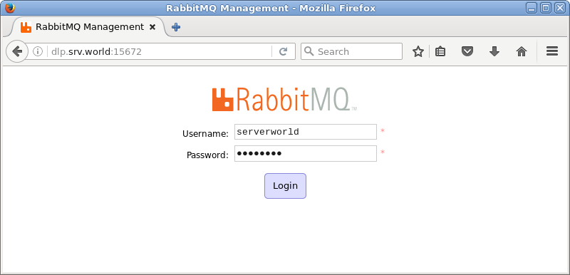
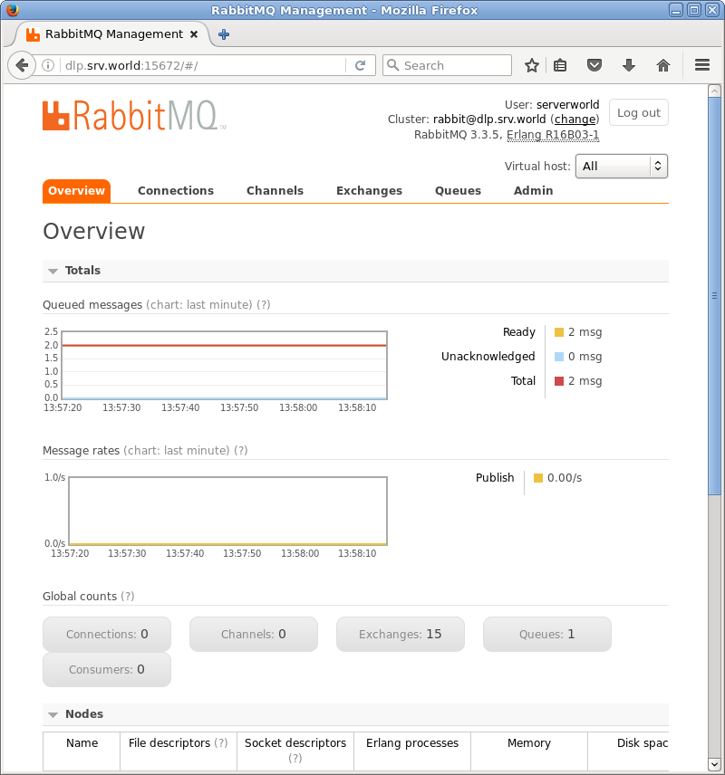
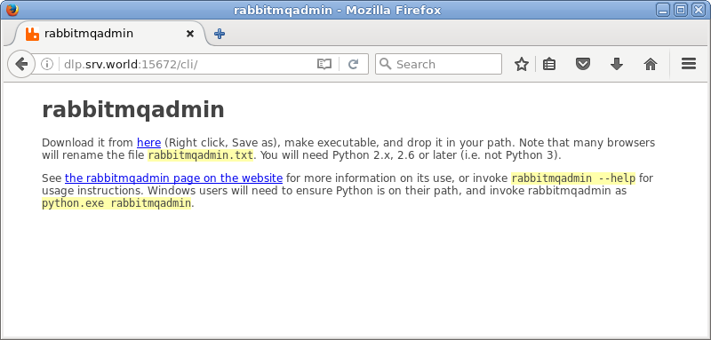
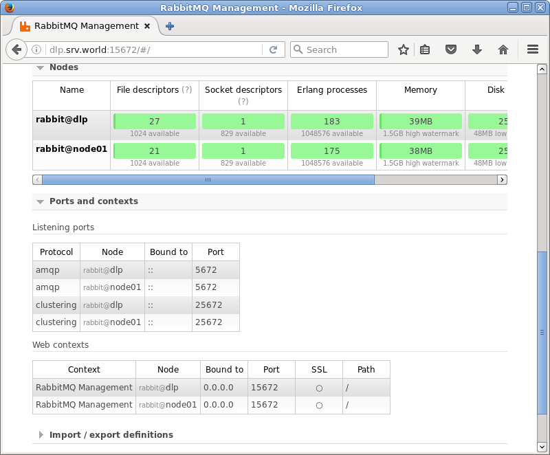

## 附1.11. 消息服务器

### 附1.11.1. RabbitMQ

[RabbitMQ](https://www.rabbitmq.com/)是由LShift提供的一个Advanced Message Queuing Protocol（AMQP）的开源实现，由以高性能、健壮以及可伸缩性出名的Erlang写成，因此也继承了这些优点。

#### 附1.11.1.1. 安装RabbitMQ

`yum --enablerepo=epel -y install rabbitmq-server` 从EPEL安装

```
systemctl start rabbitmq-server
systemctl enable rabbitmq-server
```

firewalld防火墙规则，允许RabbitMQ端口：

```
firewall-cmd --add-port=5672/tcp --permanent
firewall-cmd --reload
```

要使用RabbitMQ，先添加用户（默认情况下，只有guest用户存在，只能连接`localhost`）：

`rabbitmqctl add_user serverworld password` # 格式为：`rabbitmqctl add_user [user] [password]`

```
Creating user "serverworld" ...
...done.
```

`rabbitmqctl list_users` # 显示用户列表

```
Listing users ...
guest [administrator]
serverworld []
...done.
```

`rabbitmqctl change_password serverworld strongpassword` # 如下更改用户密码

```
Changing password for user "serverworld" ...
...done.
```

`rabbitmqctl set_user_tags serverworld administrator` # 如下向用户授予管理员角色

```
Setting tags for user "serverworld" to [administrator] ...
...done.
```

`rabbitmqctl delete_user serverworld` # 如下删除用户

```
Deleting user "serverworld" ...
...done.
```

添加虚拟主机：

`rabbitmqctl add_vhost /my_vhost` # 格式为：`rabbitmqctl add_vhost [vhost]`

```
Creating vhost "/my_vhost" ...
...done.
```

`rabbitmqctl list_vhosts` # 显示虚拟主机列表

```
Listing vhosts ...
/
/my_vhost
...done.
```

`rabbitmqctl delete_vhost /my_vhost` # 如下删除虚拟主机

```
Deleting vhost "/my_vhost" ...
...done.
```

为虚拟主机授予用户权限，如下配置：

`rabbitmqctl set_permissions -p /my_vhost serverworld ".*" ".*" ".*"` # 格式为：`rabbitmqctl set_permissions [-p vhost] [user] [permission ⇒ (modify) (write) (read)]`

```
Setting permissions for user "serverworld" in vhost "/my_vhost" ...
...done.
```

`rabbitmqctl list_permissions -p /my_vhost` # 显示虚拟主机权限

```
Listing permissions in vhost "/my_vhost" ...
serverworld     .*      .*      .*
...done.
```

`rabbitmqctl list_user_permissions serverworld` # 显示特定用户的权限

```
Listing permissions for user "serverworld" ...
/my_vhost       .*      .*      .*
...done.
```

`rabbitmqctl clear_permissions -p /my_vhost serverworld` # 如下删除特定用户的权限

```
Clearing permissions for user "serverworld" in vhost "/my_vhost" ...
...done.
```

#### 附1.11.1.2. 在Python上使用

这是在Python上使用RabbitMQ的示例。

安装AMQP客户端库：

`yum --enablerepo=epel -y install python2-pika` # 从EPEL安装

在Python上发送消息的示例。例如，使用用户“serverworld”，虚拟主机“my_vhost”连接RabbitMQ：

编辑`send_msg.py`文件：

```
#!/usr/bin/env python

import pika

credentials = pika.PlainCredentials('serverworld', 'password')
connection = pika.BlockingConnection(pika.ConnectionParameters(
                                     'localhost',
                                     5672,
                                     '/my_vhost',
                                     credentials))

channel = connection.channel()
channel.queue_declare(queue='Hello_World')

channel.basic_publish(exchange='',
                      routing_key='Hello_World',
                      body='Hello RabbitMQ World!')

print(" [x] Sent 'Hello_World'")

connection.close()
```

`python send_msg.py`

```
 [x] Sent 'Hello_World'
```

在Python上发送消息的示例。

编辑`receive_msg.py`文件：

```
#!/usr/bin/env python

import signal
import pika

signal.signal(signal.SIGPIPE, signal.SIG_DFL)
signal.signal(signal.SIGINT, signal.SIG_DFL)

credentials = pika.PlainCredentials('serverworld', 'password')
connection = pika.BlockingConnection(pika.ConnectionParameters(
                                     'dlp.srv.world',
                                     5672,
                                     '/my_vhost',
                                     credentials))

channel = connection.channel()
channel.queue_declare(queue='Hello_World')

def callback(ch, method, properties, body):
    print(" [x] Received %r" % body)

channel.basic_consume(callback,
                      queue='Hello_World',
                      no_ack=True)

print(' [*] Waiting for messages. To exit press CTRL+C')
channel.start_consuming()
```

`python receive_msg.py`

```
 [*] Waiting for messages. To exit press CTRL+C
 [x] Received 'Hello RabbitMQ World!'
```

#### 附1.11.1.3. 在PHP上使用

这是在PHP上使用RabbitMQ的示例。

安装一些软件包：

`yum --enablerepo=epel -y install composer php-bcmath` # 从EPEL安装

安装AMQP客户端库：

`composer require php-amqplib/php-amqplib`

```
Using version ^2.6 for php-amqplib/php-amqplib
./composer.json has been updated
Loading composer repositories with package information
Updating dependencies (including require-dev)
  - Installing php-amqplib/php-amqplib (v2.6.3)
    Downloading: 100%

Writing lock file
Generating autoload files
```

`composer install`

```
Loading composer repositories with package information
Installing dependencies (including require-dev) from lock file
Nothing to install or update
Generating autoload files
```

在PHP上发送消息的示例。例如，使用用户“serverworld”，虚拟主机“my_vhost”连接RabbitMQ：

编辑`send_msg.php`文件：

```
<?php
require_once __DIR__ . '/vendor/autoload.php';

use PhpAmqpLib\Connection\AMQPStreamConnection;
use PhpAmqpLib\Message\AMQPMessage;

$connection = new AMQPStreamConnection('127.0.0.1', 5672, 'serverworld', 'password', '/my_vhost');

$channel = $connection->channel();
$channel->queue_declare('Hello_World', false, false, false, false);

$msg = new AMQPMessage('Hello RabbitMQ World!');
$channel->basic_publish($msg, '', 'Hello_World');
echo " [x] Sent 'Hello_World'\n";

$channel->close();
$connection->close();
?>
```

`php send_msg.php`

```
 [x] Sent 'Hello_World'
```

在PHP上发送消息的示例。

编辑`receive_msg.php`文件：

```
<?php
require_once __DIR__ . '/vendor/autoload.php';
use PhpAmqpLib\Connection\AMQPStreamConnection;

$connection = new AMQPStreamConnection('127.0.0.1', 5672, 'serverworld', 'password', '/my_vhost');
$channel = $connection->channel();

$channel->queue_declare('Hello_World', false, false, false, false);

echo ' [*] Waiting for messages. To exit press CTRL+C', "\n";

$callback = function($msg) {
    echo " [x] Received ", $msg->body, "\n";
};

$channel->basic_consume('Hello_World', '', false, true, false, false, $callback);

while(count($channel->callbacks)) {
    $channel->wait();
}
?>
```

`php receive_msg.php`

```
 [*] Waiting for messages. To exit press CTRL+C
 [x] Received Hello RabbitMQ World!
```

#### 附1.11.1.4. 在Ruby上使用

这是在Ruby上使用RabbitMQ的示例。

安装AMQP客户端库：

`gem install bunny`

```
Fetching: bunny-2.5.1.gem (100%)
Successfully installed bunny-2.5.1
Parsing documentation for bunny-2.5.1
Installing ri documentation for bunny-2.5.1
1 gem installed
```

在Ruby上发送消息的示例。例如，使用用户“serverworld”，虚拟主机“my_vhost”连接RabbitMQ：

编辑`send_msg.rb`文件：

```
#!/usr/bin/env ruby

require "bunny"

connection = Bunny.new(
    :hostname => "127.0.0.1",
    :port => 5672,
    :vhost => "/my_vhost",
    :user => "serverworld",
    :pass => "password",
)
connection.start

channel = connection.create_channel

q = channel.queue("Hello_World")
channel.default_exchange.publish("Hello RabbitMQ World!", :routing_key => q.name)
puts " [x] Sent 'Hello RabbitMQ World!'"

connection.close
```

`ruby send_msg.rb`

```
 [x] Sent 'Hello RabbitMQ World!'
```

在Ruby上发送消息的示例。

编辑`receive_msg.rb`文件：

```
#!/usr/bin/env ruby

require "bunny"

Signal.trap(:INT){
    puts "Exited from receiving queues."
    exit(0)
}

connection = Bunny.new(
    :hostname => "127.0.0.1",
    :port => 5672,
    :vhost => "/my_vhost",
    :user => "serverworld",
    :pass => "password",
)
connection.start

channel = connection.create_channel
q = channel.queue("Hello_World")

puts " [*] Waiting for messages in #{q.name}. To exit press CTRL+C"
q.subscribe(:block => true) do |delivery_info, properties, body|
    puts " [x] Received #{body}"

    delivery_info.consumer.cancel
end
```

`ruby receive_msg.rb`

```
 [*] Waiting for messages in Hello_World. To exit press CTRL+C
 [x] Received Hello RabbitMQ World!
```

#### 附1.11.1.5. 使用Web界面

启用管理插件以使用基于Web的管理工具。

启用管理插件：

`rabbitmq-plugins enable rabbitmq_management`

```
The following plugins have been enabled:
  mochiweb
  webmachine
  rabbitmq_web_dispatch
  amqp_client
  rabbitmq_management_agent
  rabbitmq_management
Plugin configuration has changed. Restart RabbitMQ for changes to take effect.
```

`systemctl restart rabbitmq-server`

firewalld防火墙规则，添加Web界面端口：

```
firewall-cmd --add-port=15672/tcp --permanent
firewall-cmd --reload
```

从客户端访问`http://(RabbitMQ服务器的主机名或IP地址):15672/`，显示RabbitMQ登录表单，并使用添加的管理员登录：



登录成功，可以在这里做管理操作：



#### 附1.11.1.6. 使用rabbitmqadmin

可以使用`rabbitmqadmin`命令配置RabbitMQ。

在Web界面下载“rabbitmqadmin”

登录到Web界面并转到`http://(RabbitMQ服务器的主机名或IP地址):15672/cli`，显示以下屏幕，可以在这里下载“rabbitmqadmin”：



将“rabbitmqadmin”上传到RabbitMQ服务器并设置适当的权限，本例演示如下：

`ll /usr/local/bin/rabbitmqadmin`

```
-rwxr-xr-x. 1 root root 32406 Sep 5 19:12 /usr/local/bin/rabbitmqadmin
```

使用`rabbitmqadmin`命令进行基本操作：

`rabbitmqadmin help subcommands` # 显示子命令列表，只输入`help`选项

```
Usage
=====
  rabbitmqadmin [options] subcommand
.....
.....
```

`rabbitmqadmin list users` # 显示用户列表

```
+-------------+------------------------------+---------------+
|    name     |        password_hash         |     tags      |
+-------------+------------------------------+---------------+
| guest       | xxxxxxxxxxxxxxxxxxxxxxxxxxxx | administrator |
| serverworld | xxxxxxxxxxxxxxxxxxxxxxxxxxxx | administrator |
+-------------+------------------------------+---------------+
```

`rabbitmqadmin list vhosts` # 显示虚拟主机列表

```
+-----------+----------+----------------+-------------------------+----------+----------+---------+
|   name    | messages | messages_ready | messages_unacknowledged | recv_oct | send_oct | tracing |
+-----------+----------+----------------+-------------------------+----------+----------+---------+
| /         |          |                |                         |          |          | False   |
| /my_vhost | 2        | 2              | 0                       | 748      | 1004     | False   |
+-----------+----------+----------------+-------------------------+----------+----------+---------+
```

`rabbitmqadmin declare user name=centos password=password tags=administrator` # 添加用户

```
user declared
```

`rabbitmqadmin declare vhost name=/vhost01` # 添加虚拟主机

```
vhost declared
```

`rabbitmqadmin declare permission vhost=/vhost01 user=centos configure=".*" write=".*" read=".*"` # 授予权限

```
permission declared
```

`rabbitmqadmin -V /vhost01 -u centos -p password declare queue name=my_queue01` # 添加队列

```
queue declared
```

`rabbitmqadmin -V /vhost01 -u centos -p password publish routing_key=my_queue01 payload='Hello RabbitMQ World!' exchange=amq.default` # 发送消息

```
Message published
```

`rabbitmqadmin -V /vhost01 -u centos -p password get queue=my_queue01 requeue=false` # 接收消息

```
+-------------+----------+---------------+-----------------------+---------------+------------------+------------+-------+
| routing_key | exchange | message_count |        payload        | payload_bytes | payload_encoding | properties | red.. |
+-------------+----------+---------------+-----------------------+---------------+------------------+------------+-------+
| my_queue01  |          | 0             | Hello RabbitMQ World! | 21            | string           |            | False |
+-------------+----------+---------------+-----------------------+---------------+------------------+------------+
```

#### 附1.11.1.7. 配置集群

配置RabbitMQ集群，本例使用两台RabbitMQ服务器。

按照第一节内容在所有节点安装并启动RabbitMQ服务器（如果防火墙运行，同样都打开端口）。

firewalld防火墙规则，允许集群端口：

```
firewall-cmd --add-port={4369/tcp,25672/tcp} --permanent
firewall-cmd --reload
```

在节点上配置群集：

`ssh dlp.srv.world 'cat /var/lib/rabbitmq/.erlang.cookie' > /var/lib/rabbitmq/.erlang.cookie` # 在所有节点上放置相同的cookie

`systemctl restart rabbitmq-server`

`rabbitmqctl stop_app` # 停止程序

```
Stopping node rabbit@node01 ...
...done.
```

`rabbitmqctl reset` # 重置

```
Resetting node rabbit@node01 ...
...done.
```

`rabbitmqctl join_cluster rabbit@dlp` # 加入群集（仅指定主机名，不使用FQDN）

```
Clustering node rabbit@node01 with rabbit@dlp ...
...done.
```

`rabbitmqctl start_app` # 启动程序

```
Starting node rabbit@node01 ...
...done.
```

`rabbitmqctl cluster_status` # 显示状态

```
Cluster status of node rabbit@node01 ...
[{nodes,[{disc,[rabbit@dlp,rabbit@node01]}]},
 {running_nodes,[rabbit@dlp,rabbit@node01]},
 {cluster_name,<<"rabbit@dlp.srv.world">>},
 {partitions,[]}]
...done.
```

配置队列同步设置，本例演示配置队列在所有节点上同步（节点之间有一些同步的模式，可参考[官方网站的详细信息](https://www.rabbitmq.com/ha.html)）：

`rabbitmqadmin declare queue name=shared_queue` # 添加队列进行同步

```
queue declared
```

`rabbitmqctl set_policy ha-policy "shared_queue" '{"ha-mode":"all"}'` # 设置同步策略，格式为：`rabbitmqctl set_policy [policy name(any name you like)] [Queue] [Mode]`
```
Setting policy "ha-policy" for pattern "shared_queue" to "{\"ha-mode\":\"all\"}" with priority "0" ...
...done.
```

`rabbitmqadmin list queues name node policy slave_nodes state synchronised_slave_nodes` # 显示状态

```
+--------------+------------+-----------+---------------+---------+--------------------------+
|     name     |    node    |  policy   |  slave_nodes  |  state  | synchronised_slave_nodes |
+--------------+------------+-----------+---------------+---------+--------------------------+
| shared_queue | rabbit@dlp | ha-policy | rabbit@node01 | running | rabbit@node01            |
+--------------+------------+-----------+---------------+---------+--------------------------+
```

参照第五节，在所有节点上启用管理插件，可以看到每个节点的状态如下。


