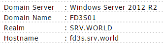

## 附1.2. 加入Windows活动目录

本教程需要局域网中的Windows活动目录域服务。

本例演示在下面的环境中进行配置：



安装一些所需的软件包：

`yum -y install realmd sssd oddjob oddjob-mkhomedir adcli samba-common`

加入Windows活动目录域：

将DNS更改为AD的：

`nmcli c modify ens3 ipv4.dns 10.0.0.100`

`nmcli c down ens3; nmcli c up ens3`

```
Connection successfully activated (D-Bus active path: /org/freedesktop/NetworkManager/ActiveConnection/1)
```

发现活动目录域：

`realm discover SRV.WORLD`

```
srv.world
  type: kerberos
  realm-name: SRV.WORLD
  domain-name: srv.world
  configured: no
  server-software: active-directory
  client-software: sssd
  required-package: oddjob
  required-package: oddjob-mkhomedir
  required-package: sssd
  required-package: adcli
  required-package: samba-common
```

加入活动目录域：

`realm join SRV.WORLD`

```
Password for Administrator:  # AD管理员密码
```

确认是否可以获得AD用户信息：

`id FD3S01\\Serverworld`

```
uid=406801001(serverworld@srv.world) gid=406800513(domain users@srv.world) groups=406800513(domain users@srv.world)
```

确认是否可以切换到AD用户：

`su - FD3S01\\Serverworld`

```
Creating home directory for serverworld@srv.world.
[serverworld@srv.world@dlp ~]$  # 已切换
```

如果想要AD用户省略域名，如下配置：

编辑`/etc/sssd/sssd.conf`文件：

```
# 更改
use_fully_qualified_names = False
```

`systemctl restart sssd`

`id Administrator`

```
uid=406800500(administrator) gid=406800513(domain users) groups=406800513(domain users),
406800572(denied rodc password replication group),406800518(schema admins),
406800520(group policy creator owners),406800512(domain admins),406800519(enterprise admins)
```
