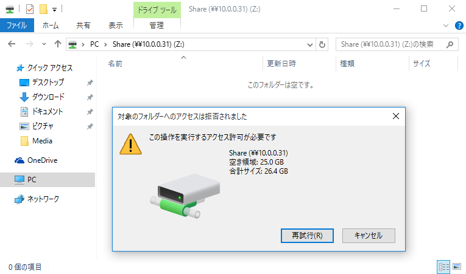
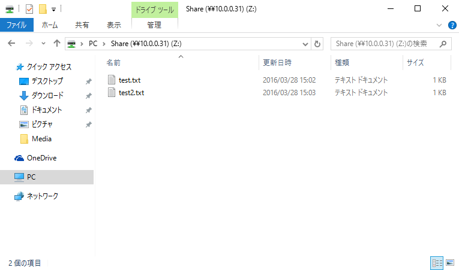
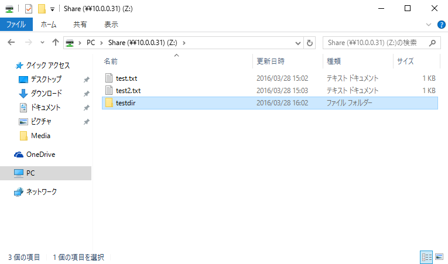

## 附1.3. 访问控制

### 附1.3.1. ACL

这是配置ACL（访问控制列表）的示例。

CentOS默认安装ACL，如果没有，运行以下命令安装：

`yum -y install acl`

如果使用CentOS7上默认的[XFS文件系统](http://oss.sgi.com/projects/xfs/)，则不必设置预设置来使用ACL功能。如果使用CentOS6上默认的ext4文件系统，则需要设置预设置才能使用ACL功能。以下为设置预设置：

对于CentOS6，在初始操作系统安装时设置的设备上，ACL选项已经通过默认挂载选项启用：

`tune2fs -l /dev/VolGroup/lv_root | grep "Default mount options"` # 显示默认挂载选项

```
Default mount options:   user_xattr acl  # ACL选项已添加
```

对于在操作系统安装后添加的设备（如添加HDD等）的情况，需要手动启用ACL选项。一种方法是使用ACL选项挂载设备，另一种方法是在默认挂载选项中添加ACL选项：

使用ACL选项来挂载以启用ACL：

`mount -o acl /dev/sdb1 /mnt`

`mount | grep sdb1`

```
/dev/sdb1 on /mnt type ext4 (rw,acl)
```

或将ACL选项添加到默认挂载选项：

`tune2fs -o acl /dev/sdb1`

`tune2fs -l /dev/vdb1 | grep "Default mount options"`

```
Default mount options: acl
```

预设置完成后，关于如何设置ACL，以为文件`/home/test.txt`设置ACL为例：

`ll /home/test.txt`

```
-rwx------ 1 root root 10 Jul  3 16:17 /home/test.txt
```

`setfacl -m u:cent:r /home/test.txt` # 为用户“cent”设置`/home/test.txt`为r（读）

`ll /home/test.txt` # 设置ACL后，在属性添加了“+”

```
-rwxr-----+ 1 root root 10 Jul  3 16:17 /home/test.txt
```

`getfacl /home/test.txt` # 确认设置

```
getfacl: Removing leading '/' from absolute path names
# file: home/test.txt
# owner: root
# group: root
user::rwx
user:cent:r--
group::---
mask::r--
other::---
```

以用户“cent”尝试访问：

`cat /home/test.txt`

```
ACL test file  # 正常读取
```

以其他用户尝试访问：

`cat /home/test.txt`

```
cat: /home/test.txt: Permission denied  # 不能正常读取
```

递归设置ACL到目录：

`setfacl -R -m u:cent:r /home/testdir` # 为用户“cent”设置`/home/testdir`为r（读）

`ll /home/testdir`

```
total 4
-rwxr-----+ 1 root root 5 Jul  3 16:23 testfile
```

`getfacl -R /home/testdir`

```
getfacl: Removing leading '/' from absolute path names
# file: home/testdir
# owner: root
# group: root
user::rwx
user:cent:r--
group::---
mask::r--
other::---

# file: home/testdir/testfile
# owner: root
# group: root
user::rwx
user:cent:r--
group::---
mask::r--
other::---
```

按组设置ACL：

`setfacl -m g:security:rw /home/test.txt` # 为组“security”设置`/home/test.txt`为rw（读/写）

`getfacl /home/test.txt`

```
getfacl: Removing leading '/' from absolute path names
# file: home/test.txt
# owner: root
# group: root
user::rwx
user:cent:r--
group::---
group:security:rw-
mask::rw-
other::---
```

以组“security”中的用户“cent”尝试访问：

`echo "test write" >> /home/test.txt`

`cat /home/test.txt`

```
ACL test file
test write  # 正常写入
```

以不是组“security”中的用户尝试访问：

`echo "test write" >> /home/test.txt`

```
-bash: /home/test.txt: Permission denied  # 不能正常写入
```

移除ACL：

`setfacl -b /home/test.txt` # 从`/home/test.txt`移除ACL

`setfacl -x u:fedora /home/test.txt` # 仅为用户“fedora”在`/home/test.txt`移除ACL

为目录设置默认ACL。如果在设置了默认ACL的目录下创建文件/目录，默认访问属性是继承的。但要注意，如果使用`chmod`更改属性，则ACL将无效：

`setfacl -m u:cent:r-x /home/testdir`

为用户“cent”设置`/home/testdir`默认ACL为r-x（读/执行）：

`setfacl -d -m u:cent:r-x /home/testdir`

`getfacl /home/testdir`

```
getfacl: Removing leading '/' from absolute path names
# file: home/testdir
# owner: root
# group: root
user::rwx
user:cent:r-x
group::---
mask::r-x
other::---
default:user::rwx
default:user:cent:r-x
default:group::---
default:mask::r-x
default:other::---
```

`echo "ACL default setting" > /home/testdir/test.txt`

`ll /home/testdir/test.txt`

```
-rw-r-----+ 1 root root 20 Jan 31 22:32 /home/testdir/test.txt
```

以用户“cent”尝试访问：

`cat /home/testdir/test.txt`

```
ACL default setting  # 正常读取
```

移除默认ACL：

`setfacl -k /home/testdir`

`getfacl /home/testdir`

```
getfacl: Removing leading '/' from absolute path names
# file: home/testdir
# owner: root
# group: root
user::rwx
user:cent:r-x
group::---
mask::r-x
other::---
```

从配置文件设置ACL：

编辑`acl.txt`文件，创建ACL的配置文件（如果想在其他系统上设置ACL，可以使用`getfacl`命令导出）：

```
# file: /home/testdir
# owner: root
# group: root
user::rwx
user:cent:r-x
group::---
mask::r-x
other::---

# file: /home/test.txt
# owner: root
# group: root
user::rwx
user:cent:r--
group::---
mask::r--
other::---
```

`setfacl --restore=acl.txt`

`ll /home`

```
total 16
drwx------. 2 cent   cent   4096 Jan 31 12:14 cent
drwx------  2 fedora fedora 4096 Jan 31 12:14 fedora
drwxr-x---+ 2 root   root   4096 Jan 31 22:32 testdir
-rwxr-----+ 1 root   root     25 Jan 31 21:56 test.txt
```

### 附1.3.2. TCP Wrapper

这是[TCP Wrapper](https://access.redhat.com/documentation/en-US/Red_Hat_Enterprise_Linux/7/html/Security_Guide/sec-Securing_Network_Access.html#sec-Securing_Services_With_TCP_Wrappers_and_xinetd)的TCP访问控制示例。

安装TCP Wrapper：

`yum -y install tcp_wrappers`

使用以下命令确认服务是否可以在TCP Wrapper控制下。如果包含`libwrap`的链接，表示可以：

`ldd /usr/sbin/sshd | grep wrap`

```
libwrap.so.0 => /lib64/libwrap.so.0 (0x00007f01b4e2a000)  # 这个服务可以在TCP Wrapper控制下，因为它包含'libwrap'
```

TCP Wrapper的访问控制配置在`/etc/hosts.allow`和`/etc/hosts.deny`中。下面示例演示设置允许从`10.0.0.0/24`访问sshd的配置：

编辑`/etc/hosts.deny`文件：

```
sshd: ALL
```

编辑`/etc/hosts.allow`文件：


```
sshd: 10.0.0.
```

对于允许从`host.example.domain`访问vsftpd的情况：

编辑`/etc/hosts.deny`文件：

```
vsftpd: ALL
```

编辑`/etc/hosts.allow`文件：


```
vsftpd: host.example.domain
```

下面这种情况，只允许从`example.domain`和`10.0.1.0/24`访问所有在TCP Wrapper控制下的服务：

编辑`/etc/hosts.deny`文件：

```
ALL: ALL
```

编辑`/etc/hosts.allow`文件：


```
ALL: .example.domain 10.0.1.
```

### 附1.3.3. SELinux

[SELinux](https://selinuxproject.org/page/Main_Page)（Security-Enhanced Linux安全增强式Linux）是美国国家安全局（NSA）对于强制访问控制的实现，是Linux历史上最杰出的新安全子系统。红帽上的[SELinux用户和管理员指南](https://access.redhat.com/documentation/en-US/Red_Hat_Enterprise_Linux/7/html/SELinux_Users_and_Administrators_Guide/)。

#### 附1.3.3.1. 操作模式

可以通过SELinux在CentOS上使用MAC（Mandatory Access Control强制访问控制）功能来获取各种资源。

如下确认SELinux的当前状态（默认模式为“Enforcing”）：

`getenforce` # 显示当前模式

```
Enforcing
```

* enforcing -> SELinux已启用（默认）
* permissive -> MAC未启用，但仅根据策略记录审计日志
* disabled -> SELinux已禁用

也可以使用下面命令显示（“Current mode”行）：

`sestatus`

```
SELinux status:                 enabled
SELinuxfs mount:                /sys/fs/selinux
SELinux root directory:         /etc/selinux
Loaded policy name:             targeted
Current mode:                   enforcing
Mode from config file:          enforcing
Policy MLS status:              enabled
Policy deny_unknown status:     allowed
Max kernel policy version:      28
```

可以通过`setenforce`命令在“permissive”和“enforcing”之间切换当前模式。但是如果系统重新启动，则模式将回到默认状态：

`getenforce`

```
Enforcing
```

`setenforce 0` # 切换到“Permissive”

`getenforce`

```
Permissive
```

`setenforce 1` # 切换到“Enforcing”

`getenforce`

```
Enforcing
```

如果要永久更改操作模式，更改配置文件中的值：

编辑`/etc/selinux/config`文件：

```
# This file controls the state of SELinux on the system.
# SELINUX= can take one of these three values:
#     enforcing - SELinux security policy is enforced.
#     permissive - SELinux prints warnings instead of enforcing.
#     disabled - No SELinux policy is loaded.
# 更改为要设置的值
SELINUX=enforcing
# SELINUXTYPE= can take one of these two values:
#     targeted - Targeted processes are protected,
#     minimum - Modification of targeted policy. Only selected processes are protected.
#     mls - Multi Level Security protection.
SELINUXTYPE=targeted
```

`reboot` # 重启系统后生效

如果将操作模式从“Disabled”更改为“Enforcing/Permissive”，则需要使用SELinux上下文重新标记文件系统。因为当在“Disabled”模式下创建一些文件或目录时，它们没有使用SELinux上下文标记，需要对它们进行标记：

`touch /.autorelabel` # 如下设置重新标记，在下一次系统重新启动时完成

`reboot`

#### 附1.3.3.2. 策略类型

如果SELinux处于“Enforcing/Permissive”状态，可以选择策略类型。如果需要，可以根据自己的环境修改所选策略。

可以在`/etc/selinux/config`文件中设置策略类型。CentOS7默认策略是“targeted”策略。但是，如果要更改策略类型，需要安装策略文件。对于最小化安装的CentOS7，默认仅安装“targeted”策略。

**如果在不安装策略文件的情况下更改策略，系统将无法启动，请小心**。

`cat /etc/selinux/config`

```
# This file controls the state of SELinux on the system.
# SELINUX= can take one of these three values:
#     enforcing - SELinux security policy is enforced.
#     permissive - SELinux prints warnings instead of enforcing.
#     disabled - No SELinux policy is loaded.
SELINUX=enforcing
# SELINUXTYPE= can take one of these two values:
#     targeted - Targeted processes are protected,
#     minimum - Modification of targeted policy. Only selected processes are protected.
#     mls - Multi Level Security protection.
# 默认为“targeted”
SELINUXTYPE=targeted
```

例如，改为“minimum”策略：

**首先安装策略文件**：

`yum -y install selinux-policy-minimum`

策略文件安装在`minimum`目录下：

`ll /etc/selinux`

```
total 16
-rw-r--r--. 1 root root  547 Mar 18 16:23 config
drwxr-xr-x. 6 root root 4096 Mar 18 17:26 minimum
-rw-r--r--. 1 root root 2321 Nov 20 16:04 semanage.conf
drwxr-xr-x. 6 root root 4096 Mar 18 16:24 targeted
```

编辑`/etc/selinux/config`文件：

```
# 更改“SELINUXTYPE”部门
# This file controls the state of SELinux on the system.
# SELINUX= can take one of these three values:
#     enforcing - SELinux security policy is enforced.
#     permissive - SELinux prints warnings instead of enforcing.
#     disabled - No SELinux policy is loaded.
SELINUX=enforcing
# SELINUXTYPE= can take one of these two values:
#     targeted - Targeted processes are protected,
#     minimum - Modification of targeted policy. Only selected processes are protected.
#     mls - Multi Level Security protection.
SELINUXTYPE=minimum
```

`reboot` # 重启系统后生效

`sestatus`

```
SELinux status:                 enabled
SELinuxfs mount:                /sys/fs/selinux
SELinux root directory:         /etc/selinux
Loaded policy name:             minimum  # 已经变更
Current mode:                   enforcing
Mode from config file:          enforcing
Policy MLS status:              enabled
Policy deny_unknown status:     allowed
Max kernel policy version:      28
```

配置文件中的示例包括RPM包提供的三种策略：

| 策略 | 描述 |
| - | - |
| Targeted | 此策略将访问控制应用于通常的攻击目标进程（默认） |
| Minimum | 此策略包含的设置文件与“Targeted”策略相同，但是与“Targeted”策略相比，访问控制的目标进程少得多 |
| MLS | Multilevel Security Policy多级安全策略。它实现了Bell-LaPadula（BLP）模型，并可能应用更复杂的控件 |

#### 附1.3.3.3. SELinux上下文

对文件或目录的访问控制由称为SELinux Context（SELinux上下文）的附加信息控制。

SELinux上下文有以下语法：`[SELinux User]:[Role]:[Type]:[Level]`

* SELinux User：SELinux用户属性。每个Linux用户都通过SELinux策略映射到SELinux用户。
* Role：RBAC（Role Based Access Control基于角色的访问控制）属性。它定义了SELinux用户的角色，控制哪些定义的角色可以通过SELinux策略访问域（Domain）。
* Type：TE（Type Enforcement）属性。它定义了进程的域（Domain），并定义了文件类型。
* Level：MLS（Multi Level Security多级安全）和MCS（Multi Category Security多类别安全）属性。Level的语法：`[sensitivity]:[category]`
  * RHEL/CentOS默认的“targeted”策略强制MCS，此策略sensitivity只使用“s0” ，category支持“c0-c1023”。
  * MLS强制Bell-La Padula强制访问模型。如果想使用它，则需要在RHEL/CentOS上安装MLS策略软件包。但它不支持X Window系统，所以不能在桌面环境中使用。

要显示文件或进程的SELinux上下文，在命令中添加`Z`选项：

`ls -Z /root` # 文件/目录

```
                        User  :  Role  :    Type    : Level
                      --------:--------:------------:------
-rw-------. root root system_u:object_r:admin_home_t:s0     anaconda-ks.cfg
```

`ps axZ` # 进程

```
LABEL                             PID TTY      STAT   TIME COMMAND
system_u:system_r:init_t:s0         1 ?        Ss     0:01 /usr/lib/systemd/syst
system_u:system_r:kernel_t:s0       2 ?        S      0:00 [kthreadd]
system_u:system_r:kernel_t:s0       3 ?        S      0:00 [ksoftirqd/0]
.....
.....
system_u:system_r:postfix_master_t:s0 916 ?    Ss     0:00 /usr/libexec/postfix/
system_u:system_r:postfix_pickup_t:s0 917 ?    S      0:00 pickup -l -t unix -u
system_u:system_r:postfix_qmgr_t:s0 918 ?      S      0:00 qmgr -l -t unix -u
system_u:system_r:kernel_t:s0     941 ?        S<     0:00 [kworker/1:1H]
system_u:system_r:kernel_t:s0     966 ?        S<     0:00 [kworker/0:1H]
system_u:system_r:kernel_t:s0    1246 ?        S<     0:00 [kworker/0:2H]
```

`id -Z` # 自己的ID

```
unconfined_u:unconfined_r:unconfined_t:s0-s0:c0.c1023
```

`yum -y install policycoreutils-python` # 如果`semanage`命令不存在，则运行安装

每个Linux用户都通过SELinux策略映射到SELinux用户，可以显示如下的映射列表：

`semanage login -l`

```
Login Name           SELinux User         MLS/MCS Range        Service

__default__          unconfined_u         s0-s0:c0.c1023       *
root                 unconfined_u         s0-s0:c0.c1023       *
system_u             system_u             s0-s0:c0.c1023       *
```

对于上面的示例（RHEL/CentOS默认）：“root”映射到“unconfined_u”；“bin”或“daemon”等系统用户映射到“system_u”；其他普通用户映射到“__default__”一次，最后映射到“unconfined_u”。

“unconfined_u”用户被分配“unconfined_r”角色，由“unconfined_u”用户启动的进程以“unconfined_t”域运行。

“unconfined_t”域分配的进程不受SELinux控制。

`ps axZ | grep unconfined_t`

```
unconfined_u:unconfined_r:unconfined_t:s0-s0:c0.c1023 1435 ttyS0 Ss   0:00 -bash
unconfined_u:unconfined_r:unconfined_t:s0-s0:c0.c1023 1556 ttyS0 R+   0:00 ps axZ
unconfined_u:unconfined_r:unconfined_t:s0-s0:c0.c1023 1557 ttyS0 S+   0:00 grep --color=auto unconfined_t
```

#### 附1.3.3.4. 更改布尔值

在SELinux策略提供的RPM软件包如“targeted”，可以轻松地更改SELinux设置来切换布尔值。

下例是基于“targeted”策略环境。

可以如下使用布尔值：

`getsebool -a` # 显示列表和当前设置

```
abrt_anon_write --> off
abrt_handle_event --> off
abrt_upload_watch_anon_write --> on
.....
.....
zoneminder_anon_write --> off
zoneminder_run_sudo --> off
```

`semanage boolean -l` # 同时显示描述

```
SELinux boolean                State  Default Description

ftp_home_dir                   (off  ,  off)  Allow ftp to home dir
smartmon_3ware                 (off  ,  off)  Allow smartmon to 3ware
mpd_enable_homedirs            (off  ,  off)  Allow mpd to enable homedirs
.....
.....
cron_can_relabel               (off  ,  off)  Allow cron to can relabel
sftpd_anon_write               (off  ,  off)  Allow sftpd to anon write
```

例如，配置“samba_enable_home_dirs”布尔值。

“samba_enable_home_dirs”默认设置为“off”，表示启用了SELinux的访问控制。

如果像这样[配置了Samba完全访问共享文件夹](../8. 文件服务器/8.2. Samba.html#821-完全访问共享文件夹)，是不可能访问它，SELinux拒绝，因为正确的SELinux上下文没有分配给文件夹。

`semanage boolean -l | grep samba_enable_home_dirs` # 默认设置为“off”

```
samba_enable_home_dirs         (off  ,  off)  Allow samba to enable home dirs
```

设置完全访问的共享文件夹后，创建一些测试文件（SELinux上下文从`/home/share`目录继承）：

`ls -Z /home/share`

```
-rw-rw-r--. cent cent unconfined_u:object_r:home_root_t:s0 test2.txt
-rw-r--r--. root root unconfined_u:object_r:home_root_t:s0 test.txt
```

访问被拒绝如下，即使文件具有读取权限，父目录具有777权限：



将“samba_enable_home_dirs”的布尔值更改为“on”，以便能够正常访问文件夹：

`setsebool -P samba_enable_home_dirs on`

`getsebool samba_enable_home_dirs`

```
samba_enable_home_dirs --> on  # 已变更
```

`ls -Z /home/share` # “samba_enable_home_dirs”为“off”时SELinux上下文被添加

```
-rw-rw-r--. cent cent unconfined_u:object_r:home_root_t:s0 test2.txt
-rw-r--r--. root root unconfined_u:object_r:home_root_t:s0 test.txt
```

`restorecon -R /home/share` # 恢复“samba_enable_home_dirs”的默认SELinux上下文

`ls -Z /home/share` # 显示SELinux上下文（更改为user_home_t）

```
-rw-rw-r--. cent cent unconfined_u:object_r:user_home_t:s0 test2.txt
-rw-r--r--. root root unconfined_u:object_r:user_home_t:s0 test.txt
```

所有配置完成后，可以如下所示访问文件夹：





#### 附1.3.3.5. 更改文件类型

可以修改访问控制设置以更改文件类型而不更改布尔值。

下例是基于“targeted”策略环境。

默认SELinux上下文的设置放在`[policy directory]/contexts/files`下面，如下所示：

`ll /etc/selinux/targeted/contexts/files`

```
total 2104
-rw-r--r--. 1 root root  368879 Mar 28 15:46 file_contexts
-rw-------. 1 root root 1336352 Mar 28 15:46 file_contexts.bin
-rw-r--r--. 1 root root   13169 Mar 28 15:46 file_contexts.homedirs
-rw-------. 1 root root   43960 Mar 28 15:46 file_contexts.homedirs.bin
-rw-r--r--. 1 root root       0 Feb 17 02:24 file_contexts.local
-rw-------. 1 root root      16 Mar 28 15:46 file_contexts.local.bin
-rw-r--r--. 1 root root  365908 Oct 21 11:19 file_contexts.pre
-rw-r--r--. 1 root root       0 Feb 17 02:24 file_contexts.subs
-rw-r--r--. 1 root root     422 Feb 17 02:24 file_contexts.subs_dist
-rw-r--r--. 1 root root     139 Feb 17 02:24 media
```

`head /etc/selinux/targeted/contexts/files/file_contexts`

```
/.*     system_u:object_r:default_t:s0
/[^/]+  --      system_u:object_r:etc_runtime_t:s0
/a?quota\.(user|group)  --      system_u:object_r:quota_db_t:s0
/nsr(/.*)?      system_u:object_r:var_t:s0
/sys(/.*)?      system_u:object_r:sysfs_t:s0
/xen(/.*)?      system_u:object_r:xen_image_t:s0
/mnt(/[^/]*)?   -l      system_u:object_r:mnt_t:s0
/mnt(/[^/]*)?   -d      system_u:object_r:mnt_t:s0
/bin/.* system_u:object_r:bin_t:s0
/dev/.* system_u:object_r:device_t:s0
```

例如，修改文件类型，以便在httpd上使用CGI：

在httpd上使用CGI的布尔值默认设置为“on”，因此可以使用默认SELinux设置在httpd设置上的默认目录`/var/www/cgi-bin/`下运行CGI：

`semanage boolean -l | grep httpd_enable_cgi`

```
httpd_enable_cgi               (on   ,   on)  Allow httpd to enable cgi
```

`grep "cgi" /etc/selinux/targeted/contexts/files/file_contexts | grep "httpd"`

```
/usr/.*\.cgi    --      system_u:object_r:httpd_sys_script_exec_t:s0
/opt/.*\.cgi    --      system_u:object_r:httpd_sys_script_exec_t:s0
/var/www/[^/]*/cgi-bin(/.*)?    system_u:object_r:httpd_sys_script_exec_t:s0
/var/www/html/[^/]*/cgi-bin(/.*)?       system_u:object_r:httpd_sys_script_exec_t:s0
/usr/lib/cgi-bin(/.*)?  system_u:object_r:httpd_sys_script_exec_t:s0
/var/www/cgi-bin(/.*)?  system_u:object_r:httpd_sys_script_exec_t:s0
/usr/lib/cgi-bin/(nph-)?cgiwrap(d)?     --      system_u:object_r:httpd_suexec_exec_t:s0
/var/log/cgiwrap\.log.* --      system_u:object_r:httpd_log_t:s0
```

`curl http://localhost/cgi-bin/index.py` # 创建测试脚本并访问它，可以访问了

```
CGI Test Page
```

但是，如果要在[另一个目录中使用CGI](../5. Web服务器/5.1. Apache httpd.html#515-使用python脚本)，即使httpd设置正确，访问也被拒绝：

`curl http://localhost/cgi-enabled/index.py`

```
<!DOCTYPE HTML PUBLIC "-//IETF//DTD HTML 2.0//EN">
<html><head>
<title>500 Internal Server Error</title>
</head><body>
<h1>Internal Server Error</h1>
<p>The server encountered an internal error or
misconfiguration and was unable to complete
your request.</p>
.....
.....
```

`ls -Z /var/www/html/cgi-enabled` # “httpd_sys_content_t”被分配

```
-rwxr-xr-x. root root unconfined_u:object_r:httpd_sys_content_t:s0 index.py
```

在这种情况下，需要将文件类型更改为SELinux允许CGI的文件类型。

如下更改文件类型（注意：使用`chcon`命令做的更改会在使用`restorecon`命令或是重新标记文件系统后恢复）：

`chcon -t httpd_sys_script_exec_t /var/www/html/cgi-enabled/index.py`

`ls -Z /var/www/html/cgi-enabled`

```
-rwxr-xr-x. root root unconfined_u:object_r:httpd_sys_script_exec_t:s0 index.py
```

`curl http://localhost/cgi-enabled/index.py`

```
CGI Test Page  # 访问成功
```

如果想永久更改类型，按如下所示进行设置：

`semanage fcontext -a -t httpd_sys_script_exec_t /var/www/html/cgi-enabled/index.py`

`grep "cgi-enabled" /etc/selinux/targeted/contexts/files/file_contexts.local`

```
# 写为了默认上下文
/var/www/html/cgi-enabled/index.py    system_u:object_r:httpd_sys_script_exec_t:s0
```

`ls -Z /var/www/html/cgi-enabled`

```
-rwxr-xr-x. root root unconfined_u:object_r:httpd_sys_content_t:s0 index.py
```

`restorecon /var/www/html/cgi-enabled/index.py` # 用`restotecon`重置

`ls -Z /var/www/html/cgi-enabled`

```
# 已恢复
-rwxr-xr-x. root root unconfined_u:object_r:httpd_sys_script_exec_t:s0 index.py
```

`curl http://localhost/cgi-enabled/index.py`

```
CGI Test Page  # 访问成功
```

#### 附1.3.3.6. 更改端口类型

SELinux标记类型（Type）到网络端口，因此无法使用未配置类型的端口启动服务。

如下所示，显示网络端口的类型列表：

`semanage port -l`

```
SELinux Port Type              Proto    Port Number

afs3_callback_port_t           tcp      7001
afs3_callback_port_t           udp      7001
afs_bos_port_t                 udp      7007
.....
.....
zookeeper_leader_port_t        tcp      2888
zope_port_t                    tcp      8021
```

例如给httpd设置82端口（http的默认端口80，https的端口443如下所示被标记为“http_port_t”，当然没有设置82。所以如果使用“listen 82”正确配置`httpd.conf`，httpd将不会启动，因为SELinux拒绝了。如果想使用82，将其添加到“http_port_t”。）：

`semanage port -l | grep -E -w "80|443"` # 显示当前设置

```
http_port_t                    tcp      80, 81, 443, 488, 8008, 8009, 8443, 9000
```

`semanage port -a -t http_port_t -p tcp 82` # 添加82端口

`semanage port -l | grep "^http_port_t"`

```
# 已添加
http_port_t                    tcp      82, 80, 81, 443, 488, 8008, 8009, 8443, 9000
```

`ss -napt` # 更改`httpd.conf`后，重新启动httpd并验证运行

```
# httpd侦听82端口
State      Recv-Q Send-Q Local Address:Port               Peer Address:Port
LISTEN     0      50           *:3306                     *:*                   users:(("mysqld",pid=1081,fd=14))
LISTEN     0      50           *:139                      *:*                   users:(("smbd",pid=867,fd=38))
LISTEN     0      128          *:22                       *:*                   users:(("sshd",pid=821,fd=3))
LISTEN     0      100    127.0.0.1:25                     *:*                   users:(("master",pid=1132,fd=13))
LISTEN     0      50           *:445                      *:*                   users:(("smbd",pid=867,fd=37))
LISTEN     0      50          :::139                     :::*                   users:(("smbd",pid=867,fd=36))
LISTEN     0      128         :::82                      :::*                   users:(("httpd",pid=1356,fd=4),("httpd",p...
LISTEN     0      128         :::22                      :::*                   users:(("sshd",pid=821,fd=4))
LISTEN     0      100        ::1:25                      :::*                   users:(("master",pid=1132,fd=14))
LISTEN     0      50          :::445                     :::*                   users:(("smbd",pid=867,fd=35))
```

#### 附1.3.3.7. 搜索日志

访问成功或被SELinux拒绝的决定被缓存一次，拒绝访问被发送到日志文件。SELinux的缓存称为AVC（Access Vector Cache访问向量缓存），拒绝访问也称为“AVC拒绝”。AVC拒绝日志是通过[Rsyslog服务](../附1. 一些可能有用的/附1.1. 系统安全.html#附1133-rsyslog)或[Audit服务](../附1. 一些可能有用的/附1.1. 系统安全.html#附1132-auditd)生成的，所以它需要服务正在运行。

通过Rsyslog发送的消息是使用“kern”工具生成的。CentOS默认的Rsyslog设置写为`*.info;xxx /var/log/messages`，所以AVC拒绝日志记录到`/var/log/messages`：

`grep "avc: .denied" /var/log/messages`

```
Apr  2 13:20:06 www kernel: type=1400 audit(1459743606.523:6): avc:  denied  { read } for  pid=1298
     comm="httpd" name="index.html" dev="dm-0" ino=67206855 scontext=system_u:system_r:httpd_t:s0
     tcontext=unconfined_u:object_r:user_home_t:s0 tclass=file
Apr  2 13:22:13 www kernel: type=1400 audit(1459743733.690:4): avc:  denied  { read } for  pid=891
     comm="httpd" name="index.html" dev="dm-0" ino=67206855 scontext=system_u:system_r:httpd_t:s0
     tcontext=unconfined_u:object_r:user_home_t:s0 tclass=file
```

通过Auditd的消息生成到`/var/log/audit/audit.log`：

`grep "avc: .denied" /var/log/audit/audit.log`

```
type=AVC msg=audit(1459146274.923:133): avc:  denied  { create } for  pid=8173 comm="smbd"
     name=E696B0E38197E38184E38395E382A9E383ABE38380E383BC scontext=system_u:system_r:smbd_t:s0
     tcontext=system_u:object_r:user_home_dir_t:s0 tclass=dir
type=AVC msg=audit(1459146274.924:134): avc:  denied  { create } for  pid=8173 comm="smbd"
     name=E696B0E38197E38184E38395E382A9E383ABE38380E383BC scontext=system_u:system_r:smbd_t:s0
     tcontext=system_u:object_r:user_home_dir_t:s0 tclass=dir
type=AVC msg=audit(1459217340.695:63): avc:  denied  { name_bind } for  pid=1320 comm="httpd"
     src=82 scontext=system_u:system_r:httpd_t:s0 tcontext=system_u:object_r:reserved_port_t:s0 tclass=tcp_socket
type=AVC msg=audit(1459217340.696:64): avc:  denied  { name_bind } for  pid=1320 comm="httpd"
     src=82 scontext=system_u:system_r:httpd_t:s0 tcontext=system_u:object_r:reserved_port_t:s0 tclass=tcp_socket
```

对于通过Auditd的消息，可以使用[`ausearch`命令]((../附1. 一些可能有用的/附1.1. 系统安全.html#附11323-使用ausearch搜索日志))搜索它们：

`ausearch -m AVC`

```
----
time->Mon Mar 28 14:59:30 2016
type=SYSCALL msg=audit(1459144770.995:64): arch=c000003e syscall=83 success=no exit=-13 a0=7fac66386bb0
     a1=1ff a2=1ff a3=7fac66388888 items=0 ppid=8142 pid=8173 auid=4294967295 uid=99 gid=0 euid=99 suid=0
     fsuid=99 egid=99 sgid=0 fsgid=99 tty=(none) ses=4294967295 comm="smbd" exe="/usr/sbin/smbd"
     subj=system_u:system_r:smbd_t:s0 key=(null) type=AVC msg=audit(1459144770.995:64):
     avc:  denied  { create } for  pid=8173 comm="smbd" name=E696B0E38197E38184E38395E382A9E383ABE38380E383BC
     scontext=system_u:system_r:smbd_t:s0 tcontext=system_u:object_r:user_home_dir_t:s0 tclass=dir
----
time->Mon Apr  4 11:27:08 2016
type=SYSCALL msg=audit(1459736828.877:69): arch=c000003e syscall=49 success=no exit=-13 a0=3 a1=7efddf9b8cf8
     a2=10 a3=7ffceb56695c items=0 ppid=1 pid=1407 auid=4294967295 uid=0 gid=0 euid=0 suid=0 fsuid=0 egid=0
     gid=0 fsgid=0 tty=(none) ses=4294967295 comm="httpd" exe="/usr/sbin/httpd" subj=system_u:system_r:httpd_t:s0
     key=(null) type=AVC msg=audit(1459736828.877:69): avc:  denied  { name_bind } for  pid=1407 comm="httpd"
     src=82 scontext=system_u:system_r:httpd_t:s0 tcontext=system_u:object_r:reserved_port_t:s0 tclass=tcp_socket
----
time->Mon Apr  4 11:27:08 2016
type=SYSCALL msg=audit(1459736828.877:68): arch=c000003e syscall=49 success=no exit=-13 a0=4 a1=7efddf9b8db8
     a2=1c a3=7ffceb566710 items=0 ppid=1 pid=1407 auid=4294967295 uid=0 gid=0 euid=0 suid=0 fsuid=0 egid=0
     sgid=0 fsgid=0 tty=(none) ses=4294967295 comm="httpd" exe="/usr/sbin/httpd" subj=system_u:system_r:httpd_t:s0
     key=(null) type=AVC msg=audit(1459736828.877:68): avc:  denied  { name_bind } for  pid=1407 comm="httpd"
     src=82 scontext=system_u:system_r:httpd_t:s0 tcontext=system_u:object_r:reserved_port_t:s0 tclass=tcp_socket
```

对于通过Auditd的消息，可以使用[`aureport`命令](../附1. 一些可能有用的/附1.1. 系统安全.html#附11324-使用aureport显示日志)显示汇总报告：

`aureport --avc`

```
AVC Report
========================================================
# date time comm subj syscall class permission obj event
========================================================
1. 08/08/2015 02:13:50 ? system_u:system_r:init_t:s0 0 (null) (null) (null) unset 347
2. 03/28/2016 13:51:10 ? system_u:system_r:kernel_t:s0 0 (null) (null) (null) unset 9
3. 03/28/2016 14:59:30 smbd system_u:system_r:smbd_t:s0 83 dir create system_u:object_r:user_home_dir_t:s0 denied 64
4. 03/28/2016 14:59:30 smbd system_u:system_r:smbd_t:s0 83 dir create system_u:object_r:user_home_dir_t:s0 denied 65
5. 03/28/2016 14:59:30 smbd system_u:system_r:smbd_t:s0 83 dir create system_u:object_r:user_home_dir_t:s0 denied 66
.....
.....
64. 04/04/2016 11:27:03 httpd system_u:system_r:httpd_t:s0 42 tcp_socket name_connect system_u:object_r:reserved_...
65. 04/04/2016 11:27:08 httpd system_u:system_r:httpd_t:s0 49 tcp_socket name_bind system_u:object_r:reserved_por...
66. 04/04/2016 11:27:08 httpd system_u:system_r:httpd_t:s0 49 tcp_socket name_bind system_u:object_r:reserved_por.
```

`aureport --avc --summary`

```
Avc Object Summary Report
=================================
total  obj
=================================
32  unconfined_u:object_r:home_root_t:s0
20  system_u:object_r:user_home_dir_t:s0
5  system_u:object_r:reserved_port_t:s0
```

#### 附1.3.3.8. 使用SETroubleShoot

使用SETroubleShoot，可以生成额外的日志来解决一些问题。来自SETroubleShoot的消息由Audit Event Dispatcher发送到`/var/log/messages`，因此需要运行[Auditd](../附1. 一些可能有用的/附1.1. 系统安全.html#附1132-auditd)。

安装“setroubleshoot-server”并配置一些设置以使用`sealert`命令：

`yum -y install setroubleshoot-server`

编辑`/etc/tmpfiles.d/setroubleshoot.conf`文件：

```
D /var/run/setroubleshoot 0755 setroubleshoot root -
```

`mkdir --context=system_u:object_r:setroubleshoot_var_run_t:s0 /var/run/setroubleshoot`

`chown setroubleshoot:root /var/run/setroubleshoot`

`chmod 755 /var/run/setroubleshoot`

```
service auditd restart
systemctl restart dbus
```
全部完成，AVC拒绝的其他日志会输出到`/var/log/messages`，如下所示：

`grep -E 'setroubleshoot|preventing' /var/log/messages`

```
Apr  3 19:33:41 dlp setroubleshoot: failed to retrieve rpm info for /var/www/html/index.html
Apr  3 19:33:41 dlp setroubleshoot: SELinux is preventing /usr/sbin/httpd from getattr access
                on the file /var/www/html/index.html. For complete SELinux messages.
                run sealert -l 84495686-3c5c-411f-9fb7-bb396ac49c1d
Apr  3 19:33:41 dlp python: SELinux is preventing /usr/sbin/httpd from getattr access on the file /var/www/html/index.html.
                #012#012*****  Plugin restorecon (99.5 confidence) suggests   ************************#012#012
                If you want to fix the label. #012/var/www/html/index.html default label should be httpd_sys_content_t.
                #012Then you can run restorecon.#012Do#012# /sbin/restorecon -v /var/www/html/index.html#012#012*****
                Plugin catchall (1.49 confidence) suggests   **************************#012#012If you believe that
                httpd should be allowed getattr access on the index.html file by default.#012Then you should report
                this as a bug.#012You can generate a local policy module to allow this access.#012Do#012allow this access
                for now by executing:#012# grep httpd /var/log/audit/audit.log | audit2allow -M mypol#012#
                semodule -i mypol.pp#012
```

对于上面示例的第4行，给出了一个命令来查看更多详细信息，并显示如下所示的日志：

`sealert -l 84495686-3c5c-411f-9fb7-bb396ac49c1d`

```
SELinux is preventing /usr/sbin/httpd from getattr access on the file /var/www/html/index.html.

*****  Plugin restorecon (99.5 confidence) suggests   ************************

If you want to fix the label.
/var/www/html/index.html default label should be httpd_sys_content_t.
Then you can run restorecon.
Do
# /sbin/restorecon -v /var/www/html/index.html

*****  Plugin catchall (1.49 confidence) suggests   **************************

If you believe that httpd should be allowed getattr access on the index.html file by default.
Then you should report this as a bug.
You can generate a local policy module to allow this access.
Do
allow this access for now by executing:
# grep httpd /var/log/audit/audit.log | audit2allow -M mypol
# semodule -i mypol.pp


Additional Information:
Source Context            system_u:system_r:httpd_t:s0
Target Context            unconfined_u:object_r:admin_home_t:s0
Target Objects            /var/www/html/index.html [ file ]
Source                    httpd
Source Path               /usr/sbin/httpd
Port                      <Unknown>
Host                      dlp.srv.world
Source RPM Packages       httpd-2.4.6-40.el7.centos.x86_64
Target RPM Packages
Policy RPM                selinux-policy-3.13.1-60.el7_2.3.noarch
Selinux Enabled           True
Policy Type               targeted
Enforcing Mode            Enforcing
Host Name                 dlp.srv.world
Platform                  Linux dlp.srv.world 3.10.0-327.10.1.el7.x86_64
                          #1 SMP Tue Feb 16 17:03:50 UTC 2016 x86_64 x86_64
Alert Count               3
First Seen                2016-04-03 19:11:23 JST
Last Seen                 2016-04-03 19:33:40 JST
Local ID                  84495686-3c5c-411f-9fb7-bb396ac49c1d

Raw Audit Messages
type=AVC msg=audit(1459845220.621:57): avc:  denied  { getattr } for  pid=847 comm="httpd" 
    path="/var/www/html/index.html" dev="dm-0" ino=101186198 scontext=system_u:system_r:httpd_t:s0 
    tcontext=unconfined_u:object_r:admin_home_t:s0 tclass=file


type=SYSCALL msg=audit(1459845220.621:57): arch=x86_64 syscall=lstat success=no exit=EACCES a0=7fb4dab46f70 
    a1=7fff43babe90 a2=7fff43babe90 a3=0 items=0 ppid=822 pid=847 auid=4294967295 uid=48 gid=48 euid=48 
    suid=48 fsuid=48 egid=48 sgid=48 fsgid=48 tty=(none) ses=4294967295 comm=httpd exe=/usr/sbin/httpd 
    subj=system_u:system_r:httpd_t:s0 key=(null)

Hash: httpd,httpd_t,admin_home_t,file,getattr
```

#### 附1.3.3.9. 使用audit2allow

使用`audit2allow`命令，可以从拒绝操作的日志中轻松生成SELinux策略允许规则。但是，`audit2allow`可能允许比所需要的更多的访问权限，所以最好使用[`restorecon`或`chcon`命令](#附1335-更改文件类型)进行配置。

`yum install policycoreutils-python` # 如果系统中不存在`audit2allow`，先安装

读取日志文件显示拒绝的原因（如果未指定任何日志文件，则读取`/var/log/audit/audit.log`；如果指定日志文件，将`-i logfile`选项改为`-a`选项）：

`audit2allow -w -a` # 读取`audit.log`显示AVC拒绝的原因

```
type=AVC msg=audit(1460007772.762:55): avc:  denied  { getattr } for  pid=1029 comm="httpd" path="/var/www/html/index.html"
    dev="dm-0" ino=101186198 scontext=system_u:system_r:httpd_t:s0 tcontext=unconfined_u:object_r:admin_home_t:s0 tclass=file
        Was caused by:
                Missing type enforcement (TE) allow rule.

                You can use audit2allow to generate a loadable module to allow this access.

.....
.....

type=AVC msg=audit(1460007828.479:64): avc:  denied  { getattr } for  pid=1056 comm="httpd" path="/var/www/html/index.html"
    dev="dm-0" ino=101186198 scontext=system_u:system_r:httpd_t:s0 tcontext=unconfined_u:object_r:admin_home_t:s0 tclass=file
        Was caused by:
                Missing type enforcement (TE) allow rule.

                You can use audit2allow to generate a loadable module to allow this access.
```

`ausearch -m AVC --start 04/05/2016 19:52:00 --end 04/05/2016 19:52:59 | audit2allow -w` # 例如，使用`ausearch`显示特定日志

```
type=AVC msg=audit(1460009034.012:76): avc:  denied  { getattr } for  pid=1054 comm="httpd" path="/var/www/html/index.html"
    dev="dm-0" ino=101186198 scontext=system_u:system_r:httpd_t:s0 tcontext=unconfined_u:object_r:admin_home_t:s0 tclass=file

        Was caused by:
                Missing type enforcement (TE) allow rule.

                You can use audit2allow to generate a loadable module to allow this access.

type=AVC msg=audit(1460009034.013:77): avc:  denied  { getattr } for  pid=1054 comm="httpd" path="/var/www/html/index.html"
    dev="dm-0" ino=101186198 scontext=system_u:system_r:httpd_t:s0 tcontext=unconfined_u:object_r:admin_home_t:s0 tclass=file

        Was caused by:
                Missing type enforcement (TE) allow rule.

                You can use audit2allow to generate a loadable module to allow this access.
```

`ausearch -m AVC --start 04/05/2016 19:52:00 --end 04/05/2016 19:52:59 | audit2allow -a` # 使用`-a`选项显示所需类型

```
#============= httpd_t ==============
allow httpd_t admin_home_t:file getattr;
```

生成允许规则如下：

`ausearch -m AVC --start 04/05/2016 19:52:00 --end 04/05/2016 19:52:59 | audit2allow -a -M test_rule` # 例如，生成“test_rule”模块

```
******************** IMPORTANT ***********************
To make this policy package active, execute:

semodule -i test_rule.pp
```

`semodule -i test_rule.pp` # 使用上面显示的命令安装模块

`semodule -l | grep test_rule` # 确认模块已加载

```
test_rule 1.0
```

在某些情况下已完成设置，但对于有些情况，还没有，如下例就不能正常访问：

`curl http://localhost/index.html `

```
<!DOCTYPE HTML PUBLIC "-//IETF//DTD HTML 2.0//EN">
<html><head>
<title>403 Forbidden</title>
</head><body>
<h1>Forbidden</h1>
<p>You don't have permission to access /index.html
on this server.</p>
</body></html>
```

原因是“httpd_t”域仅使用“getattr”来访问“admin_home_t”类型文件是不够的。在这种情况下，再次使用`audit2allow`生成规则：

`ausearch -m AVC | grep -E 'http|index.html' | audit2allow -a`

```
# 读（read）权限也是必需的
#============= httpd_t ==============
allow httpd_t admin_home_t:file read;

#!!!! This avc is allowed in the current policy
allow httpd_t admin_home_t:file getattr;
```

`ausearch -m AVC | grep -E 'http|index.html' | audit2allow -a -M test_rule`

`semodule -i test_rule.pp`

`curl http://localhost/index.html`

```
# 还无法访问
<!DOCTYPE HTML PUBLIC "-//IETF//DTD HTML 2.0//EN">
<html><head>
<title>403 Forbidden</title>
</head><body>
<h1>Forbidden</h1>
.....
```

`ausearch -m AVC | grep -E 'http|index.html' | audit2allow -a`

```
# 打开（open）权限也是必需的
#============= httpd_t ==============
allow httpd_t admin_home_t:file open;

#!!!! This avc is allowed in the current policy
allow httpd_t admin_home_t:file { read getattr };
```

`ausearch -m AVC | grep -E 'http|index.html' | audit2allow -a -M test_rule`

`semodule -i test_rule.pp`

`curl http://localhost/index.html`

```
Test Page  # 访问成功
```

#### 附1.3.3.10. 使用matchpathcon

使用`matchpathcon`命令显示指定路径的默认SELinux上下文。以下是使用`matchpathcon`命令的一些示例：

`matchpathcon /var/www/html/index.html` # 显示`/var/www/html/index.html`的默认值

```
/var/www/html/index.html        system_u:object_r:httpd_sys_content_t:s0
```

`matchpathcon -V /var/www/html` # 比较当前上下文和`/var/www/html`的默认值（如果没有差异，显示“verified”）

```
/var/www/html verified.
```

`matchpathcon -V /var/www/html/index.html` # 比较当前上下文和`/var/www/html/index.html`的默认值（如果不同，显示如下）
```
/var/www/html/index.html has context unconfined_u:object_r:admin_home_t:s0, should be system_u:object_r:httpd_sys_content_t:s0
```

`matchpathcon -V /var/www/html/*` # 可以使用通配符指定目标

```
/var/www/html/cgi-enabled verified.
/var/www/html/index.html has context unconfined_u:object_r:user_home_t:s0, should be system_u:object_r:httpd_sys_conten_t:s0
/var/www/html/index.php verified.
/var/www/html/index.py verified.
/var/www/html/info.php verified.
```

#### 附1.3.3.11. 使用sesearch

使用`sesearch`命令搜索SELinux策略。

`yum install setools-console` # 如果系统中不存在`sesearch`，先安装

以下是使用`sesearch`命令的一些示例：

`sesearch --allow` # 显示允许的全部规则

```
Found 95937 semantic av rules:
   allow logrotate_t systemd_passwd_var_run_t : sock_file { ioctl read write create getattr setattr lock...
   allow dmidecode_t virtd_t : fd use ;
   allow ssh_keygen_t anaconda_t : fd use ;
   allow logadm_t systemd_passwd_var_run_t : sock_file { ioctl read write create getattr setattr lock app...
   allow unconfined_dbusd_t unconfined_dbusd_t : x_device { getattr setattr use read write getfocus setfo...
.....
.....
```

`sesearch -s httpd_t --allow -d` # 显示允许访问“httpd_t”域的规则（`-d`（--direct）表示按照字面搜索）

```
Found 915 semantic av rules:
   allow httpd_t system_dbusd_t : unix_stream_socket connectto ;
   allow httpd_t dirsrv_config_t : file { ioctl read write create getattr setattr lock append unlink link rename op...
   allow httpd_t dirsrv_config_t : dir { ioctl read write create getattr setattr lock unlink link rename add_name r...
   allow httpd_t httpd_squirrelmail_t : file { ioctl read write create getattr setattr lock append unlink link rena...
.....
.....
```

`sesearch -t httpd_sys_script_exec_t --allow -d` # 显示哪些域可以访问“httpd_sys_script_exec_t”类型的允许规则

```
Found 10 semantic av rules:
   allow httpd_sys_script_t httpd_sys_script_exec_t : file { ioctl read getattr lock execute execute_no_trans entryp...
   allow httpd_sys_script_t httpd_sys_script_exec_t : dir { ioctl read getattr lock search open } ;
   allow httpd_sys_script_exec_t httpd_sys_script_exec_t : filesystem associate ;
   allow openshift_domain httpd_sys_script_exec_t : file { ioctl read getattr lock execute execute_no_trans open } ;
   allow openshift_domain httpd_sys_script_exec_t : dir { getattr search open } ;
.....
.....
```

`sesearch -t shadow_t -c file -p write --allow` # 显示哪些域可以写入“shadow_t”类型的文件的允许规则

```
Found 10 semantic av rules:
   allow updpwd_t shadow_t : file { ioctl read write create getattr setattr lock append unlink link rename open } ;
   allow yppasswdd_t shadow_t : file { ioctl read write create getattr setattr lock relabelfrom relabelto append unl...
   allow pegasus_openlmi_account_t shadow_t : file { ioctl read write create getattr setattr lock relabelfrom relabe...
   allow files_unconfined_type file_type : file { ioctl read write create getattr setattr lock relabelfrom relabelto...
   allow sysadm_passwd_t shadow_t : file { ioctl read write create getattr setattr lock relabelfrom relabelto append...
.....
.....
```

`sesearch -b samba_enable_home_dirs --allow -d` # 显示布尔值“samba_enable_home_dirs”的定义规则

```
Found 8 semantic av rules:
   allow smbd_t home_root_t : dir { ioctl read getattr lock search open } ;
   allow smbd_t home_root_t : lnk_file { read getattr } ;
   allow smbd_t user_home_type : file { ioctl read write create getattr setattr lock append unlink link rename open  ...
   allow smbd_t user_home_type : dir { ioctl read write create getattr setattr lock unlink link rename add_name remov...
   allow smbd_t user_home_type : lnk_file { ioctl read write create getattr setattr lock append unlink link rename } ;
.....
.....
```
