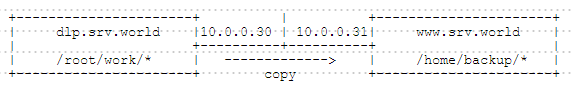
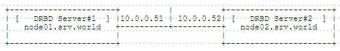

## 附1.4. 文件同步

### 附1.4.1. Rsync

[Rsync（remote sync）](https://rsync.samba.org/)是类unix系统下的数据镜像备份工具。它的特性如下：

1. 可以镜像保存整个目录树和文件系统。
2. 可以很容易做到保持原来文件的权限、时间、软硬链接等等。
3. 无须特殊权限即可安装。
4. 优化的流程，文件传输效率高。
5. 可以使用rcp、ssh等方式来传输文件，当然也可以通过直接的socket连接。
6. 支持匿名传输。

Rsync的基本用法：`rsync 选项 源 目的地`，如`rsync -av --exclude="tmp" /home/ /backup`

| 选项 | 描述 |
| - | - |
| -v | increase verbosity |
| -a | archive mode; same as -rlptgoD (no -H) |
| -u | skip files that are newer on the receiver |
| -z | 	compress file data during the transfer |
| --exclude=PATTERN | exclude files matching PATTERN |
| --delete | delete files that don’t exist on sender |

如果要由cron或其他自动设置rsync，需要按下面的配置，因为不设置就需要认证。例如，将`dlp.svv.world`上`/root/work`目录下的文件或目录复制到`www.srv.world`上的`/home/backup`。



在**源主机**上配置：

`yum -y install rsync`

编辑`/etc/rsync_exclude.lst`文件：

```
# 指定要排除复制的文件或目录
test
test.txt
```

在**目的地主机**上配置：

`yum -y install rsync`

编辑`/etc/rsyncd.conf`文件：

```
# 任意名称
[backup]
# 复制目的地目录
path = /home/backup
# 允许访问的主机
hosts allow = 10.0.0.30
hosts deny = *
list = true
uid = root
gid = root
read only = false
```

`mkdir /home/backup`

```
systemctl start rsyncd
systemctl enable rsyncd
```

配置完成。在源主机执行以下`rsync`命令：

`rsync -avz --delete --exclude-from=/etc/rsync_exclude.lst /root/work/ www.srv.world::backup`

如果要定期运行，在cron中添加：

`crontab -e`

```
00 02 * * * rsync -avz --delete --exclude-from=/etc/rsync_exclude.lst /root/work/ www.srv.world::backup
```

### 附1.4.2. Lsyncd

一般rsync软件是通过crond这支后台进行（计划任务）来实现自动同步数据，如今已有更好的开源软件来代替使用crond了，那就是[Lsyncd（Live Syncing (Mirror) Daemon）](https://github.com/axkibe/lsyncd)。它的工作原理：监视本地（rsync client）的目录，当源数据有文件或目录更新时，更新本地文件或目录到远端机器（rsync server），保持实时文件同步，但是它更新数据时需要远端rsync server运行rsync demon。

先按上一节内容配置好Rsync。

安装并配置Lsyncd以实时同步文件或目录：

`yum --enablerepo=epel -y install lsyncd` # 从EPEL安装

编辑`/etc/lsyncd.conf`文件：

```
# 注释下行
-- sync{default.rsyncssh, source="/var/www/html", host="localhost", targetdir="// tmp/htmlcopy/"}

# 添加以下内容到最后
settings{
    statusFile = "/tmp/lsyncd.stat",
    statusInterval = 1,
}
sync{
    default.rsync,
    # 源目录
    source="/root/work/",
    # 目的地主机名或IP地址:(在rsyncd.conf中设置的名称）
    target="10.0.0.31::backup",
    # 排除列表
    excludeFrom="/etc/rsync_exclude.lst",
}
```

```
systemctl start lsyncd
systemctl enable lsyncd
```

确认文件和目录在目的地主机上实时复制。

### 附1.4.3. DRBD

[DRBD（Distributed Replicated Block Device）](http://docs.linbit.com/)是由内核模块和相关脚本而构成，用以构建高可用性的集群。其实现方式是通过网络来镜像整个设备。您可以把它看作是一种网络RAID。DRBD负责接收数据，把数据写到本地磁盘，然后发送给另一个主机。另一个主机再将数据存到自己的磁盘中。

本例基于以下环境：



要安装DRBD的服务器有必要有空闲的块设备。

本例演示配置为使用块设备`/dev/vg_r0/lv_r0`。

#### 附1.4.3.1. 安装DRBD

在两个主机更新系统，安装所需的软件包并重新启动：

`yum -y update`

`yum -y install gcc make automake autoconf libxslt libxslt-devel flex rpm-build kernel-devel`

`reboot`

在两台主机上安装DRBD，确认[下载最新版本](http://oss.linbit.com/drbd/)：

`mkdir -p rpmbuild/{BUILD,BUILDROOT,RPMS,SOURCES,SPECS,SRPMS}`

```
wget http://oss.linbit.com/drbd/drbd-utils-latest.tar.gz \
http://oss.linbit.com/drbd/8.4/drbd-8.4.7-1.tar.gz
```

`tar zxvf drbd-8.4.7-1.tar.gz`

`cd drbd-*`

`make km-rpm`

`cd`

`tar zxvf drbd-utils-latest.tar.gz`

`cd drbd-utils-*`

编辑`drbd.spec.in`文件：


```
# 添加
%bcond_without sbinsymlinks
%undefine with_sbinsymlinks
```

`./configure`

`make rpm`

`cd /root/rpmbuild/RPMS/x86_64`

`rpm -Uvh drbd-utils-*.rpm drbd-km-*.rpm`

```
Preparing...                          ################################# [100%]
Updating / installing...
   1:drbd-utils-8.9.5-1.el7.centos    ################################# [ 33%]
   2:drbd-km-3.10.0_327.4.5.el7.x86_64################################# [ 67%]
   3:drbd-km-debuginfo-8.4.7-1        ################################# [100%]
```

注：“drbd-km”软件包是使用当前版本的内核构建的，所以如果将来更新内核，那么需要使用新版本内核重新构建DRBD。

#### 附1.4.3.2. 配置DRBD

在两台主机上配置DRBD：

编辑`/etc/drbd.d/global_common.conf`文件：

```
# 在“disk”部分中添加以下内容（如果发生IO错误，则分离磁盘）
disk {
   on-io-error detach;
```

编辑`/etc/drbd.d/r0.res`文件：

```
resource r0 {
    # DRBD设备
    device /dev/drbd0;
    # 块设备
    disk /dev/vg_r0/lv_r0;
    meta-disk internal;
    on node01.srv.world {
        # IP地址:端口
        address 10.0.0.51:7788;
    }
    on node02.srv.world {
        address 10.0.0.52:7788;
    }
} 
```

`modprobe drbd` # 加载模块

`lsmod | grep drbd`

```
drbd                  405309  0
libcrc32c              12644  2 xfs,drbd
```

`drbdadm create-md r0` # 创建DRBD资源

```
--==  Thank you for participating in the global usage survey  ==--
The server's response is:

you are the 972th user to install this version
initializing activity log
NOT initializing bitmap
Writing meta data...
New drbd meta data block successfully created.
success
```

`systemctl start drbd`

```
 DRBD's startup script waits for the peer node(s) to appear.
 - If this node was already a degraded cluster before the
   reboot, the timeout is 0 seconds. [degr-wfc-timeout]
 - If the peer was available before the reboot, the timeout
   is 0 seconds. [wfc-timeout]
   (These values are for resource 'r0'; 0 sec -> wait forever)
...
...
To abort waiting enter 'yes' [  18]:yes
```

`systemctl enable drbd`

在两台主机上进行配置后，在**node01主机**上同步数据：

`cat /proc/drbd` # 当前状态为“Secondary/Secondary”

```
version: 8.4.7-1 (api:1/proto:86-101)
GIT-hash: 3a6a769340ef93b1ba2792c6461250790795db49 build by root@node01.srv.world, 2016-01-28 14:44:07
 0: cs:Connected ro:Secondary/Secondary ds:Inconsistent/Inconsistent C r-----
    ns:0 nr:0 dw:0 dr:0 al:0 bm:0 lo:0 pe:0 ua:0 ap:0 ep:1 wo:f oos:20938076
```

`drbdadm -- --overwrite-data-of-peer primary r0` # 获取primary角色并同步数据

`cat /proc/drbd` # 同步开始

```
version: 8.4.7-1 (api:1/proto:86-101)
GIT-hash: 3a6a769340ef93b1ba2792c6461250790795db49 build by root@node01.srv.world, 2016-01-28 14:44:07
 0: cs:SyncSource ro:Primary/Secondary ds:UpToDate/Inconsistent C r-----
    ns:39144 nr:0 dw:0 dr:40056 al:0 bm:0 lo:0 pe:0 ua:0 ap:0 ep:1 wo:f oos:20898932
        [>....................] sync'ed:  0.2% (20408/20444)M
        finish: 1:19:58 speed: 4,348 (4,348) K/sec
```

`cat /proc/drbd` # 同步后，状态如下

```
version: 8.4.7-1 (api:1/proto:86-101)
GIT-hash: 3a6a769340ef93b1ba2792c6461250790795db49 build by root@node01.srv.world, 2016-01-28 14:44:07
 0: cs:Connected ro:Primary/Secondary ds:UpToDate/UpToDate C r-----
    ns:20938076 nr:0 dw:0 dr:20938988 al:0 bm:0 lo:0 pe:0 ua:0 ap:0 ep:1 wo:f oos:0
```

可以配置DRBD，在DRBD设备上创建文件系统并将其挂载使用：

`mkfs.xfs /dev/drbd0`

`mkdir /drbd_disk`

`mount /dev/drbd0 /drbd_disk`

`df -hT`

```
Filesystem              Type      Size  Used Avail Use% Mounted on
/dev/mapper/centos-root xfs        27G  1.7G   25G   7% /
devtmpfs                devtmpfs  2.0G     0  2.0G   0% /dev
tmpfs                   tmpfs     2.0G     0  2.0G   0% /dev/shm
tmpfs                   tmpfs     2.0G  8.3M  2.0G   1% /run
tmpfs                   tmpfs     2.0G     0  2.0G   0% /sys/fs/cgroup
/dev/vda1               xfs       497M  206M  292M  42% /boot
tmpfs                   tmpfs     396M     0  396M   0% /run/user/0
/dev/drbd0              xfs        20G   33M   20G   1% /drbd_disk
```

`echo 'test file' > /drbd_disk/test.txt` # 创建测试文件

`ll /drbd_disk`

```
total 4
-rw-r--r-- 1 root root 10 Jan 28 15:32 test.txt
```

如下在**node02主机**挂载DRBD设备：

先在当前的primary主机（node01）运行：

`umount /drbd_disk` # 卸载

`drbdadm secondary r0` # 获取secondary角色

在当前的secondary主机（node02）运行：

`drbdadm primary r0` # 获取primary角色

`mount /dev/drbd0 /drbd_disk` # 挂载

`df -hT`

```
Filesystem              Type      Size  Used Avail Use% Mounted on
/dev/mapper/centos-root xfs        27G  1.7G   25G   7% /
devtmpfs                devtmpfs  2.0G     0  2.0G   0% /dev
tmpfs                   tmpfs     2.0G     0  2.0G   0% /dev/shm
tmpfs                   tmpfs     2.0G  8.4M  2.0G   1% /run
tmpfs                   tmpfs     2.0G     0  2.0G   0% /sys/fs/cgroup
/dev/vda1               xfs       497M  206M  292M  42% /boot
tmpfs                   tmpfs     396M     0  396M   0% /run/user/0
/dev/drbd0              xfs        20G   33M   20G   1% /drbd_disk
```

`ll /drbd_disk`

```
total 4
-rw-r--r-- 1 root root 10 Jan 28 15:32 test.txt
```
