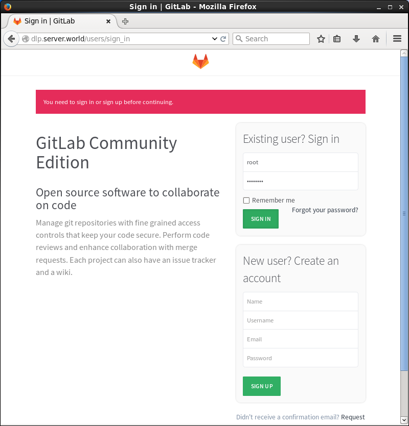
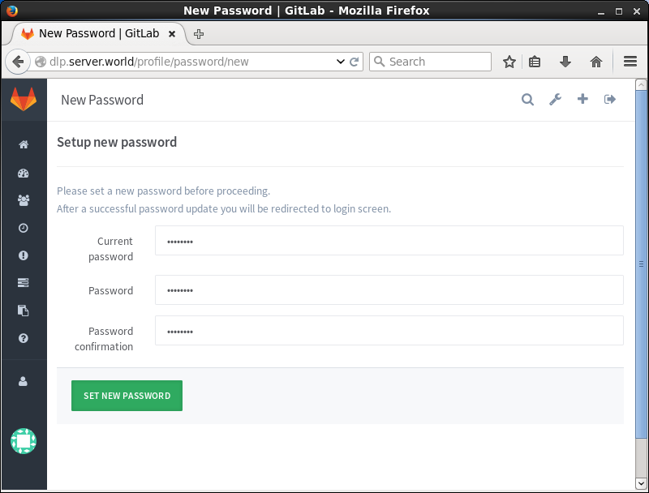
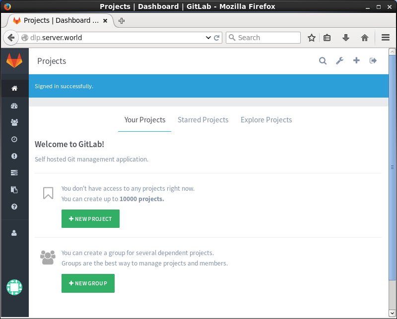
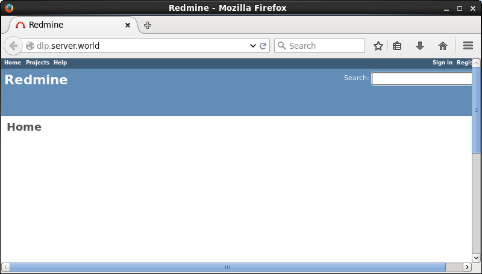
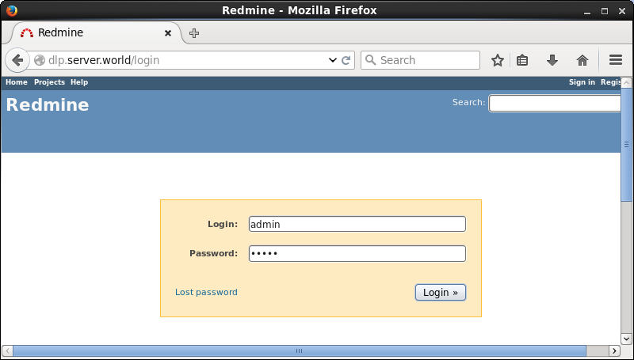
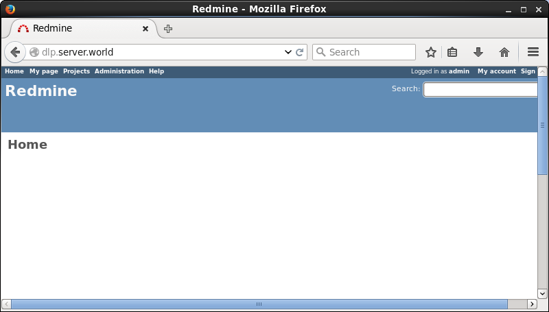
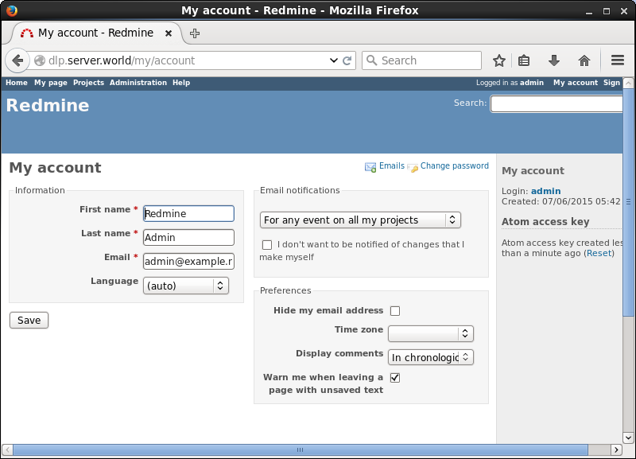
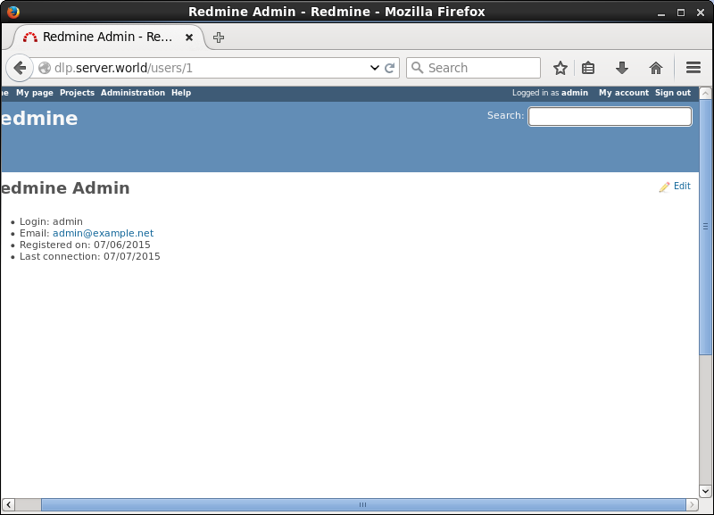
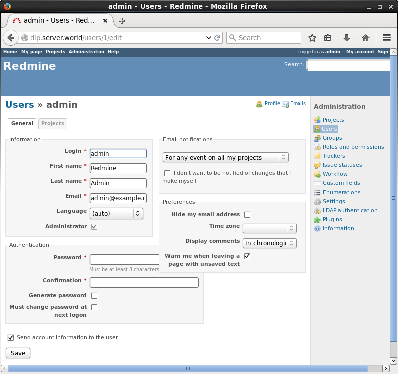

## 附1.6. 项目管理与版本控制

### 附1.6.1. GitLab

[GitLab](http://gitlab.org/)是一个利用[Ruby on Rails](http://rubyonrails.org/)开发的开源应用程序，实现一个自托管的Git项目仓库，可通过Web界面进行访问公开的或者私人项目。如果觉得安装麻烦可以使用[GitLab Installers](https://bitnami.com/stack/gitlab)一键安装程序。

安装并启动[SSH服务器](../1. 初始化设置/1.9. 配置SSH.html)，[SMTP服务器](../9. 邮件服务器/9.1. 安装Postfix.html)。如果使用了firewalld防火墙，打开“http”服务端口。

安装GitLab：

`curl -O https://packages.gitlab.com/install/repositories/gitlab/gitlab-ce/script.rpm.sh`

`sh script.rpm.sh`

`yum -y install gitlab-ce`

`gitlab-ctl reconfigure`

访问`http://(服务器的主机名或IP地址)/`，然后使用用户“root”和初始密码“5iveL!fe”登录：



初次登录后，需要更改密码。更改为任意密码：



这是GitLab主页。可以在本地网络中像GitHub那样使用：



### 附1.6.2. Redmine

[Redmine](https://www.redmine.org/)是基于Web的项目管理和缺陷跟踪工具。它用日历和甘特图辅助项目及进度可视化显示，支持多项目管理。

安装并启动[Apache httpd](../5. Web服务器/5.1. Apache httpd.html)，[SMTP服务器](../9. 邮件服务器/9.1. 安装Postfix.html)和[MariaDB数据库服务器](../6. 数据库/6.1. MariaDB.html)并安装[Ruby 2.2](../13. 语言开发环境/13.1. Ruby.html#1311-安装ruby-22)

安装其他一些需要的软件包：

`yum -y install ImageMagick ImageMagick-devel libcurl-devel httpd-devel mariadb-devel ipa-pgothic-fonts`

在MariaDB上为Redmine创建一个用户和数据库：

`mysql -u root -p`

```
Enter password:
Welcome to the MariaDB monitor.  Commands end with ; or \g.
Your MariaDB connection id is 10
Server version: 5.5.41-MariaDB MariaDB Server

Copyright (c) 2000, 2014, Oracle, MariaDB Corporation Ab and others.

Type 'help;' or '\h' for help. Type '\c' to clear the current input statement.

MariaDB [(none)]> create database redmine; 
Query OK, 1 row affected (0.00 sec)

# 在“password”部分设置任意密码
MariaDB [(none)]> grant all privileges on redmine.* to redmine@'localhost' identified by 'password'; 
Query OK, 0 rows affected (0.00 sec)

MariaDB [(none)]> flush privileges; 
Query OK, 0 rows affected (0.00 sec)

MariaDB [(none)]> exit
```

确认[最新版本的下载链接](http://www.redmine.org/projects/redmine/wiki/Download)，下载并安装：

`wget http://www.redmine.org/releases/redmine-3.0.3.tar.gz`

`tar zxvf redmine-3.0.3.tar.gz`

`mv redmine-3.0.3 /var/www/redmine`

`cd /var/www/redmine`

编辑`./config/database.yml`文件：

```
# 数据库设置
production:
    adapter: mysql2
    # 数据库名称
    database: redmine
    host: localhost
    # 数据库用户
    username: redmine
    # 上面数据库用户的密码
    password: password
    encoding: utf8
```

编辑`./config/configuration.yml`文件：

```
# SMTP设置
production:
    email_delivery:
        delivery_method: :smtp
        smtp_settings:
            address: "localhost"
            port: 25
            domain: 'dlp.srv.world'
    rmagick_font_path: /usr/share/fonts/ipa-pgothic/ipagp.ttf
```

`gem install bundler --no-rdoc --no-ri` # 安装bundler

`bundle install --without development test postgresql sqlite` # 安装Gem

`bundle exec rake generate_secret_token` # 生成密钥

`bundle exec rake db:migrate RAILS_ENV=production` # 生成表

`gem install passenger --no-rdoc --no-ri` # 安装Passenger

`passenger-install-apache2-module` # 安装Apache2的模块

```
Welcome to the Phusion Passenger Apache 2 module installer, v5.0.6.

This installer will guide you through the entire installation process. It
shouldn't take more than 3 minutes in total.

Here's what you can expect from the installation process:

 1. The Apache 2 module will be installed for you.
 2. You'll learn how to configure Apache.
 3. You'll learn how to deploy a Ruby on Rails application.

Don't worry if anything goes wrong. This installer will advise you on how to
solve any problems.

Press Enter to continue, or Ctrl-C to abort.
1  # 指定“1”并回车
.....
.....
After you restart Apache, you are ready to deploy any number of web
applications on Apache, with a minimum amount of configuration!
.....
```

为Redmine配置httpd。本例演示配置为虚拟主机：

编辑`/etc/httpd/conf.d/passenger.conf`文件：

```
LoadModule passenger_module /usr/lib64/ruby/gems/2.2.0/gems/passenger-5.0.13/buildout/apache2/mod_passenger.so
PassengerRoot /usr/lib64/ruby/gems/2.2.0/gems/passenger-5.0.13
PassengerDefaultRuby /usr/bin/ruby

NameVirtualHost *:80
<VirtualHost *:80>
    ServerName dlp.srv.world
    DocumentRoot /var/www/redmine/public
</VirtualHost>
```

`chown -R apache. /var/www/redmine`

`systemctl restart httpd`

访问在httpd上配置的URL，然后Redmine的主页如下所示。点击“Sing in”按钮：



使用初始用户名/密码“admin/admin”登录：



登录成功，首先更改管理员密码 点击“My account”：



点击“admin”：



点击“edit”：



在“Authentication”部分输入任意密码并保存更改



### 附1.6.3. Gitolite

[Gitolite](https://github.com/sitaramc/gitolite)是一款Perl语言开发的Git服务管理工具，通过公钥对用户进行认证，并能够通过配置文件对写操作进行基于分支和路径的精细授权。

#### 附1.6.3.1. 安装Gitolite

`yum --enablerepo=epel -y install gitolite3` # 从EPEL安装

生成SSH密钥对，并使用Gitolite管理员用户设置Gitolite：

`su - gitolite3`

```
Generating public/private rsa key pair.
Enter passphrase (empty for no passphrase):  # 设置密码
Enter same passphrase again:  # 确认密码
Your identification has been saved in /var/lib/gitolite3/.ssh/gitadmin.
Your public key has been saved in /var/lib/gitolite3/.ssh/gitadmin.pub.
The key fingerprint is:
xx:xx:xx:xx:xx:xx:xx:xx:xx:xx:xx:xx:xx:xx:xx:xx gitolite3@dlp.srv.world
The key's randomart image is:

-sh-4.2$ gitolite setup -pk ~/.ssh/gitadmin.pub
Initialized empty Git repository in /var/lib/gitolite3/repositories/gitolite-admin.git/
Initialized empty Git repository in /var/lib/gitolite3/repositories/testing.git/

-sh-4.2$ vi ~/.ssh/config

# 任意名称
host GitServer
    user gitolite3
    # Git服务器的主机名或IP地址
    hostname 10.0.0.30
    port 22
    # 密钥
    identityfile ~/.ssh/gitadmin
    
-sh-4.2$ chmod 600 ~/.ssh/config
-sh-4.2$ git config --global user.name "gitolite3"
-sh-4.2$ git config --global user.email "gitolite3@srv.world"
-sh-4.2$ git config --global push.default simple

# 克隆管理库以完成设置
-sh-4.2$ git clone ssh://GitServer/gitolite-admin 
Cloning into 'gitolite-admin'...
The authenticity of host '10.0.0.30 (10.0.0.30)' can't be established.
ECDSA key fingerprint is xx:xx:xx:xx:xx:xx:xx:xx:xx:xx:xx:xx:xx:xx:xx:xx.
Are you sure you want to continue connecting (yes/no)? yes
Warning: Permanently added '10.0.0.30' (ECDSA) to the list of known hosts.
Enter passphrase for key '/var/lib/gitolite3/.ssh/gitadmin':
remote: Counting objects: 6, done.
remote: Compressing objects: 100% (4/4), done.
remote: Total 6 (delta 0), reused 0 (delta 0)
Receiving objects: 100% (6/6), done.
```

#### 附1.6.3.2. 添加用户

以要为Gitolite设置的用户登录系统并生成SSH密钥对：

`ssh-keygen -f ~/.ssh/id_cent`

```
Generating public/private rsa key pair.
Enter passphrase (empty for no passphrase):
Enter same passphrase again:
Your identification has been saved in /home/cent/.ssh/id_cent.
Your public key has been saved in /home/cent/.ssh/id_cent.pub.
The key fingerprint is:
xx:xx:xx:xx:xx:xx:xx:xx:xx:xx:xx:xx:xx:xx:xx:xx cent@dlp.srv.world
The key's randomart image is:
```

将上面生成的SSH公钥传给Gitolite管理员用户。接下来，使用Gitolite管理员如下添加用户：

```
-sh-4.2$ whoami
gitolite3
-sh-4.2$ cd ~/gitolite-admin/keydir
-sh-4.2$ git add id_cent.pub
-sh-4.2$ git commit -m "Add User cent"
1 file changed, 1 insertion(+)
create mode 100644 keydir/id_cent.pub
-sh-4.2$ git push origin master
Enter passphrase for key '/var/lib/gitolite3/.ssh/gitadmin':
Counting objects: 6, done.
Delta compression using up to 2 threads.
Compressing objects: 100% (4/4), done.
Writing objects: 100% (4/4), 686 bytes | 0 bytes/s, done.
Total 4 (delta 0), reused 0 (delta 0)
To ssh://GitServer/gitolite-admin
  1d61702..8d46625 master -> master
```

确认使用刚添加的用户克隆库：

编辑`~/.ssh/config`文件：

```
# 任意名称
host GitServer
    user gitolite3
    # Git服务器的主机名或IP地址
    hostname 10.0.0.30
    port 22
    # 密钥
    identityfile ~/.ssh/id_cent
```

`chmod 600 ~/.ssh/config`

`git config --global user.name "cent"`

`git config --global user.email "cent@srv.world"`

`git clone ssh://GitServer/testing`

```
Cloning into 'testing'...
warning: You appear to have cloned an empty repository.
```

`ll`

```
total 0
drwxrwxr-x 3 cent cent 17 Jul 21 20:50 testing
```

#### 附1.6.3.3. 添加新库

例如，使用Gitolite管理员添加一个新的库“public-repo”：

```
-sh-4.2$ vi ~/gitolite-admin/conf/gitolite.conf

# 添加到最后
repo public-repo
    RW+     =   @all

-sh-4.2$ cd ~/gitolite-admin
-sh-4.2$ git commit -a -m "Add public-repo repository"
[master 5aebeb2] Add public-repo repository
1 file changed, 4 insertions(+)
-sh-4.2$ git push
Enter passphrase for key '/var/lib/gitolite3/.ssh/gitadmin':
Counting objects: 7, done.
Delta compression using up to 2 threads.
Compressing objects: 100% (3/3), done.
Writing objects: 100% (4/4), 391 bytes | 0 bytes/s, done.
Total 4 (delta 0), reused 0 (delta 0)
remote: Initialized empty Git repository in /var/lib/gitolite3/repositories/public-repo.git/
To ssh://GitServer/gitolite-admin
  8d46625..5aebeb2 master -> master
```

确认用户可以克隆刚添加的库：

`ssh GitServer` # 显示当前用户可以访问的库列表

```
PTY allocation request failed on channel 0
hello id_cent, this is gitolite3@dlp running gitolite3 3.6.3-1.el7 on git 1.8.3.1

 R W    public-repo
 R W    testing
Connection to 10.0.0.30 closed.
```

`git clone ssh://GitServer/public-repo`

```
Cloning into 'public-repo'...
warning: You appear to have cloned an empty repository.
```

`ll`

```
total 0
drwxrwxr-x 3 cent cent 17 Jul 21 21:06 public-repo
drwxrwxr-x 3 cent cent 17 Jul 21 20:50 testing
```

#### 附1.6.3.4. 设置访问控制

使用Gitolite管理员设置库的访问控制。

例如，将用户“cent”的读取和写入权限添加到“public-repo”：

```
-sh-4.2$ cd ~/gitolite-admin/conf
-sh-4.2$ vi gitolite.conf

# 在下面指定用户格式的SSH密钥文件名
repo public-repo
    RW+     =   id_cent

-sh-4.2$ git commit -a -m "Change Permission for public-repo"
-sh-4.2$ git push
```

例如，将组“developer”的读取和写入权限添加到“public-repo”：

```
-sh-4.2$ cd ~/gitolite-admin/conf
-sh-4.2$ vi gitolite.conf

@developer = id_cent id_ubuntu

repo public-repo
    RW+     =   @developer

-sh-4.2$ git commit -a -m "Change Permission for public-repo"
-sh-4.2$ git push
```

例如，添加访问权限如下：

* 将用户“redhat”添加读/写权限到所有库
* 将组“deployer”添加读/写权限添加到“prod”分支
* 将组“deployer”添加读/写权限添加到“dlp”分支

```
-sh-4.2$ cd ~/gitolite-admin/conf
-sh-4.2$ vi gitolite.conf

@developer = id_cent id_ubuntu
@deployer = id_debian id_fedora

repo public-repo
    RW+     =   id_redhat
    RW prod =  @deployer
    RW dlp  =  @developer

-sh-4.2$ git commit -a -m "Change Permission for public-repo"
-sh-4.2$ git push
```
