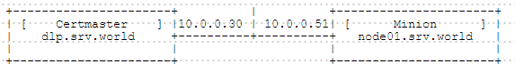

## 附1.8. 配置管理工具

### 附1.8.1. Salt

[Salt](https://saltstack.com/community/)是一个强大的远程执行管理器，用于快速和高效的服务器管理。

#### 附1.8.1.1. 安装Salt

可以在独立的服务器上使用Salt，本例演示配置为服务器和客户端环境。管理服务器称为Salt Master，客户端服务器称为Salt Minion。

在**Salt Master**主机上安装“salt-master”：

`yum --enablerepo=epel -y install salt-master` # 从EPEL安装

```
systemctl start salt-master
systemctl enable salt-master
```

Salt Master防火墙规则：

```
firewall-cmd --add-port={4505/tcp,4506/tcp} --permanent
firewall-cmd --reload
```

在**Salt Minion**主机上安装“salt-minionr”：

`yum --enablerepo=epel -y install salt-minion` # 从EPEL安装

编辑`/etc/salt/minion`文件:

```
# 取消注释并指定Salt Master服务器
master: dlp.srv.world
```

```
systemctl start salt-minion
systemctl enable salt-minion
```

Salt Minion初始运行时，向Salt Master发送公钥认证。如果Salt Master接受密钥，Salt Master和Salt Minion可以互相连接。

**Salt Master**上运行：

`salt-key -L` # 显示密钥列表

```
Accepted Keys:
Denied Keys:
Unaccepted Keys:
node01.srv.world
Rejected Keys:
```

`salt-key -A` # 使用`A`选项允许所有密钥

```
The following keys are going to be accepted:
Unaccepted Keys:
node01.srv.world
Proceed? [n/Y] y
Key for minion node01.srv.world accepted.
```

`salt-key -L`

```
Accepted Keys:
node01.srv.world
Denied Keys:
Unaccepted Keys:
Rejected Keys:
```

`salt "*" test.ping` # 验证工作

```
node01.srv.world:
    True
```

#### 附1.8.1.2. 基本用法

从Salt Master到Salt Minion远程执行命令的基本用法：

`salt [option] [target] [function] [arguments]`

有关所有嵌入式功能的说明，[参阅官方网站](https://docs.saltstack.com/en/latest/ref/modules/all/index.html)。

也可以使用命令查看功能（有多行输出，使用`less`或`more`的命令来读取）：

`salt '*' sys.doc`

```
'acl.delfacl:'

    Remove specific FACL from the specified file(s)

    CLI Examples:

        salt '*' acl.delfacl user myuser /tmp/house/kitchen
        salt '*' acl.delfacl default:group mygroup /tmp/house/kitchen

.....
.....
```

可以用各种方式指定目标：

`salt '*' test.ping` # 指定所有Minion，`test.ping`表示确认Minion是活动的

```
node02.srv.world:
    True
node01.srv.world:
    True
```

`salt 'node01.srv.world' disk.usage` # 指定Minion：“node01.srv.world”，`disk.usage`表示确认当前磁盘使用率

```
node01.srv.world:
    ----------
    /:
        ----------
        1K-blocks:
            27740944
        available:
            26176776
        capacity:
            6%
        filesystem:
            /dev/mapper/centos-root
        used:
            1564168
.....
.....
```

`salt -L 'node01.srv.world,node02.srv.world' status.loadavg` # 使用列表指定某些Minion（以逗号分隔），`status.loadavg`表示确认平均负载

```
node02.srv.world:
    ----------
    1-min:
        0.0
    15-min:
        0.05
    5-min:
        0.01
node01.srv.world:
.....
.....
```

`salt -E 'node[0-9][0-9].srv.world' selinux.getenforce` # 用表达式指定Minion，示例表示`node00-99.srv.world`，`selinux.getenforce`表示确认SELinux运行模式

```
node02.srv.world:
    Enforcing
node01.srv.world:
    Enforcing
```

`salt -G 'os:CentOS' grains.item kernelrelease` # 使用Grains数据指定操作系统为CentOS的Minion，`grains.item kernelrelease`表示确认内核版本来自“grains.item”数据，“Grains”是Salt中用来保存Minion系统数据或其他内容的词

```
node01.srv.world:
    ----------
    kernelrelease:
        3.10.0-327.36.1.el7.x86_64
node02.srv.world:
    ----------
    kernelrelease:
        3.10.0-327.36.1.el7.x86_64
```

`salt -C 'G@os:CentOS and E@node0[1-5].srv.world' cmd.run 'uptime'` # 用`C`选项指定多个条件，示例表示指定操作系统为CentOS且主机名为`node01-node05`的Minion，`cmd.run`表示执行命令

```
node02.srv.world:
     09:46:43 up 18 min,  0 users,  load average: 0.00, 0.01, 0.03
node01.srv.world:
     09:46:43 up 18 min,  0 users,  load average: 0.07, 0.05, 0.03
```

还可以使用组指定目标：

编辑`/etc/salt/master`文件：

```
# 取消注释
default_include: master.d/*.conf
```

`mkdir /etc/salt/master.d`

编辑`/etc/salt/master.d/nodegroups.conf`文件：

```
# group01：用“L@”指定列表（逗号分隔）specify List with "L@" (comma separated)
# group02：用表达式指定node03-node05
# group03：指定操作系统为CentOS
nodegroups:
  group01: 'L@node01.srv.world,node02.srv.world'
  group02: 'E@node0[3-5].srv.world'
  group03: 'G@os:CentOS'
```

```
systemctl restart salt-master
```

`salt -N 'group01' firewalld.list_services` # 对“group01”组运行，`firewalld.list_services`表示确认firewalld允许的服务

```
node01.srv.world:
    - dhcpv6-client
    - ssh
node02.srv.world:
    - dhcpv6-client
    - ssh
```

#### 附1.8.1.3. 使用Salt State文件

Salt State文件是用YAML文件编写的配置文件。

首先定义存放Salt State文件的根目录。默认位置是`/srv/salt`（本例演示使用默认位置配置）：

编辑`/etc/salt/master`文件：

```
# 取消注释并定义根目录
file_roots:
  base:
    - /srv/salt
```

`mkdir /srv/salt`

将State文件放在根目录下，可以使用`salt`命令将配置应用于Minion（例如，将“wget”软件包安装到Minion）：

编辑`/srv/salt/default.sls`文件（扩展名为“sls”，文件可为任意名称）：

```
install_wget:
  pkg.installed:
    - name: wget
```

`salt "node01.srv.world" state.sls default` # 适用于“node01”

```
node01.srv.world:
----------
          ID: install_wget
    Function: pkg.installed
        Name: wget
      Result: True
     Comment: The following packages were installed/updated: wget

.....
.....

Summary
------------
Succeeded: 1 (changed=1)
Failed:    0
------------
Total states run:     1
```

`salt "node01.srv.world" cmd.run 'rpm -q wget'` # 验证

```
node01.srv.world:
    wget-1.14-10.el7_0.1.x86_64
```

将称为“Top文件”的“top.sls”在定义的根目录下：

编辑`/srv/salt/top.sls`文件：

```
base:
  # 定义目标Minion
  '*':
    # 定义State文件的名称
    - default
```

编辑`/srv/salt/default.sls`文件，创建在Top文件中定义的State文件：

```
# 例如，安装并启动httpd和MariaDB并安装PHP
webserver:
  pkg.installed:
    - pkgs:
      - httpd
      - php
      - php-mbstring
      - php-pear
      - mariadb-server

/var/www/html/index.php:
  file:
    - managed
    - source: salt://httpd/index.php
    - require:
      - pkg: webserver

# 初始设置脚本
/tmp/setup.sql:
  file:
    - managed
    - source: salt://httpd/setup.sql

enable_httpd:
  service.running:
    - name: httpd
    - enable: True
    - require:
      - pkg: webserver

enable_mariadb:
  service.running:
    - name: mariadb
    - enable: True
    - require:
      - pkg: webserver

setup_mariadb:
  cmd.run:
    - name: '/bin/mysql -u root < /tmp/setup.sql'
    - require:
      - service: enable_mariadb

# 如果Firewalld运行，需配置服务


setup_fw:
  cmd.run:
    - names:
      - '/bin/firewall-cmd --add-service={http,https,mysql}'
      - '/bin/firewall-cmd --add-service={http,https,mysql} --permanent'

```

编辑`/srv/salt/httpd/index.php`文件，创建index.php模板：

```
<?php
   print "Salt State Test Page";
?>
```

编辑`/srv/salt/httpd/setup.sql`文件，创建MariaDB初始设置脚本：

```
set password for root@localhost=password('password');
set password for root@'127.0.0.1'=password('password'); 
delete from mysql.user where user='';
delete from mysql.user where password='';
drop database test;
```

`salt "*" state.apply` # 运行“state.apply”来应用设置

```
node01.srv.world:
    ----------
    cmd_|-setup_fw_|-/bin/firewall-cmd --add-service={http,https,mysql} --permanent_|-run:
        ----------
        __run_num__:
            7
        changes:

.....
.....

 name:
            mariadb
        result:
            True
        start_time:
            19:56:52.911517
```

验证

`salt "node01.srv.world" cmd.run 'systemctl status httpd'`

```
node01.srv.world:
    * httpd.service - The Apache HTTP Server
       Loaded: loaded (/usr/lib/systemd/system/httpd.service; enabled; vendor preset: disabled)
       Active: active (running) since Mon 2016-10-17 10:56:52 JST; 2min 16s ago
.....
.....
```

`salt "node02.srv.world" cmd.run 'systemctl status httpd'`

`salt "node01.srv.world" cmd.run 'systemctl status httpd'`

```
node01.srv.world:
    * mariadb.service - MariaDB database server
       Loaded: loaded (/usr/lib/systemd/system/mariadb.service; enabled; vendor preset: disabled)
       Active: active (running) since Mon 2016-10-17 10:56:57 JST; 2min 24s ago
.....
.....
```

`salt "node02.srv.world" cmd.run 'systemctl status httpd'`

`salt "node01.srv.world" cmd.run 'mysql -u root -ppassword -e "show databases;"'`

```
node01.srv.world:
    Database
    information_schema
    mysql
    performance_schema
```

`salt "node02.srv.world" cmd.run 'mysql -u root -ppassword -e "show databases;"'`

`curl http://node01.srv.world/index.php`

```
Salt State Test Page
```

`curl http://node02.srv.world/index.php`

#### 附1.8.1.4. 使用Salt-cp

可以使用`salt`命令将文件复制到Minion，但是使用`salt-cp`命令来处理Minion更简单：

`salt-cp '*' test.txt /root/test.txt` # 将当前目录下的`test.txt`复制到所有Minion中的`/root/`中

```
{'node01.srv.world': {'/root/test.txt': True},
'node02.srv.world': {'/root/test.txt': True}}
```

`salt-cp 'node01.srv.world' setup.sql /tmp/setup.sql` # 指定`node01.srv.world`为目标Minion并复制

```
{'node01.srv.world': {'/root/test.txt': True},
'node02.srv.world': {'/root/test.txt': True}}
```

`salt-cp -E 'node[0-9][1-2].srv.world' setup.sql /tmp/setup.sql` # 用表达式指定目标Minion

```
{'node01.srv.world': {'/tmp/setup.sql': True},
'node02.srv.world': {'/tmp/setup.sql': True}}
.....
.....
```

`salt-cp -G 'os:CentOS' config.sh /tmp/config.sh` # 使用Grains数据指定Minion

```
{'node01.srv.world': {'/tmp/config.sh': True},
'node02.srv.world': {'/tmp/config.sh': True}}
.....
.....
```

### 附1.8.2. Puppet

[Puppet](https://puppet.com/)是一个配置管理工具。

#### 附1.8.2.1. 安装Puppet

可以在独立的服务器上使用Puppet，本例演示配置为Puppet服务器和Puppet客户端环境。

必须先设置DNS或hosts来解析名称或IP地址，以及NTP设置。

在**Puppet服务器**主机上安装`puppet-server`：

`yum -y install https://yum.puppetlabs.com/puppetlabs-release-el-7.noarch.rpm`

`sed -i -e "s/enabled=1/enabled=0/g" /etc/yum.repos.d/puppetlabs.repo`

`yum --enablerepo=puppetlabs-products,puppetlabs-deps -y install puppet-server`

编辑`/etc/puppet/puppet.conf`文件：

```
[main]
# 在[main]部分中添加以下内容：Puppet服务器的DNS名称
    dns_alt_names = dlp.srv.world,dlp
```

`puppet master --verbose --no-daemonize`

```
Info: Creating a new SSL key for ca
Info: Creating a new SSL certificate request for ca
Info: Certificate Request fingerprint (SHA256): 
Notice: Signed certificate request for ca
Info: Creating a new certificate revocation list
Info: Creating a new SSL key for dlp.srv.world
Info: csr_attributes file loading from /etc/puppet/csr_attributes.yaml
Info: Creating a new SSL certificate request for dlp.srv.world
Info: Certificate Request fingerprint (SHA256): 
Notice: dlp.srv.world has a waiting certificate request
Notice: Signed certificate request for dlp.srv.world
Notice: Removing file Puppet::SSL::CertificateRequest dlp.srv.world at 
    '/var/lib/puppet/ssl/ca/requests/dlp.srv.world.pem'
Notice: Removing file Puppet::SSL::CertificateRequest dlp.srv.world at 
    '/var/lib/puppet/ssl/certificate_requests/dlp.srv.world.pem'
Notice: Starting Puppet master version 3.8.1
# 按Ctrl + C退出
```

```
systemctl start puppetmaster
systemctl enable puppetmaster
```

在**Puppet客户端**主机安装`puppet`：

`yum -y install https://yum.puppetlabs.com/puppetlabs-release-el-7.noarch.rpm`

`sed -i -e "s/enabled=1/enabled=0/g" /etc/yum.repos.d/puppetlabs.repo`

`yum --enablerepo=puppetlabs-products,puppetlabs-deps -y install puppet`

编辑`/etc/puppet/puppet.conf`文件：

```
[agent]
# 在[agent]部分中添加以下内容：Puppet服务器的主机名或IP地址
    server = dlp.srv.world
```

`puppet agent --test --ca_server=dlp.srv.world`

```
Info: Creating a new SSL key for node01.srv.world
Info: Caching certificate for ca
Info: csr_attributes file loading from /etc/puppet/csr_attributes.yaml
Info: Creating a new SSL certificate request for node01.srv.world
Info: Certificate Request fingerprint (SHA256): 
Info: Caching certificate for ca
Exiting; no certificate found and waitforcert is disabled
```

```
systemctl start puppet
systemctl enable puppet
```

在**Puppet服务器**上启用Puppet客户端的证书：

`puppet cert list` # 显示证书请求

```
"node01.srv.world" (SHA256) xx:xx:xx:xx:xx:xx:xx
```

`puppet cert --allow-dns-alt-names sign node01.srv.world` # 签名

```
Notice: Signed certificate request for node01.srv.world
Notice: Removing file Puppet::SSL::CertificateRequest node01.srv.world at 
    '/var/lib/puppet/ssl/ca/requests/node01.srv.world.pem'
```

创建测试清单（manifest）以确认Puppet服务器/客户端正常工作。Puppet客户端默认情况下，每隔30分钟可以使用Puppet服务器上的清单，所以等一会儿来确认它，或者如果想立即确认，重新启动Puppet客户端守护进程（puppetd）：

编辑`/etc/puppet/manifests/site.pp`文件：

```
# 例如，如下所示创建一个“testgroup”
group { 'testgroup':
    ensure => present,
    gid    => 2000,
}
```

`systemctl restart puppet` # 如果想立即确认重启puppetd

`grep testgroup /etc/group`

```
testgroup:x:2000:
```

可以如下所示手动将清单应用到本地环境：

`puppet apply /etc/puppet/manifests/site.pp`

```
Notice: Compiled catalog for dlp.srv.world in environment production in 0.13 seconds
Notice: /Stage[main]/Main/Group[testgroup]/ensure: created
Notice: Finished catalog run in 0.34 seconds
```

#### 附1.8.2.2. 文件资源

这是文件资源（file resource）的示例。

它如下管理配置以保存文件（如果文件不在Puppet客户端，则会创建该文件，如果存在，它将保留指定的属性）：

编辑`/etc/puppet/manifests/site.pp`文件：

```
file { '/home/testfile.txt':
    ensure  => file,
    owner   => 'root',
    group   => 'root',
    mode    => 644,
    content => 'This is the puppet test file.',
}
```

编辑`/etc/puppet/manifests/site.pp`文件，使用变量指定内容：

```
$contents = 'This is the test Puppet manifest.
Sample contents
Test contents
'

file { '/home/testfile.txt':
    ensure  => file,
    owner   => 'root',
    group   => 'root',
    mode    => 644,
    content => "$contents",
}
```

将Puppet服务器上的源文件指定为模板：

编辑`/etc/puppet/fileserver.conf`文件：

```
# add to the end: specify the directory which includes template files
[extra_files]
    path /etc/puppet/files
    allow *
# extra_files -> 任意名称
# path        -> 目录路径
# allow       -> 允许访问的客户端（上例表示允许所有），如果要指定客户端，格式为：“allow 192.168.0.0/24”或“*.srv.world”
```

编辑`/etc/puppet/manifests/site.pp`文件：

```
file { '/home/testfile.txt':
    ensure => file,
    owner  => 'root',
    group  => 'root',
    mode   => 644,
    source => 'puppet://dlp.srv.world/extra_files/test.txt',
}
```

`mkdir /etc/puppet/files`

`echo "Puppet test file" > /etc/puppet/files/test.txt`

管理配置以保持链接。下例保持到“/home/testfile.txt”的链接“/home/testfile.link”：

编辑`/etc/puppet/manifests/site.pp`文件：

```
file { '/home/testfile.link':
    ensure => link,
    target => '/home/testfile.txt',
}
```

管理配置以保持文件不存在，如果存在，则将被删除：

编辑`/etc/puppet/manifests/site.pp`文件：

```
file { '/home/testfile.link': ensure => absent }
```

管理配置以保持递归目录。下例指定“mode”为“644”，但为目录添加“x”。此外，源目录中不存在的文件或目录将使用参数`purge`或`force`进行删除。

编辑`/etc/puppet/fileserver.conf`文件：

```
# 添加到最后：将目录指定为源
[extra_dir]
    path /etc/puppet/dirs
    allow *
```

编辑`/etc/puppet/manifests/site.pp`文件：

```
file { '/home/testdir':
    ensure  => directory,
    recurse => true,
    purge   => true,
    force   => true,
    owner   => 'root',
    group   => 'root',
    mode    => 644,
    source  => 'puppet://dlp.srv.world/extra_dir/testdir',
}
```

`mkdir -p /etc/puppet/dirs/testdir`

#### 附1.8.2.3. 软件包资源

这是软件包资源（package resource）的示例。

管理配置以保持“httpd”被安装：

编辑`/etc/puppet/manifests/site.pp`文件：

```
package { 'httpd':
    provider => yum,
    ensure   => installed,
}
```

管理配置以保持“latest httpd”被安装：

编辑`/etc/puppet/manifests/site.pp`文件：

```
package { 'httpd':
    provider => yum,
    ensure   => latest,
}
```

管理配置以保持“epel-release”使用rpm安装：

编辑`/etc/puppet/manifests/site.pp`文件：

```
package { 'epel-release':
    provider => rpm,
    ensure   => installed,
    source   => 'http://dl.fedoraproject.org/pub/epel/6/x86_64/epel-release-6-8.noarch.rpm',
}
```

管理配置以保持“httpd”不被安装（如果安装，将被删除）：

编辑`/etc/puppet/manifests/site.pp`文件：

```
package { 'httpd':
    provider => yum,
    ensure   => purged,
}
```

#### 附1.8.2.4. 服务资源

这是服务资源（service resource）的示例。

管理配置以保持“httpd”在运行：

编辑`/etc/puppet/manifests/site.pp`文件：

```
service { 'httpd':
    name   => 'httpd',
    ensure => running,
}
```

管理配置以保持“httpd”在运行。如果没有安装，“httpd”当然不会启动，因此管理配置以保持“httpd”被安装作为“require”（必要）参数如下：

编辑`/etc/puppet/manifests/site.pp`文件：

```
package { 'httpd':
    provider => yum,
    ensure   => installed,
}
service { 'httpd':
    name    => 'httpd',
    ensure  => running,
    require => Package['httpd'],
}
```

管理配置以保持“httpd”不运行（如果运行，将被停止）：

编辑`/etc/puppet/manifests/site.pp`文件：

```
service { 'httpd':
    name   => 'httpd',
    ensure => stopped,
}
```

下面配置当文件`/etc/httpd/conf/httpd.conf`更新时，会重新启动“httpd”：

编辑`/etc/puppet/manifests/site.pp`文件：

```
file { '/etc/httpd/conf/httpd.conf':
    ensure => file,
    owner  => 'root',
    group  => 'root',
    mode   => 644,
    source => 'puppet://dlp.srv.world/extra_files/httpd.conf',
    notify => Service['httpd'],
}
service { 'httpd':
    name   => 'httpd',
    ensure => running,
}
```

#### 附1.8.2.5. 组资源

这是组资源（group resource）的示例。

管理配置以保持组“centos”存在：

编辑`/etc/puppet/manifests/site.pp`文件：

```
group { 'centos': ensure => present }
```

明确指定GID：

编辑`/etc/puppet/manifests/site.pp`文件：

```
group { 'centos':
    ensure => present,
    gid    => 1000,
}
```

管理配置以保持组“centos”不存在（如果存在，将被删除）：

编辑`/etc/puppet/manifests/site.pp`文件：

```
group { 'centos': ensure => absent }
```

#### 附1.8.2.6. 用户资源

这是用户资源（user resource）的示例。

管理配置以保持用户“cent”存在：

为用户生成一个加密密码：

```
python -c 'import crypt,getpass; \
print(crypt.crypt(getpass.getpass(), \
crypt.mksalt(crypt.METHOD_SHA512)))'
```

```
Password:
$6$Fb2fpm8Vctsxxxxxxxxxx
```

编辑`/etc/puppet/manifests/site.pp`文件：

```
group { 'centos': ensure => absent }
```

明确指定UID或GID或组：

编辑`/etc/puppet/manifests/site.pp`文件：

```
group { 'cent':
    ensure => present,
    gid    => 1000,
}
user { 'cent':
    ensure     => present,
    home       => '/home/cent',
    managehome => true,
    uid        => 1000,
    gid        => 1000,
    groups     => ['cent', 'wheel'],
    password   => '$6$0XTc2rjlxxxxxxxx',
}
```

明确指定密码最大，最小位数或注释：

编辑`/etc/puppet/manifests/site.pp`文件：

```
group { 'cent':
    ensure => present,
    gid    => 1000,
}
user { 'cent':
    ensure           => present,
    home             => '/home/cent',
    managehome       => true,
    uid              => 1000,
    gid              => 1000,
    groups           => ['cent', 'wheel'],
    password_max_age => 90,
    password_min_age => 1,
    password         => '$6$0XTc2rjlxxxxxxxx',
    comment          => 'Cent User',
}
```

管理配置以保持用户“cent”不存在（如果存在，将被与主目录一起删除）：

编辑`/etc/puppet/manifests/site.pp`文件：

```
user { 'cent':
    ensure     => absent,
    home       => '/home/cent',
    managehome => true,
}
```

#### 附1.8.2.7. 执行资源

这是执行资源（exec resource）的示例。

可以通过使用执行资源来执行任何命令，但不推荐使用，因为这样是危险的。所以使用这个资源来处理特定的情况，比如通过使用`refreshonly`参数来接收事件。

当`/etc/aliases`更新时，它执行`newaliases`：

编辑`/etc/puppet/manifests/site.pp`文件：

```
file { '/etc/aliases':
    ensure => file,
    owner  => 'root',
    group  => 'root',
    mode   => 644,
    source => 'puppet://dlp.srv.world/extra_files/aliases'
}

exec { 'newaliases':
    path        => ['/usr/bin', '/usr/sbin'],
    subscribe   => File['/etc/aliases'],
    refreshonly => true
}
```

#### 附1.8.2.8. 节点部分

可以通过使用“node”（节点）部分为每个客户端设置资源，如下所示：

将资源设置到`www01.srv.world`及其他（“default”部分适用于其他客户端）：

编辑`/etc/puppet/manifests/site.pp`文件：

```
node 'www01.srv.world' {
    file { '/home/testfile.txt':
        ensure  => file,
        owner   => 'root',
        group   => 'root',
        mode    => 644,
        content => 'This is the puppet test file.',
    }
}
node default {
    user { 'cent':
        ensure     => present,
        home       => '/home/cent',
        managehome => true,
        password   => '$6$0XTc2rjlxxxxxxxx',
    }
}
```

将资源设置到`www01.srv.world`和`www.srv.world`及其他：

编辑`/etc/puppet/manifests/site.pp`文件：

```
node 'www01.srv.world' {
    file { '/home/testfile.txt':
        ensure  => file,
        owner   => 'root',
        group   => 'root',
        mode    => 644,
        content => 'This is the puppet test file.',
    }
}
node 'www.srv.world' inherits 'www01.srv.world' {
    file { '/home/testfile2.txt':
        ensure  => file,
        content => 'inherits test file.',
    }
}
node default {
    user { 'cent':
        ensure     => present,
        home       => '/home/cent',
        managehome => true,
        password   => '$6$0XTc2rjlxxxxxxxx',
    }
}
```

#### 附1.8.2.9. 类部分

可以通过使用“class”（类）部分来管理一些资源，如下所示：

这是定义和使用类“sample01”的例子：

编辑`/etc/puppet/manifests/site.pp`文件：

```
class sample01 {
    file { '/home/testfile.txt':
        ensure  => file,
        owner   => 'root',
        group   => 'root',
        mode    => 644,
        content => 'This is the puppet test file.',
    }
    user { 'cent':
        ensure     => present,
        home       => '/home/cent',
        managehome => true,
        password   => '$6$0XTc2rjlxxxxxxxx',
    }
}
node 'www.srv.world' { include 'sample01' }
```

这是一个使用继承类的例子，类“sample01”和类“sample02”都通过此清单应用于`www.srv.world`：

编辑`/etc/puppet/manifests/site.pp`文件：

```
class sample01 {
    file { '/home/testfile.txt':
        ensure  => file,
        owner   => 'root',
        group   => 'root',
        mode    => 644,
        content => 'This is the puppet test file.',
    }
    user { 'cent':
        ensure     => present,
        home       => '/home/cent',
        managehome => true,
        password   => '$6$0XTc2rjlxxxxxxxx',
    }
}
class sample02 inherits sample01 {
    file { '/home/testfile2.txt':
        ensure  => file,
        owner   => 'root',
        group   => 'wheel',
        content => 'test file2',
    }
}
node 'www.srv.world' { include 'sample02' }
```

#### 附1.8.2.10. facter变量

如果需要，可以使用由系统自动设置的facter变量。

显示facter变量：

`facter`

```
architecture => x86_64
augeasversion => 1.1.0
bios_release_date => 01/01/2007
bios_vendor => Seabios
bios_version => 0.5.1
blockdevice_vda_size => 53687091200
blockdevice_vda_vendor => 0x1af4
...
...
...
uptime_hours => 1
uptime_seconds => 6836
uuid => 8DBDD6BD-B474-765D-D743-1160BE341044
virtual => kvm
```

例如，如果操作系统为“RedHat”或“CentOS”，版本为“7.1.1503”，则应用类“sample01”，如果版本不是“7.1.1503”，则应用类“sample02”，如果操作系统不是“RedHat”或“CentOS”，应用类“sample03”：

编辑`/etc/puppet/manifests/site.pp`文件：

```
class sample01 {
    file { '/home/testfile.txt':
        ensure  => file,
        owner   => 'root',
        group   => 'root',
        mode    => 644,
        content => 'This is the puppet test file.',
    }
}
class sample02 {
    user { 'cent':
        ensure     => present,
        home       => '/home/cent',
        managehome => true,
        password   => '$6$0XTc2rjlxxxxxxxx',
    }
}
class sample03 {
    file { '/home/testfile2.txt':
        ensure  => file,
        owner   => 'root',
        group   => 'wheel',
        content => 'test file2',
    }
}
case $operatingsystem {
    'RedHat', 'CentOS': {
        if $operatingsystemrelease == '7.1.1503' { include 'sample01' }
        else                                { include 'sample02' }
    }
    default:            { include 'sample03' }
}
```

### 附1.8.3. Ansible

[Ansible](https:www.ansible.com/)提供一种最简单的方式用于发布、管理和编排计算机系统的工具。

#### 附1.8.3.1. 安装Ansible

Ansible不需要专用的服务器/客户端程序，只需要Ansible命令和SSH。

在想要使用Ansible管理的所有客户端上[启动SSH守护进程](../1. 初始化设置/1.9. 配置SSH.html)。

安装Ansible：

`yum --enablerepo=epel -y install ansible openssh-clients` # 从EPEL安装

为Ansible设置客户端的基本设置（原始文件`/etc/ansible/hosts`中有更多详细信息，可以参考）：

编辑`/etc/ansible/ansible.cfg`文件：

```
# 取消注释（不检查主机密钥）
host_key_checking = False
```

`mv /etc/ansible/hosts /etc/ansible/hosts.org`

编辑`/etc/ansible/hosts`文件：

```
# 写入管理的客户端
10.0.0.50

# 可以分组（定义任意组名称）
[target_servers]
# 写入客户端进行分组
10.0.0.51
10.0.0.52
```

`ansible all --list-hosts` # 确认设置，显示所有定义的主机

```
    10.0.0.50
    10.0.0.51
    10.0.0.52
```

`ansible target_servers --list-hosts` # 显示组中的特定主机

```
    10.0.0.51
    10.0.0.52
```

#### 附1.8.3.2. 基本用法

Ansible的基本用法：

`ansible [Target Hosts] [Option] -m [Module] -a [Arguments]`

Ansible官方网站提供了许多模块（Module），可以访问[网站参考](https://docs.ansible.com/ansible/modules_by_category.html)。

使用Ansible时进行身份验证是有必要的，因为它使用SSH访问。而且，可以将作为非特权用户Ansible使用，但是如果想在客户端上使用特权，则需要允许通过`sudo`等使用特权命令。

对于客户端上的SSH服务器允许直接root登录（“PermitRootLogin no”除外） + 密钥对认证（non-passphrase非密码）的情况，可以如下使用Ansible。如果在密钥对中设置密码，可以在[启动SSH-Agent](../1. 初始化设置/1.9. 配置SSH.html#197-ssh-agent)后使用：

`ansible target_servers -m ping` # 执行`ping`命令到组“target_servers”

```
10.0.0.51 | success >> {
    "changed": false,
    "ping": "pong"
}

10.0.0.52 | success >> {
    "changed": false,
    "ping": "pong"
}
```

如果想连接密码认证，可以使用如下所示的`k`选项。但是，它需要在所有客户端上设置相同的密码，并且需要[安装SSHPass](../1. 初始化设置/1.9. 配置SSH.html#196-sshpass)：

`ansible target_servers -k -m command -a "uptime"` # 执行`uptime`命令到组“target_servers”

```
SSH password:
10.0.0.52 | success | rc=0 >>
 10:28:07 up 10 min,  2 users,  load average: 0.01, 0.02, 0.03

10.0.0.51 | success | rc=0 >>
 10:28:07 up 11 min,  1 user,  load average: 0.01, 0.03, 0.05
```

对于使用非特权用户连接到客户端的情况，可以使用`sudo`提权。如果想使用除root以外的其他用户权限，指定选项`--become-user=xxx`。如果想使用sudo（su | pbrun | pfexec | runas）外另一种方式提权，指定选项`--become-method=xxx`：

`ansible target_servers -k -m command -a "cat /etc/shadow" -b --ask-become-pass` # 执行`cat /etc/shadow`命令到组“target_servers”

```
SSH password:
SUDO password[defaults to SSH password]:
10.0.0.51 | success | rc=0 >>
root:$6$xxxxxxxxxx:15441:0:99999:7:::
bin:*:15240:0:99999:7:::
daemon:*:15240:0:99999:7:::
.....
.....

10.0.0.52 | success | rc=0 >>
root:$6$xxxxxxxxxx:15441:0:99999:7:::
bin:*:15240:0:99999:7:::
daemon:*:15240:0:99999:7:::
.....
.....
```

#### 附1.8.3.3. 使用Playbook1

这是Ansible Playbook的基本用法。

Playbook写为YAML文件。

例如，创建一个具有相同权限的文件的Playbook：

编辑`playbook_sample.yml`文件：

```
# 目标主机名或组名
- hosts: target_servers
# 定义任务
  tasks:
# 任意任务名称
  - name: Test Task
# 使用文件模块设置文件状态
    file: path=/home/cent/test.conf state=touch owner=cent group=cent mode=0600
```

`ansible-playbook playbook_sample.yml` # 运行Playbook

```
PLAY [target_servers] *********************************************************

GATHERING FACTS ***************************************************************
ok: [10.0.0.52]
ok: [10.0.0.51]

TASK: [Test Task] *************************************************************
changed: [10.0.0.51]
changed: [10.0.0.52]

PLAY RECAP ********************************************************************
10.0.0.51                  : ok=2    changed=1    unreachable=0    failed=0
10.0.0.52                  : ok=2    changed=1    unreachable=0    failed=0
```

`ansible target_servers -m command -a "ls -l /home/cent"` # 确认设置

```
10.0.0.51 | success | rc=0 >>
total 0
-rw------- 1 cent cent 0 Apr 21 15:35 test.conf

10.0.0.52 | success | rc=0 >>
total 0
-rw------- 1 cent cent 0 Apr 21 15:35 test.conf
```

例如，创建一个安装并运行Apache httpd的Playbook：

编辑`playbook_sample.yml`文件：

```
- hosts: target_servers
# 使用特权（默认：root）
  become: yes
# 使用特权的方式
  become_method: sudo
# 定义任务
  tasks:
  - name: httpd is installed
    yum: name=httpd state=installed
  - name: httpd is running and enabled
    service: name=httpd state=started enabled=yes
```

`ansible-playbook playbook_sample.yml --ask-become-pass` # 运行Playbook

```
SUDO password:

PLAY [target_servers] *********************************************************

GATHERING FACTS ***************************************************************
ok: [10.0.0.51]
ok: [10.0.0.52]

TASK: [httpd is installed] ****************************************************
changed: [10.0.0.51]
changed: [10.0.0.52]

TASK: [httpd is running and enabled] ******************************************
changed: [10.0.0.51]
changed: [10.0.0.52]

PLAY RECAP ********************************************************************
10.0.0.51                  : ok=3    changed=2    unreachable=0    failed=0
10.0.0.52                  : ok=3    changed=2    unreachable=0    failed=0
```

`ansible target_servers -m shell -a "/bin/systemctl status httpd | head -3" -b --ask-become-pass` # 确认设置

```
SUDO password:
10.0.0.52 | success | rc=0 >>
httpd.service - The Apache HTTP Server
   Loaded: loaded (/usr/lib/systemd/system/httpd.service; enabled)
   Active: active (running) since Thu 2015-07-15 20:42:00 JST; 2min 2s ago

10.0.0.51 | success | rc=0 >>
httpd.service - The Apache HTTP Server
   Loaded: loaded (/usr/lib/systemd/system/httpd.service; enabled)
   Active: active (running) since Thu 2015-07-15 20:42:00 JST; 2min 2s ago
```

#### 附1.8.3.4. 使用Playbook2


#### 附1.8.3.5. 使用Playbook3


#### 附1.8.3.6. 使用Playbook4


#### 附1.8.3.7. 使用Playbook5


#### 附1.8.3.3. 使用Playbook6


### 附1.8.4. Func

[Func](https://fedoraproject.org/wiki/Infrastructure/Fedorahosted-retirement)是由红帽公司以Fedora平台统一网络控制器（Fedora Unified Network Controller），目的是为了解决这一系列统一管理监控问题而设计开发的系统管理基础框架。

#### 附1.8.4.1. 安装Func

Func可以从管理服务器（称为“Certmaster”）操作远程服务器（称为“Minion”）。

本例基于以下环境配置：



在所有节点上安装用于Certmaster/Minion的Func：

`yum --enablerepo=epel -y install func` # 从EPEL安装

在Certmaster服务器上启动“certmaster”服务：

```
systemctl start certmaster
systemctl enable certmaster
```

“certmaster”服务firewalld防火墙规则：

```
firewall-cmd --add-port=51235/tcp --permanent
firewall-cmd --reload
```

在Minion服务器上启动“funcd”服务。配置Certmaster服务器，也作为一个Minion：

编辑`/etc/certmaster/minion.conf`文件：

```
# configuration for minions

[main]
# Certmaster服务器的主机名或IP地址
certmaster = dlp.srv.world
certmaster_port = 51235
log_level = DEBUG
cert_dir = /etc/pki/certmaster
```

```
systemctl start funcd
systemctl enable funcd
```

“funcd”服务firewalld防火墙规则：

```
firewall-cmd --add-port=51234/tcp --permanent
firewall-cmd --reload
```

当Funcd在Minion上初始运行时，需要如下所示签名Minion的证书：

`certmaster-ca --list` # 显示请求

```
dlp.srv.world
node01.srv.world
```

给它们签名：

`certmaster-ca --sign dlp.srv.world`

```
/var/lib/certmaster/certmaster/csrs/dlp.srv.world.csr signed - cert located at /var/lib/certmaster/certmaster/certs/dlp.srv.world.cert
```

`certmaster-ca --sign node01.srv.world`

```
/var/lib/certmaster/certmaster/csrs/node01.srv.world.csr signed - cert located at /var/lib/certmaster/certmaster/certs/node01.srv.world.cert
```

`func "*" list_minions` # 显示各Minion

```
dlp.srv.world
node01.srv.world
```

#### 附1.8.4.2. 基本操作

在Certmaster服务器上运行命令到Minion。基本用法如下：`func target call module method [args ...]`

显示Minion：

`func "*" list_minions` # 显示所有Minion

```
dlp.srv.world
node01.srv.world
```

`func "dlp.srv.world;node01.srv.world" list_minions` # 指定Minion并显示

```
dlp.srv.world
node01.srv.world
```

显示所有可用的模块（module）：

`func "node01.srv.world" call system list_modules` # 显示`node01.srv.world`的模块

```
{'node01.srv.world': ['bridge',
                      'certmastermod',
                      'command',
                      'confmgt_augeas',
                      'copyfile',
                      'cpu',
                      'delegation',
                      'disk',
                      'djangoctl',
                      'echo',
                      'fact',
                      'filetracker',
                      'func_getargs',
                      'func_module',
                      'getfile',
                      'hardware',
                      'httpd',
                      'iptables',
                      'iptables.port',
                      'jboss',
                      'jobs',
                      'mount',
                      'nagios',
                      'nagios_check',
                      'netapp.options',
                      'netapp.snap',
                      'netapp.vol',
                      'netapp.vol.clone',
                      'networktest',
                      'overlord',
                      'portinfo',
                      'process',
                      'pullfile',
                      'reboot',
                      'rpms',
                      'service',
                      'smart',
                      'snmp',
                      'sysctl',
                      'test',
                      'users',
                      'vlan',
                      'yumcmd']}
```

显示模块的所有可用方法（method）：

`func "node01.srv.world" call command list_methods` # 显示“command”模块的方法

```
{'node01.srv.world': ['run',
                      'config_items',
                      'grep',
                      'exists',
                      'save_config',
                      'module_version',
                      'grep',
                      'list_methods',
                      'module_description',
                      'get_method_args',
                      'module_api_version']}
```

#### 附1.8.4.3. 使用YumModule

YumModule的基本用法。

在所有Minion上运行`yum update`：

`func "*" call yumcmd update`

```
('node01.srv.world',
 'command: update \nkernel-tools.x86_64 0:3.10.0-327.36.1.el7 - u\nbind-license.noarch 32:9.9.4-29.el7_2.4 - u\n.....
('dlp.srv.world',
 'command: update \nkernel-tools.x86_64 0:3.10.0-327.36.1.el7 - u\nbind-license.noarch 32:9.9.4-29.el7_2.4 - u\n.....
```

在指定的Minion上安装指定的软件包（func命令结果显示`\n`，很难阅读，所以将其替换为真正的换行符可以轻松阅读）：

`func "node01.srv.world" call yumcmd install "httpd mariadb-server" | sed 's/\\n/\n/g'`

```
{'node01.srv.world': 'command: install httpd mariadb-servermariadb-server.x86_64 1:5.5.50-1.el7_2 
    - uhttpd.x86_64 0:2.4.6-40.el7.centos.4 - u'}
```

#### 附1.8.4.4. 使用CopyFileModule

CopyFileModule的基本用法。

将Certmaster上的`/root/test.txt`复制到所有Minion上的`/home`：

`func "*" copyfile -f /root/test.txt --remotepath /home/test.txt`

`func "*" call command run "ls -l /home" | sed 's/\\n/\n/g'` # 运行`ls`来确认

```
('node01.srv.world',
 [0,
  'total 4
drwx------. 2 cent cent 59 Aug  8  2015 cent
-rw-r--r--. 1 root root 10 Sep 30 16:46 test.txt
',
  ''])
('dlp.srv.world',
 [0,
  'total 4
drwx------. 2 cent cent 59 Aug  8  2015 cent
-rw-r--r--. 1 root root 10 Sep 30 16:46 test.txt
',
  ''])
```

#### 附1.8.4.5. 使用CommandModule

CommandModule的基本用法。

实际上，这个模块可以运行几乎任何命令：`func target call command run "command"`

在所有Minion上安装“wget”：

```
('node01.srv.world',
 [0,
  'Loaded plugins: fastestmirror
Loading mirror speeds from cached hostfile
 * base: ftp.riken.jp
 * extras: ftp.riken.jp
 * updates: ftp.riken.jp
Resolving Dependencies
--> Running transaction check
---> Package wget.x86_64 0:1.14-10.el7_0.1 will be installed
--> Finished Dependency Resolution
.....
.....
Installed:
  wget.x86_64 0:1.14-10.el7_0.1

Complete!
',
  ''])
('dlp.srv.world',
 [0,
  'Loaded plugins: fastestmirror
Loading mirror speeds from cached hostfile
 * base: ftp.riken.jp
 * extras: ftp.riken.jp
 * updates: ftp.riken.jp
Resolving Dependencies
--> Running transaction check
---> Package wget.x86_64 0:1.14-10.el7_0.1 will be installed
--> Finished Dependency Resolution
.....
.....
Installed:
  wget.x86_64 0:1.14-10.el7_0.1

Complete!
',
  ''])
```

在所有Minion上运行“ls /home”：

`func "*" call command run "ls -l /home" | sed 's/\\n/\n/g'`

```
('node01.srv.world',
 [0,
  'total 4
drwx------. 2 cent cent 59 Aug  8  2015 cent
-rw-r--r--. 1 root root 10 Sep 30 16:46 test.txt
',
  ''])
('dlp.srv.world',
 [0,
  'total 4
drwx------. 2 cent cent 59 Aug  8  2015 cent
-rw-r--r--. 1 root root 10 Sep 30 16:46 test.txt
',
  ''])
```

在指定的Minion上运行“cat /etc/passwd”：

`func "node01.srv.world" call command run "cat /etc/passwd" | sed 's/\\n/\n/g'`

```
('node01.srv.world',
 [0,
  'root:x:0:0:root:/root:/bin/bash
bin:x:1:1:bin:/bin:/sbin/nologin
daemon:x:2:2:daemon:/sbin:/sbin/nologin
.....
.....
apache:x:48:48:Apache:/usr/share/httpd:/sbin/nologin
mysql:x:27:27:MariaDB Server:/var/lib/mysql:/sbin/nologin
',
  ''])
```

在所有Minion的`/home`下创建一个目录：

`func "*" call command run "mkdir /home/test.dir"`

```
('node01.srv.world', [0, '', ''])
('dlp.srv.world', [0, '', ''])
```

`func "*" call command run "ls -ld /home/test.dir" | sed 's/\\n/\n/g'`

```
('node01.srv.world',
 [0, 'drwx------. 2 root root 6 Sep 30 17:01 /home/test.dir
', ''])
('dlp.srv.world',
 [0, 'drwx------. 2 root root 6 Sep 30 17:01 /home/test.dir
', ''])
```

在所有Minion的`/home/test.txt`运行更改所有者为“nobody”和权限为“600”：

`func "*" call command run "chown nobody. /home/test.txt;chmod 600 /home/test.txt"`

```
('node01.srv.world', [0, '', ''])
('dlp.srv.world', [0, '', ''])
```

`func "*" call command run "ls -l /home/test.txt" | sed 's/\\n/\n/g'`

```
('node01.srv.world',
 [0, '-rw-------. 1 nobody nobody 10 Sep 30 16:46 /home/test.txt
', ''])
('dlp.srv.world',
 [0, '-rw-------. 1 nobody nobody 10 Sep 30 16:46 /home/test.txt
', ''])
```

在所有Minion上重新启动ntpd：

`func "*" call command run "systemctl restart ntpd" | sed 's/\\n/\n/g'`

```
('node01.srv.world', [0, '', ''])
('dlp.srv.world', [0, '', ''])
```
