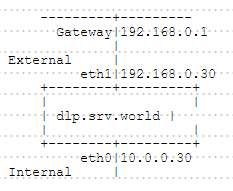
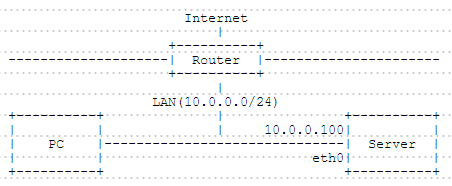
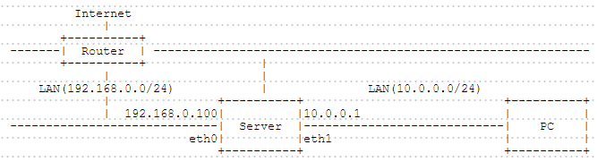
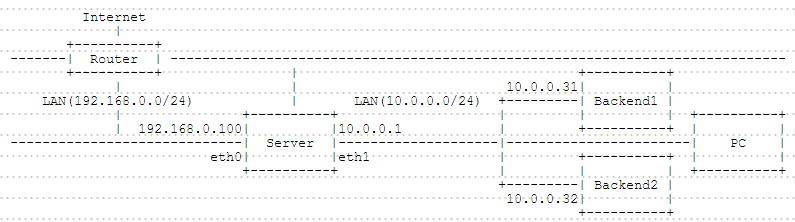
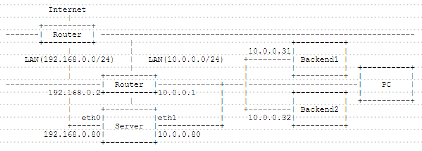

## 附1.9. 防火墙

### 附1.9.1. Firewalld

[Firewalld](https://fedoraproject.org/wiki/FirewallD/)是一款提供D-Bus接口从而支持动态管理的防火墙守护进程。红帽上的[Firewalld使用指南](https://access.redhat.com/documentation/en-US/Red_Hat_Enterprise_Linux/7/html/Security_Guide/sec-Using_Firewalls.html#sec-Introduction_to_firewalld)，[fedoraproject上的手册（中文）](https://fedoraproject.org/wiki/FirewallD/zh-cn)。

#### 附1.9.1.1. 基本操作

Firewalld上服务的定义设置为防火墙上的区域（zone）。要启用防火墙，将区域与网卡相关联的命令关联。

要使用Firewalld，先启动：

```
systemctl start firewalld
systemctl enable firewalld
```

默认，“public”区域应用到网卡，“dhcpv6-client”和“ssh”被允许。当使用`firewall-cmd`命令运行时，如果输入的命令没有`--zone=***`格式，则配置将设置为默认区域。

`firewall-cmd --get-default-zone` # 显示默认区域

```
public
```

`firewall-cmd --list-all` # 显示当前设置

```
public (default, active)
  interfaces: eno16777736
  sources:
  services: dhcpv6-client ssh
  ports:
  masquerade: no
  forward-ports:
  icmp-blocks:
  rich rules:
```

`firewall-cmd --list-all-zones` # 显示默认定义的所有区域

```
block
  interfaces:
  sources:
  services:
  ports:
  masquerade: no
  forward-ports:
  icmp-blocks:
  rich rules:
  .....
  .....
```

`firewall-cmd --list-service --zone=external` # 在指定区域显示允许的服务

```
ssh
```

`firewall-cmd --set-default-zone=external` # 更改默认区域

```
success
```

`firewall-cmd --add-interface=eth1 --zone=internal` # 将没有设定区域的接口添加到指定区域，可以添加`--permanent`选项，在重启后也生效

`firewall-cmd --remove-interface=eth1 --zone=internal` # 将接口从所在区域删除，可以添加`--permanent`选项，在重启后也生效

`firewall-cmd --change-interface=eth1 --zone=external` # 更改接口的区域（即使添加了`--permanent`选项，使用`change-interface`也不会永久更改）

实际（在Ubuntu16.04.3中安装的firewalld）测试，添加`--permanent`选项只是在未重启时使用`firewall-cmd --reload`重载防火墙不会生效，但重启（reboot）还是会生效，可以添加与不添加命令连续运行，即可实现生效且重启后也有效。补充：CentOS测试结果一样。

```
success
```

`firewall-cmd --list-all --zone=external`

```
external (active)
  interfaces: eth1
  sources:
  services: ssh
  ports:
  masquerade: yes
  forward-ports:
  icmp-blocks:
  rich rules:
```

`nmcli c mod eth1 connection.zone external` # 如果要永久更改，使用`nmcli`

`firewall-cmd --get-active-zone`

```
external
  interfaces: eth1
public
  interfaces: eth0
```

显示默认定义的服务：

`firewall-cmd --get-services`

```
amanda-client bacula bacula-client dhcp dhcpv6 dhcpv6-client dns ftp high-availability http https imaps ipp ipp-client ipsec kerberos kpasswd ldap ldaps libvirt libvirt-tls mdns mountd ms-wbt mysql nfs ntp openvpn pmcd pmproxy pmwebapi pmwebapis pop3s postgresql proxy-dhcp radius rpc-bind samba samba-client smtp ssh telnet tftp tftp-client transmission-client vnc-server wbem-https
```

定义文件位于以下位置，如果要添加原始定义，在其中添加XML文件：

`ls /usr/lib/firewalld/services`

```
amanda-client.xml      ipp-client.xml   mysql.xml       rpc-bind.xml
bacula-client.xml      ipp.xml          nfs.xml         samba-client.xml
bacula.xml             ipsec.xml        ntp.xml         samba.xml
dhcpv6-client.xml      kerberos.xml     openvpn.xml     smtp.xml
dhcpv6.xml             kpasswd.xml      pmcd.xml        ssh.xml
dhcp.xml               ldaps.xml        pmproxy.xml     telnet.xml
dns.xml                ldap.xml         pmwebapis.xml   tftp-client.xml
ftp.xml                libvirt-tls.xml  pmwebapi.xml    tftp.xml
high-availability.xml  libvirt.xml      pop3s.xml       transmission-client.xml
https.xml              mdns.xml         postgresql.xml  vnc-server.xml
http.xml               mountd.xml       proxy-dhcp.xml  wbem-https.xml
imaps.xml              ms-wbt.xml       radius.xml
```

添加或删除允许的服务，重新启动系统后，更改将恢复。如果要永久更改设置，添加`--permanent`选项：

`firewall-cmd --add-service=http` # 例如，添加“http”（更改仅一次有效）

```
success
```

`firewall-cmd --list-service`

```
dhcpv6-client http ssh
```

`firewall-cmd --remove-service=http` # 删除“http”

```
success
```

`firewall-cmd --list-service`

```
dhcpv6-client ssh
```

`firewall-cmd --add-service=http --permanent` # 永久添加“http”

```
success
```

`firewall-cmd --reload` # 永久的情况，需要重新加载Firewalld以启用更改

```
success
```

`firewall-cmd --list-service`

```
dhcpv6-client http ssh
```

添加或删除允许的端口：

`firewall-cmd --add-port=465/tcp` # 例如，添加“465/TCP”

```
success
```

`firewall-cmd --list-port`

```
465/tcp
```

`firewall-cmd --remove-port=465/tcp` # 删除“465/TCP”

```
success
```

`firewall-cmd --list-port`

```
# 无内容
```

`firewall-cmd --add-port=465/tcp --permanent` # 永久添加“465/TCP”

```
success
```

`firewall-cmd --reload`

```
success
```

`firewall-cmd --list-port`

```
465/tcp
```

添加或删除禁止的ICMP类型：

`firewall-cmd --add-icmp-block=echo-request` # 例如，添加“echo-request”来禁止它

```
success
```

`firewall-cmd --list-icmp-blocks`

```
echo-request
```

`firewall-cmd --remove-icmp-block=echo-request` # 删除“echo-request”

```
success
```

`firewall-cmd --list-icmp-blocks`

```
# 无内容
```

`firewall-cmd --get-icmptypes` # 显示ICMP类型

```
destination-unreachable echo-reply echo-request parameter-problem redirect 
router-advertisement router-solicitation source-quench time-exceeded
```

#### 附1.9.1.2. IP伪装

基于以下环境演示如何配置防火墙的IP伪装：



更改接口的区域：

`firewall-cmd --get-active-zone` # 显示当前设置

```
public
  interfaces: eth0 eth1
```

`nmcli c mod eth0 connection.zone internal` # 更改“eth0”区域为“internal”

`nmcli c mod eth1 connection.zone external` # 更改“eth1”区域为“external”

`firewall-cmd --get-active-zone`

```
internal
  interfaces: eth0
external
  interfaces: eth1
```

在External区域设置IP伪装：

`firewall-cmd --zone=external --add-masquerade --permanent` # 设置IP伪装

```
success
```

`firewall-cmd --reload`

```
success
```

`firewall-cmd --zone=external --query-masquerade`

```
yes
```

`cat /proc/sys/net/ipv4/ip_forward` # 如果启用伪装，“ip_forward”将自动启用

```
1
```

例如，配置将进入External区域的22端口的数据包转发到本地1234端口（如果要永久设置，添加`--permanent`选项）：

`firewall-cmd --zone=external --add-forward-port=port=22:proto=tcp:toport=1234`

```
success
```

`firewall-cmd --list-all --zone=external`

```
external (active)
  interfaces: eth1
  sources:
  services: ssh
  ports:
  masquerade: yes
  forward-ports: port=22:proto=tcp:toport=1234:toaddr=
  icmp-blocks:
  rich rules:
```

例如，配置将进入External区域的22端口的数据包转发到另一个主机（10.0.0.31）（注：原文是192.168.0.31，但感觉应该是错了）的22端口：

`firewall-cmd --zone=external --add-forward-port=port=22:proto=tcp:toport=22:toaddr=10.0.0.31`

```
success
```

`firewall-cmd --list-all --zone=external`

```
external (active)
  interfaces: eth1
  sources:
  services: ssh
  ports:
  masquerade: yes
  forward-ports: port=22:proto=tcp:toport=22:toaddr=10.0.0.31
  icmp-blocks:
  rich rules:
```

例如，配置允许通过Internal网络（10.0.0.0/24）内的服务器传出数据包，并转发到External端：

`firewall-cmd --zone=internal --add-masquerade --permanent` # 给internal区域设置伪装

```
success
```

`firewall-cmd --reload`

```
success
```

`firewall-cmd --direct --add-rule ipv4 nat POSTROUTING 0 -o eth1 -j MASQUERADE`

`firewall-cmd --direct --add-rule ipv4 filter FORWARD 0 -i eth0 -o eth1 -j ACCEPT`

`firewall-cmd --direct --add-rule ipv4 filter FORWARD 0 -i eth1 -o eth0 -m state --state RELATED,ESTABLISHED -j ACCEPT`

#### 附1.9.1.3. 收集的其他一些

对指定的IP地址开放端口，如对192.168.1.101开放3306/tcp：

```
firewall-cmd --permanent --add-rich-rule="rule family="ipv4" source address="192.168.1.101" port protocol="tcp" port="3306" accept"
firewall-cmd --reload
```

查看配置：

```
firewall-cmd --list-all
```

删除配置：

```
firewall-cmd --permanent --remove-rich-rule="rule family="ipv4" source address="192.168.1.101" port protocol="tcp" port="3306" accept"
```

### 附1.9.2. iptables

[iptables](https://www.netfilter.org/projects/iptables/)是与Linux内核集成的IP信息包过滤系统。红帽上的[Firewalld使用指南](https://access.redhat.com/documentation/en-US/Red_Hat_Enterprise_Linux/7/html/Security_Guide/sec-Using_Firewalls.html#sec-Using_iptables)。

#### 附1.9.2.1. 设置示例1

本例基于以下环境：



* DROP INPUT by Default
* ACCEPT OUTPUT by Default
* ACCEPT Established Connection
* ACCEPT the Connection from loopback
* ACCEPT Ping Connection for 5 times per a minites from internal network(10.0.0.0/24)
* ACCEPT SSH Connection from internal network(10.0.0.0/24)

编辑`iptables.sh`文件：

```
#!/bin/bash

trust_host='10.0.0.0/24'
my_host='10.0.0.100'

/sbin/iptables -F
/sbin/iptables -X

/sbin/iptables -P INPUT DROP
/sbin/iptables -P OUTPUT ACCEPT
/sbin/iptables -P FORWARD DROP

/sbin/iptables -A INPUT -m state --state ESTABLISHED,RELATED -j ACCEPT

/sbin/iptables -A INPUT -s 127.0.0.1 -d 127.0.0.1 -j ACCEPT

/sbin/iptables -A INPUT -p icmp --icmp-type echo-request -s $trust_host \
-d $my_host -m limit --limit 1/m --limit-burst 5 -j ACCEPT

/sbin/iptables -A INPUT -p tcp -m state --state NEW -m tcp -s $trust_host \
-d $my_host --dport 22 -j ACCEPT

/etc/rc.d/init.d/iptables save
/etc/rc.d/init.d/iptables restart
```

`sh iptables.sh`

```
iptables: Saving firewall rules to /etc/sysconfig/iptables: [  OK  ]
iptables: Flushing firewall rules: [  OK  ]
iptables: Setting chains to policy ACCEPT: filter [  OK  ]
iptables: Unloading modules: [  OK  ]
iptables: Applying firewall rules: ip_tables: (C) 2000-2006 Netfilter Core Team
nf_conntrack version 0.5.0 (16384 buckets, 65536 max)
[  OK  ]
```

#### 附1.9.2.2. 设置示例2

本例基于以下环境：



* DROP INPUT by Default
* ACCEPT OUTPUT by Default
* DROP FORWARD by Default
* ACCEPT Established Connection
* ACCEPT the Connection from loopback
* ACCEPT Ping Connection for 5 times per a minites from internal network(10.0.0.0/24)
* ACCEPT SSH Connection from internal network(10.0.0.0/24)
* ACCEPT Outgoing Packets through the Server from internal network(10.0.0.0/24) and translatte the source address

编辑`iptables.sh`文件：

```
#!/bin/bash

trust_host='10.0.0.0/24'
my_host='10.0.0.100'

echo 1 > /proc/sys/net/ipv4/ip_forward

/sbin/iptables -F
/sbin/iptables -t nat -F
/sbin/iptables -X

/sbin/iptables -P INPUT DROP
/sbin/iptables -P OUTPUT ACCEPT
/sbin/iptables -P FORWARD DROP

/sbin/iptables -A FORWARD -i eth1 -o eth0 -s $trust_host -j ACCEPT
/sbin/iptables -A FORWARD -m state --state ESTABLISHED,RELATED -j ACCEPT

/sbin/iptables -A INPUT -m state --state ESTABLISHED,RELATED -j ACCEPT

/sbin/iptables -A INPUT -s 127.0.0.1 -d 127.0.0.1 -j ACCEPT

/sbin/iptables -A INPUT -p icmp --icmp-type echo-request -s $trust_host \
-d $my_host -m limit --limit 1/m --limit-burst 5 -j ACCEPT

/sbin/iptables -A INPUT -p tcp -m state --state NEW -m tcp -s $trust_host \
-d $my_host --dport 22 -j ACCEPT

/sbin/iptables -t nat -A POSTROUTING -o eth0 -s $trust_host -j MASQUERADE

/etc/rc.d/init.d/iptables save
/etc/rc.d/init.d/iptables restart
```

`sh iptables.sh`

```
iptables: Saving firewall rules to /etc/sysconfig/iptables: [  OK  ]
iptables: Flushing firewall rules: [  OK  ]
iptables: Setting chains to policy ACCEPT: filter [  OK  ]
iptables: Unloading modules: [  OK  ]
iptables: Applying firewall rules: ip_tables: (C) 2000-2006 Netfilter Core Team
nf_conntrack version 0.5.0 (16384 buckets, 65536 max)
[  OK  ]
```

#### 附1.9.2.3. 设置示例3

本例基于以下环境：



* DROP INPUT by Default
* ACCEPT OUTPUT by Default
* DROP FORWARD by Default
* ACCEPT Established Connection
* ACCEPT the Connection from loopback
* Forward the Packets to 80 on eth0 to the same port on Backend1
* Forward the Packets to 443 on eth0 to the same port on Backend2
* But DROP the Packets from 192.168.0.20
* ACCEPT Ping Connection for 5 times per a minites from internal network(10.0.0.0/24)
* ACCEPT SSH Connection from internal network(10.0.0.0/24)
* But DROP the Packets from 10.0.0.20
* ACCEPT Outgoing Packets through the Server from internal network(10.0.0.0/24) and translatte the source address

编辑`iptables.sh`文件：

```
#!/bin/bash

trust_host='10.0.0.0/24'
my_internal_ip='10.0.0.1'
my_external_ip='192.168.0.100'

listen_port_1='80'
backend_host_1='10.0.0.31'
backend_port_1='80'

listen_port_2='443'
backend_host_2='10.0.0.32'
backend_port_2='443'

echo 1 > /proc/sys/net/ipv4/ip_forward

/sbin/iptables -F
/sbin/iptables -t nat -F
/sbin/iptables -X

/sbin/iptables -P INPUT DROP
/sbin/iptables -P OUTPUT ACCEPT
/sbin/iptables -P FORWARD DROP

/sbin/iptables -A FORWARD -i eth1 -o eth0 -s $trust_host -j ACCEPT
/sbin/iptables -A FORWARD -m state --state ESTABLISHED,RELATED -j ACCEPT

/sbin/iptables -A FORWARD -s 192.168.0.20/32 -j DROP

/sbin/iptables -A FORWARD -p tcp --dst $backend_host_1 --dport $backend_port_1 -j ACCEPT
/sbin/iptables -A FORWARD -p tcp --dst $backend_host_2 --dport $backend_port_2 -j ACCEPT

/sbin/iptables -A INPUT -s 10.0.0.20/32 -j DROP

/sbin/iptables -A INPUT -m state --state ESTABLISHED,RELATED -j ACCEPT
/sbin/iptables -A INPUT -s 127.0.0.1 -d 127.0.0.1 -j ACCEPT
/sbin/iptables -A INPUT -p icmp --icmp-type echo-request -s $trust_host \
-d $my_internal_ip -m limit --limit 1/m --limit-burst 5 -j ACCEPT
/sbin/iptables -A INPUT -p tcp -m state --state NEW -m tcp -s $trust_host \
-d $my_internal_ip --dport 22 -j ACCEPT

/sbin/iptables -t nat -A POSTROUTING -o eth0 -s $trust_host -j MASQUERADE

/sbin/iptables -t nat -A PREROUTING -p tcp --dst $my_external_ip --dport $listen_port_1 \
-j DNAT --to-destination $backend_host_1:$backend_port_1
/sbin/iptables -t nat -A PREROUTING -p tcp --dst $my_external_ip --dport $listen_port_2 \
-j DNAT --to-destination $backend_host_2:$backend_port_2

/etc/rc.d/init.d/iptables save
/etc/rc.d/init.d/iptables restart
```

`sh iptables.sh`

```
iptables: Saving firewall rules to /etc/sysconfig/iptables: [  OK  ]
iptables: Flushing firewall rules: [  OK  ]
iptables: Setting chains to policy ACCEPT: filter [  OK  ]
iptables: Unloading modules: [  OK  ]
iptables: Applying firewall rules: ip_tables: (C) 2000-2006 Netfilter Core Team
nf_conntrack version 0.5.0 (16384 buckets, 65536 max)
[  OK  ]
```

#### 附1.9.2.4. 设置示例4

本例基于以下环境：



* DROP INPUT by Default
* ACCEPT OUTPUT by Default
* DROP FORWARD by Default
* ACCEPT Established Connection
* ACCEPT the Connection from loopback
* Forward the Packets to 22 on eth0 to the same port on Backend1
* Forward the Packets to 80 on eth0 to the same port on Backend2
* ACCEPT Ping Connection for 5 times per a minites from internal network(10.0.0.0/24)
* ACCEPT SSH Connection from internal network(10.0.0.0/24)
* ACCEPT Outgoing Packets through the Server from internal network(10.0.0.0/24) and translatte the source address

编辑`iptables.sh`文件：

```
#!/bin/bash

trust_host='10.0.0.0/24'
my_internal_ip='10.0.0.80'
my_external_ip='192.168.0.80'

listen_port_1='22'
backend_host_1='10.0.0.31'
backend_port_1='22'

listen_port_2='80'
backend_host_2='10.0.0.32'
backend_port_2='80'

echo 1 > /proc/sys/net/ipv4/ip_forward

/sbin/iptables -F
/sbin/iptables -t nat -F
/sbin/iptables -X

/sbin/iptables -P INPUT DROP
/sbin/iptables -P OUTPUT ACCEPT
/sbin/iptables -P FORWARD DROP

/sbin/iptables -A FORWARD -i eth1 -o eth0 -s $trust_host -j ACCEPT
/sbin/iptables -A FORWARD -m state --state ESTABLISHED,RELATED -j ACCEPT

/sbin/iptables -A FORWARD -p tcp --dst $backend_host_1 --dport $backend_port_1 -j ACCEPT
/sbin/iptables -A FORWARD -p tcp --dst $backend_host_2 --dport $backend_port_2 -j ACCEPT

/sbin/iptables -A INPUT -m state --state ESTABLISHED,RELATED -j ACCEPT
/sbin/iptables -A INPUT -s 127.0.0.1 -d 127.0.0.1 -j ACCEPT
/sbin/iptables -A INPUT -p icmp --icmp-type echo-request -s $trust_host \
-d $my_internal_ip -m limit --limit 1/m --limit-burst 5 -j ACCEPT
/sbin/iptables -A INPUT -p tcp -m state --state NEW -m tcp -s $trust_host \
-d $my_internal_ip --dport 22 -j ACCEPT

/sbin/iptables -t nat -A POSTROUTING -o eth0 -s $trust_host -j MASQUERADE

/sbin/iptables -t nat -A PREROUTING -p tcp --dst $my_external_ip --dport $listen_port_1 \
-j DNAT --to-destination $backend_host_1:$backend_port_1
/sbin/iptables -t nat -A POSTROUTING -p tcp --dst $backend_host_1 --dport $backend_port_1 \
-j SNAT --to-source $my_internal_ip

/sbin/iptables -t nat -A PREROUTING -p tcp --dst $my_external_ip --dport $listen_port_2 \
-j DNAT --to-destination $backend_host_2:$backend_port_2
/sbin/iptables -t nat -A POSTROUTING -p tcp --dst $backend_host_2 --dport $backend_port_2 \
-j SNAT --to-source $my_internal_ip

/etc/rc.d/init.d/iptables save
/etc/rc.d/init.d/iptables restart
```

`sh iptables.sh`

```
iptables: Saving firewall rules to /etc/sysconfig/iptables: [  OK  ]
iptables: Flushing firewall rules: [  OK  ]
iptables: Setting chains to policy ACCEPT: filter [  OK  ]
iptables: Unloading modules: [  OK  ]
iptables: Applying firewall rules: ip_tables: (C) 2000-2006 Netfilter Core Team
nf_conntrack version 0.5.0 (16384 buckets, 65536 max)
[  OK  ]
```

其他一些参数：

指定IP范围，可以通过计算子网掩码来设置，如果需要精确控制一个IP范围加入以下参数：

`-m --src-range 192.168.0.2-192.168.0.5`  # 匹配来源地址范围

`-m --dst-range 192.168.1.11-192.168.1.15`  # 匹配目的地址范围

### 附1.9.3. Fail2ban

[Fail2ban](http://www.fail2ban.org/wiki/index.php/Main_Page)扫描系统日志文件，例如`/var/log/pwdfail`或`/var/log/apache/error_log`，从中找出多次尝试登录失败的IP地址，并将该IP地址加入防火墙的拒绝访问列表中。

查的资料是CentOS6的，默认调用[iptables](#附192-iptables)防火墙，不知道CentOS7安装好后是不是直接调用firewalld，有空了再看看。

**安装**

`yum --enablerepo=epel -y install fail2ban`

安装完成后，`/etc/fail2ban`目录下`fail2ban.conf`为日志设定文档，`jail.conf`为阻挡设定文档。`/etc/fail2ban/filter.d`为具体阻挡内容设定目录具体。

**配置**

创建全局配置（可以直接在`/etc/fail2ban/jail.conf`下面添加规则）：

`cp /etc/fail2ban/jail.conf /etc/fail2ban/jail.local`  # 复制`jail.conf`文件到`jail.local`

编辑`jail.local`：

```
# 修改如下配置
[DEFAULT]
# ignoreip用于指定哪些地址可以忽略fail2ban防御（白名单）
# 以空格分隔的列表，可以是IP地址、CIDR前缀或者DNS主机名
ignoreip = 127.0.0.1 10.10.0.2 192.168.0.0/24
# 客户端主机被禁止的时长（秒）
bantime = 86400
# 客户端主机被禁止前允许失败的次数 
maxretry = 5
# 查找失败次数的时长（秒）
findtime = 600
#以上规则，fail2ban会自动禁止在最近10分钟内有超过5次访问尝试失败的非白名单内的IP地址，禁止时间24个小时
```

SSH防护配置，新建`/etc/fail2ban/jail.d/sshd.local`文件：

```
[ssh-iptables]
enabled  = true
# “filter   = sshd”中sshd对应/etc/fail2ban/filter.d/sshd.conf
filter   = sshd
# 如果ssh端口不是默认22，则修改为“port=具体端口号”
action   = iptables[name=SSH, port=ssh, protocol=tcp]
#          sendmail-whois[name=SSH, dest=your@email.com, sender=fail2ban@example.com]
# 日志路径，Debian系发行版为/var/log/auth.log
logpath  = /var/log/secure
# 这里可以单独设置maxretry等参数，优先级比全局配置jail.local高
maxretry = 5
```

CentOS7启动：

```
systemctl enable fail2ban
systemctl start fail2ban
```

CentOS6启动：

```
chkconfig --level 23 fail2ban on
service fail2ban start
```

可以`cat /etc/fail2ban/filter.d/sshd.conf`查看fail2ban是如何拦截的（fail2ban使用正则表达式找出认证失败的条目，然后拦截对应的建立连接的IP“<HOST>”）

使用命令`fail2ban-client ping`，验证运行，正常显示：

```
Server replied: pong
```

测试fail2ban是否正常工作，尝试通过使用错误的密码来用SSH连接到服务器模拟一个暴力破解攻击。同时监控`/var/log/fail2ban.log`，该文件记录在fail2ban中发生的任何敏感事件。

`tail -f /var/log/fail2ban.log`

邮件防护配置，举例（根据自己实际情况修改设置）：日志路径为`/var/log/maillog`，认证错误的条目类似于：

```
Nov 15 03:15:36 mailserver: LOGIN FAILED, user=a@x.com, ip=[1.2.3.4]
Nov 15 05:20:51 mailserver: LOGIN FAILED, user=b, ip=[1.2.3.5]
```

新建`/etc/fail2ban/jail.d/mail.local`文件：

```
[mail-smtp]
enabled = true
filter = mail-smtp
action = iptables[name=smtp, port=25, protocol=tcp]
logpath = /var/log/maillog
bantime = 86400
findtime = 300
maxretry = 10

[mail-imap]
enabled = true
filter = mail-imap
action = iptables[name=imap, port=143, protocol=tcp]
logpath = /var/log/maillog
bantime = 86400
findtime = 300
maxretry = 10

[mail-pop3]
enabled = true
filter = mail-pop3
action = iptables[name=pop3, port=110, protocol=tcp]
logpath = /var/log/maillog
bantime = 86400
findtime = 300
maxretry = 10
```

在`/etc/fail2ban/filter.d`目录下新建`mail-smtp.conf`、`mail-imap.conf`和`mail-pop3.conf`，此处内容相同，如下：

```
# Fail2Ban configuration file
#
# Author: Bill Landry ((email_protected))
#
# $Revision: 510 $
[Definition]

# Option: failregex
# Notes.: regex to match the password failures messages in the logfile. The
# host must be matched by a group named "host". The tag "" can
# be used for standard IP/hostname matching and is only an alias for
# (?:::f{4,6}:)?(?P\S+)
# Values: TEXT
# 以下正则表达式根据实际内容修改，如有多个规则，每行写一个

failregex = FAILED.*\[<HOST>\]$
            FAILED.*a@x.com.*\[<HOST>\]$

# Option: ignoreregex
# Notes.: regex to ignore. If this regex matches, the line is ignored.
# Values: TEXT

ignoreregex =
```

如果查找规则相同可以只使用一条查找规则，`/etc/fail2ban/jail.d/mail.local`中对应规则名也修改即可。

设置完成后重启fail2ban。

以此类推，只要有符合规范的日志文件的服务应该都可以按上面的方法来实现防护。

开启防护后可以通过`iptables -L`或`iptables -L -nv`查看状态，会多出类似下面的内容（下例表示已拦截1.2.3.4对三个服务的访问）：

```
Chain f2b-imap (1 references)
 pkts bytes target   prot opt in  out  source     destination
    0     0 REJECT   all  --  *   *    1.2.3.4    0.0.0.0/0    reject-with icmp-port-unreachable 
 281K   64M RETURN   all  --  *   *    0.0.0.0/0  0.0.0.0/0

Chain f2b-smtp (1 references)
 pkts bytes target   prot opt in  out  source     destination
    0     0 REJECT   all  --  *   *    1.2.3.4    0.0.0.0/0    reject-with icmp-port-unreachable 
32042   38M RETURN   all  --  *   *    0.0.0.0/0  0.0.0.0/0

Chain f2b-pop3 (1 references)
 pkts bytes target   prot opt in  out  source     destination
    0     0 REJECT   all  --  *   *    1.2.3.4    0.0.0.0/0    reject-with icmp-port-unreachable 
32042   38M RETURN   all  --  *   *    0.0.0.0/0  0.0.0.0/0
```

通过上面查看到拦截信息，如果要移除已拦截的IP地址（如1.2.3.4），运行：

`iptables -D f2b-imap -s 1.2.3.4 -j REJECT`  # `f2b-imap`对应要移除的规则，`1.2.3.4`修改为要移除的IP

运行后再`iptables -L -nv`：

```
Chain f2b-imap (1 references)
 pkts bytes target   prot opt in  out  source     destination
 281K   64M RETURN   all  --  *   *    0.0.0.0/0  0.0.0.0/0

Chain f2b-smtp (1 references)
 pkts bytes target   prot opt in  out  source     destination
    0     0 REJECT   all  --  *   *    1.2.3.4    0.0.0.0/0    reject-with icmp-port-unreachable 
32042   38M RETURN   all  --  *   *    0.0.0.0/0  0.0.0.0/0

Chain f2b-pop3 (1 references)
 pkts bytes target   prot opt in  out  source     destination
    0     0 REJECT   all  --  *   *    1.2.3.4    0.0.0.0/0    reject-with icmp-port-unreachable 
 6256   25M RETURN   all  --  *   *    0.0.0.0/0  0.0.0.0/0
```

也可以使用`fail2ban-client`命令行工具来查看和管理fail2ban的IP阻塞列表：

`fail2ban-client status`

```
Status
|- Number of jail:	4
`- Jail list:	ssh-iptables, mail-smtp, mail-imap, mail-pop3
```

查看指定监狱的状态（如mail-smtp）：

`fail2ban-client status mail-smtp`

```
Status for the jail: mail-smtp
|- Filter
|  |- Currently failed:	0
|  |- Total failed:	4
|  `- File list:	/var/log/maillog
`- Actions
   |- Currently banned:	0
   |- Total banned:	0
   `- Banned IP list:	1.2.3.4
```

解锁指定的IP：

`fail2ban-client set mail-smtp unbanip 1.2.3.4`

> 注：
>
> 如果停止了Fail2ban服务，那么所有的IP地址都会被解锁。当重启Fail2ban，它会从`/etc/log/secure`等（即规则中指定的日志文件）中找到异常的IP地址列表，如果这些异常地址的发生时间仍然在禁止时间内，那么Fail2ban会重新将这些IP地址禁止。
>
> Fail2ban可以缓解暴力密码攻击，但是并不能避免来自复杂的分布式暴力破解，攻击者通过使用成千上万个机器控制的IP地址来绕过Fail2ban的防御机制。


